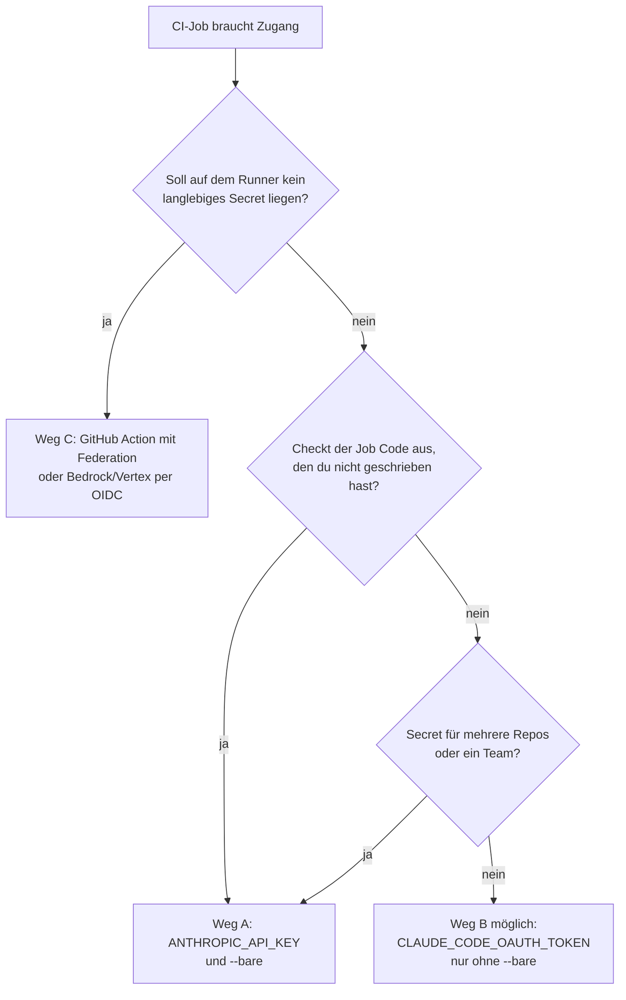

# S4.4 · CI-Zugangsdaten, Kostengrenzen und Kosten-Feinschliff

<!-- meta:start -->
> **Regal:** [Headless & CI/CD](README.md#headless-ci) · **Stufe:** Vertiefung · **~30 Min** · **Voraussetzungen:** [S4.3 Headless: claude -p als Pipeline-Stufe](s4-03-headless.md) · 🛡 **Sicherheitsboden**
>
> ← [S4.3 Headless: claude -p als Pipeline-Stufe](s4-03-headless.md) · [Bibliothek](README.md) · [S4.5 CI-Pipelines bauen mit GitHub Actions und GitLab](s4-05-ci-pipelines.md) →
<!-- meta:end -->

## Schnellcheck

- Kannst du ohne Nachschlagen sagen, welche Zugangsdaten ein `--bare`-Lauf liest und welche nicht, und was passiert, wenn API-Key und Abo-Token beide gesetzt sind?
- Weißt du, was ein `claude -p`-Lauf ohne `--bare` aus einem ausgecheckten fremden Repository mitlädt?

## Auf einen Blick

`claude -p` ohne `--bare` führt die Hooks und MCP-Server eines fremden Repos aus, ohne Vertrauensdialog. Für Code, den du nicht selbst geschrieben hast, nimmst du deshalb einen API-Key und `--bare`. Ein Abo-Token aus `claude setup-token` liest `--bare` nie; es gehört nur in Jobs ohne `--bare` auf Code, dem du vertraust. Jeden unbeaufsichtigten Lauf deckelst du mit `--max-budget-usd` und `--max-turns`. Der Kosten-Feinschliff über Wochen steht in anderen Kapiteln; hier gibt es dazu nur Verweise.

## Bild im Kopf

Die automatische Nachtrunde des Wachdienstes aus S4.3 bekommt ein festes Tank- und Zeitbudget. Ist es verbraucht, bricht sie ab und meldet sich, statt die ganze Nacht weiterzufahren: Das sind `--max-budget-usd` und `--max-turns`. Sie bekommt außerdem einen Schlüssel für genau diesen Auftrag. Ein Abo-Token ist wie der persönliche Dienstausweis einer Person mit einem Jahr Gültigkeit, ein API-Key wie der Firmenschlüssel, den ein Team teilt. Und ohne `--bare` folgt die Runde allen Anweisungen und Sensoren, die sie am Einsatzort vorfindet, auch denen, die ein Fremder dort angebracht hat.

## Im Detail

### Erst den Zugang wählen, dann die Flags

Interaktive Sitzungen melden sich über den Browser an. CI-Runner haben keinen Browser, also gibst du dem Runner Zugangsdaten. Es gibt drei Wege, und sie sind **nicht austauschbar**: `--bare` entscheidet, welche funktionieren.

| Weg | Zugangsdaten auf dem Runner | Mit `--bare`? | Abrechnung | Wofür |
|---|---|---|---|---|
| **A: API-Key** (Standard für geskriptetes `claude -p`) | `ANTHROPIC_API_KEY` (Key aus der Claude Console) oder ein `apiKeyHelper` über `--settings` | **ja** | API-Nutzung | geteilte Pipelines, Secrets für die ganze Organisation, jeder Job, der Code auscheckt, den du nicht geschrieben hast |
| **B: Abo-Token** | `CLAUDE_CODE_OAUTH_TOKEN`, einmal erzeugt mit `claude setup-token` | **nein**, `--bare` liest es nie | dein Pro-, Max-, Team- oder Enterprise-Abo | eigene Repos auf deinem eigenen Abo; das Eingabefeld `claude_code_oauth_token` der offiziellen GitHub Action |
| **C: kein langlebiges Secret** | Claude Code GitHub Action mit Workload Identity Federation, oder Bedrock/Vertex mit kurzlebigen Cloud-Zugangsdaten (OIDC) | Bedrock/Vertex: **ja**; Federation-Profile: **nein**, die Action erledigt die Federation selbst | API oder Cloud-Anbieter | Umgebungen mit hohen Sicherheitsanforderungen (Token-Rotation: [S4.5](s4-05-ci-pipelines.md)) |

Weg B in zwei Zeilen:

```bash
claude setup-token   # once, on a workstation: browser login, then prints a 1-year token
# The command saves the token nowhere. Copy it into the CI secret CLAUDE_CODE_OAUTH_TOKEN now.
```

Aus der Tabelle folgen drei Regeln:

1. **Ein direkter `claude --bare`-Aufruf braucht für die Anthropic-API einen API-Key.** Er liest `ANTHROPIC_API_KEY` oder einen `apiKeyHelper`; für Bedrock, Vertex und Foundry liest er deren eigene Zugangsdaten wie üblich. Nie liest er `CLAUDE_CODE_OAUTH_TOKEN`, OAuth-Anmeldungen, den Schlüsselbund des Systems oder Federation-Profile. Ein `--bare`-Job, der nur das Abo-Token hat, ist nicht angemeldet. Laut Doku ist `--bare` der empfohlene Modus für geskriptete Aufrufe und soll künftig Standard für `-p` werden.
2. **Code, den du nicht geschrieben hast → Weg A mit `--bare`.** Weg B läuft ohne `--bare`, und dann laufen die Hooks aus der `.claude/settings.json` und die Server aus der `.mcp.json` des ausgecheckten Repos auf deinem Runner. Weg B bleibt Repos vorbehalten, denen du vertraust.
3. **Geteiltes Secret → API-Key.** Ein Abo-Token gehört der Person, die `claude setup-token` ausgeführt hat. Für ein Secret, das mehrere Repos oder ein Team teilen, nimmst du einen API-Key.



> **Vorrang-Falle:** Sind mehrere Zugangsdaten gesetzt, nimmt Claude Code laut Doku in dieser Reihenfolge: Cloud-Anbieter, `ANTHROPIC_AUTH_TOKEN`, `ANTHROPIC_API_KEY`, `apiKeyHelper`, `CLAUDE_CODE_OAUTH_TOKEN`, Federation-Profile, zuletzt die Abo-Anmeldung aus `/login`. Einen vorhandenen `ANTHROPIC_API_KEY` nutzt der `-p`-Modus ohne Rückfrage; interaktiv fragt Claude Code einmal, ob du ihn verwenden willst. Ein vergessener Key in der Runner-Umgebung schiebt eine „Abo"-Pipeline also still in die API-Abrechnung. `claude auth status` zeigt als JSON, welche Methode gilt (`authMethod`: `none`, `claude.ai`, `oauth_token`, `api_key`, `api_key_helper` oder `third_party`) und endet mit Exit-Code 0, wenn du angemeldet bist, sonst mit 1.

> **Sicherheitshinweis:** Beides sind dauerhafte Zugangsdaten. Das Abo-Token kann nur Modell-Anfragen stellen (keine Remote Control, keine claude.ai-Connectors), verbraucht aber ein Jahr lang dein Abo. Behandle beide wie einen SSH-Deploy-Key: nie committen, nie loggen, nie in einen Prompt tippen, nach Plan rotieren und sofort ersetzen, wenn ein CI-Anbieter kompromittiert ist.

### Läufe deckeln: `--max-budget-usd` und `--max-turns`

Das größte CI-Risiko bei autonomen Sprachmodellen ist eine Endlosschleife: Ein Werkzeug scheitert immer wieder, Claude versucht es immer wieder, die Rechnung steigt. Zwei Flags entschärfen das, beide nur im Print-Modus (`-p`):

- **`--max-budget-usd 0.50`**: Dollargrenze. Laut Doku zählen Ausgaben von Subagenten mit. Die Antwort, mit der ein Lauf die Grenze überschreitet, wird noch bezahlt; die Endsumme kann also etwas über der Grenze liegen. Die Doku nennt für diesen Fall keinen Exit-Code, wohl aber einen Ergebnis-Subtyp `error_max_budget_usd`. Eine Pipeline, die auf die Grenze reagieren soll, liest ihn aus dem JSON (`--output-format json`) und prüft den Exit-Code einmal selbst, statt ihn anzunehmen.
- **`--max-turns 10`**: Grenze für die Zahl der Arbeitsschritte. Laut Doku endet der Lauf mit einem Fehler, wenn sie erreicht ist. Ohne das Flag gibt es keine Grenze.

Die Rundengrenze bremst Wiederholungsschleifen, das Budget die Kosten. Setz in CI immer beide. [S3.13](s3-13-autonome-loops-absichern.md) nutzt dieselben Grenzen für autonome Loops, die Grundlagen stehen in [S1.19](s1-19-kosten-im-blick.md). Was ein Lauf gekostet hat, steht im JSON-Feld `total_cost_usd`; die Doku nennt es eine Schätzung auf dem Client, maßgeblich ist die Usage-Seite der [Claude Console](https://platform.claude.com/usage).

### `--bare`: was es weglässt und was es braucht

Standardmäßig lädt `claude -p` Hooks, Skills, Plugins, MCP-Server, Auto-Memory und `CLAUDE.md`. **`--bare` schaltet die automatische Erkennung von all dem ab:**

```bash
# Loads everything it finds in the folder and in ~/.claude
claude -p "Categorize" --output-format json

# Skips the discovery: just the model and the built-in tools
claude --bare -p "Categorize" --output-format json
```

- **Schneller Kaltstart:** keine automatische Erkennung von Hooks, Skills, eigenen Commands, Subagenten, Plugins, MCP-Servern, Auto-Memory oder `CLAUDE.md`.
- **Gleiches Verhalten überall:** Hooks, Plugins und `.mcp.json`-Server aus dem Host oder dem ausgecheckten Repo laufen nicht, außer du übergibst sie selbst. Der `env`-Block und Helper wie `awsAuthRefresh` aus den Settings-Dateien des Projekts gelten aber weiter.
- **Nur ausdrücklich übergebener Kontext:** Was der Schritt braucht, gibst du mit `--append-system-prompt-file`, `--add-dir`, `--mcp-config`, `--settings`, `--agents` oder `--plugin-dir` mit.
- **Nicht ohne Werkzeuge:** Auch mit `--bare` hat Claude Bash sowie Werkzeuge zum Lesen und Bearbeiten von Dateien. `--bare` ist keine Rechte-Grenze; die setzen Modus und Regeln ([S3.8](s3-08-rechte-fuer-autonomie.md)).

**Warum das für die Sicherheit zählt:** Ohne `--bare` führt eine `-p`-Sitzung die Hooks aus der `.claude/settings.json` des Projekts aus und verbindet die Server aus seiner `.mcp.json`, auch in einem Ordner, dem du nie vertraut hast, und ohne Vertrauensdialog. In einer CI, die Code von Beitragenden auscheckt, hält `--bare` deren Hooks von deinem Runner fern. Ganz fremdem Code gibst du zusätzlich `--setting-sources user` mit: Dann liest Claude Code weder die Settings-Dateien noch die `.mcp.json` des Projekts, also auch nicht dessen `env`-Block und Helper.

**Was `--bare` braucht:** den API-Key (Weg A) oder Zugangsdaten eines Cloud-Anbieters. Die Übung unten zeigt beides: dass die Hooks eines fremden Repos ohne `--bare` laufen und dass ein `--bare`-Lauf ohne Key nicht angemeldet ist.

### Kosten-Feinschliff: wohin der Rest gehört

Wie du Kosten über Wochen senkst, ist nicht der Sicherheitskern dieses Kapitels und steht dort, wo es zu Hause ist:

- **Modell und Effort je Phase:** [S4.1](s4-01-modell-pro-phase.md) und [S1.7](s1-07-modellwahl-und-effort.md). Preisverhältnisse zwischen den Modellen führt der [Kanon](../_canonical.md), nicht dieses Kapitel.
- **`/usage`, `/insights`, die ersten Gewohnheiten:** [S1.19](s1-19-kosten-im-blick.md). `/usage` und `/insights` sehen nur die lokalen Sitzungen eines Rechners, nicht die Läufe deiner Pipeline.
- **Systemprompt für CI (`--append-system-prompt`, `--system-prompt-file`):** [CLI-Referenz](https://code.claude.com/docs/en/cli-reference#system-prompt-flags) und [S1.15](s1-15-output-styles.md).
- **Prompt-Caching und Basislinie:** Laut [Doku](https://code.claude.com/docs/en/prompt-caching) hält der Cache mit API-Key oder Cloud-Anbieter, also im typischen CI-Lauf, standardmäßig fünf Minuten; ein Modellwechsel bricht ihn. Bündle zusammengehörige Läufe zeitlich eng. Die Kostenseite der Doku rät außerdem, vor einem breiten Rollout mit einer kleinen Gruppe eine eigene Basislinie zu messen.

## Selbst machen

### Übung: ein fremdes Repo, ein Hook, ein Deckel (etwa 15 Minuten)

**Ziel:** Du siehst, dass `claude -p` ohne `--bare` den Hook eines Ordners ausführt, ohne zu fragen, dass `--bare` ihn nicht lädt (und dafür eine Anmeldung braucht, die du vielleicht nicht hast), und wie ein Budgetdeckel einen Lauf abbricht.

**Startzustand:** ein neuer Ordner `~/cc-workshop/ci-zugang`, der ein „fremdes Repo" spielt. Sein Hook ist harmlos: Er schreibt nur eine Zeile in `hook-ran.txt` im Ordner. Was ein böser Hook an derselben Stelle tun könnte, bleibt Text. Du brauchst nur Claude Code und Python. Die Hauptübung braucht keinen API-Key; wer einen hat, findet unten ein Extra. Es läuft nichts weiter, an deiner globalen Konfiguration ändert sich nichts. **Kein Secret in einen Prompt oder eine Datei:** Auch nicht für das Extra.

Bash:

```bash
mkdir -p ~/cc-workshop/ci-zugang/.claude && cd ~/cc-workshop/ci-zugang
```

PowerShell:

```powershell
New-Item -ItemType Directory -Force "$HOME\cc-workshop\ci-zugang\.claude"; Set-Location "$HOME\cc-workshop\ci-zugang"
```

1. Sieh nach, womit du angemeldet bist: `claude auth status`. Erwartet: JSON mit dem Feld `authMethod`, bei einer Anmeldung per Browser vermutlich `claude.ai`. Danach `echo "exit=$?"` (PowerShell: `"exit=$LASTEXITCODE"`): `exit=0`, wenn du angemeldet bist. Merk dir `authMethod`: Steht dort `claude.ai` oder `oauth_token`, wird `--bare` in Schritt 4 nicht angemeldet sein.
2. Leg mit einem Editor die Datei `.claude/settings.json` an (`.claude` ist ein geschützter Pfad, schreib die Datei selbst, nicht über Claude):

   <!-- cockpit:example -->
   ```json
   {
     "hooks": {
       "SessionStart": [
         {
           "hooks": [
             {"type": "command", "command": "echo ran >> \"${CLAUDE_PROJECT_DIR}/hook-ran.txt\""}
           ]
         }
       ]
     }
   }
   ```

   Du hast kein `claude` gestartet und keinen Vertrauensdialog bestätigt. Prüf mit `ls` (PowerShell: `dir`), dass `hook-ran.txt` noch nicht existiert.
3. Lauf ohne `--bare`, mit beiden Deckeln und JSON-Ausgabe. Bash:

   ```bash
   claude -p "Reply with the single word ok." --model haiku --max-turns 2 --max-budget-usd 0.50 --permission-mode dontAsk --output-format json
   echo "exit=$?"
   cat hook-ran.txt
   ```

   PowerShell: dieselbe erste Zeile, dann `"exit=$LASTEXITCODE"` und `Get-Content hook-ran.txt`. Erwartet: Es kam kein Vertrauensdialog, keine Rückfrage, `exit=0`. In der JSON-Ausgabe steht `total_cost_usd` (laut Doku eine Schätzung), und `hook-ran.txt` enthält die Zeile `ran`. Der Hook eines Ordners, den du nie bestätigt hast, ist gelaufen.
4. Lösch den Beweis und wiederhol den Lauf mit `--bare`. Bash:

   ```bash
   rm hook-ran.txt
   claude --bare -p "Reply with the single word ok." --model haiku --max-turns 2 --output-format json
   echo "exit=$?"
   ls hook-ran.txt
   ```

   PowerShell: `Remove-Item hook-ran.txt`, dieselbe `claude`-Zeile, `"exit=$LASTEXITCODE"`, `Test-Path hook-ran.txt`. Erwartet: `hook-ran.txt` existiert nicht (`ls` meldet, dass es fehlt, `Test-Path` gibt `False`): Der Hook wurde nie geladen. Bist du nur per Browser angemeldet, endet der Lauf mit einem Fehler, nicht angemeldet (im Probelauf stand im Feld `result` der Text `Not logged in · Please run /login`), und einem Exit-Code ungleich 0; die Doku sagt dazu, dass `--bare` OAuth-Anmeldungen und den Schlüsselbund nie liest und ein Fehler im Lauf als Ergebnis auf stdout steht. Hast du `ANTHROPIC_API_KEY` in der Umgebung, läuft er mit Antwort durch. In beiden Fällen fehlt `hook-ran.txt`.
5. Lass einen Lauf an seiner Budgetgrenze scheitern. Der Deckel ist absichtlich winzig:

   ```bash
   claude -p "Reply with the single word ok." --model haiku --max-turns 2 --max-budget-usd 0.0001 --permission-mode dontAsk --output-format json
   echo "exit=$?"
   ```

   In PowerShell: dieselbe erste Zeile, dann `"exit=$LASTEXITCODE"`. Erwartet: Der Lauf endet vorzeitig; im JSON steht laut Doku `error_max_budget_usd` als `subtype` des Ergebnisses, und `total_cost_usd` ist größer als 0, denn die Antwort, die den Deckel überschritten hat, wird bezahlt. Notier dir den Exit-Code, den du siehst (im Probelauf 1): Die Doku nennt keinen, also verlass dich in deiner Pipeline nicht auf eine Annahme, sondern auf das, was du gemessen hast.

**Extra: `--bare` mit eigenem Key (etwa 5 Minuten).** Nur, wenn du einen API-Key aus der Console hast. Setz ihn nur für dieses Terminal, ohne dass er in einer Datei oder im Verlauf landet. Bash: `read -rs ANTHROPIC_API_KEY && export ANTHROPIC_API_KEY`. PowerShell: `$env:ANTHROPIC_API_KEY = Read-Host "key"`. Wiederhol Schritt 4. Erwartet: ein normales Ergebnis, `exit=0`, kein `hook-ran.txt`. Räum danach auf: `unset ANTHROPIC_API_KEY` beziehungsweise `Remove-Item Env:ANTHROPIC_API_KEY`, und schließ das Terminal. Mit gesetztem Key rechnet jeder `-p`-Lauf über die API ab, auch ohne `--bare`.

**Aufräumen:** Es läuft nichts weiter. Lösch den Ordner `~/cc-workshop/ci-zugang` selbst.

**Geschafft, wenn:**

- [ ] du `authMethod` deiner Anmeldung kennst
- [ ] `hook-ran.txt` nach dem Lauf ohne `--bare` existierte und nach dem Lauf mit `--bare` nicht
- [ ] du in Schritt 3 `total_cost_usd` gelesen hast
- [ ] der Lauf mit dem winzigen Budget vorzeitig endete und du seinen Exit-Code notiert hast

## Typische Fallen

- **Der `--bare`-Job ist nicht angemeldet.** Er hat nur `CLAUDE_CODE_OAUTH_TOKEN`, und das liest `--bare` nie. Nimm Weg A (`ANTHROPIC_API_KEY`) oder lass `--bare` weg, aber nur auf Code, dem du vertraust.
- **Die „Abo"-Pipeline rechnet über die API ab.** In der Runner-Umgebung steht noch ein `ANTHROPIC_API_KEY`, und der gewinnt gegen das Abo-Token. `claude auth status` zeigt, welche Methode gewählt wird.
- **Das Token landet im Log.** `claude setup-token` gibt ein Token mit einem Jahr Laufzeit aus. Schreib es nie in eine Datei im Repo, nie in einen Prompt, und ersetze es sofort, wenn es sichtbar war.
- **Die Grenze „sichert" nur das Geld.** `--max-budget-usd` und `--max-turns` begrenzen Kosten und Schritte, nicht, was Claude in diesen Schritten tut. Das bestimmen Rechte-Modus und Regeln.

## Check

Du kannst für eine CI-Stufe den passenden Zugang wählen und begründen, sagen, was `--bare` weglässt und braucht, und jeden Lauf mit `--max-budget-usd` und `--max-turns` deckeln.

1. Welche Zugangsdaten liest ein `claude --bare`-Aufruf für die Anthropic-API, und welche nie?
2. Was passiert in einem `-p`-Lauf, wenn `ANTHROPIC_API_KEY` und `CLAUDE_CODE_OAUTH_TOKEN` beide gesetzt sind, und was läuft auf deinem Runner mit, wenn ein `-p`-Job ohne `--bare` fremden Code auscheckt?
3. Was begrenzt `--max-budget-usd`, was `--max-turns`, und warum können die Kosten trotzdem etwas über der Dollargrenze liegen?

<details><summary>Auflösung</summary>

1. `ANTHROPIC_API_KEY` oder einen `apiKeyHelper`. Nie liest `--bare` OAuth-Anmeldungen, den Schlüsselbund, `CLAUDE_CODE_OAUTH_TOKEN` oder Federation-Profile.
2. Der API-Key gewinnt, denn er steht in der Rangfolge vor dem Abo-Token; im `-p`-Modus nutzt Claude Code ihn ohne Rückfrage. Ohne `--bare` laufen die Hooks aus der `.claude/settings.json` und die Server aus der `.mcp.json` des ausgecheckten Repos, ohne Vertrauensdialog.
3. `--max-budget-usd` begrenzt die Ausgaben (Subagenten zählen mit), `--max-turns` die Zahl der Arbeitsschritte. Die Antwort, die die Dollargrenze überschreitet, wird noch bezahlt.

</details>

<details><summary>Quizfrage</summary>

**Frage:** Eine Pipeline prüft Pull Requests von Beitragenden. Sie nutzt bisher das Abo-Token deines Projekts (`CLAUDE_CODE_OAUTH_TOKEN`), ohne `--bare`. Du willst fremde Hooks aussperren. Was ist richtig?

- **Richtig:** Auf einen API-Key aus der Console wechseln und `--bare` hinzufügen. Das Abo-Token liest `--bare` nie, ein Job mit `--bare` und nur dem Token wäre nicht angemeldet.
- Falsch: `--bare` zum bestehenden Aufruf hinzufügen und das Abo-Token behalten, denn `--bare` übernimmt die Anmeldung aus der Umgebung.
- Falsch: Nichts ändern, denn Hooks eines Repos laufen in `-p` erst, nachdem jemand den Vertrauensdialog für den Ordner bestätigt hat.
- Falsch: Zusätzlich einen API-Key setzen und das Token behalten, denn bei zwei Zugängen gilt das Abo und der Key bleibt ungenutzt.

</details>

## Weiterlesen

- [Authentifizierung, u. a. Vorrang und langlebige Tokens](https://code.claude.com/docs/en/authentication)
- [Headless und `--bare`](https://code.claude.com/docs/en/headless)
- [CLI-Referenz (`--max-budget-usd`, `--max-turns`, `claude auth status`)](https://code.claude.com/docs/en/cli-reference)
- [Kosten verwalten](https://code.claude.com/docs/en/costs)
- [Wie Claude Code Prompt-Caching nutzt](https://code.claude.com/docs/en/prompt-caching)
- [GitHub Actions](https://code.claude.com/docs/en/github-actions)
- [S4.3 · Headless: claude -p als Pipeline-Stufe](s4-03-headless.md)
- [S4.5 · CI-Pipelines bauen mit GitHub Actions und GitLab](s4-05-ci-pipelines.md)
- [S1.19 · Kosten im Blick: /cost, /usage und Budgetgrenzen](s1-19-kosten-im-blick.md)
- [S3.13 · Autonome Loops absichern: Budget und Worktree](s3-13-autonome-loops-absichern.md)
- [S1.7 · Modellwahl und Effort](s1-07-modellwahl-und-effort.md)
- [S4.1 · Das richtige Modell pro Phase](s4-01-modell-pro-phase.md)
