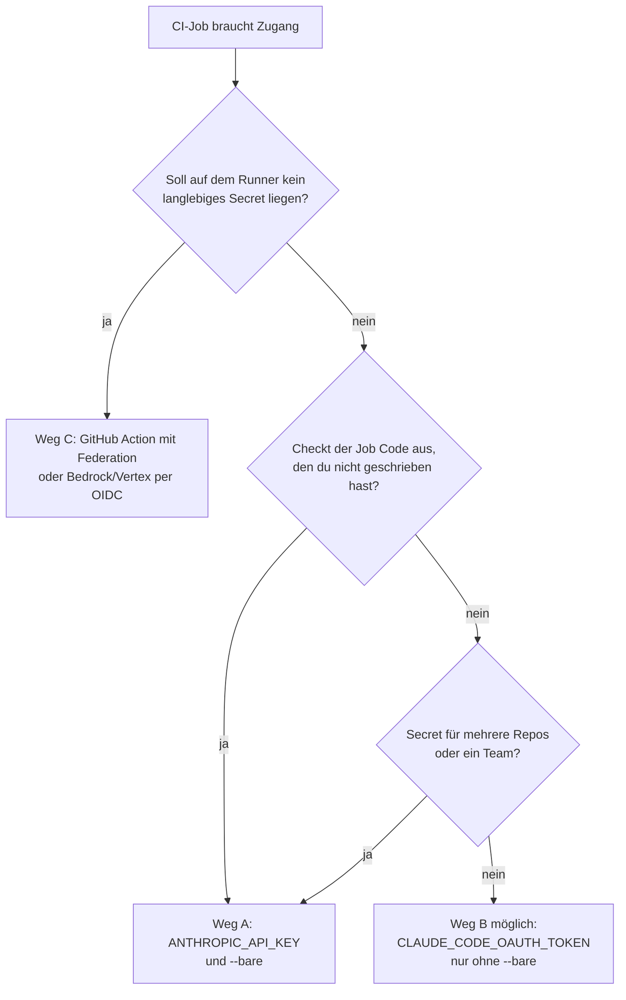

# S4.4 · CI-Zugangsdaten, Kostengrenzen und Kosten-Feinschliff

<!-- meta:start -->
> **Regal:** [Headless & CI/CD](README.md#headless-ci) · **Stufe:** Vertiefung · **~18 Min** · **Voraussetzungen:** [S4.3 Headless: claude -p als Pipeline-Stufe](s4-03-headless.md) · 🛡 **Sicherheitsboden**
>
> ← [S4.3 Headless: claude -p als Pipeline-Stufe](s4-03-headless.md) · [Bibliothek](README.md) · [S4.5 CI-Pipelines bauen mit GitHub Actions und GitLab](s4-05-ci-pipelines.md) →
<!-- meta:end -->

## Schnellcheck

- Kannst du ohne Nachschlagen sagen, welche Zugangsdaten ein `--bare`-Lauf liest und welche nicht, und was passiert, wenn API-Key und Abo-Token beide gesetzt sind?
- Hast du schon einmal einen unbeaufsichtigten Claude-Lauf mit harter Dollar- und Rundengrenze abgesichert und danach nachgesehen, was er wirklich gekostet hat?

## Auf einen Blick

`claude -p` ohne `--bare` führt die Hooks und MCP-Server eines fremden Repos aus, ohne Vertrauensdialog. Für Code, den du nicht selbst geschrieben hast, nimmst du deshalb einen API-Key und `--bare`. Ein Abo-Token aus `claude setup-token` liest `--bare` nie; es gehört nur in Jobs ohne `--bare` auf Code, dem du vertraust. Jeden unbeaufsichtigten Lauf deckelst du mit `--max-budget-usd` und `--max-turns`.

Danach kommt der Feinschliff der Kosten: ein Modell pro Phase (Planen, Umsetzen, Prüfen), Prompt-Caching, knappe Prompts und ein wöchentlicher Blick in `/usage`.

## Bild im Kopf

Die automatische Nachtrunde des Wachdienstes aus S4.3 bekommt ein festes Tank- und Zeitbudget. Ist es verbraucht, bricht sie ab und meldet sich, statt die ganze Nacht weiterzufahren: Das sind `--max-budget-usd` und `--max-turns`. Sie bekommt außerdem einen Schlüssel für genau diesen Auftrag. Ein Abo-Token ist wie der persönliche Dienstausweis einer Person mit einem Jahr Gültigkeit, ein API-Key wie der Firmenschlüssel, den ein Team teilt. Und ohne `--bare` folgt die Runde allen Anweisungen und Sensoren, die sie am Einsatzort vorfindet, auch denen, die ein Fremder dort angebracht hat.

## Im Detail

### Erst den Zugang wählen, dann die Flags

Interaktive Sitzungen melden sich über den Browser an. CI-Runner haben keinen Browser, also gibst du dem Runner Zugangsdaten. Es gibt drei Wege, und sie sind **nicht austauschbar**: `--bare` entscheidet, welche funktionieren.

| Weg | Zugangsdaten auf dem Runner | Mit `--bare`? | Abrechnung | Wofür |
|---|---|---|---|---|
| **A: API-Key** (Standard für geskriptetes `claude -p`) | `ANTHROPIC_API_KEY` (Key aus der Claude Console) oder ein `apiKeyHelper` über `--settings` | **ja** | API-Nutzung | geteilte Pipelines, Secrets für die ganze Organisation, jeder Job, der Code auscheckt, den du nicht geschrieben hast |
| **B: Abo-Token** | `CLAUDE_CODE_OAUTH_TOKEN`, einmal erzeugt mit `claude setup-token` | **nein**, `--bare` liest es nie | dein Pro-, Max-, Team- oder Enterprise-Abo | eigene Repos auf deinem eigenen Abo; das Eingabefeld `claude_code_oauth_token` der offiziellen GitHub Action |
| **C: kein langlebiges Secret** | Claude Code GitHub Action mit Workload Identity Federation, oder Bedrock/Vertex mit kurzlebigen Cloud-Zugangsdaten (OIDC) | Bedrock/Vertex: **ja**; Federation-Profile: **nein**, die Action erledigt die Federation selbst | API oder Cloud-Anbieter | Umgebungen mit hohen Sicherheitsanforderungen (Token-Rotation: [S4.5](s4-05-ci-pipelines.md)) |

Weg B in zwei Zeilen:

```bash
claude setup-token   # once, on a workstation: browser login, then prints a 1-year token
# The command saves the token nowhere. Copy it into the CI secret CLAUDE_CODE_OAUTH_TOKEN now.
```

Aus der Tabelle folgen drei Regeln:

1. **Ein direkter `claude --bare`-Aufruf braucht einen API-Key oder Zugangsdaten eines Cloud-Anbieters.** Er liest `ANTHROPIC_API_KEY`, einen `apiKeyHelper` oder die Zugangsdaten von Bedrock, Vertex oder Foundry, nie `CLAUDE_CODE_OAUTH_TOKEN` und nie Federation-Profile. Ein `--bare`-Job, der nur das Abo-Token hat, ist nicht angemeldet. `--bare` ist der empfohlene Modus für geskriptete Aufrufe und soll künftig Standard für `-p` werden; Weg A ist damit der zukunftssichere Standard.
2. **Code, den du nicht geschrieben hast → Weg A mit `--bare`.** Weg B läuft ohne `--bare`, und dann laufen die Hooks aus der `.claude/settings.json` und die Server aus der `.mcp.json` des ausgecheckten Repos auf deinem Runner (siehe „`--bare`" unten). Weg B bleibt Repos vorbehalten, denen du vertraust.
3. **Geteiltes Secret → API-Key.** Ein Abo-Token gehört der Person, die `claude setup-token` ausgeführt hat. Für ein Secret, das mehrere Repos oder ein Team teilen, nimmst du einen API-Key.



> **Vorrang-Falle:** Sind beide gesetzt, gewinnt `ANTHROPIC_API_KEY` gegen `CLAUDE_CODE_OAUTH_TOKEN`; im `-p`-Modus wird ein vorhandener Key immer genutzt. Ein vergessener Key in der Runner-Umgebung schiebt eine „Abo"-Pipeline still in die API-Abrechnung. `claude auth status` zeigt, welche Zugangsdaten Claude Code nehmen würde (`"authMethod": "api_key"` oder `"oauth_token"`); ob sie gültig sind, prüft es nicht.

> **Sicherheitshinweis:** Beides sind dauerhafte Zugangsdaten. Das Abo-Token kann nur Modell-Anfragen stellen (keine Remote Control, keine claude.ai-Connectors), verbraucht aber ein Jahr lang dein Abo. Behandle beide wie einen SSH-Deploy-Key: nie committen, nie loggen, nach Plan rotieren und sofort ersetzen, wenn ein CI-Anbieter kompromittiert ist.

### Kostengrenzen: `--max-budget-usd` und `--max-turns`

Das größte CI-Risiko bei autonomen Sprachmodellen ist eine Endlosschleife: Ein Werkzeug scheitert immer wieder, Claude versucht es immer wieder, die Rechnung steigt und steigt. Zwei Flags entschärfen das:

- **`--max-budget-usd 0.50`**: harte Dollargrenze. Ist sie erreicht, endet der Lauf mit einem Exit-Code ungleich 0. CI scheitert sauber, statt Geld zu verbrennen. Ausgaben von Subagenten zählen mit. Die Antwort, mit der ein Lauf die Grenze überschreitet, wird noch bezahlt; die Endsumme kann also etwas über der Grenze liegen.
- **`--max-turns 10`**: harte Grenze für Agenten-Runden. Erreicht Claude sie, endet der Lauf mit einem Fehler. Ohne das Flag gibt es keine Rundengrenze. Es steht in der CLI-Referenz, aber nicht in `claude --help`: Die Hilfe ist nicht die vollständige Referenz.

Beide Flags wirken nur im Print-Modus (`-p`). Die Rundengrenze bremst Wiederholungsschleifen, das Budget bremst die Kosten, auch innerhalb einer einzigen langen Runde. Einen Aufruf mit beiden Grenzen probierst du in „Selbst machen" aus.

Setz in CI immer beide Grenzen.

**Querverweis:** [S3.13](s3-13-autonome-loops-absichern.md) nutzt dieselben Grenzen als Sicherheitsnetz für autonome Loops, die Grundlagen stehen in [S1.19](s1-19-kosten-im-blick.md). CI ist die strengste Anwendung dieses Musters.

### `--bare`: schlank und sicher

Standardmäßig lädt `claude -p` Hooks, Skills, Plugins, MCP-Server und das Auto-Memory. Für einen einfachen Aufruf in CI, etwa „ordne dieses JSON ein", ist das reiner Ballast. **`--bare` schaltet das alles ab:**

```bash
# Heavy: loads everything
claude -p "Categorize" --output-format json

# Lightweight: just the model
claude --bare -p "Categorize" --output-format json
```

`--bare` bringt dir:

- **schnelleren Kaltstart:** keine automatische Erkennung von Hooks, Skills, eigenen Commands, Subagenten, Plugins, MCP-Servern, Auto-Memory oder CLAUDE.md
- **gleiches Verhalten überall:** Hooks, Skills, eigene Commands, Subagenten, Plugins und `.mcp.json`-Server aus dem Host oder dem ausgecheckten Repo laufen nicht, außer du übergibst sie selbst. Der `env`-Block und Helper wie `awsAuthRefresh` aus den Settings-Dateien des Projekts gelten aber weiter
- **nur ausdrücklich übergebenen Kontext:** Was der Schritt braucht, gibst du mit `--append-system-prompt-file`, `--add-dir`, `--mcp-config`, `--settings`, `--agents` oder `--plugin-dir` mit. Einen Skill kannst du weiterhin ausdrücklich mit `/skill-name` aufrufen.

„Nur das Modell" heißt dabei nicht „ohne Werkzeuge": Auch mit `--bare` hat Claude Bash sowie Werkzeuge zum Lesen und Bearbeiten von Dateien.

**Warum das für die Sicherheit zählt:** Ohne `--bare` führt eine `-p`-Sitzung die Hooks aus der `.claude/settings.json` des Projekts aus und verbindet die Server aus seiner `.mcp.json`, auch in einem Ordner, dem du nie vertraut hast, und ohne Vertrauensdialog. In einer CI, die Code von Beitragenden auscheckt, hält `--bare` deren Hooks von deinem Runner fern. Ganz fremdem Code gibst du zusätzlich `--setting-sources user` mit: Dann liest Claude Code weder die Settings-Dateien noch die `.mcp.json` des Projekts, also auch nicht dessen `env`-Block und Helper.

**Haken bei der Anmeldung:** `--bare` meldet sich **nur** über `ANTHROPIC_API_KEY` oder einen `apiKeyHelper` an. Es liest weder OAuth noch den Schlüsselbund des Systems noch `CLAUDE_CODE_OAUTH_TOKEN` (das Token aus `claude setup-token`). Eine `--bare`-Pipeline braucht also einen API-Key (Weg A) oder Zugangsdaten eines Cloud-Anbieters. Federation-Profile liest `--bare` ebenfalls nicht.

Nimm `--bare` für jeden CI-Schritt, der deine eigenen Skills oder Hooks nicht wirklich braucht. Zum vollen Modus greifst du nur, wenn die Pipeline tatsächlich von einem Plugin oder MCP-Server abhängt.

### Eine Persona für CI: die Systemprompt-Flags

Eine Persona für CI sieht anders aus als eine interaktive: knapper, strukturierter, mit Blick auf Zeilennummern. Drei Flags formen sie:

- **`--append-system-prompt "Always respond in JSON."`** hängt einen Hinweis an den Standard-Systemprompt an. Gut für kleine Anpassungen.
- **`--system-prompt "<full text>"`** ersetzt den Systemprompt ganz. Volle Kontrolle, aber die Voreinstellungen von Claude Code fallen weg.
- **`--system-prompt-file <path>`** tut dasselbe, liest den Text aber aus einer Datei. Die Persona in git zu versionieren, ist das empfohlene Muster.

```bash
claude -p "Review the diff" \
  --system-prompt-file ci/personas/strict-reviewer.md \
  --output-format json
```

`--system-prompt` und `--system-prompt-file` schließen sich gegenseitig aus. Output Styles und Personas im Alltag: [S1.15](s1-15-output-styles.md).

### Preise im Verhältnis

Absolute Preise pro Million Tokens ändern sich mit jeder Generation; sie stehen nur im [Kanon](../_canonical.md). Relativ zum Opus-Tier ergeben die Preise dort ungefähr dieses Bild (neu rechnen, wenn sich die Tabelle im Kanon ändert):

| Tier | Relative Kosten |
|---|---|
| Fable | ~2.5x |
| Opus | 1x |
| Sonnet | ~0.5x |
| Haiku | ~0.25x |

**Faustregel:** Output kostet ungefähr das Fünffache von Input. Schreib knappe Prompts mit wenigen vorgeladenen Dateien, denn auch Input kostet. Eine CLAUDE.md mit 50 KB, die in jeder Sitzung lädt, ist eine wiederkehrende Abgabe auf jedes Gespräch mit Claude.

Den Überblick, wofür sich welches Modell eignet, gibt [S1.7](s1-07-modellwahl-und-effort.md).

### `/usage` und `/insights`: wohin Tokens und Zeit gehen

`/usage` (Aliase `/cost` und `/stats`) zeigt die Kosten der laufenden Sitzung, die Grenzen deines Plans und Aktivitätsstatistiken. Auf einem Pro-, Max-, Team- oder Enterprise-Plan kommt eine Aufschlüsselung dazu:

- **Anteile:** wie viel der jüngsten Nutzung auf Skills, Subagenten, Plugins und einzelne MCP-Server entfällt
- **Verhaltensmerker:** etwa langer Kontext oder Cache-Fehlschläge, sobald eines davon 10 % oder mehr der Nutzung ausmacht
- **Loops:** die schwersten `/loop`- und anderen geplanten Aufgaben, mit Tokens insgesamt und pro Lauf

Mit `d` und `w` wechselst du zwischen den letzten 24 Stunden und den letzten 7 Tagen. Die Zahlen sind Näherungen aus der lokalen Sitzungshistorie dieses Rechners.

`/insights` misst nicht Tokens, sondern deine Arbeitsweise. Es analysiert deine letzten Sitzungen auf diesem Rechner und schreibt einen HTML-Bericht: woran du arbeitest, wo es hakt (etwa missverstandene Aufträge oder fehlerhafter Code) und was du an Claude Code ausprobieren solltest. Die Analyse verbraucht selbst Tokens aus deinem Plan oder deiner API-Nutzung.

**Wochenroutine:** Öffne `/usage`, schalte mit `w` auf 7 Tage und prüf:

1. Welche Skills, Subagenten oder MCP-Server tragen den größten Anteil, und ist das gerechtfertigt?
2. Welche Loops sind die schwersten, und waren sie gewollt?
3. Sollte eine Routinearbeit auf ein günstigeres Modell wechseln, etwa das Haiku-Tier?

Danach zeigt dir `/insights`, wo in deiner Arbeitsweise Zeit und Tokens verloren gehen. So misst du deine Kosten laufend, statt am Monatsende überrascht zu werden.

**Für Teams und CI:** `/usage` und `/insights` sehen nur die lokalen Sitzungen eines Rechners, keine anderen Geräte. Die verbindliche Abrechnung zeigt die Usage-Seite der [Claude Console](https://platform.claude.com/usage). Einen einzelnen Headless-Lauf misst `--output-format json`: Die Antwort enthält das Feld `total_cost_usd`, eine Schätzung auf dem Client. Kostenüberwachung in der Pipeline: [S4.5](s4-05-ci-pipelines.md).

### Ein Modell pro Phase: Planen, Umsetzen, Prüfen

Bei anspruchsvollen Aufgaben schlägt eine Pipeline aus drei Modellen einen Ein-Modell-Ansatz oft bei Qualität und Kosten zugleich:

| Phase | Modell | Effort | Warum |
|---|---|---|---|
| **Planen** | Opus-Tier | `xhigh` | Fehler in der Architektur kosten am meisten; Tiefe an dieser Stelle erspart dir später das Neuschreiben |
| **Umsetzen** | Sonnet-Tier | `medium` | Code schreiben ist Routine; Sonnet erledigt das schnell und solide |
| **Prüfen** | Haiku-Tier | keine Effort-Einstellung | Schlusskontrolle, schneller Mustervergleich; dafür reicht Haiku |

Die Kostenform ist grob `1x (plan) + 0.5x (implement) + 0.25x (review) ≈ 1.75x` statt `3x` (Opus in allen drei Phasen), also rund 40 % günstiger, gerechnet mit gleicher Tokenmenge je Phase, und oft mit besseren Ergebnissen als nur mit Opus.

Wann nicht: bei kleinen Aufgaben, bei denen die Planung der triviale Teil ist. Ein Hilfsprogramm in einer einzigen Datei braucht keinen Opus-Architekten. Wie du Modelle in einer Pipeline mit Codex staffelst: [S4.1](s4-01-modell-pro-phase.md).

### Acht Gewohnheiten, die sich über Monate summieren

1. **Skills statt einer langen CLAUDE.md:** Skills laden bei Bedarf, die CLAUDE.md lädt in jeder Sitzung.
2. **Subagenten zur Isolation:** Sie halten deinen Hauptkontext frei von den Tokens der Nebenaufgaben.
3. **`/compact` rechtzeitig:** Verdichte, *bevor* der Kontext voll ist, mit einem Fokus-Hinweis, damit das richtige Detail übrig bleibt.
4. **Sonnet für Routinearbeit:** Zum Opus-Tier greifst du nur, wenn die Aufgabe Tiefe wirklich belohnt.
5. **Haiku für Massen-Lesen:** Dateiinventar, einfaches Filtern, „finde alle Dateien, die zu X passen".
6. **Den Cache nutzen:** Wiederholte Aufgaben landen oft im Cache (Lebensdauer siehe „Prompt-Caching" unten).
7. **`--bare` für einfache geskriptete Aufrufe:** Es überspringt die Erkennung von Hooks, Skills, Plugins, MCP-Servern, Auto-Memory und CLAUDE.md, wenn du sie nicht brauchst (Anmeldung nur per API-Key, `apiKeyHelper` oder Cloud-Anbieter).
8. **Knappe Prompts:** Lass „erklär deine Begründung" weg, wenn die Antwort offensichtlich ist.

Die drei Gewohnheiten für den ersten Tag stehen in [S1.19](s1-19-kosten-im-blick.md).

### Faustregeln fürs Team

- **Eigene Basislinie:** Was eine Person pro Tag ausgibt, schwankt stark mit Kontextlänge, Modellmix und der Frage, wie oft Claude unbeaufsichtigt läuft. Die Kostenseite der Doku rät, mit einer kleinen Pilotgruppe eine eigene Basislinie zu messen, bevor ihr breit ausrollt.
- **Im Abo:** Kenn deine Grenze; `/usage` zeigt die Plan-Limits.
- **Im Team:** Macht `--max-budget-usd` zur Voreinstellung in geteilten Skripten und schaut jede Woche in `/usage`.

Es geht nicht um eine bestimmte Zahl, sondern darum, dass es eine gibt und du sie kennst.

### Prompt-Caching: der größte Kostenhebel

Claude Code schickt bei jeder Nachricht den ganzen Kontext neu. Die API cacht den unveränderten Anfang der Anfrage (den Präfix) und berechnet ihn beim nächsten Mal zum Cache-Preis. Ein Cache-Treffer kostet einen Bruchteil des normalen Input-Preises, beim Sonnet-Tier ein Zehntel. Das erste Schreiben in den Cache kostet dagegen etwas mehr als normaler Input.

**Wie lange der Cache hält:** Jeder Treffer setzt die Uhr zurück. Mit API-Key oder Cloud-Anbieter, also im typischen CI-Lauf, hält er standardmäßig fünf Minuten. Im Abo bekommt die Hauptsitzung innerhalb der Plan-Nutzung eine Stunde; Subagenten bekommen fünf Minuten.

Was das bedeutet:

- Eine lange CLAUDE.md lädt einmal beim Sitzungsstart und liegt dann im Cache; weitere Runden innerhalb der Lebensdauer treffen ihn.
- Ein Subagent liest den Cache der Hauptsitzung nicht mit, er baut einen eigenen auf. Ein Fork dagegen erbt den Präfix und liest ihn.

So triffst du den Cache öfter:

1. **Wechsle das Modell nicht mitten in der Sitzung.** Jedes Modell hat seinen eigenen Cache.
2. **Bündle zusammengehörige Aufgaben in einer Sitzung,** solange der Cache warm ist.
3. **Ändere die CLAUDE.md ruhig, aber wisse, wann es wirkt:** Eine Änderung mitten in der Sitzung bricht den Cache nicht, gilt aber erst nach `/clear`, `/compact` oder einem Neustart.
4. **Für Batch-Läufe in CI:** `--exclude-dynamic-system-prompt-sections` verschiebt benutzerbezogenen Kontext aus dem Systemprompt und verbessert so die Wiederverwendung über Nutzer und Rechner hinweg. Das Flag ist für geskriptete Mehrbenutzer-Lasten mit `-p` gedacht und wirkt nur mit dem Standard-Systemprompt, nicht zusammen mit `--system-prompt` oder `--system-prompt-file`.

**Was den Cache bricht:**

- ein Modellwechsel (`/model opus` ↔ `/model sonnet`)
- je nach Modell ein Wechsel der Effort-Stufe
- ein MCP-Server, den du mitten in der Sitzung verbindest oder entfernst, aber nur, wenn sich dadurch die Werkzeugdefinitionen der Anfrage ändern. Stellt Tool Search die MCP-Werkzeuge zurück (auf unterstützten Modellen der Standard), bleibt der Cache stehen. Für ein Plugin mit MCP-Servern gilt dasselbe; seine Skills, Commands, Agents und Hooks brechen den Cache nie.
- `/compact`, weil es die Unterhaltung durch eine Zusammenfassung ersetzt, und ein Upgrade von Claude Code
- eine Pause, die länger ist als die Lebensdauer
- ein anderer `--system-prompt` zwischen zwei Läufen

**Größenordnung:** Eine CLAUDE.md mit 100K Tokens kostet beim ersten Laden den vollen Input-Preis und den Aufschlag fürs Schreiben in den Cache. Bei einem Treffer zahlst du nur den Cache-Lesepreis. Bei zehn Sitzungen am Tag summiert sich der Unterschied. Wie gut der Cache gerade trifft, zeigt `/usage` in der Zeile `Prompt cache (main)`.

### Anti-Patterns

- **Mach das Opus-Tier mit `xhigh` nicht zur Voreinstellung.** Das ist eine der teuersten Kombinationen und selten gerechtfertigt.
- **Lass `/loop` oder `/goal` nicht ohne Kostengrenze laufen** ([S3.13](s3-13-autonome-loops-absichern.md)). Die Kosten können sich still vervielfachen.
- **Lass die CLAUDE.md nicht unbegrenzt wachsen.** Jedes Token darin zahlst du in jeder Sitzung, für immer.
- **Rechtfertige laufende Ausgaben nicht mit „Heute sind schon 20 $ weg, dann kann ich auch weitermachen".** Nimm das frühe Stoppsignal als Hilfe, nicht als Störung.

## Vorführen

### Demo: Headless Claude in fünf Minuten, Schritte 3 und 4

Das ist die Fortsetzung der Demo aus [S4.3](s4-03-headless.md); Ziel, Voraussetzungen und die Schritte 1 und 2 stehen dort.

**Zusätzliche Voraussetzung für Schritt 4:** `ANTHROPIC_API_KEY` in der Umgebung. `--bare` liest weder die Browser-Anmeldung noch ein Abo-Token; ohne API-Key ist der `--bare`-Aufruf nicht angemeldet.

**Schritt 3: eine Kostengrenze vorführen**

```bash
claude -p "Refactor this entire codebase from scratch with full test coverage" \
  --max-budget-usd 0.05 \
  < workshop-playground/access_control.py
```

Erwartung: Claude beginnt die ehrgeizige Aufgabe, erreicht die Grenze und beendet den Lauf mit einer Meldung, dass das Budget erschöpft ist. Zeig den Exit-Code (`echo $?`): ungleich 0. CI würde diesen Schritt scheitern lassen, statt ihn endlos laufen zu lassen.

**Schritt 4: `--bare`, den Zeitunterschied zeigen**

Zeitmessung im direkten Vergleich:

```bash
time claude -p "Hello"
time claude --bare -p "Hello"
```

`--bare` sollte spürbar schneller antworten: Es überspringt die Erkennung von Skills, den Verbindungsaufbau zu MCP-Servern und die Registrierung von Hooks. Nenn den Unterschied laut.

<details><summary>Für Moderierende</summary>

**Sagen:**

- Schritt 3: „Ohne dieses Flag hätte dieser Prompt Dollars kosten können. Mit ihm liegt der schlimmste Fall bei ungefähr fünf Cent."
- Schritt 4: „Für ein `Hello` brauchst du keine Plugins. Für einen echten CI-Schritt vielleicht schon. Wähl das passende Werkzeug."

Den Abschluss-Sprechpunkt der ganzen Demo findest du in [S4.3](s4-03-headless.md).

**Wenn kein API-Key da ist:** Zeig Schritt 4 nur als Befehl und erklär, warum `--bare` ohne API-Key nicht angemeldet wäre.

**`claude setup-token` nie live:** Willst du den Befehl zeigen, dann **vor dem Workshop offline**, nicht auf dem geteilten Bildschirm. Er gibt ein langlebiges OAuth-Token aus. Wer damit nachlässig umgeht, geht dasselbe Risiko ein wie mit einem privaten SSH-Schlüssel auf dem Beamer. Nenn den Befehl, verweis auf die Doku und mach weiter.

</details>

## Selbst machen

### Übung: einen Headless-Lauf deckeln und nachmessen (etwa 10 Minuten)

**Ziel:** Einen unbeaufsichtigten Lauf mit beiden Grenzen absichern und danach wissen, welcher Zugang gegriffen hat und was der Lauf gekostet hat.

**Schritt 1: den Zugang prüfen**

`claude auth status` zeigt, welche Zugangsdaten Claude Code gerade nehmen würde (`"authMethod": "api_key"` oder `"oauth_token"`). Ob sie gültig sind, prüft der Befehl nicht. Willst du `--bare` nutzen, brauchst du einen API-Key (Weg A).

**Schritt 2: beide Grenzen setzen**

Führe in einem Repo mit ein paar Commits aus:

<!-- cockpit:example -->
```bash
claude -p "Generate release notes" --max-budget-usd 0.20 --max-turns 10
```

Prüf danach mit `echo $?` den Exit-Code. Erreicht der Lauf eine der beiden Grenzen, endet er mit einem Fehler.

**Schritt 3 (Bonus, etwa 5 Minuten): eine Kostenspur für den Pre-Commit-Hook**

Baust du in [S4.5](s4-05-ci-pipelines.md) den Pre-Commit-Hook mit `claude -p`, dann schreib jeden Aufruf in eine lokale Spur-Datei, damit du später nachprüfen kannst, wie oft der Hook lief und mit welchem Ergebnis:

```bash
echo "$(date) | $(basename "$0") | budget=0.10 | result=$(echo "$RESULT" | head -1)" >> ~/.claude/precommit-trace.log
```

Setz die Zeile direkt vor `exit 0` (und eine ähnliche vor `exit 1`). Nach ein paar Commits zeigt `tail ~/.claude/precommit-trace.log`, wie oft der Hook lief und was herauskam. Die Zeile notiert nur die Grenze (`budget=0.10`), nicht den echten Betrag. Den echten Betrag liefert ein Lauf mit `--output-format json` im Feld `total_cost_usd`.

**Geschafft, wenn:**

- [ ] du weißt, welcher Zugang auf deinem Rechner greift
- [ ] ein Lauf mit `--max-budget-usd` und `--max-turns` durchgelaufen ist und du seinen Exit-Code kennst
- [ ] (Bonus) `~/.claude/precommit-trace.log` mit jedem Commit wächst

## Typische Fallen

- **Der `--bare`-Job ist nicht angemeldet.** Er hat nur `CLAUDE_CODE_OAUTH_TOKEN`, und das liest `--bare` nie. Nimm Weg A (`ANTHROPIC_API_KEY`) oder lass `--bare` weg, aber nur auf Code, dem du vertraust.
- **Die „Abo"-Pipeline rechnet über die API ab.** In der Runner-Umgebung steht noch ein `ANTHROPIC_API_KEY`, und der gewinnt gegen das Abo-Token. `claude auth status` zeigt, welche Zugangsdaten gewählt werden.
- **Das Token landet im Log oder auf dem Beamer.** `claude setup-token` gibt ein Token mit einem Jahr Laufzeit aus. Zeig den Befehl nie live, schreib das Token nie in eine Datei im Repo und ersetze es sofort, wenn es sichtbar war.
- **Der Lauf hat keine Rundengrenze, weil `claude --help` das Flag nicht zeigt.** `--max-turns` gibt es trotzdem; die CLI-Referenz ist maßgeblich, nicht die Hilfe.

## Check

Du kannst für eine CI-Stufe den passenden Zugang wählen und begründen (API-Key mit `--bare` für fremden Code, Abo-Token nur ohne `--bare` auf vertrauenswürdigem Code), jeden Lauf mit `--max-budget-usd` und `--max-turns` deckeln und die Kosten mit einem Modell pro Phase und Prompt-Caching senken.

1. Welche Zugangsdaten liest ein `claude --bare`-Aufruf, und welche nie?
2. Was passiert in einem `-p`-Lauf, wenn `ANTHROPIC_API_KEY` und `CLAUDE_CODE_OAUTH_TOKEN` beide gesetzt sind?
3. Was läuft auf deinem Runner mit, wenn ein `-p`-Job ohne `--bare` fremden Code auscheckt?

<details><summary>Quizfrage</summary>

**Frage:** Welcher Ansatz senkt laut diesem Kapitel die Kosten einer anspruchsvollen Aufgabe, ohne auf Qualität zu verzichten?

- **Richtig:** Planen mit dem Opus-Tier, Umsetzen mit Sonnet, Prüfen mit Haiku: grob 1,75x statt 3x.
- Falsch: `--bare` für alle Subagenten, weil geladene Hooks und Plugins die Kosten treiben, nicht die Modellwahl.
- Falsch: Prompt-Caching allein, weil ein warmer Cache die Input-Tokens aller Subagenten auf null senkt.
- Falsch: `effort: low` für alle Phasen, weil die Effort-Stufe mehr bewirkt als die Wahl des Modells.

</details>

## Weiterlesen

- [Authentifizierung, u. a. Vorrang und langlebige Tokens](https://code.claude.com/docs/en/authentication)
- [Headless und `--bare`](https://code.claude.com/docs/en/headless)
- [CLI-Referenz (`--max-budget-usd`, `--max-turns`, Systemprompt-Flags)](https://code.claude.com/docs/en/cli-reference)
- [Kosten verwalten](https://code.claude.com/docs/en/costs)
- [Wie Claude Code Prompt-Caching nutzt](https://code.claude.com/docs/en/prompt-caching)
- [GitHub Actions](https://code.claude.com/docs/en/github-actions)
- [S4.3 · Headless: claude -p als Pipeline-Stufe](s4-03-headless.md)
- [S4.5 · CI-Pipelines bauen mit GitHub Actions und GitLab](s4-05-ci-pipelines.md)
- [S1.19 · Kosten im Blick: /cost, /usage und Budgetgrenzen](s1-19-kosten-im-blick.md)
- [S3.13 · Autonome Loops absichern: Budget und Worktree](s3-13-autonome-loops-absichern.md)
- [S1.7 · Modellwahl und Effort](s1-07-modellwahl-und-effort.md)
- [S4.1 · Das richtige Modell pro Phase](s4-01-modell-pro-phase.md)
