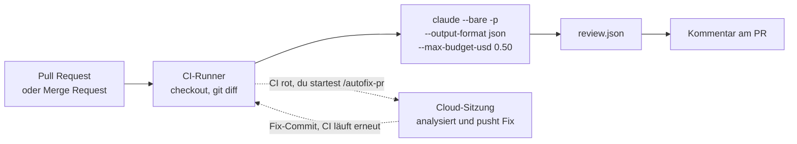

# S4.5 · CI-Pipelines bauen mit GitHub Actions und GitLab

<!-- meta:start -->
> **Regal:** [Headless & CI/CD](README.md#headless-ci) · **Stufe:** Vertiefung · **~18 Min** · **Voraussetzungen:** [S4.4 CI-Zugangsdaten, Kostengrenzen und Kosten-Feinschliff](s4-04-ci-zugang-und-kosten.md)
>
> ← [S4.4 CI-Zugangsdaten, Kostengrenzen und Kosten-Feinschliff](s4-04-ci-zugang-und-kosten.md) · [Bibliothek](README.md) · [S4.6 Unterwegs: Remote Control und /teleport](s4-06-remote-und-teleport.md) →
<!-- meta:end -->

## Schnellcheck

- Hast du schon einmal einen Review-Job in GitHub Actions oder GitLab CI laufen lassen, der einen Diff mit `claude --bare -p` prüft und das Ergebnis an die nächste Stufe weitergibt?
- Kannst du ohne Nachschlagen drei Fehler nennen, die in CI nie passieren dürfen, etwa `claude` ohne `-p`, und jeweils begründen, warum?

## Auf einen Blick

Eine Claude-Stufe in CI besteht immer aus denselben vier Bausteinen: `claude -p` statt einer interaktiven Sitzung, `--output-format json` für die nächste Stufe, `--max-budget-usd` als harte Kostengrenze und Zugangsdaten, die zum Aufruf passen (für `--bare` ein API-Key). Ob GitHub Actions, GitLab CI oder ein lokaler Pre-Commit-Hook: Es wechseln nur die YAML-Oberfläche und die Variablen der Plattform.

Hat der Runner keinen direkten Internetzugang, erreichst du das Modell über einen Proxy, Amazon Bedrock oder Google Vertex AI. Drei Regeln gelten überall: nie `claude` ohne `-p`, nie `--dangerously-skip-permissions` auf geteilten Runnern, nie Zugangsdaten im Log.

## Bild im Kopf

Die automatische Nachtrunde des Wachdienstes aus S4.3 fährt jetzt durch mehrere Gebäude. Die Checkliste ist überall dieselbe: die Route ohne Gespräch abfahren (`-p`), das Streifenformular ausfüllen (JSON), im Tank- und Zeitbudget bleiben (`--max-budget-usd`) und mit dem passenden Dienstausweis durch die Tür gehen (Zugangsdaten). Nur die Gebäude unterscheiden sich: GitHub und GitLab haben andere Türschilder und Schlüsselkästen, also andere YAML-Felder und Variablen.

Der Pre-Commit-Hook ist der Ausweisleser am Ausgang: Er prüft, was das Gebäude verlassen will, bevor es draußen ist. Mit Claude dahinter urteilt der Leser, statt nur ein Muster abzugleichen.



## Im Detail

### Was in jeder CI-Stufe steckt

Alle Beispiele in diesem Kapitel setzen dieselben Teile zusammen, die du aus [S4.3](s4-03-headless.md) und [S4.4](s4-04-ci-zugang-und-kosten.md) kennst:

| Teil | Flag oder Einstellung | Wozu |
|---|---|---|
| Headless-Aufruf | `claude -p` | einmaliger Befehl ohne Gespräch; ohne `-p` wartet `claude` auf Eingabe, und der Job hängt |
| Sauberer Lauf | `--bare` | keine Hooks, Skills, Plugins oder MCP-Server aus dem Repo oder vom Runner |
| Strukturierte Ausgabe | `--output-format json` | die nächste Stufe parst JSON statt Prosa |
| Kostengrenze | `--max-budget-usd` | harte Obergrenze für jeden unbeaufsichtigten Lauf |
| Zugangsdaten | API-Key als CI-Secret | `--bare` liest einen API-Key, `apiKeyHelper` oder Zugangsdaten eines Cloud-Anbieters, nie ein Abo-Token |

### GitHub Actions: ein vollständiges Muster

Ein PR-Reviewer, der bei jedem Pull Request läuft, setzt alles zusammen.

> **Drei Details im Block:** Der Installer liegt unter `https://claude.ai/install.sh` und legt `claude` in `~/.local/bin` ab; die Zeile mit `GITHUB_PATH` macht den Ordner für die folgenden Schritte sichtbar. Jeder Schritt mit der GitHub CLI braucht `GH_TOKEN` mit einem Token, das die nötigen Rechte hat; für den Kommentar gibt der `permissions`-Block dem `GITHUB_TOKEN` genau `pull-requests: write` und sonst nur Lesen (so zeigt es auch das Workflow-Beispiel der [GitHub-Actions-Doku](https://code.claude.com/docs/en/github-actions)). Ohne `--json-schema` steht Claudes Antwort im Feld `result`; ein eigenes Feld wie `summary` gibt es nur mit einem Schema, dann unter `.structured_output.summary` ([S4.3](s4-03-headless.md)).

```yaml
# .github/workflows/claude-review.yml
name: Claude PR Review
on:
  pull_request:
    types: [opened, synchronize]

jobs:
  review:
    runs-on: ubuntu-latest
    permissions:
      contents: read
      pull-requests: write   # gh pr comment
    steps:
      - uses: actions/checkout@v4
        with:
          fetch-depth: 0

      - name: Setup Claude Code
        run: |
          curl -fsSL https://claude.ai/install.sh | bash
          echo "$HOME/.local/bin" >> "$GITHUB_PATH"

      - name: Run Review
        env:
          ANTHROPIC_API_KEY: ${{ secrets.ANTHROPIC_API_KEY }}
        run: |
          git diff origin/main...HEAD > /tmp/diff.patch
          claude --bare -p "Review this diff. Find bugs, security issues, style issues. Output JSON." \
            --output-format json \
            --max-budget-usd 0.50 \
            < /tmp/diff.patch \
            > /tmp/review.json

      - name: Post Review as PR Comment
        env:
          GH_TOKEN: ${{ secrets.GITHUB_TOKEN }}
        run: |
          gh pr comment ${{ github.event.pull_request.number }} \
            --body "$(jq -r '.result' /tmp/review.json)"
```

Alle Teile stecken darin: `--bare` für einen sauberen Lauf, JSON-Ausgabe für die nächste Stufe, `--max-budget-usd` als harte Grenze und ein API-Key als Secret (Weg A aus [S4.4](s4-04-ci-zugang-und-kosten.md), der einzige Anthropic-Zugang, den `--bare` annimmt). Nimmst du stattdessen das Abo-Token, lässt du `--bare` weg und lässt den Workflow nur auf Pull Requests von Leuten laufen, denen du vertraust: Ohne `--bare` führt `-p` die Hooks und MCP-Server des ausgecheckten Repos aus.

Für GitHub gibt es außerdem die offizielle Claude Code GitHub Action (`anthropics/claude-code-action@v1`); `/install-github-app` richtet App, Secret und Workflow für dich ein. Das Muster oben baut die Teile von Hand, damit du sie auf jede Plattform übertragen kannst.

> **Shell-Syntax:** Diese CI-Beispiele laufen auf **Linux-Runnern** (`runs-on: ubuntu-latest`, GitLab-Shell-Runner). Dort ist die POSIX-Form (`export`, `/tmp/`, `#!/bin/bash`) richtig, du übersetzt sie nicht nach PowerShell. Probierst du ein Snippet **lokal unter Windows** aus, nimm `$env:VAR` für Umgebungsvariablen und `$env:TEMP` statt `/tmp/`.

### GitLab CI und selbst betriebene Runner

Viele mittelständische Industrieunternehmen betreiben GitLab selbst, mit privaten Runnern, oft ohne direkten Internetzugang vom Runner aus. Das Gegenstück zum GitHub-Workflow für einen Review von Merge Requests sieht so aus. Es setzt voraus, dass der Runner den Installer und die API erreicht; ohne Direktzugang siehe den nächsten Abschnitt.

> **Alpine:** Auf Alpine und anderen musl-basierten Images braucht Claude Code zur Laufzeit `libgcc`, `libstdc++` und `ripgrep`, dazu `USE_BUILTIN_RIPGREP=0`, damit es das System-`ripgrep` nutzt. Beides steht im Block; der Installer legt `claude` in `~/.local/bin` ab, deshalb die `PATH`-Zeile.

```yaml
# .gitlab-ci.yml
stages:
  - review

claude-review:
  stage: review
  image: alpine:latest
  rules:
    - if: $CI_PIPELINE_SOURCE == "merge_request_event"
  before_script:
    # Setup Claude Code in a minimal container
    - apk add --no-cache curl git bash libgcc libstdc++ ripgrep
    - curl -fsSL https://claude.ai/install.sh | bash
    - export PATH="$HOME/.local/bin:$PATH"
  script:
    - git fetch origin $CI_MERGE_REQUEST_TARGET_BRANCH_NAME
    - git diff origin/$CI_MERGE_REQUEST_TARGET_BRANCH_NAME...HEAD > /tmp/diff.patch
    - |
      claude --bare -p "Review this MR diff. Find bugs, security issues. Output JSON." \
        --output-format json \
        --max-budget-usd 0.50 \
        < /tmp/diff.patch \
        > /tmp/review.json
    - cat /tmp/review.json
  variables:
    ANTHROPIC_API_KEY: $ANTHROPIC_API_KEY
    USE_BUILTIN_RIPGREP: "0"
```

Es sind dieselben Teile wie im GitHub-Workflow. Es wechseln nur die Oberfläche (GitLab-YAML) und die Variablen für Merge Requests, `CI_MERGE_REQUEST_TARGET_BRANCH_NAME` und `CI_PIPELINE_SOURCE`.

### Runner ohne Internetzugang

Hat dein Runner keinen direkten Internetzugang, wie oft in regulierten Branchen (Versorger, Zulieferer der Verteidigung, Krankenhäuser), erreicht `claude` die Adresse `api.anthropic.com` nicht. Drei Muster decken diesen Fall ab.

**Option A: HTTP-Proxy.** Claude Code nutzt den Proxy des Unternehmens:

```bash
export HTTPS_PROXY="http://proxy.corp.example:8080"
export HTTP_PROXY="http://proxy.corp.example:8080"
claude -p "Review this diff" < diff.patch
```

Der Proxy braucht eine Freigabe für `api.anthropic.com`; die vollständige Liste der Adressen, etwa `downloads.claude.ai` für den Installer, steht in der Netzwerk-Doku. Die meisten Unternehmens-Proxys protokollieren ohnehin jeden Aufruf. Kombiniere das mit eigenen OpenTelemetry-Attributen (`OTEL_RESOURCE_ATTRIBUTES`, siehe „CI-Kosten überwachen" unten), damit das SOC Claude-Aufrufe den Runner-Jobs zuordnen kann.

**Option B: Amazon Bedrock in der VPC.** Du nutzt Claude über Bedrock innerhalb deiner VPC:

```bash
export CLAUDE_CODE_USE_BEDROCK=1
export AWS_REGION=eu-central-1
export AWS_PROFILE=ci-bedrock-role
claude -p "Review this diff" < diff.patch
```

Der Modellverkehr geht nicht an `api.anthropic.com`, er bleibt in deiner VPC und ist mit AWS SigV4 signiert. Eine Ausnahme nennt die Netzwerk-Doku: Das WebFetch-Tool fragt für seinen Domain-Check weiter bei `api.anthropic.com` an, außer du setzt `skipWebFetchPreflight: true` in den Settings. Der Runner braucht die IAM-Rechte aus der Bedrock-Anleitung, darunter `bedrock:InvokeModel` und `bedrock:InvokeModelWithResponseStream`, beschränkt auf die Claude-Modelle.

**Option C: Vertex AI in Google Cloud.** Dasselbe Muster über Vertex AI, das die Doku heute „Agent Platform" von Google Cloud nennt:

```bash
export CLAUDE_CODE_USE_VERTEX=1
export CLOUD_ML_REGION=europe-west1
export ANTHROPIC_VERTEX_PROJECT_ID=my-corp-project
claude -p "Review this diff" < diff.patch
```

Die Isolation ist gleichwertig: Claude läuft innerhalb der Grenzen deines GCP-Projekts. Ob du Bedrock oder Vertex nimmst, entscheidet, wo der Rest deines Stacks schon liegt; beide umgehen den öffentlichen Anthropic-Endpunkt.

### Pre-Commit-Hook: dasselbe lokal

Dasselbe Headless-Muster läuft lokal als Git-Pre-Commit-Hook (`.git/hooks/pre-commit`). Das Grundmuster:

```bash
#!/bin/bash
git diff --cached | claude --bare -p \
  "Check this staged diff for obvious bugs. Reply 'OK' or list issues." \
  --max-budget-usd 0.10 \
  --output-format json
# Exit non-zero if issues found
```

Die Skizze ruft Claude nur auf. Die Entscheidung fehlt noch, der Kommentar am Ende markiert die Stelle. Die vollständige Fassung mit Exit-Code baust du in „Selbst machen".

Unter **Windows** führt Git Hooks über das mitgelieferte Git Bash aus; ein `#!/bin/bash`-Pre-Commit-Hook läuft also, wie er ist, ohne `.ps1`. Willst du den Aufruf lieber aus PowerShell starten, schreibst du ihn in eine Zeile ohne die `\`-Fortsetzungen: `git diff --cached | claude --bare -p "..." --max-budget-usd 0.10 --output-format json`.

**Dasselbe Wort, eine andere Schicht.** Die Hooks aus [S2.6](s2-06-hooks-als-sensoren.md) bis [S2.8](s2-08-hook-einrichten.md) sind Hooks von Claude Code (`PreToolUse`, `PostToolUse` und so weiter). Der Hook hier ist ein **Git**-Hook, der Claude Code von außen aufruft. Beides sind gute Stellen, um Claude in deinen Ablauf einzubauen. Auch das Blocken funktioniert verschieden: Ein Git-Pre-Commit-Hook bricht den Commit bei jedem Exit-Code ungleich 0 ab, ein PreToolUse-Hook von Claude Code blockt mit `exit 2` (oder einer JSON-Entscheidung).

### /autofix-pr: Claude in der PR-Schleife

`/autofix-pr` startet eine Cloud-Sitzung, die die CI eines Pull Requests beobachtet. Schlägt die CI fehl, analysiert die Sitzung den Fehler, pusht einen Fix-Commit und lässt die CI erneut laufen. Der Ablauf:

1. Du pushst einen PR.
2. Die CI schlägt fehl: ein kaputter Test, ein Lint-Fehler, ein Typfehler.
3. Du (oder ein Hook) rufst `/autofix-pr` auf.
4. Eine Sitzung auf Anthropics Infrastruktur übernimmt den PR, analysiert den Fehler und pusht einen Fix.
5. Die CI läuft erneut.

> **Sicherheitshinweis:** Nimm `/autofix-pr` für **Test- und Lint-Fehler**, nicht für fehlgeschlagene Produktions-Deploys. Ein scheiternder Deploy-Schritt ist ein Signal, das menschliches Urteil braucht, keine automatische Antwort.

Wann `/autofix-pr` passt und wann nie, steht samt Voraussetzungen in [S1.17](s1-17-git-befehle.md#autofix-pr-ci-fehler-von-einer-cloud-sitzung-beheben-lassen). Kurz: Es passt zu Test-, Lint- und Formatierungsfehlern, Tippfehlern in der Doku und fehlenden Imports. Tabu ist es bei Produktions-Deploys, bei Security-, Auth- oder Crypto-Code (selbst ein „Lint-Fix" kann einen Fehler einbauen) und in Repos, deren main-Branch automatisch in Produktion deployt. Kombiniere es mit Branch-Protection-Regeln, damit der automatisch gepushte Commit vor dem Merge trotzdem eine menschliche Freigabe braucht.

### Token-Rotation auf langlebigen Runnern

Welche Zugangsdaten auch immer auf einem langlebigen CI-Runner liegen (Build-Farmen, GitLab-Runner im eigenen Rechenzentrum, Jenkins-Agenten): Auf die Rotation kommt es an.

- **Abo-Token (Weg B):** `claude setup-token` stellt ein Token mit einem Jahr Laufzeit aus. Du rotierst, indem du ein neues erzeugst und das CI-Secret ersetzt, mindestens vierteljährlich, und du lässt ein Token auf dem Runner nie unbemerkt ablaufen. `claude auth` kennt nur `login`, `logout` und `status`; einen Befehl, der deine ausgestellten Tokens auflistet, gibt es nicht. Führ deshalb selbst Buch, wo welches Token liegt.
- **API-Key (Weg A):** Leg in der Claude Console einen Key pro Pipeline an. Wird einer bekannt, sperrst du genau diesen, ohne die anderen zu brechen. Ein gelöschtes CI-Secret macht den Key nicht ungültig: Lösch ihn auch in der Console.
- **Im Secret-Speicher des CI-Anbieters ablegen:** GitLab-CI/CD-Variablen mit **Protected** und **Masked**, GitHub-Actions-Secrets, Jenkins-Credentials mit maskiertem Logging. Übrig gebliebene Secrets früherer CI-Anbindungen sind ein Risiko, das lange unbemerkt liegen bleibt: Lösch sie.
- **Für Umgebungen mit hohen Sicherheitsanforderungen (Weg C):** Verzichte ganz auf langlebige Secrets. Die Claude Code GitHub Action kann das OIDC-Token des Workflows über ein Service-Konto der Claude Console gegen API-Zugang tauschen (Workload Identity Federation; der Workflow braucht `id-token: write`). Außerhalb von GitHub nimmst du Bedrock oder Vertex mit **kurzlebigen AWS- oder GCP-Zugangsdaten per OIDC-Federation**: Der Runner bekommt aus der Identität des CI-Anbieters ein STS-Token mit einer Stunde Laufzeit, ruft damit Bedrock auf und trägt nie ein langlebiges Anthropic-Token. Wird ein Token bekannt, ist der mögliche Schaden auf eine Stunde begrenzt statt auf ein Jahr.

### CI-Kosten überwachen

`/usage` (Alias `/cost`) zeigt die Kosten der laufenden interaktiven Sitzung, keine Summe über alle CI-Läufe. Für den Überblick über die ganze CI hast du drei Wege:

- **Claude Console:** Die Usage-Seite fasst die API-Ausgaben aller Aufrufe mit deinen Keys zusammen.
- **Eigenes Logging:** Leite `--output-format stream-json` an einen Log-Sammler und werte die `usage`-Ereignisse aus. Für einen einzelnen Lauf reicht `--output-format json` mit dem Feld `total_cost_usd` ([S4.4](s4-04-ci-zugang-und-kosten.md)).
- **OpenTelemetry:** **Markiere deine CI-Läufe**, damit die Summen etwas aussagen. Schalte im Job den Export ein (`CLAUDE_CODE_ENABLE_TELEMETRY=1`, `OTEL_METRICS_EXPORTER=otlp`, `OTEL_EXPORTER_OTLP_ENDPOINT=<your collector>`) und setz `OTEL_RESOURCE_ATTRIBUTES="ci_run_id=<id>,repo=<name>"`. Claude Code hängt diese Schlüssel als Attribute an jeden Messpunkt und jedes Ereignis, das es exportiert; in deinem Metrik-Backend schlüsselst du die Ausgaben dann nach Repo, Workflow oder PR auf. Die Werte dürfen keine Leerzeichen enthalten.

### Don'ts in CI

Diese Fehler sehen in der Entwicklungsumgebung harmlos aus und treffen dich in CI hart:

- **Kein** `--dangerously-skip-permissions` auf geteilten Runnern. CI-Infrastruktur ist geteilt: Wer das Rechtesystem umgeht, kann Secrets zwischen Jobs durchsickern lassen oder auf den Runner-Host schreiben. Brauchst du volle Automatisierung, nimm einen Runner in einer Sandbox ([S3.8](s3-08-rechte-fuer-autonomie.md)).
- **Keine** interaktiven Sitzungen in CI. `claude` ohne `-p` wartet auf stdin, und der Job hängt.
- **Keine** Zugangsdaten im CI-Log. Führe `set +x` vor jedem Schritt aus, der `ANTHROPIC_API_KEY` oder `CLAUDE_CODE_OAUTH_TOKEN` berührt, und maskiere das Secret in der Oberfläche deines CI-Anbieters.
- **Keine** autonomen Schleifen ohne Kostengrenze. `--max-budget-usd` ist ein einziges Flag: Schreib es in jede Zeile.

## Selbst machen

### Übung: einen Pre-Commit-Hook mit Claude bauen

**Art:** Einzelarbeit, etwa 25 Minuten. **Priorität:** Sollte man machen.

**Ziel:** Claude Code als Lint-Prüfung in deinen lokalen Git-Ablauf einbauen. Das ist dein erster Einsatz von Claude als Kommandozeilen-Werkzeug in einer Pipeline.

**Hintergrund:** [S4.3](s4-03-headless.md) und [S4.4](s4-04-ci-zugang-und-kosten.md) haben den Headless-Modus eingeführt (`claude -p`, `--bare`, `--max-budget-usd`, `--output-format`). Diese Übung macht daraus ein echtes Sicherheitsnetz: einen Git-Pre-Commit-Hook, der fehlerhafte Diffs blockt, bevor sie deinen Rechner verlassen. Du lernst dabei vier Dinge auf einmal:

- einen Headless-Aufruf in einem echten Skript
- eine harte Budgetgrenze für eine Routine, die bei jedem Commit läuft
- `--bare`, damit der Hook schnell bleibt
- Claudes Ausgabe lesen und daraus Bestanden oder Durchgefallen ableiten

**Voraussetzung:** `ANTHROPIC_API_KEY` ist in deiner Umgebung gesetzt. `--bare` nutzt weder dein Abo-Login noch ein Abo-Token; ohne API-Key ist der Aufruf nicht angemeldet, und der Hook blockt jeden Commit mit einer Fehlermeldung. Hast du nur ein Abo, lässt du `--bare` in diesem Wegwerf-Repo weg; dann läuft der Aufruf mit deiner Anmeldung.

**Schritt 1: ein Wegwerf-Repo anlegen**

> ⚠️ **Nicht in `workshop-playground/` ausführen.** Der Playground ist *kein* eigenes Git-Repo, das Workshop-Repo selbst verfolgt ihn. `git init` ist dort entweder wirkungslos oder legt ein verwirrendes verschachteltes Repo an, und der `pre-commit`-Hook aus dem nächsten Schritt könnte am Ende Commits im Workshop-Repo blocken. Nimm stattdessen einen frischen, eigenen Ordner, wie in den Übungen von Session 1.

```bash
# macOS / Linux / Git Bash
mkdir -p ~/cc-workshop/exercise-3.6 && cd ~/cc-workshop/exercise-3.6
git init
echo "print('hello')" > app.py        # a file to commit later
```

```powershell
# Windows PowerShell
New-Item -ItemType Directory -Force -Path "$HOME\cc-workshop\exercise-3.6" | Out-Null
Set-Location "$HOME\cc-workshop\exercise-3.6"
git init
"print('hello')" | Set-Content app.py
```

Dieses Repo ist zum Wegwerfen: Nichts, was du hier tust, berührt das Workshop-Material.

**Schritt 2: den Hook schreiben**

Leg `.git/hooks/pre-commit` mit diesem Inhalt an:

<!-- cockpit:example -->
```bash
#!/bin/bash
STAGED=$(git diff --cached)
if [ -z "$STAGED" ]; then exit 0; fi

RESULT=$(echo "$STAGED" | claude --bare -p \
  "Check this staged diff for obvious bugs, security issues, or leftover debug statements (print, console.log, debugger). Reply with 'OK' if clean, otherwise list the issues one per line." \
  --max-budget-usd 0.10 \
  --output-format text)

if [[ "$RESULT" != "OK"* ]]; then
  echo "Pre-commit check failed:"
  echo "$RESULT"
  exit 1
fi
exit 0
```

Darin stecken alle Flags aus S4.3 und S4.4:

- `--bare`, damit der Hook schnell startet und sich überall gleich verhält
- `--max-budget-usd 0.10` als harte Grenze: Ein Commit-Versuch kostet im schlimmsten Fall etwa zehn Cent (die Antwort, die die Grenze überschreitet, wird noch bezahlt, siehe S4.4). `--max-turns` (nur im Print-Modus, dokumentiert, aber nicht in `claude --help`) ist die passende Rundengrenze, wenn du eine zweite, unabhängige Schleifenbremse willst.
- `--output-format text`, weil der Hook nur ein Ja oder Nein braucht

**Schritt 3: ausführbar machen**

```bash
chmod +x .git/hooks/pre-commit
```

Unter Windows machst du das in Git Bash oder WSL: Das Hook-System von Git sucht nach ausführbaren POSIX-Skripten.

**Schritt 4: den Normalfall testen**

Mach eine saubere Änderung (ein Kommentar, ein korrigierter Tippfehler, ein zusätzliches Leerzeichen), stage sie und committe. Der Hook sollte still durchlaufen.

**Schritt 5: den Fehlerfall testen**

Bau jetzt absichtlich ein Problem ein: eine Zeile `print("DEBUG")`, ein fest eingetragenes Passwort oder einen auskommentierten Test. Stage und versuch zu committen. Der Hook sollte blocken, die gefundenen Probleme auflisten und mit einem Code ungleich 0 enden. Der Commit findet nicht statt.

**Bonus (etwa 5 Minuten): eine Kostenspur.** Wie du jeden Aufruf des Hooks in eine lokale Spur-Datei schreibst, steht in [S4.4](s4-04-ci-zugang-und-kosten.md) unter „Selbst machen", Schritt 3.

**Nachdenken:** Beantworte nach fünf oder mehr Commits mit aktivem Hook diese Fragen in deinen Notizen:

1. **Kosten:** Wie viele Tokens hat ein Aufruf ungefähr verbraucht? Schau in einer interaktiven Sitzung mit `/usage` nach oder auf der Usage-Seite der Claude Console. War die gesetzte Budgetgrenze fast erreicht, oder blieb der Lauf deutlich darunter?
2. **Genauigkeit:** Hat der Hook ein Problem gefunden, das du sonst committet hättest? Hat er falschen Alarm geschlagen und dir Zeit gekostet?
3. **Tempo:** Hat der Hook deinen Commit-Ablauf spürbar gebremst? Wenn ja, was würdest du eintauschen: weniger Prüfungen, kürzere Prompts, ein schnelleres Modell mit `--model haiku`?
4. **Praxistauglichkeit:** Würdest du den Hook in einem echten Projekt einschalten? Schreib je drei Punkte dafür und dagegen auf.

**Geschafft, wenn:**

- [ ] der Hook ausführbar ist und unter `.git/hooks/pre-commit` liegt
- [ ] ein sauberer Commit still durchläuft
- [ ] ein Commit mit einem offensichtlichen Problem mit einer lesbaren Meldung geblockt wird
- [ ] die Flags aus S4.3 und S4.4 in deinem Hook stehen: `--max-budget-usd`, `--output-format` und, wenn du einen API-Key hast, `--bare`
- [ ] du eine Meinung dazu hast, ob du den Hook in einem echten Projekt einsetzen würdest

**Für Schnelle:** Stell den Hook auf `--output-format json` mit einem kleinen `--json-schema` um und werte das Ergebnis mit `jq` aus; es steht dann in `.structured_output` ([S4.3](s4-03-headless.md)). Die Entscheidung wird so zu deterministischer boolescher Logik statt zu einem Vergleich des Textanfangs: genau das Muster, das ein CI-Runner nutzen würde.

## Typische Fallen

Was bei deiner ersten Claude-Anbindung in CI schiefgeht und wie du es behebst:

| Symptom | Ursache | Lösung |
|---|---|---|
| Anmeldefehler, obwohl `CLAUDE_CODE_OAUTH_TOKEN` gesetzt ist | Der Job läuft mit `--bare`, und `--bare` liest das Abo-Token nie | Stell den Job auf einen API-Key um (Weg A); lass `--bare` nur bei vertrauenswürdigem Code weg (Weg B) |
| Anmeldefehler bei einem Job, der früher lief | Das Abo-Token hat sein Jahr hinter sich, oder der API-Key wurde gesperrt | Neues Token oder neuen Key erzeugen und das CI-Secret ersetzen |
| Die Pipeline rechnet über die API ab, obwohl du ein Abo-Token eingerichtet hast | Ein übrig gebliebener `ANTHROPIC_API_KEY` in der Runner-Umgebung hat Vorrang vor `CLAUDE_CODE_OAUTH_TOKEN` | Den Key aus der Job-Umgebung entfernen; `claude auth status` muss `"authMethod": "oauth_token"` zeigen |
| Ein einzelner Lauf kostet unerwartet viel | Eine Schleife ohne Budgetgrenze | `--max-budget-usd` bei **jedem** CI-Aufruf setzen |
| Das nachgelagerte `jq` scheitert an der Ausgabe | Freie Prosa statt JSON | `--output-format json` und `--json-schema` ergänzen |
| Die Persona schwankt von Lauf zu Lauf | Der Standard-Systemprompt ändert sich mit den geladenen Skills | `--bare` plus `--system-prompt-file` für eine feste Persona |
| Der Runner hängt und wartet auf Eingabe | Interaktiver Modus statt `-p` | In CI immer `claude -p "..."`, nie `claude` ohne `-p` |

## Check

Du kannst eine CI-Stufe aus den vier Bausteinen zusammensetzen (`claude -p`, JSON-Ausgabe, Budgetgrenze, passende Zugangsdaten), sie für GitHub Actions oder GitLab CI schreiben und erkennen, warum ein Job hängt, nicht angemeldet ist oder Prosa statt JSON liefert.

1. Warum hängt ein CI-Job, der `claude` ohne `-p` aufruft?
2. Auf welchen drei Wegen erreicht ein Runner ohne direkten Internetzugang das Modell?
3. Was unterscheidet einen Git-Pre-Commit-Hook beim Blocken von einem PreToolUse-Hook von Claude Code?

<details><summary>Quizfrage</summary>

**Frage:** Warum ist `/autofix-pr` für einen fehlgeschlagenen Produktions-Deploy in der CI ungeeignet?

- **Richtig:** Ein scheiternder Deploy braucht menschliches Urteil über Zustand und Rollback; ein Auto-Fix kann den Schaden vergrößern.
- Falsch: `/autofix-pr` lädt immer den ganzen Plugin-Stack, und geschützte Pfade blocken dann jedes Schreiben in Produktions-Repos.
- Falsch: `/autofix-pr` arbeitet nur auf Branches vor dem Merge, und Deploy-Fehler treten erst nach dem Merge in `main` auf.
- Falsch: `/autofix-pr` erreicht keine externen Deploy-Dienste und kann die eigentliche Fehlerursache deshalb gar nicht lesen.

</details>

## Weiterlesen

- [Claude Code GitHub Actions](https://code.claude.com/docs/en/github-actions)
- [Claude Code GitLab CI/CD](https://code.claude.com/docs/en/gitlab-ci-cd)
- [Headless-Modus und `--bare`](https://code.claude.com/docs/en/headless)
- [Installation, auch auf Alpine Linux](https://code.claude.com/docs/en/setup)
- [Netzwerk: Proxy und freizugebende Adressen](https://code.claude.com/docs/en/network-config)
- [Amazon Bedrock](https://code.claude.com/docs/en/amazon-bedrock) · [Google Cloud (Vertex AI)](https://code.claude.com/docs/en/google-vertex-ai)
- [Nutzung mit OpenTelemetry überwachen](https://code.claude.com/docs/en/monitoring-usage)
- [S4.3 · Headless: claude -p als Pipeline-Stufe](s4-03-headless.md)
- [S4.4 · CI-Zugangsdaten, Kostengrenzen und Kosten-Feinschliff](s4-04-ci-zugang-und-kosten.md)
- [S1.17 · Git-Befehle in der Sitzung](s1-17-git-befehle.md)
- [S2.8 · Einen Hook einrichten, der wirklich blockt](s2-08-hook-einrichten.md)
- [S3.8 · Rechte für autonome Läufe](s3-08-rechte-fuer-autonomie.md)
- [S3.13 · Autonome Loops absichern: Budget und Worktree](s3-13-autonome-loops-absichern.md)
