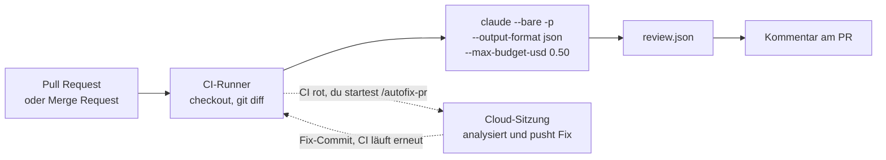

# S4.5 · CI-Pipelines bauen mit GitHub Actions und GitLab

<!-- meta:start -->
> **Regal:** [Headless & CI/CD](README.md#headless-ci) · **Stufe:** Vertiefung · **~18 Min** · **Voraussetzungen:** [S4.4 CI-Zugangsdaten, Kostengrenzen und Kosten-Feinschliff](s4-04-ci-zugang-und-kosten.md)
>
> ← [S4.4 CI-Zugangsdaten, Kostengrenzen und Kosten-Feinschliff](s4-04-ci-zugang-und-kosten.md) · [Bibliothek](README.md) · [S4.6 Unterwegs: Remote Control und /teleport](s4-06-remote-und-teleport.md) →
<!-- meta:end -->

## Schnellcheck

- Hast du schon einmal einen Review-Job in GitHub Actions oder GitLab CI laufen lassen, der einen Diff mit `claude -p` prüft und das Ergebnis an die nächste Stufe weitergibt?
- Kannst du ohne Nachschlagen drei Fehler nennen, die in CI nie passieren dürfen, etwa `claude` ohne `-p`, und jeweils begründen, warum?

## Auf einen Blick

Eine Claude-Stufe in CI besteht immer aus denselben vier Bausteinen: `claude -p` statt einer interaktiven Sitzung, `--output-format json` für die nächste Stufe, `--max-budget-usd` (und `--max-turns`) als harte Grenzen und Zugangsdaten, die zum Aufruf passen ([S4.4](s4-04-ci-zugang-und-kosten.md)). Ob GitHub Actions, GitLab CI oder ein lokaler Pre-Commit-Hook: Es wechseln nur die YAML-Oberfläche und die Variablen der Plattform.

Du baust die Stufe lokal, im Pre-Commit-Hook eines Wegwerf-Repos. Die YAML-Beispiele für GitHub und GitLab sind Lesestoff; ausprobieren kannst du sie mit Konto, Repository und API-Key (Extra). Drei Regeln gelten überall: nie `claude` ohne `-p`, nie `--dangerously-skip-permissions` auf geteilten Runnern, nie Zugangsdaten im Log.

## Bild im Kopf

Die automatische Nachtrunde des Wachdienstes aus S4.3 fährt jetzt durch mehrere Gebäude. Die Checkliste ist überall dieselbe: die Route ohne Gespräch abfahren (`-p`), das Streifenformular ausfüllen (JSON), im Tank- und Zeitbudget bleiben (`--max-budget-usd`) und mit dem passenden Dienstausweis durch die Tür gehen (Zugangsdaten). Nur die Gebäude unterscheiden sich: GitHub und GitLab haben andere Türschilder und Schlüsselkästen, also andere YAML-Felder und Variablen.

Der Pre-Commit-Hook ist der Ausweisleser am Ausgang: Er prüft, was das Gebäude verlassen will, bevor es draußen ist. Mit Claude dahinter urteilt der Leser, statt nur ein Muster abzugleichen.



## Im Detail

### Was in jeder CI-Stufe steckt

Alle Beispiele setzen dieselben Teile zusammen, die du aus [S4.3](s4-03-headless.md) und [S4.4](s4-04-ci-zugang-und-kosten.md) kennst:

| Teil | Flag oder Einstellung | Wozu |
|---|---|---|
| Headless-Aufruf | `claude -p` | einmaliger Befehl ohne Gespräch; ohne `-p` wartet `claude` auf Eingabe, und der Job hängt |
| Sauberer Lauf | `--bare` | keine Hooks, Skills, Plugins oder MCP-Server aus dem Repo oder vom Runner |
| Strukturierte Ausgabe | `--output-format json`, `--json-schema` | die nächste Stufe liest ein Feld statt Prosa |
| Grenzen | `--max-budget-usd`, `--max-turns` | Obergrenzen für jeden unbeaufsichtigten Lauf |
| Rechte | `--permission-mode dontAsk` | niemand antwortet auf Rückfragen; Claude Code lehnt ab, was sonst nachfragen würde |
| Zugangsdaten | API-Key als CI-Secret | `--bare` liest für die Anthropic-API nur einen API-Key oder `apiKeyHelper` |

### GitHub Actions: ein Muster zum Lesen

Ein PR-Reviewer, der bei jedem Pull Request läuft. Lies ihn Block für Block:

- `on: pull_request` startet bei neuen Commits eines Pull Requests; `permissions` gibt dem `GITHUB_TOKEN` nur Lesen plus `pull-requests: write` für den Kommentar; `fetch-depth: 0` holt die Historie für `git diff`.
- Der Installer legt `claude` in `~/.local/bin` ab; `GITHUB_PATH` macht den Ordner für die folgenden Schritte sichtbar.
- Der Review-Schritt bekommt den Zugang aus dem Secret `ANTHROPIC_API_KEY`. Der Diff geht per Pipe hinein, Claude braucht also kein Lese-Werkzeug; das Schema gibt dem Ergebnis feste Felder, `--permission-mode dontAsk` lehnt ab, was nachfragen würde.
- Der letzte Schritt liest `.structured_output.summary` und postet es mit `gh pr comment` (dafür braucht `gh` ein `GH_TOKEN`).

```yaml
# .github/workflows/claude-review.yml
name: Claude PR Review
on:
  pull_request:
    types: [opened, synchronize]

jobs:
  review:
    runs-on: ubuntu-latest
    permissions:
      contents: read
      pull-requests: write   # gh pr comment
    steps:
      - uses: actions/checkout@v6
        with:
          fetch-depth: 0

      - name: Setup Claude Code
        run: |
          curl -fsSL https://claude.ai/install.sh | bash
          echo "$HOME/.local/bin" >> "$GITHUB_PATH"

      - name: Run Review
        env:
          ANTHROPIC_API_KEY: ${{ secrets.ANTHROPIC_API_KEY }}
        run: |
          git diff origin/main...HEAD > /tmp/diff.patch
          claude --bare -p "Review this diff. Find bugs and security issues." \
            --output-format json \
            --json-schema '{"type":"object","properties":{"summary":{"type":"string"},"issues":{"type":"array","items":{"type":"string"}}},"required":["summary","issues"]}' \
            --max-budget-usd 0.50 --max-turns 10 --permission-mode dontAsk \
            < /tmp/diff.patch \
            > /tmp/review.json

      - name: Post Review as PR Comment
        env:
          GH_TOKEN: ${{ secrets.GITHUB_TOKEN }}
        run: |
          gh pr comment ${{ github.event.pull_request.number }} \
            --body "$(jq -r '.structured_output.summary' /tmp/review.json)"
```

Nimmst du statt des API-Keys das Abo-Token, lässt du `--bare` weg und lässt den Workflow nur auf Pull Requests von Leuten laufen, denen du vertraust: Ohne `--bare` führt `-p` die Hooks und MCP-Server des ausgecheckten Repos aus ([S4.4](s4-04-ci-zugang-und-kosten.md)). Für GitHub gibt es außerdem die offizielle Claude Code GitHub Action (`anthropics/claude-code-action@v1`); `/install-github-app` richtet App, Secret und Workflow für dich ein. Das Muster oben baut die Teile von Hand, damit du sie auf jede Plattform übertragen kannst.

> **Shell-Syntax:** Diese CI-Beispiele laufen auf **Linux-Runnern**. Dort ist die POSIX-Form (`/tmp/`, `#!/bin/bash`) richtig, du übersetzt sie nicht nach PowerShell.

### GitLab CI: dieselben Teile

Das Gegenstück für Merge Requests. Es setzt voraus, dass der Runner den Installer und die API erreicht. Den API-Key legst du in GitLab als maskierte, geschützte CI/CD-Variable im Projekt an; er steht nicht in der Datei.

```yaml
# .gitlab-ci.yml
stages:
  - review

claude-review:
  stage: review
  image: alpine:latest
  rules:
    - if: $CI_PIPELINE_SOURCE == "merge_request_event"
  before_script:
    # musl-based image: Claude Code needs libgcc, libstdc++ and ripgrep at runtime
    - apk add --no-cache curl git bash libgcc libstdc++ ripgrep
    - curl -fsSL https://claude.ai/install.sh | bash
    - export PATH="$HOME/.local/bin:$PATH"
  script:
    - git fetch origin $CI_MERGE_REQUEST_TARGET_BRANCH_NAME
    - git diff origin/$CI_MERGE_REQUEST_TARGET_BRANCH_NAME...HEAD > /tmp/diff.patch
    - |
      claude --bare -p "Review this MR diff. Find bugs and security issues." \
        --output-format json \
        --max-budget-usd 0.50 --max-turns 10 --permission-mode dontAsk \
        < /tmp/diff.patch \
        > /tmp/review.json
    - cat /tmp/review.json
  variables:
    USE_BUILTIN_RIPGREP: "0"   # use the system ripgrep installed above
```

Auf Alpine und anderen musl-basierten Images braucht Claude Code zur Laufzeit `libgcc`, `libstdc++` und `ripgrep`, dazu `USE_BUILTIN_RIPGREP=0`. Es sind dieselben Teile wie bei GitHub; es wechseln nur die Oberfläche und die Variablen für Merge Requests, `CI_MERGE_REQUEST_TARGET_BRANCH_NAME` und `CI_PIPELINE_SOURCE`.

### Runner ohne Internetzugang

Erreicht ein Runner `api.anthropic.com` nicht direkt, gibt es drei Wege: einen **HTTP-Proxy** (`HTTPS_PROXY`, `HTTP_PROXY`; er braucht eine Freigabe für `api.anthropic.com` und `downloads.claude.ai`, die vollständige Liste steht in der [Netzwerk-Doku](https://code.claude.com/docs/en/network-config)), **Amazon Bedrock** (`CLAUDE_CODE_USE_BEDROCK=1`, `AWS_REGION`, ein AWS-Profil mit `bedrock:InvokeModel` und `bedrock:InvokeModelWithResponseStream`) oder **Vertex AI**, in der Doku „Agent Platform" (`CLAUDE_CODE_USE_VERTEX=1`, `CLOUD_ML_REGION`, `ANTHROPIC_VERTEX_PROJECT_ID`). Bei Bedrock und Vertex gehen laut Netzwerk-Doku Modellverkehr und Anmeldung an deinen Anbieter statt an `api.anthropic.com`; das WebFetch-Tool fragt für seinen Domain-Check weiter bei `api.anthropic.com` an, außer du setzt `skipWebFetchPreflight: true`. Wo der Verkehr sonst verläuft, hängt von deinem Netz ab und steht nicht in der Doku.

### Pre-Commit-Hook: dasselbe lokal

Dasselbe Headless-Muster läuft lokal als Git-Pre-Commit-Hook (`.git/hooks/pre-commit`): Der gestagte Diff geht an Claude, und die Antwort entscheidet, ob der Commit durchgeht. Das ist die Übung unten. Zwei Dinge sind dabei neu:

- **Exit-Code und Urteil sind zwei Dinge** ([S4.3](s4-03-headless.md)). Der Hook prüft zuerst, ob `claude` überhaupt gelaufen ist, und liest dann erst die Antwort. Sonst sähe ein Lauf, der gar nicht startete, wie ein Urteil „nicht OK" aus.
- **Ein Git-Pre-Commit-Hook ist nicht dasselbe wie die Hooks von Claude Code** ([S2.6](s2-06-hooks-als-sensoren.md) bis [S2.8](s2-08-hook-einrichten.md)). Er ruft Claude von außen auf, und Git bricht den Commit bei jedem Exit-Code ungleich 0 ab. Ein PreToolUse-Hook von Claude Code blockt dagegen mit `exit 2` (oder einer JSON-Entscheidung).

Unter Windows führt Git die Hooks über das mitgelieferte Git Bash aus, ein `#!/bin/bash`-Skript läuft also, wie es ist.

### /autofix-pr: Claude in der PR-Schleife

`/autofix-pr` startet eine Cloud-Sitzung, die die CI eines Pull Requests beobachtet. Schlägt die CI fehl, analysiert die Sitzung den Fehler, pusht einen Fix-Commit und lässt die CI erneut laufen. Wann es passt und wann nie, steht samt Voraussetzungen in [S1.17](s1-17-git-befehle.md#ausblick-autofix-pr-und---from-pr). Kurz: Es passt zu Test-, Lint- und Formatierungsfehlern, nie zu fehlgeschlagenen Produktions-Deploys und nie zu Security-, Auth- oder Crypto-Code. Kombiniere es mit Branch-Protection-Regeln, damit der gepushte Commit vor dem Merge eine menschliche Freigabe braucht.

### Rotation und Kosten, kurz

- **Rotation:** Ein Abo-Token läuft nach einem Jahr ab; führ Buch, wo welches liegt (`claude auth` kennt nur `login`, `logout` und `status`). Leg pro Pipeline einen eigenen API-Key an, damit du genau einen sperren kannst, und lösch einen Key auch in der Console, nicht nur das CI-Secret. Gar kein langlebiges Secret ist Weg C aus [S4.4](s4-04-ci-zugang-und-kosten.md). In GitLab legst du Secrets als Variable mit **Protected** und **Masked** ab.
- **Kosten:** `/usage` zeigt nur die lokale Sitzung. Für die ganze CI gibt es die Usage-Seite der Console, `total_cost_usd` im JSON eines Laufs und OpenTelemetry (`CLAUDE_CODE_ENABLE_TELEMETRY=1`, `OTEL_METRICS_EXPORTER=otlp`, `OTEL_EXPORTER_OTLP_ENDPOINT`, dazu `OTEL_RESOURCE_ATTRIBUTES="ci_run_id=<id>,repo=<name>"` ohne Leerzeichen in den Werten), um die Ausgaben nach Repo oder PR aufzuschlüsseln.

### Don'ts in CI

- **Kein** `--dangerously-skip-permissions` auf geteilten Runnern. Wer das Rechtesystem umgeht, kann Secrets zwischen Jobs durchsickern lassen oder auf den Runner-Host schreiben. Brauchst du volle Automatisierung, nimm einen Runner in einer Sandbox ([S3.8](s3-08-rechte-fuer-autonomie.md)).
- **Keine** interaktiven Sitzungen. `claude` ohne `-p` wartet auf stdin, und der Job hängt.
- **Keine** Zugangsdaten im CI-Log. Maskiere das Secret in der Oberfläche deines CI-Anbieters.
- **Keine** autonomen Schleifen ohne Kostengrenze. Schreib `--max-budget-usd` in jede Zeile.
- **Fremder Diff ist fremder Text.** Ein Modell mit Bash- und Edit-Werkzeugen liest ihn, und Anweisungen darin können Claude erreichen. Gib dem Lauf nur, was er braucht (`--permission-mode dontAsk`, keine breiten `--allowedTools`) und lies [X.4](x-04-agenten-im-dauerbetrieb.md) zu Prompt Injection.

## Selbst machen

### Übung: einen Pre-Commit-Hook mit Claude bauen (etwa 15 Minuten)

**Ziel:** Du baust Claude als Prüfer in den Commit-Ablauf eines Wegwerf-Repos ein, siehst einen sauberen Commit durchgehen und einen mit einem Debug-Rest scheitern und trennst im Hook Exit-Code und Urteil.

**Startzustand:** ein neues Repository `~/cc-workshop/precommit`; Git, Claude Code und Python reichen. Nichts davon liegt außerhalb des Ordners, der Hook lebt in `.git/hooks`, und die Git-Einstellungen gelten nur für dieses Repo. Der Hook ruft `claude` ohne `--bare` auf, denn das Repo ist dein eigenes und `--bare` bräuchte einen API-Key. Jeder Commit-Versuch kostet etwas Kontingent: Der Hook nutzt `--model haiku`, `--max-budget-usd 0.10` und `--max-turns 3`.

Bash:

```bash
mkdir -p ~/cc-workshop/precommit && cd ~/cc-workshop/precommit
git init
git config user.name "Workshop"
git config user.email "workshop@example.invalid"
python -c "open('app.py','w').write('x = 1\n')"
git add app.py && git commit -m "init"
```

PowerShell:

```powershell
New-Item -ItemType Directory -Force "$HOME\cc-workshop\precommit"; Set-Location "$HOME\cc-workshop\precommit"
git init
git config user.name "Workshop"
git config user.email "workshop@example.invalid"
python -c "open('app.py','w').write('x = 1\n')"
git add app.py; git commit -m "init"
```

(Unter macOS und Linux heißt Python meist `python3`.) Nicht in `workshop-playground/` arbeiten: Den verfolgt das Workshop-Repo selbst.

1. Leg mit einem Editor die Datei `.git/hooks/pre-commit` an. `.git` ist ein geschützter Pfad, schreib sie selbst. Speichere sie mit Unix-Zeilenenden (LF): Ein CR am Zeilenende macht aus `#!/bin/bash` für Git Bash einen unbekannten Interpreter.

   <!-- cockpit:example -->
   ```bash
   #!/bin/bash
   STAGED=$(git diff --cached)
   if [ -z "$STAGED" ]; then exit 0; fi

   RESULT=$(echo "$STAGED" | claude -p \
     "Check this staged diff for leftover debug statements (print, console.log, debugger) and obvious bugs. Reply with the single word OK if clean, otherwise list the issues one per line." \
     --model haiku --max-turns 3 --max-budget-usd 0.10 --permission-mode dontAsk --output-format text)
   STATUS=$?

   if [ "$STATUS" -ne 0 ]; then
     echo "Pre-commit check could not run (claude exit $STATUS). Commit blocked."
     echo "$RESULT"
     exit 1
   fi
   if [[ "$RESULT" != "OK"* ]]; then
     echo "Pre-commit check found issues:"
     echo "$RESULT"
     exit 1
   fi
   exit 0
   ```

2. Mach ihn ausführbar: `chmod +x .git/hooks/pre-commit` (macOS und Linux). Unter Windows führt Git die Hooks über sein Git Bash aus; läuft der Hook in Schritt 3 nicht, führ `chmod +x` einmal in Git Bash aus.
3. **Der Normalfall.** Ändere `app.py` zu `x = 2`, stage und committe:

   ```bash
   python -c "open('app.py','w').write('x = 2\n')"
   git add app.py && git commit -m "bump x"
   git log --oneline
   ```

   In PowerShell dieselben Zeilen mit `;` statt `&&`. Erwartet: Der Commit läuft nach einigen Sekunden durch, ohne Meldung des Hooks, und `git log --oneline` zeigt zwei Commits. Blockt der Hook trotzdem, hat Claude etwas gefunden; lies die Meldung, sie ist das Urteil.
4. **Der Fehlerfall.** Bau einen Debug-Rest ein, stage und versuch zu committen:

   ```bash
   python -c "open('app.py','w').write('x = 2\nprint(x)\n')"
   git add app.py && git commit -m "add debug"
   echo "exit=$?"
   git log --oneline
   ```

   In PowerShell: `git add app.py; git commit -m "add debug"`, dann `"exit=$LASTEXITCODE"` und `git log --oneline`. Erwartet: `Pre-commit check found issues:`, darunter eine Zeile zum `print`, `exit=1`; `git log --oneline` zeigt weiter zwei Commits, die Änderung bleibt gestaged.
5. **Exit-Code gegen Urteil.** Ändere im Hook den Aufruf `claude -p` in `claudx -p`, damit er scheitert, und versuch den Commit erneut. Erwartet: `Pre-commit check could not run (claude exit 127)`. Der Commit ist blockiert, obwohl niemand etwas beurteilt hat: Der Fehlstart steht in einer anderen Meldung als das Urteil. Stell den Namen wieder auf `claude`. Mit `git commit --no-verify` übergehst du den Hook, wenn du ihn einmal bewusst umgehen musst.

**Aufräumen:** Es läuft nichts weiter. Lösch den Ordner `~/cc-workshop/precommit` selbst; mit ihm sind Repo und Hook weg.

**Geschafft, wenn:**

- [ ] der saubere Commit durchlief und `git log --oneline` zwei Commits zeigte
- [ ] der Commit mit dem `print`-Rest blockt, `exit=1` zeigte und weiter nur zwei Commits im Verlauf standen
- [ ] der Lauf mit `claudx` eine andere Meldung als das Urteil lieferte (`could not run`, Exit 127)

### Extra: die Stufe in GitHub Actions (etwa 20 Minuten)

Du brauchst ein GitHub-Konto, die GitHub CLI `gh` ([Werkstatt erweitern](../reference/werkstatt-erweitern.md#github-cli)) und einen API-Key aus der Console, den du als Repository-Secret `ANTHROPIC_API_KEY` über die Oberfläche von GitHub einträgst, nie in eine Datei oder einen Prompt. Leg ein leeres, privates Test-Repository an, lege das Workflow-YAML von oben unter `.github/workflows/claude-review.yml` ab, öffne einen Pull Request mit einer kleinen Änderung und lies den Kommentar. Erwartet: Der Workflow läuft, und am Pull Request steht ein Kommentar mit dem Feld `summary`. Räum auf: Lösch das Test-Repository und den Key in der Console.

### Extra: der Hook mit Schema (etwa 10 Minuten)

Stell den Hook auf `--output-format json` mit einem kleinen `--json-schema` um (`{"ok": boolean, "issues": [string]}`) und lies `structured_output` aus ([S4.3](s4-03-headless.md)). Die Entscheidung wird so Logik über ein Feld statt eines Vergleichs des Textanfangs, genau das Muster, das ein CI-Runner nutzen würde.

## Typische Fallen

| Symptom | Ursache | Lösung |
|---|---|---|
| Anmeldefehler, obwohl `CLAUDE_CODE_OAUTH_TOKEN` gesetzt ist | Der Job läuft mit `--bare`, und `--bare` liest das Abo-Token nie | Stell den Job auf einen API-Key um (Weg A); lass `--bare` nur bei vertrauenswürdigem Code weg (Weg B) |
| Anmeldefehler bei einem Job, der früher lief | Das Abo-Token hat sein Jahr hinter sich, oder der API-Key wurde gesperrt | Neues Token oder neuen Key erzeugen und das CI-Secret ersetzen |
| Die Pipeline rechnet über die API ab, obwohl du ein Abo-Token eingerichtet hast | Ein übrig gebliebener `ANTHROPIC_API_KEY` in der Runner-Umgebung hat Vorrang | Den Key aus der Job-Umgebung entfernen; `claude auth status` zeigt die gewählte Methode |
| Ein einzelner Lauf kostet unerwartet viel | Eine Schleife ohne Grenze | `--max-budget-usd` und `--max-turns` bei **jedem** CI-Aufruf setzen |
| Das nachgelagerte `jq` scheitert an der Ausgabe | Freie Prosa statt JSON, oder das falsche Feld des Umschlags | `--output-format json` und `--json-schema` setzen, `.structured_output` lesen |
| Der Runner hängt und wartet auf Eingabe | Interaktiver Modus statt `-p` | In CI immer `claude -p "..."`, nie `claude` ohne `-p` |
| Der Pre-Commit-Hook blockt jeden Commit | `claude` läuft nicht (nicht gefunden, nicht angemeldet), und der Hook behandelt jeden Fehlstart als „nicht OK" | Exit-Code getrennt prüfen, wie in der Übung; im Notfall `git commit --no-verify` |
| Der Hook läuft nicht, obwohl er da ist | Die Datei ist nicht ausführbar oder hat Windows-Zeilenenden | `chmod +x`, mit LF speichern |

## Check

Du kannst eine CI-Stufe aus den Bausteinen zusammensetzen (`claude -p`, JSON-Ausgabe, Grenzen, passende Zugangsdaten), in einem Pre-Commit-Hook Exit-Code und Urteil trennen und erkennen, warum ein Job hängt, nicht angemeldet ist oder Prosa statt JSON liefert.

1. Warum hängt ein CI-Job, der `claude` ohne `-p` aufruft?
2. Warum prüft der Pre-Commit-Hook der Übung den Exit-Code von `claude`, bevor er die Antwort liest?
3. Womit blockt ein Git-Pre-Commit-Hook einen Commit, womit ein PreToolUse-Hook von Claude Code einen Tool-Aufruf?

<details><summary>Auflösung</summary>

1. `claude` ohne `-p` startet eine interaktive Sitzung und wartet auf Eingabe, die in CI niemand liefert; der Job hängt.
2. Der Exit-Code sagt, ob der Lauf durchgekommen ist, die Antwort ist das Urteil. Ohne die Trennung sähe ein Lauf, der gar nicht startete (nicht gefunden, nicht angemeldet), wie ein „nicht OK" aus.
3. Git bricht den Commit bei jedem Exit-Code ungleich 0 ab. Ein PreToolUse-Hook von Claude Code blockt über den Code allein nur mit `exit 2` (oder einer JSON-Entscheidung); jeder andere Code lässt den Aufruf laufen.

</details>

<details><summary>Quizfrage</summary>

**Frage:** Warum ist `/autofix-pr` für einen fehlgeschlagenen Produktions-Deploy in der CI ungeeignet?

- **Richtig:** Ein scheiternder Deploy braucht menschliches Urteil über Zustand und Rollback; ein Auto-Fix kann den Schaden vergrößern.
- Falsch: `/autofix-pr` lädt immer den ganzen Plugin-Stack, und geschützte Pfade blocken dann jedes Schreiben in Produktions-Repos.
- Falsch: `/autofix-pr` arbeitet nur auf Branches vor dem Merge, und Deploy-Fehler treten erst nach dem Merge in `main` auf.
- Falsch: `/autofix-pr` erreicht keine externen Deploy-Dienste und kann die eigentliche Fehlerursache deshalb gar nicht lesen.

</details>

## Weiterlesen

- [Claude Code GitHub Actions](https://code.claude.com/docs/en/github-actions)
- [Claude Code GitLab CI/CD](https://code.claude.com/docs/en/gitlab-ci-cd)
- [Headless-Modus und `--bare`](https://code.claude.com/docs/en/headless)
- [Installation, auch auf Alpine Linux](https://code.claude.com/docs/en/setup)
- [Netzwerk: Proxy und freizugebende Adressen](https://code.claude.com/docs/en/network-config)
- [Amazon Bedrock](https://code.claude.com/docs/en/amazon-bedrock) · [Google Cloud (Vertex AI)](https://code.claude.com/docs/en/google-vertex-ai)
- [Nutzung mit OpenTelemetry überwachen](https://code.claude.com/docs/en/monitoring-usage)
- [S4.3 · Headless: claude -p als Pipeline-Stufe](s4-03-headless.md)
- [S4.4 · CI-Zugangsdaten, Kostengrenzen und Kosten-Feinschliff](s4-04-ci-zugang-und-kosten.md)
- [S1.17 · Git-Befehle in der Sitzung](s1-17-git-befehle.md)
- [S2.8 · Einen Hook einrichten, der wirklich blockt](s2-08-hook-einrichten.md)
- [S3.8 · Rechte für autonome Läufe](s3-08-rechte-fuer-autonomie.md)
- [S3.13 · Autonome Loops absichern: Budget und Worktree](s3-13-autonome-loops-absichern.md)
- [X.4 · Agenten im Dauerbetrieb](x-04-agenten-im-dauerbetrieb.md)
