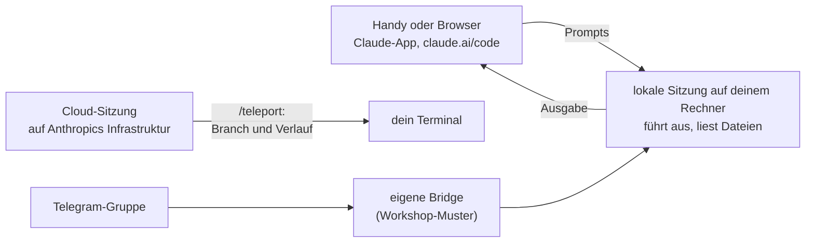

# S4.6 · Unterwegs: Remote Control und /teleport

<!-- meta:start -->
> **Regal:** [Remote, Docker, Isolation](README.md#remote-isolation) · **Stufe:** Kür · **~12 Min** · **Voraussetzungen:** [S1.3 Die Oberflächen: CLI, Desktop, IDE, Web, iOS](s1-03-oberflaechen.md)
>
> ← [S4.5 CI-Pipelines bauen mit GitHub Actions und GitLab](s4-05-ci-pipelines.md) · [Bibliothek](README.md) · [S4.7 Isolation mit Docker und Worktrees](s4-07-isolation-docker-worktrees.md) →
<!-- meta:end -->

## Schnellcheck

- Hast du schon einmal eine laufende Claude-Code-Sitzung vom Handy oder aus dem Browser mit Remote Control gesteuert oder eine Cloud-Sitzung mit `/teleport` ins Terminal geholt?
- Kannst du ohne Nachschlagen drei Fälle nennen, in denen sich eine eigene Telegram-Bridge gegenüber Remote Control lohnt?

## Auf einen Blick

Remote Control macht eine Sitzung, die auf deinem Rechner läuft, von claude.ai/code oder der Claude-App aus steuerbar: Du schickst Prompts vom Handy, Claude führt sie lokal aus, und die Ausgabe kommt zurück. `/teleport` geht den umgekehrten Weg und holt eine Cloud-Sitzung samt Branch in dein Terminal. Eine eigene Telegram-Bridge lohnt den Aufwand nur, wenn mehrere Leute steuern, ein Gruppenchat die Oberfläche ist oder du ein Audit je Absender brauchst.

## Bild im Kopf

Remote Control ist die Fernbedienung der Leitstelle auf dem Diensthandy: Eine einzelne Person ist unterwegs und bedient dieselbe Anlage, die im Gebäude weiterläuft. Die Anlage bleibt, wo sie ist; das Handy ist nur ein zweites Bedienpult. Die Telegram-Bridge ist dagegen der Gruppenchat der Leitstelle: Mehrere Operatoren koordinieren sich, und jeder Auftrag hat einen Absender. Das ist flexibler, aber eigene Infrastruktur, die du selbst betreibst und absicherst.



## Im Detail

### Remote Control: die lokale Sitzung von unterwegs steuern

Bevor du eine eigene Bridge baust, schau dir an, was Claude Code für die Arbeit von unterwegs schon mitbringt.

**`claude remote-control`** ist ein Unterbefehl der CLI. Er lässt eine entfernte Oberfläche (claude.ai/code im Browser oder die Claude-App auf iOS und Android) **eine Sitzung steuern, die in deinem lokalen Terminal läuft**. Die Oberfläche schickt Prompts, dein lokaler Claude führt sie aus, und die Ausgabe kommt zurück. Code-Ausführung und Dateizugriff bleiben auf deinem Rechner; eigener Bridge-Code ist nicht nötig.

Aus einer laufenden Sitzung heraus geht es auch:

- **`/remote-control`** oder **`/rc`** schaltet Remote Control für die aktuelle Sitzung ein, samt bisherigem Verlauf. Ein zweiter Aufruf öffnet das Statusfenster mit Sitzungs-URL und QR-Code, in dem du die Verbindung auch wieder trennst.
- **`/teleport`** oder **`/tp`** holt eine Cloud-Sitzung **in dein lokales Terminal**, also in die umgekehrte Richtung. Das ist praktisch, wenn du am Handy etwas begonnen hast und am Schreibtisch weitermachen willst.
- Das CLI-Flag **`--teleport`** tut dasselbe beim Start.

**Typischer Einsatz:** Du sitzt im Zug, auf dem Handy die Claude-App. Über Remote Control schickst du deinem Arbeitslaptop den Auftrag „Run a security audit on the checkout service". Der lokale Claude führt ihn aus, die Ergebnisse kommen aufs Handy. Kein Telegram, kein Bridge-Prozess, nur der offizielle Kanal. Der Laptop muss dafür laufen: Die Web- und Handy-Oberflächen sind nur ein Fenster in die lokale Sitzung.

Remote Control braucht ein Abo (Pro, Max, Team oder Enterprise) und eine Anmeldung über claude.ai. Die lokale Sitzung baut nur ausgehende HTTPS-Verbindungen zur Anthropic-API auf und öffnet keine Ports auf deinem Rechner. Solange Remote Control verbunden ist, liegt das Transkript der Sitzung auf Anthropics Servern.

### /teleport: eine Cloud-Sitzung ins Terminal holen

`/teleport` öffnet eine Auswahl deiner Cloud-Sitzungen, holt Branch und Gesprächsverlauf der gewählten und setzt sie im Terminal fort. Vorher prüft Teleport drei Dinge: Dein Git-Stand ist sauber (sonst bietet es an, zu stashen), du stehst in einer Arbeitskopie desselben Repositories, und der Branch der Cloud-Sitzung liegt auf dem Remote.

Danach hat das Terminal eine eigene Kopie der Sitzung: Neue Arbeit bleibt lokal und erscheint nicht in der Cloud-Sitzung. Willst du danach wieder vom Handy aus steuern, startest du in der lokalen Sitzung `/remote-control`.

### Eingebaut oder eigene Bridge?

| Aspekt | `claude remote-control` (eingebaut) | Telegram-Bridge (🔧 eigenes Muster) |
|---|---|---|
| Aufwand | keiner, eingebaut | Telegram-Bot anlegen, Bridge-Dienst betreiben, Anmeldung verdrahten |
| Oberflächen | von Anthropic betrieben (claude.ai/code, Claude-App für iOS und Android) | jeder Telegram-Client |
| Mehrere Nutzer, Gruppe | ein Nutzer (dein Konto) | Gruppenchats, mehrere Absender, Audit je Absender |
| Anpassung | die Oberfläche von Anthropic | Bot-Befehle, rollenbasierter Zugriff, eigenes Routing |
| Am besten für | „Ich will nur vom Handy aus meinen Laptop steuern" | „Die Rufbereitschaft unseres Teams schreibt einem SOC-Bot" |

**Empfehlung:** Nimm Remote Control für deine persönlichen Abläufe von unterwegs. Bau eine Telegram-Bridge nur, wenn du wirklich Routing für mehrere Nutzer, Gruppenchat-Semantik oder einen Audit-Trail je Absender brauchst.

### Telegram-Bridge: Koordination im Gruppenchat (🔧 eigenes Muster)

> **🔧 Eigene Komponente:** Die Telegram-Bridge ist ein Lehrbeispiel aus dem Workshop, kein Teil von Claude Code. Für die meisten persönlichen Fälle ist Remote Control der einfachere Weg.

1. Du schickst eine Telegram-Nachricht: „Run a security audit on the checkout service"
2. Die Bridge empfängt sie und startet eine Aufgabe in Claude Code.
3. Claude führt den ganzen Ablauf aus: Es kann mehrere Agenten starten, Scans laufen lassen und Berichte schreiben.
4. Die Ergebnisse kommen im Telegram-Chat an.

**Wann sich der Eigenbau lohnt:**

- Koordination mehrerer Nutzer im Gruppenchat: Mehrere Operatoren geben Aufträge und schauen zu, mit Audit-Trail je Nutzer.
- Eine Rufbereitschaft, die schon in einem Telegram-Kanal lebt: Die vorhandene Oberfläche bleibt, statt dass eine zweite dazukommt.
- Fälle, in denen die offiziellen Oberflächen von Remote Control (claude.ai/code, Claude-App) nicht zum Ablauf des Teams passen.

Für „ich will vom Handy aus meinen Laptop steuern" deckt Remote Control denselben Bedarf ohne Bridge-Dienst ab. Das offizielle Muster für Nachrichten, die von außen in eine laufende Sitzung kommen, sind Channels (Research Preview): MCP-Server, die von sich aus Nachrichten schicken ([S2.17](s2-17-mcp-sicherheit.md#channels-server-die-von-sich-aus-melden), [S3.13](s3-13-autonome-loops-absichern.md)).

### PushNotification: Bescheid bekommen, statt nachzusehen

**`PushNotification`** ist ein eingebautes Tool. Es schickt eine Desktop-Benachrichtigung und, wenn Remote Control verbunden ist, eine Push-Nachricht aufs Handy, wenn eine Aufgabe fertig ist, etwa „Build done. 3 PRs ready for review." Kombiniere es mit lang laufenden Hintergrund-Agenten, wenn du bei Abschluss eine Nachricht willst, statt die Sitzung immer wieder anzuschauen.

### Ausprobieren

Mit einem Befehl gibst du die laufende Sitzung für ein zweites Gerät frei:

<!-- cockpit:example -->
```
/remote-control
```

Claude Code verbindet die Sitzung und nennt eine Sitzungs-URL. Ruf `/remote-control` noch einmal auf, dann zeigt das Statusfenster URL und QR-Code. Öffne die URL auf Handy oder Laptop, dann liest und antwortest du von dort.

## Typische Fallen

- **Remote Control startet nicht, weil du mit API-Key arbeitest.** Remote Control gibt es nur mit Abo und Anmeldung über claude.ai, nicht mit API-Key und nicht über Bedrock, Vertex oder Foundry. In Team und Enterprise muss außerdem ein Owner Remote Control in den Admin-Einstellungen einschalten.
- **Vom Handy aus reagiert die Sitzung nicht mehr.** Die Sitzung läuft auf deinem Rechner: Er muss an sein, und der `claude`-Prozess muss weiterlaufen.
- **`/teleport` verweigert den Wechsel.** Teleport braucht einen sauberen Git-Stand, eine Arbeitskopie desselben Repositories (keinen Fork) und einen Branch, der auf dem Remote liegt. Mit einer Anmeldung per API-Key ist Teleport nicht verfügbar; melde dich mit `/login` über claude.ai an.
- **Nach `/teleport` sieht das Handy die neue Arbeit nicht.** Das Terminal arbeitet mit einer eigenen Kopie der Sitzung. Willst du weiter vom Handy aus steuern, starte lokal `/remote-control`.

## Check

Du kannst erklären, in welche Richtung Remote Control und `/teleport` arbeiten, beides aus einer laufenden Sitzung aufrufen und begründen, wann eine eigene Telegram-Bridge den Mehraufwand wert ist.

1. Wo läuft die Sitzung, die du mit Remote Control vom Handy aus steuerst, und was muss dafür auf deinem Rechner laufen?
2. Was holt `/teleport` in dein Terminal, und was prüft es vorher?
3. Wann schickt `PushNotification` auch eine Nachricht aufs Handy?

<details><summary>Quizfrage</summary>

**Frage:** Was ist der entscheidende Unterschied zwischen `claude remote-control` und `/teleport`?

- **Richtig:** Bei Remote Control kommen die Prompts von außen und laufen lokal; `/teleport` holt eine Cloud-Sitzung ins Terminal.
- Falsch: `/teleport` lässt sich nur aus der iOS-App auslösen; `remote-control` ist ein reiner CLI-Befehl ohne App-Verbindung.
- Falsch: Beide öffnen denselben Kanal in beide Richtungen; es unterscheidet sich nur, welche Seite die Verbindung zuerst aufbaut.
- Falsch: `remote-control` braucht einen MCP-Server als Push-Relay; `/teleport` nutzt dagegen OAuth und keinen weiteren Server.

</details>

## Weiterlesen

- [Remote Control](https://code.claude.com/docs/en/remote-control)
- [Claude Code im Web: von der Cloud ins Terminal](https://code.claude.com/docs/en/claude-code-on-the-web#from-cloud-to-terminal)
- [Befehlsreferenz (`/remote-control`, `/teleport`)](https://code.claude.com/docs/en/commands)
- [Tool-Referenz (`PushNotification`)](https://code.claude.com/docs/en/tools-reference)
- [S1.3 · Die Oberflächen: CLI, Desktop, IDE, Web, iOS](s1-03-oberflaechen.md)
- [S2.17 · MCP-Sicherheit und ein eigener Server](s2-17-mcp-sicherheit.md)
- [S3.13 · Autonome Loops absichern: Budget und Worktree](s3-13-autonome-loops-absichern.md)
- [S4.7 · Isolation mit Docker und Worktrees](s4-07-isolation-docker-worktrees.md)
