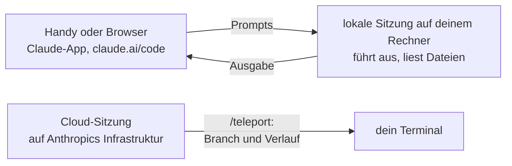

# S4.6 · Unterwegs: Remote Control und /teleport

<!-- meta:start -->
> **Regal:** [Remote, Docker, Isolation](README.md#remote-isolation) · **Stufe:** Kür · **~12 Min** · **Voraussetzungen:** [S1.3 Die Oberflächen: CLI, Desktop, IDE, Web, iOS](s1-03-oberflaechen.md)
>
> ← [S4.5 CI-Pipelines bauen mit GitHub Actions und GitLab](s4-05-ci-pipelines.md) · [Bibliothek](README.md) · [S4.7 Isolation mit Docker und Worktrees](s4-07-isolation-docker-worktrees.md) →
<!-- meta:end -->

## Schnellcheck

- Bist du mit einem claude.ai-Abo (Pro, Max, Team oder Enterprise) angemeldet, nicht mit einem API-Key, Bedrock oder Vertex? Ohne das kannst du dieses Kapitel nur lesen: Remote Control und `/teleport` setzen die Anmeldung über claude.ai voraus.
- Kannst du ohne Nachschlagen sagen, in welche Richtung Remote Control arbeitet und in welche `/teleport`?

## Auf einen Blick

**Voraussetzung für die Übung:** eine Anmeldung über claude.ai mit einem der vier Abos (bei Team und Enterprise muss ein Owner Remote Control freigeschaltet haben), dazu ein zweiter Bildschirm: ein Browser-Tab auf claude.ai/code reicht, das Handy mit der Claude-App geht auch. Es läuft nichts außerhalb deines Rechners außer der Verbindung, und die Übung beendet sie wieder.

Remote Control macht eine Sitzung, die auf deinem Rechner läuft, von claude.ai/code oder der Claude-App aus steuerbar: Du schickst Prompts vom Handy, Claude führt sie lokal aus, und die Ausgabe kommt zurück. `/teleport` geht den umgekehrten Weg und holt eine Cloud-Sitzung samt Branch in dein Terminal. Remote Control ist nicht der Weg für Nachrichten, die von außen in eine Sitzung kommen sollen (etwa aus einem Chat): Dafür gibt es Channels.

## Bild im Kopf

Remote Control ist die Fernbedienung der Leitstelle auf dem Diensthandy: Eine einzelne Person ist unterwegs und bedient dieselbe Anlage, die im Gebäude weiterläuft. Die Anlage bleibt, wo sie ist; das Handy ist nur ein zweites Bedienpult. Fährt der Leitstellenrechner herunter, ist die Fernbedienung wirkungslos. Dazu kommt: Wer den Dienstausweis (dein Konto) hat, kann das Pult bedienen.



## Im Detail

### Remote Control: die lokale Sitzung von unterwegs steuern

**`claude remote-control`** ist ein Unterbefehl der CLI. Er lässt eine entfernte Oberfläche (claude.ai/code im Browser oder die Claude-App auf iOS und Android) **eine Sitzung steuern, die auf deinem Rechner läuft**. Die Oberfläche schickt Prompts, dein lokaler Claude führt sie aus, und die Ausgabe kommt zurück. Code-Ausführung und Dateizugriff bleiben auf deinem Rechner. Dein Rechner muss an sein und der `claude`-Prozess weiterlaufen.

Es gibt drei Wege hinein:

- **`claude remote-control`** startet einen Server im Terminal, der auf Verbindungen wartet.
- **`claude --remote-control`** (oder `--rc`) startet eine normale interaktive Sitzung, die du auch von außen steuern kannst.
- **`/remote-control`** oder **`/rc`** schaltet Remote Control für die laufende Sitzung ein, samt bisherigem Verlauf. Mit einem Namen (`/remote-control Workshop-Test`) setzt du den Titel. Ein zweiter Aufruf öffnet das Statusfenster mit Sitzungs-URL und QR-Code, in dem du die Verbindung auch wieder trennst; die lokale Sitzung läuft dabei weiter.

Die Übung nutzt den dritten Weg. Eine Sitzung findest du von der anderen Seite, indem du die URL öffnest, den QR-Code scannst oder in claude.ai/code oder in der Claude-App unter **Code** nach ihrem Namen suchst. Die Claude-App bekommst du mit `/mobile` (zeigt einen QR-Code für den App-Store).

**Voraussetzungen laut Doku:** ein Abo (Pro, Max, Team, Enterprise; API-Keys werden nicht unterstützt), die Anmeldung über claude.ai mit `/login` und ein Anbieter-Endpunkt `api.anthropic.com`: Mit Amazon Bedrock, Vertex, Foundry oder einem anderen `ANTHROPIC_BASE_URL` geht es nicht.

### Was dabei wohin geht

Die lokale Sitzung baut nur ausgehende HTTPS-Verbindungen auf und öffnet keine Ports auf deinem Rechner. Solange Remote Control verbunden ist, liegt das Transkript der Sitzung, also deine Nachrichten, Claudes Antworten und die Werkzeugaktivität, auf Anthropics Servern. Ausführung und Dateizugriff bleiben bei dir.

**Dein Konto ist der Zugang.** Eine Sitzung, die du per Remote Control verbindest, erscheint in den Claude-Apps deines Kontos. Wer dein claude.ai-Konto übernimmt, erreicht damit auch deine verbundene Sitzung. Die Doku nennt dazu „Trusted Devices" (Beta): Es bindet den Zugang an ein bekanntes Gerät und eine frische Anmeldung statt nur an das angemeldete Konto. Die Sitzung läuft mit ihrem Rechte-Modus weiter, Aufträge vom Handy eingeschlossen ([S1.6](s1-06-rechte-modi.md), [S3.8](s3-08-rechte-fuer-autonomie.md)); ein Auftrag mit Schreibzugriff löst also die Rückfrage aus, die der Modus vorsieht.

### /teleport: eine Cloud-Sitzung ins Terminal holen

`/teleport` (oder `/tp`) öffnet eine Auswahl deiner Cloud-Sitzungen, holt Branch und Gesprächsverlauf der gewählten und setzt sie im Terminal fort; dasselbe gibt es beim Start als `claude --teleport`. Laut Doku prüft Teleport vorher:

| Voraussetzung | Was gemeint ist |
|---|---|
| Sauberer Git-Stand | keine uncommitteten Änderungen; sonst bietet Teleport an, zu stashen |
| Richtiges Repository | eine Arbeitskopie desselben Repositories, kein Fork |
| Branch verfügbar | der Branch der Cloud-Sitzung wurde auf den Remote gepusht |
| Gleiches Konto | du bist bei demselben claude.ai-Konto angemeldet wie die Cloud-Sitzung |

Danach hat das Terminal eine eigene Kopie der Sitzung: Neue Arbeit bleibt lokal und erscheint nicht in der Cloud-Sitzung. Willst du weiter vom Handy steuern, startest du lokal `/remote-control`. Mit einer Anmeldung per API-Key ist Teleport nicht verfügbar. Eine Übung dazu fehlt, weil sie eine Cloud-Sitzung auf einem gepushten Repository braucht.

### Channels statt eigener Bridge

Für Nachrichten, die von außen in eine laufende Sitzung kommen, nennt die Doku Channels (Research Preview): Sie schieben Ereignisse aus einer Chat-App wie Telegram oder Discord oder aus deinem eigenen Server in die Sitzung. Wie das gebaut und abgesichert wird: [S2.17](s2-17-mcp-sicherheit.md#channels-server-die-von-sich-aus-melden), [S3.13](s3-13-autonome-loops-absichern.md). Für „ich will vom Handy aus meinen Laptop steuern" reicht Remote Control.

### PushNotification: Bescheid bekommen, statt nachzusehen

**`PushNotification`** ist ein eingebautes Tool. Es schickt eine Desktop-Benachrichtigung und, wenn Remote Control verbunden ist, eine Push-Nachricht aufs Handy, etwa wenn eine lange Aufgabe fertig ist. Du kannst auch im Prompt darum bitten (`notify me when the tests finish`).

## Selbst machen

### Übung: eine lokale Sitzung im Browser öffnen und wieder trennen (etwa 10 Minuten)

**Ziel:** Du schaltest Remote Control für eine laufende Sitzung ein, schickst aus dem Browser einen lesenden Auftrag, siehst ihn im Terminal und trennst die Verbindung wieder.

**Startzustand:** ein neuer Ordner `~/cc-workshop/unterwegs` mit einer kleinen Datei. Du brauchst die Anmeldung über claude.ai, ein Abo und einen zweiten Bildschirm (Browser-Tab auf claude.ai/code oder die Claude-App), siehe oben. Außerhalb des Ordners entsteht eine Remote-Control-Sitzung bei Anthropic. Die Schritte enden damit, sie zu trennen und den Eintrag zu archivieren.

Bash:

```bash
mkdir -p ~/cc-workshop/unterwegs && cd ~/cc-workshop/unterwegs
python -c "open('todo.txt','w').write('call back\nbuy milk\nwrite report\n')"
```

PowerShell:

```powershell
New-Item -ItemType Directory -Force "$HOME\cc-workshop\unterwegs"; Set-Location "$HOME\cc-workshop\unterwegs"
python -c "open('todo.txt','w').write('call back\nbuy milk\nwrite report\n')"
```

(Unter macOS und Linux heißt Python meist `python3`.)

1. Prüf die Anmeldung: `claude auth status`. Erwartet: JSON mit `authMethod` und dem Wert `claude.ai`. Steht dort `api_key`, `api_key_helper` oder `third_party`, kannst du die Übung nicht machen; lies das Kapitel weiter.
2. Starte `claude --permission-mode default`, bestätige den Vertrauensdialog und gib ein:

   <!-- cockpit:example -->
   ```
   /remote-control Workshop-Test
   ```

   Erwartet: Beim ersten Mal erscheint ein Dialog; wähle laut Doku **Enable Remote Control**. Die Doku nennt die Bestätigung einmalig, sie gilt also auch für spätere Sitzungen. Danach verbindet sich die Sitzung, und die Statusleiste zeigt `/rc active`, wenn das Terminal breit genug ist.
3. Gib `/remote-control` noch einmal ein. Erwartet: das Statusfenster mit Sitzungs-URL und QR-Code. Öffne die URL im Browser (oder scanne den Code mit der Claude-App). Erwartet: Die Sitzung `Workshop-Test` öffnet sich auf claude.ai/code mit dem bisherigen Verlauf.
4. Schick im Browser diesen lesenden Auftrag: `List the files in this folder and tell me how many lines todo.txt has. Do not change anything.` Erwartet: Die Nachricht erscheint im Terminal, als hättest du sie dort getippt, und die Antwort steht an beiden Stellen. `todo.txt` hat drei Zeilen. Auch ein Auftrag vom Browser läuft unter den Rechten deiner Sitzung: Das Lesen im Ordner braucht keine Freigabe, ein Schreibauftrag würde eine Rückfrage auslösen.
5. Trenn die Verbindung: `/remote-control` im Terminal, im Statusfenster die Verbindung trennen. Erwartet: `/rc active` verschwindet, die lokale Sitzung läuft weiter (frag sie etwas Kleines), und in der Sitzungsliste auf claude.ai/code verliert `Workshop-Test` den grünen Punkt, den die Doku für „online" nennt.
6. Beende die Sitzung mit `/exit` und archiviere den Eintrag auf claude.ai/code (Maus auf die Sitzung, Archiv-Symbol in der Seitenleiste). Prüf, dass sie gegangen ist: Sie steht nicht mehr in der Standardliste und lässt sich laut Doku über den Archiv-Filter finden; im Terminal läuft kein `claude` mehr für diesen Ordner.

**Aufräumen:** Lösch den Ordner `~/cc-workshop/unterwegs` selbst. Schalte Remote Control nicht für alle Sitzungen ein (`/config`, „Enable Remote Control for all sessions"); die Übung braucht es nicht, und es würde jede künftige Sitzung verbinden.

**Geschafft, wenn:**

- [ ] `/rc active` im Terminal erschien und die Sitzung im Browser mit ihrem Verlauf offen war
- [ ] der Auftrag aus dem Browser im Terminal ankam und `todo.txt` drei Zeilen hatte
- [ ] `/rc active` nach dem Trennen verschwunden war und die lokale Sitzung weiterlief
- [ ] der Eintrag archiviert und kein `claude` mehr offen war

## Typische Fallen

- **Remote Control startet nicht, weil du mit API-Key arbeitest.** Es gibt Remote Control nur mit Abo und Anmeldung über claude.ai, nicht mit API-Key und nicht über Bedrock, Vertex oder Foundry. Melde dich mit `/login` über claude.ai an. In Team und Enterprise muss außerdem ein Owner Remote Control in den Admin-Einstellungen einschalten.
- **Vom Handy aus reagiert die Sitzung nicht mehr.** Die Sitzung läuft auf deinem Rechner: Er muss an sein, und der `claude`-Prozess muss weiterlaufen. Schließt du das Terminal, geht die Sitzung offline.
- **Wer dein Konto übernimmt, erreicht deine Sitzung.** Behandle die Anmeldung bei claude.ai wie einen Zugang zu deinem Rechner. Starte Sitzungen, die du von unterwegs steuerst, nicht in einem Modus, der mehr freigibt, als du vom Handy aus verantworten willst.
- **`/teleport` verweigert den Wechsel.** Es braucht einen sauberen Git-Stand, eine Arbeitskopie desselben Repositories (keinen Fork) und einen Branch, der auf dem Remote liegt.
- **Nach `/teleport` sieht das Handy die neue Arbeit nicht.** Das Terminal arbeitet mit einer eigenen Kopie der Sitzung. Starte lokal `/remote-control`, wenn du weiter vom Handy steuern willst.

## Check

Du kannst erklären, in welche Richtung Remote Control und `/teleport` arbeiten, Remote Control aus einer laufenden Sitzung ein- und ausschalten und sagen, was dafür vorausgesetzt wird.

1. Wo läuft die Sitzung, die du mit Remote Control vom Handy aus steuerst, und was muss dafür auf deinem Rechner laufen?
2. Was holt `/teleport` in dein Terminal, und was prüft es vorher?
3. Was liegt auf Anthropics Servern, solange Remote Control verbunden ist, und was bleibt auf deinem Rechner?

<details><summary>Auflösung</summary>

1. Auf deinem Rechner. Dein Rechner muss an sein und der `claude`-Prozess weiterlaufen; Handy und Browser sind nur ein Fenster in diese lokale Sitzung.
2. Es holt eine Cloud-Sitzung samt Branch und Gesprächsverlauf. Vorher prüft es: sauberer Git-Stand, eine Arbeitskopie desselben Repositories (kein Fork), ein auf den Remote gepushter Branch und dasselbe claude.ai-Konto.
3. Das Transkript der Sitzung (Nachrichten, Antworten, Werkzeugaktivität) liegt auf Anthropics Servern. Ausführung und Dateizugriff bleiben auf deinem Rechner; die lokale Sitzung öffnet keine eingehenden Ports.

</details>

<details><summary>Quizfrage</summary>

**Frage:** Du arbeitest im Terminal mit einem API-Key aus der Console und willst die laufende Sitzung vom Handy aus steuern. Was gilt?

- **Richtig:** Es geht nicht: Remote Control unterstützt keine API-Keys. Du meldest dich mit `/login` über claude.ai an, mit Pro, Max, Team oder Enterprise.
- Falsch: Es geht, wenn du die Sitzung mit `/remote-control` aus dem laufenden Terminal startest; nur der Unterbefehl `claude remote-control` prüft die Anmeldung.
- Falsch: Es geht über Amazon Bedrock, weil die Sitzung lokal läuft und nur das Modell aus der Cloud kommt.
- Falsch: Es geht, wenn du `ANTHROPIC_BASE_URL` auf ein Gateway setzt, das die Anfragen an claude.ai weiterreicht.

</details>

## Weiterlesen

- [Remote Control](https://code.claude.com/docs/en/remote-control)
- [Claude Code im Web: von der Cloud ins Terminal](https://code.claude.com/docs/en/claude-code-on-the-web#from-cloud-to-terminal)
- [Claude Code auf dem Handy](https://code.claude.com/docs/en/mobile)
- [Befehlsreferenz (`/remote-control`, `/teleport`)](https://code.claude.com/docs/en/commands)
- [Tool-Referenz (`PushNotification`)](https://code.claude.com/docs/en/tools-reference)
- [S1.3 · Die Oberflächen: CLI, Desktop, IDE, Web, iOS](s1-03-oberflaechen.md)
- [S2.17 · MCP-Sicherheit und ein eigener Server](s2-17-mcp-sicherheit.md)
- [S3.13 · Autonome Loops absichern: Budget und Worktree](s3-13-autonome-loops-absichern.md)
- [S4.7 · Isolation mit Docker und Worktrees](s4-07-isolation-docker-worktrees.md)
