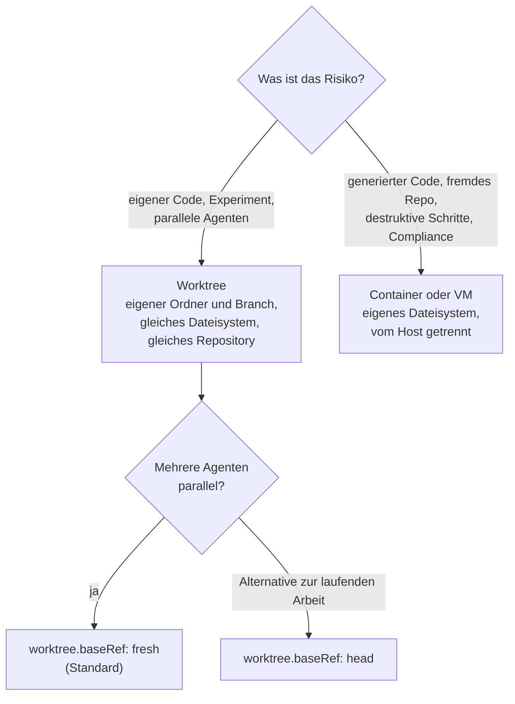

# S4.7 · Isolation mit Docker und Worktrees

<!-- meta:start -->
> **Regal:** [Remote, Docker, Isolation](README.md#remote-isolation) · **Stufe:** Kür · **~25 Min** · **Voraussetzungen:** [S1.18 Worktrees als Testlabor](s1-18-worktrees.md)
>
> ← [S4.6 Unterwegs: Remote Control und /teleport](s4-06-remote-und-teleport.md) · [Bibliothek](README.md) · [X.4 Agenten im Dauerbetrieb: OpenClaw und was dabei schiefgehen kann](x-04-agenten-im-dauerbetrieb.md) →
<!-- meta:end -->

## Schnellcheck

- Hast du schon einmal mehrere `claude --worktree`-Sitzungen parallel laufen lassen und danach einen Branch gemergt oder verworfen?
- Kannst du ohne Nachschlagen sagen, was ein Worktree vom Hauptordner trennt und was Hauptordner und Worktree teilen?

## Auf einen Blick

Ein Worktree isoliert Dateien: Jeder Agent bekommt einen eigenen Arbeitsordner auf einem eigenen Branch im selben Repository, ohne Container und sofort. Claude Code hält eine Worktree-Sitzung dabei aktiv davon ab, Dateien im Hauptordner zu bearbeiten. Das Repository selbst, gespeicherte Freigaben und alles, was nicht aus Dateien besteht, teilt der Worktree dagegen mit dem Hauptordner. Ein Container (Docker) gibt Claude Code ein eigenes Dateisystem und eigene Prozesse; ihn brauchst du für generierten Code, der gefährlich sein könnte. Vollständig ist auch diese Trennung nicht: Was du einbindest oder hineinreichst (das Repository, Zugangsdaten, Netz), bleibt erreichbar. Für ein Repository, dem du nicht traust, nennt die Doku eine eigene VM oder eine Cloud-Sitzung. Die Übung zeigt an einem Worktree, wo seine Grenze verläuft. Container bleiben Lesestoff.

## Bild im Kopf

Ein Worktree ist die Testbank aus S1.18: ein Nachbau der Anlage in einem eigenen Raum, mit derselben Ausstattung und getrennt vom Live-System. Mehrere Techniker arbeiten an mehreren Testbänken gleichzeitig, ohne sich in die Quere zu kommen. Alle Testbänke stehen aber im selben Gebäude und hängen am selben Archiv: Was ein Techniker ins Archiv einträgt, sehen alle.

Docker ist die Einschlusskammer. Du willst wissen, ob ein verdächtiges Gerät gefährlich ist? Dann öffnest du es nicht in der Lobby. Du bringst es in die Einschlusskammer und untersuchst es aus der Ferne.



## Im Detail

### Zwei Stufen der Isolation

Worktree und Container sind zwei Stufen der Isolationsleiter aus [S3.9](s3-09-geschuetzte-pfade-und-sandbox.md); dort ordnest du auch die OS-Sandbox und die eigene VM ein. Hier geht es um die Praxis: wo die Grenze eines Worktrees verläuft und wann du eine Stufe höher gehst.

### Was ein Worktree isoliert

Laut Doku isolieren Worktrees Dateiänderungen. Solange eine Sitzung in einem Worktree isoliert ist, blockt Claude Code Aufrufe nach vier Prüfungen (die Doku nennt sie „How Claude Code enforces isolation"):

- **Dateibearbeitung:** `Edit`, `Write` oder `NotebookEdit` auf einen Pfad im Hauptordner.
- **Arbeitsverzeichnis von Befehlen:** ein Shell-Befehl, dessen Arbeitsverzeichnis im Hauptordner liegt oder sich nicht prüfen lässt.
- **Git-Umleitungen:** ein Befehl, der Git in den Hauptordner umleitet (`git -C`, `--git-dir`, `GIT_DIR`, ein `cd` dorthin).
- **Befehlsform:** ein Befehl, bei dem sich aus dem Text nicht prüfen lässt, dass Git im Worktree bleibt.

Das gilt auch für Subagenten der Sitzung. Claude sieht jede Ablehnung als Tool-Fehler, der den Worktree nennt. Die Doku nennt nur diese vier Prüfungen; was sie nicht abdecken, blocken sie nicht. Ob ein Shell-Befehl mit einem absoluten Pfad in den Hauptordner schreiben könnte, sagt die Doku nicht: Verlass dich dafür auf den Rechte-Modus und seine Rückfragen ([S1.5](s1-05-rechte-im-alltag.md)). Ein Worktree ist kein Sicherheitsrand um den Rechner.

### Was ein Worktree teilt und was ihm fehlt

Ein Worktree hat eigene Dateien und einen eigenen Branch, teilt laut Doku aber mit dem Hauptordner:

- **das `.git`-Verzeichnis des Repositories:** Ein Commit im Worktree liegt sofort im gemeinsamen Repository, ohne Push, und der Branch ist im Hauptordner sichtbar.
- **gespeicherte Freigaben:** Wählst du für einen Bash-Befehl „Yes, and don't ask again", landet die Regel in der `.claude/settings.local.json` des Hauptordners und gilt für ihn und jeden anderen Worktree des Repositories, auch nachdem du den Worktree entfernt hast. Unter Windows und in einigen anderen Fällen bleibt sie beim Worktree.
- **Projekt-Plugins**, und Skills, Agenten und Commands des Hauptordners, wenn der Worktree keine eigenen hat.

Fehlen tut ein frischer Checkout: Ein Worktree enthält nur, was Git verfolgt. Dateien, die gitignoriert sind (etwa eine `.env`), liegen nicht darin, außer du trägst sie in eine Datei `.worktreeinclude` im Projektstamm ein: Sie nennt mit `.gitignore`-Syntax, welche ignorierten Dateien in jeden neuen Worktree kopiert werden. Abhängigkeiten installierst du im Worktree neu. Und was kein Teil des Repositories ist, trennt der Worktree nicht: laufende Prozesse, Ports, Datenbanken, dein Benutzerkonto ([S1.18](s1-18-worktrees.md)).

### worktree.baseRef und --tmux, kurz

`worktree.baseRef` bestimmt, wovon ein neuer Worktree von `claude --worktree` abzweigt: `fresh` (Standard) vom Standard-Branch des Repositories, `head` von deinem lokalen `HEAD` samt ungepushten Commits ([S1.18](s1-18-worktrees.md#worktreebaseref-von-wo-der-worktree-abzweigt)). Lässt du mehrere Agenten dieselbe Aufgabe angehen, sorgt `fresh` dafür, dass alle vom selben Stand starten; auch die Worktrees von Subagenten folgen der Einstellung. Für einen einzelnen Aufruf gibst du sie mit `--settings '{"worktree":{"baseRef":"fresh"}}'` mit.

`--tmux` legt für die Worktree-Sitzung eine eigene tmux-Sitzung an und braucht `--worktree`. Laut Doku nutzt es iTerm2-Panes, wenn verfügbar; `--tmux=classic` erzwingt klassisches tmux.

### Container: wann der Worktree nicht reicht

Die Doku zur Wahl der Isolation vergleicht die Stufen nach dem, was sie isolieren:

| Ansatz | Was isoliert wird | Docker nötig |
|---|---|---|
| Sandbox für das Bash-Tool | Bash-, PowerShell- und Monitor-Befehle samt Kindprozessen | nein |
| Sandbox Runtime | der ganze Claude-Code-Prozess samt Datei-Werkzeugen, MCP-Servern und Hooks | nein |
| Dev-Container | die komplette Entwicklungsumgebung | ja |
| Virtuelle Maschine | das ganze Betriebssystem | nein |

Für ungeprüften Code gibt die Doku die Richtung vor: Für ein nicht vertrauenswürdiges Repository eine eigene virtuelle Maschine oder, mit Abo, eine Cloud-Sitzung; für unbeaufsichtigte Läufe mit `--dangerously-skip-permissions` einen Container, eine VM oder die Sandbox Runtime. Ein Dev-Container führt Befehle im Container aus, während Änderungen an Projektdateien in deinem lokalen Repository erscheinen, weil es als Arbeitsordner eingebunden ist. Er ist keine absolute Grenze: Die Doku warnt, dass er mit `--dangerously-skip-permissions` ein bösartiges Projekt nicht daran hindert, alles abzugreifen, was im Container erreichbar ist, auch die Claude-Code-Zugangsdaten in `~/.claude`. Nimm Dev-Container nur für Repositories, denen du vertraust, und binde keine Host-Geheimnisse wie `~/.ssh` ein. Jede Isolation ändert außerdem nicht, was an das Modell gesendet wird.

## Selbst machen

### Übung: wo die Grenze eines Worktrees verläuft (etwa 15 Minuten)

**Ziel:** Du siehst in einer Worktree-Sitzung, dass Claude Code die Bearbeitung des Hauptordners ablehnt, dass ein Commit im Worktree trotzdem sofort im Repository des Hauptordners liegt und dass eine gitignorierte Datei im Worktree fehlt. Am Ende entfernst du den Worktree.

**Startzustand:** ein neues Repository `~/cc-workshop/isolation`; Git, Claude Code und Python reichen. Außerhalb des Ordners entsteht nichts Dauerhaftes, und der Worktree liegt im Ordner selbst unter `.claude/worktrees/`. Du brauchst zwei Terminals: eines für Claude, eines für den Hauptordner. Die Übung unterscheidet sich von S1.18 darin, dass sie die Grenzen sucht, nicht nur den Normalfall.

Bash:

```bash
mkdir -p ~/cc-workshop/isolation && cd ~/cc-workshop/isolation
git init
git config user.name "Workshop"
git config user.email "workshop@example.invalid"
python -c "open('notes.txt','w').write('v1\n'); open('.gitignore','w').write('.claude/worktrees/\nlocal.env\n'); open('local.env','w').write('TOKEN=not-a-secret\n')"
git add notes.txt .gitignore
git commit -m "init"
```

PowerShell:

```powershell
New-Item -ItemType Directory -Force "$HOME\cc-workshop\isolation"; Set-Location "$HOME\cc-workshop\isolation"
git init
git config user.name "Workshop"
git config user.email "workshop@example.invalid"
python -c "open('notes.txt','w').write('v1\n'); open('.gitignore','w').write('.claude/worktrees/\nlocal.env\n'); open('local.env','w').write('TOKEN=not-a-secret\n')"
git add notes.txt .gitignore
git commit -m "init"
```

(Unter macOS und Linux heißt Python meist `python3`.) `local.env` ist gitignoriert und enthält nur Platzhaltertext. Starte einmal `claude` in diesem Ordner, bestätige den Vertrauensdialog und beende die Sitzung mit `/exit`. Notier dir den absoluten Pfad des Ordners (`pwd`, in PowerShell `(Get-Location).Path`) als `<main>`.

1. Starte die Worktree-Sitzung:

   <!-- cockpit:example -->
   ```bash
   claude --worktree isolation-a --permission-mode acceptEdits
   ```

   Erwartet: Eine Sitzung startet im Ordner `.claude/worktrees/isolation-a`. In deinem zweiten Terminal zeigt `git worktree list` im Hauptordner zwei Einträge.
2. Gib ein: `List all files in the current folder, including hidden ones, and say whether local.env is among them.` Erwartet: `notes.txt` und `.gitignore` stehen in der Liste, `local.env` nicht. Der Worktree ist ein frischer Checkout, gitignorierte Dateien kommen nicht mit.
3. Gib ein (setz deinen Pfad ein): `Use the Edit tool to change <main>/notes.txt from v1 to v2.` Fragt Claude Code zuerst, ob es die Datei im Hauptordner lesen darf, antworte mit „Yes“: Lesen ist erlaubt, es geht um das Schreiben. Erwartet: Claude meldet, dass die Bearbeitung verweigert wurde; laut Doku sieht Claude die Ablehnung als Tool-Fehler, der den Worktree nennt. Im Probelauf änderte Claude danach von sich aus die Kopie im Worktree; das stört die folgenden Schritte nicht. Versucht Claude es stattdessen mit einem Shell-Befehl und fragt nach Freigabe, lehne mit „No" ab: Gemeint ist die Prüfung der Bearbeitung. Lies im zweiten Terminal `notes.txt` im Hauptordner (`cat notes.txt`, in PowerShell `Get-Content notes.txt`). Erwartet: weiter `v1`.
4. Gib ein: `Change notes.txt in this folder to v2 and commit it with the message "v2 in worktree".` Beantworte eine Rückfrage zu `git commit` mit „Yes", nicht mit „Yes, and don't ask again": Diese Wahl würde laut Doku eine Regel im Hauptordner speichern. Erwartet: Der Commit gelingt.
5. Prüf im zweiten Terminal, im Hauptordner:

   ```bash
   git branch
   git log --oneline worktree-isolation-a
   git log --oneline
   cat notes.txt
   ```

   In PowerShell `Get-Content notes.txt` statt `cat`. Erwartet: `git branch` listet `worktree-isolation-a`, obwohl du nichts gepusht hast; `git log --oneline worktree-isolation-a` zeigt den Commit `v2 in worktree`; `git log --oneline` im Hauptordner zeigt ihn nicht, und `notes.txt` dort ist weiter `v1`. Die Dateien sind getrennt, das Repository ist gemeinsam.
6. Räum auf, im ersten Terminal: `/exit`. Claude Code findet einen neuen Commit im Worktree und fragt, ob du ihn behalten oder entfernen willst; wähl „Remove worktree". Prüf im zweiten Terminal, dass nichts übrig ist: `git worktree list` zeigt nur den Hauptordner, `git branch` nicht mehr `worktree-isolation-a`. Der Commit ist mit dem Branch weg: Entfernen löscht Worktree und Branch samt Arbeit.

**Aufräumen:** Lösch den Ordner `~/cc-workshop/isolation` selbst.

**Geschafft, wenn:**

- [ ] `local.env` im Worktree fehlte
- [ ] die Bearbeitung des Hauptordners abgelehnt wurde und `notes.txt` dort `v1` blieb
- [ ] der Branch `worktree-isolation-a` ohne Push im Hauptordner sichtbar war
- [ ] nach dem Entfernen weder Worktree noch Branch existierten

### Extra: ein Dev-Container (Docker; etwa 20 Minuten)

Du brauchst Docker und einen Editor mit Dev-Container-Unterstützung, etwa VS Code mit der Dev-Containers-Erweiterung. Folge in einem Wegwerf-Repository der Doku zu [Dev-Containern](https://code.claude.com/docs/en/devcontainer): `.devcontainer/devcontainer.json` mit dem Claude-Code-Feature anlegen, den Container neu bauen, darin `claude` starten und anmelden. Bind keine Host-Geheimnisse wie `~/.ssh` ein. Erwartet: Befehle laufen im Container, Änderungen erscheinen im lokalen Repository. Räum auf, indem du den Container und sein Image in Docker entfernst (`docker ps -a`, `docker rm`, `docker rmi`) und den Wegwerf-Ordner löschst; die Doku-Seite behandelt das Aufräumen nicht, schau mit `docker ps -a` nach, dass nichts mehr läuft.

## Typische Fallen

- **Der Worktree schützt deinen Branch, nicht deinen Rechner.** Ein Worktree ist ein eigener Ordner auf demselben Dateisystem. Er bewahrt den Hauptbranch vor Fehlern des Agenten, aber nicht den Host vor gefährlichem Code. Generierten Code führst du in einem Container oder einer VM aus; für ein Repository, dem du nicht traust, nennt die Doku eine eigene VM oder eine Cloud-Sitzung.
- **„Yes, and don't ask again" gilt über den Worktree hinaus.** Die Regel landet laut Doku in der `.claude/settings.local.json` des Hauptordners und überlebt den Worktree.
- **Im Worktree fehlt die `.env`.** Ein Worktree ist ein frischer Checkout. Trag die Datei in `.worktreeinclude` ein oder leg sie dort an.
- **Parallele Agenten starten von verschiedenen Ständen.** Setzt irgendeine Settings-Datei `head`, zweigt jeder Worktree vom lokalen Stand ab, der gerade ausgecheckt ist. Setz `fresh` für den Fan-out ausdrücklich.
- **`--tmux` allein startet nichts.** Das Flag braucht `--worktree`.

## Check

Du kannst an einer Worktree-Sitzung zeigen, was sie vom Hauptordner trennt und was sie teilt, und begründen, wann ein Container nötig ist.

1. Was teilen sich Hauptordner und Worktree, und was hat der Worktree für sich?
2. Warum ersetzt ein Worktree keinen Container?
3. Wovon zweigt ein neuer Worktree mit `fresh` ab, wovon mit `head`?

<details><summary>Auflösung</summary>

1. Sie teilen das `.git`-Verzeichnis des Repositories (Commits und Branches sind sofort in beiden sichtbar) und gespeicherte Freigaben. Der Worktree hat eigene Dateien und einen eigenen Branch; gitignorierte Dateien fehlen darin.
2. Ein Worktree isoliert Dateiänderungen und lässt Claude Code die Bearbeitung des Hauptordners ablehnen. Prozesse, Ports, Datenbanken und dein Benutzerkonto bleiben dieselben. Ein Container oder eine VM trennt den Host.
3. `fresh` zweigt vom Standard-Branch des Repositories ab, `head` von deinem lokalen `HEAD` samt ungepushten Commits.

</details>

<details><summary>Quizfrage</summary>

**Frage:** Du arbeitest in einer `claude --worktree`-Sitzung und bittest Claude, mit dem Edit-Werkzeug eine Datei im Hauptordner zu ändern. Was passiert?

- **Richtig:** Claude Code lehnt die Bearbeitung ab, weil der Pfad im Hauptordner liegt; Claude sieht einen Tool-Fehler.
  - Warum: Eine der vier Prüfungen gilt der Dateibearbeitung: `Edit`, `Write` oder `NotebookEdit` auf einen Pfad im Hauptordner blockt Claude Code, solange die Sitzung im Worktree isoliert ist.
- Falsch: Die Änderung gelingt, denn Worktree und Hauptordner teilen dasselbe Repository und damit dieselben Dateien.
  - Warum: Das gemeinsame Repository macht die Dateien nicht gemeinsam: Der Worktree hat eigene Dateien und einen eigenen Branch, geteilt wird das `.git`-Verzeichnis.
- Falsch: Claude Code blockt alles, auch `git commit` im Worktree, weil das gemeinsame `.git`-Verzeichnis im Hauptordner liegt.
  - Warum: Ein Commit im Worktree gelingt und liegt sofort im gemeinsamen Repository. Geblockt wird, was in den Hauptordner zielt, etwa `git -C`, `GIT_DIR` oder ein `cd` dorthin.
- Falsch: Die Änderung gelingt nach einer Rückfrage; die Prüfung gilt nur für Dateien, die Git verfolgt, nicht für die im Hauptordner.
  - Warum: Die Prüfung hängt am Pfad im Hauptordner, nicht daran, ob Git die Datei verfolgt. Eine Rückfrage gibt es höchstens fürs Lesen; das Bearbeiten lehnt Claude Code ab.

</details>

## Weiterlesen

- [Parallele Sitzungen mit Worktrees](https://code.claude.com/docs/en/worktrees)
- [Eine Sandbox-Umgebung wählen](https://code.claude.com/docs/en/sandbox-environments)
- [Dev-Container: Claude Code im Container betreiben](https://code.claude.com/docs/en/devcontainer)
- [Settings-Referenz: worktree.baseRef](https://code.claude.com/docs/en/settings-reference#worktree-baseref)
- [CLI-Referenz (`--worktree`, `--tmux`)](https://code.claude.com/docs/en/cli-reference)
- [S1.18 · Worktrees als Testlabor](s1-18-worktrees.md)
- [S3.9 · Geschützte Pfade und Sandbox-Stufen](s3-09-geschuetzte-pfade-und-sandbox.md)
- [S3.13 · Autonome Loops absichern: Budget und Worktree](s3-13-autonome-loops-absichern.md)
- [S4.6 · Unterwegs: Remote Control und /teleport](s4-06-remote-und-teleport.md)
- [S4.8 · Abschlussprojekt mit Bewertung](s4-08-abschlussprojekt.md)
