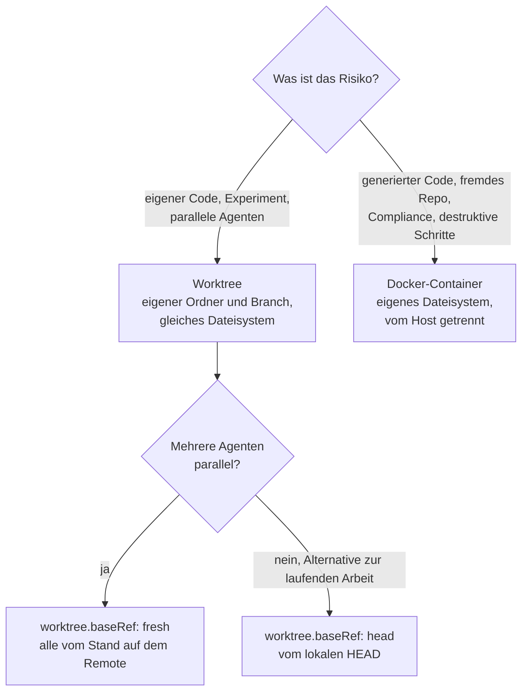

# S4.7 · Isolation mit Docker und Worktrees

<!-- meta:start -->
> **Regal:** [Remote, Docker, Isolation](README.md#remote-isolation) · **Stufe:** Kür · **~15 Min** · **Voraussetzungen:** [S1.18 Worktrees als Testlabor](s1-18-worktrees.md)
>
> ← [X.4 Agenten im Dauerbetrieb: OpenClaw und was dabei schiefgehen kann](x-04-agenten-im-dauerbetrieb.md) · [Bibliothek](README.md) · [S4.8 Abschlussprojekt mit Bewertung](s4-08-abschlussprojekt.md) →
<!-- meta:end -->

## Schnellcheck

- Hast du schon einmal mehrere `claude --worktree`-Sitzungen parallel laufen lassen und danach einen Branch gemergt oder verworfen?
- Kannst du ohne Nachschlagen sagen, wann `worktree.baseRef` auf `fresh` gehört und wann auf `head`?

## Auf einen Blick

Ein Worktree isoliert Dateien: Jeder Agent bekommt einen eigenen Arbeitsordner auf einem eigenen Branch im selben Repository, ohne Container und sofort. Ein Docker-Container trennt Claude Code vollständig vom Host, mit eigenem Dateisystem; ihn brauchst du für generierten Code, der gefährlich sein könnte, und für fremde Repositories. Lässt du mehrere Agenten parallel in Worktrees arbeiten, setz `worktree.baseRef` ausdrücklich, damit alle vom selben Stand abzweigen.

## Bild im Kopf

Ein Worktree ist die Testbank aus S1.18: ein Nachbau der Anlage in einem eigenen Raum, mit derselben Ausstattung und getrennt vom Live-System. Mehrere Techniker arbeiten an mehreren Testbänken gleichzeitig, ohne sich in die Quere zu kommen. Alle Testbänke stehen aber im selben Gebäude.

Docker ist die Einschlusskammer. Du willst wissen, ob ein verdächtiges Gerät gefährlich ist? Dann öffnest du es nicht in der Lobby. Du bringst es in die Einschlusskammer und untersuchst es aus der Ferne. Explodiert es, bleibt die Lobby heil.



## Im Detail

### Zwei Stufen der Isolation

Worktree und Container sind zwei Stufen der Isolationsleiter aus [S3.9](s3-09-geschuetzte-pfade-und-sandbox.md); dort ordnest du auch die OS-Sandbox und die eigene VM ein. Hier geht es um die Praxis: wann du welche Stufe nimmst und wie du parallele Agenten in Worktrees sauber aufsetzt.

### Inception: Claude Code in Docker (🔧 eigenes Plugin)

`/multi-model-orchestrator:inception` startet Claude Code in einem Docker-Container, vollständig isoliert. Der Befehl stammt aus dem Workshop-Plugin `multi-model-orchestrator` (🔧), nicht aus Claude Code selbst und aus keinem offiziellen Marketplace.

**Wofür:**

| Szenario | Warum Inception |
|---|---|
| Generierten Code ausführen | Generierter Code kann gefährlich sein. Führ ihn im Container aus. |
| Fremde Repositories | analysieren, ohne dein Host-System offenzulegen |
| Parallele isolierte Aufgaben | Jede Instanz hat ihr eigenes Dateisystem, es gibt keine Konflikte. |
| Compliance-Anforderungen | vollständige Protokollierung von Netz- und Dateizugriffen |
| Destruktive Operationen | umbauen, löschen, formatieren, mit sauberem Rückweg |

Wie du Claude Code ohne eigenes Plugin in einem Container betreibst, beschreibt die offizielle Doku zu Dev-Containern (siehe Weiterlesen).

### Worktree-Isolation

Git-Worktrees sind getrennte Arbeitsordner, die dieselbe Git-Historie teilen, jeder mit eigenem Dateistand. [S1.18](s1-18-worktrees.md) führt sie ein; hier nutzt du sie als Isolationsstufe für Agenten:

<!-- cockpit:example -->
```bash
git worktree add ../agent-task-1 -b agent/task-1

# Agent works in ../agent-task-1
# Your main directory is completely untouched
# Changes are in git but isolated to that branch

git merge agent/task-1               # Accept
git worktree remove ../agent-task-1  # Or discard entirely
```

**Was das bringt:**

- leicht: kein Docker-Aufwand, sofort eingerichtet
- Mehrere Agenten arbeiten parallel im selben Repo, ohne sich zu stören.
- Jeder Agent hat seinen eigenen Branch: sauber mergen oder sauber verwerfen.

Das Beispiel legt den Worktree von Hand mit Git an. `claude --worktree <name>` erledigt das in einem Schritt unter `.claude/worktrees/` ([S1.18](s1-18-worktrees.md#in-einem-schritt-claude---worktree)).

### worktree.baseRef: wo der Worktree abzweigt

Die Einstellung `worktree.baseRef` bestimmt, **von welchem Stand ein neuer Worktree von `claude --worktree` abzweigt**. Für Worktrees, die du wie oben von Hand mit `git worktree add` anlegst, gilt sie nicht; `-b` zweigt dort von deinem aktuellen `HEAD` ab. Sie kennt zwei Werte:

| Wert | Verhalten | Wann |
|---|---|---|
| **`fresh`** | zweigt von `origin/<default>` ab, also immer vom zuletzt gepushten Stand des Hauptzweigs | Fan-out mehrerer Agenten, die alle vom selben frischen Stand starten müssen |
| **`head`** | zweigt von deinem lokalen `HEAD` ab; deine ungepushten Commits gehen mit | „Ich stecke mitten im Refactor und will in einem Worktree eine Alternative ausprobieren, ohne meinen Stand zu verlieren" |

Heute ist `fresh` der Standard. Weil sich der Standard zwischen CLI-Versionen verschoben hat, setz den Wert trotzdem ausdrücklich, statt dich auf ihn zu verlassen. Für Muster mit mehreren Agenten ist die Antwort fast immer `fresh`: Fünf Agenten, die von fünf leicht verschiedenen Ständen starten, machen die Fehlersuche zum Albtraum. Die Einstellung gehört in eine Settings-Datei, etwa die `settings.json` des Projekts. Für einen einzelnen Aufruf übergibst du sie direkt mit `--settings '{"worktree":{"baseRef":"fresh"}}'`. Auch die Worktrees von Subagenten folgen dieser Einstellung ([S1.18](s1-18-worktrees.md#worktreebaseref-von-wo-der-worktree-abzweigt)).

### --tmux: jede Worktree-Sitzung im Blick

Fächerst du die Arbeit auf mehrere Worktree-Sitzungen auf, legt `--tmux` für jede eine eigene tmux-Sitzung an:

```bash
claude --worktree feature/api-migration --tmux
claude --worktree feature/db-migration --tmux
claude --worktree feature/ui-migration --tmux
```

`--tmux` braucht `--worktree`. Wo iTerm2 verfügbar ist, nutzt Claude Code dessen native Panes; `--tmux=classic` erzwingt klassisches tmux. Zwischen den Sitzungen wechselst du mit den normalen tmux-Tastenkürzeln. Ohne `--tmux` jonglierst du drei Terminals oder liest die Logs erst hinterher; mit `--tmux` verfolgst du den Lauf der drei Migrations-Agenten live.

## Typische Fallen

- **Der Worktree schützt deinen Branch, nicht deinen Rechner.** Ein Worktree ist ein eigener Ordner auf demselben Dateisystem. Er bewahrt den Hauptbranch vor Fehlern des Agenten, aber nicht den Host vor gefährlichem Code. Generierten Code und fremde Repositories führst du im Container aus.
- **Parallele Agenten starten von verschiedenen Ständen.** Setzt irgendeine Settings-Datei `head`, oder läuft eine CLI-Version mit einem anderen Standard, zweigt jeder Worktree vom lokalen Stand ab, der gerade ausgecheckt ist. Setz `fresh` für den Fan-out ausdrücklich.
- **`--tmux` allein startet nichts.** Das Flag braucht `--worktree`.
- **`/multi-model-orchestrator:inception` fehlt.** Der Befehl kommt aus dem Workshop-Plugin (🔧) und braucht Docker. Fehlt das Plugin, ist der offizielle Weg über Dev-Container die Alternative.

## Check

Du kannst für eine Aufgabe begründen, ob ein Worktree reicht oder ein Container nötig ist, `worktree.baseRef` für parallele Agenten ausdrücklich setzen und erklären, was `--tmux` beim Start mehrerer Worktree-Sitzungen tut.

1. Was isoliert ein Worktree, und was isoliert er nicht?
2. Wovon zweigt ein neuer Worktree mit `fresh` ab, wovon mit `head`?
3. Wie setzt du `worktree.baseRef` für einen einzigen Aufruf, ohne eine Settings-Datei zu ändern?

<details><summary>Quizfrage</summary>

**Frage:** Fünf Agenten sollen dieselbe Migration parallel in eigenen Worktrees bearbeiten. Warum setzt du `worktree.baseRef` ausdrücklich auf `fresh`?

- **Richtig:** Damit alle vom selben Stand auf `origin/<default>` abzweigen, egal welche lokalen Commits oder welcher CLI-Standard gelten.
- Falsch: Weil Worktrees sonst nur lesen dürfen und erst `fresh` den Schreibzugriff auf den neuen Branch des Worktrees freigibt.
- Falsch: Weil `baseRef` festlegt, ob ein Worktree ein eigenes `.git`-Verzeichnis bekommt oder nur einen Symlink auf das Haupt-Repository.
- Falsch: Weil `claude --worktree` ohne ausdrückliche Einstellung immer vom lokalen `HEAD` abzweigt und `fresh` nie der Standard ist.

</details>

## Weiterlesen

- [Parallele Sitzungen mit Worktrees](https://code.claude.com/docs/en/worktrees)
- [Settings-Referenz: worktree.baseRef](https://code.claude.com/docs/en/settings-reference#worktree-baseref)
- [CLI-Referenz (`--worktree`, `--tmux`)](https://code.claude.com/docs/en/cli-reference)
- [Dev-Container: Claude Code im Container betreiben](https://code.claude.com/docs/en/devcontainer)
- [S1.18 · Worktrees als Testlabor](s1-18-worktrees.md)
- [S3.9 · Geschützte Pfade und Sandbox-Stufen](s3-09-geschuetzte-pfade-und-sandbox.md)
- [S3.13 · Autonome Loops absichern: Budget und Worktree](s3-13-autonome-loops-absichern.md)
- [S4.6 · Unterwegs: Remote Control und /teleport](s4-06-remote-und-teleport.md)
- [S4.8 · Abschlussprojekt mit Bewertung](s4-08-abschlussprojekt.md)
