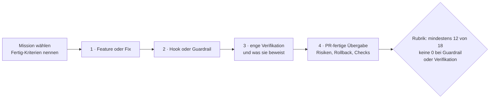

# S4.8 · Abschlussprojekt mit Bewertung

<!-- meta:start -->
> **Regal:** [Abschlussprojekt](README.md#capstone) · **Stufe:** Kür · **~25 Min** · **Voraussetzungen:** [S3.4 Orchestrierungsmuster: Fan-out, Pipeline, Hierarchie](s3-04-orchestrierungsmuster.md) · [S3.8 Rechte für autonome Läufe](s3-08-rechte-fuer-autonomie.md) · [S3.13 Autonome Loops absichern: Budget und Worktree](s3-13-autonome-loops-absichern.md)
>
> ← [S4.7 Isolation mit Docker und Worktrees](s4-07-isolation-docker-worktrees.md) · [Bibliothek](README.md) · [S4.9 Fehlersuche: /debug, --verbose, /doctor](s4-09-fehlersuche-werkzeuge.md) →
<!-- meta:end -->

## Schnellcheck

- Hast du schon einmal mit Claude Code eine kleine Änderung samt Guardrail, gezielter Prüfung und PR-Beschreibung mit Rollback-Notiz allein durchgezogen?
- Kannst du ohne Nachschlagen skizzieren, wie Orchestrator, Subagenten in Worktrees, Prüf-Pipeline, Hooks und Kanal in einem vollständigen Ablauf zusammenspielen?

## Auf einen Blick

Im Abschlussprojekt zeigst du, dass du Claude Code allein und produktiv einsetzen kannst. In 35 bis 45 Minuten lieferst du im `workshop-playground/` eine kleine Änderung mit vier Ergebnissen: ein Feature oder einen Fix, einen Guardrail, eine enge Verifikation und eine PR-fertige Übergabe. Eine Rubrik bewertet, was du beobachtbar tust, nicht welche Begriffe du dir gemerkt hast.

Davor gehst du die Gesamtarchitektur als Rückblick durch. Deine Skizze wird zum Plan, der Build zum Beweis. Den Ablauf sollst du morgen im eigenen Repo wiederholen können.

## Bild im Kopf

Stell dir vor, du hast für deine Software einen Sicherheitsleitstand (SOC) gebaut. Er überwacht laufend, ermittelt selbst, schickt Spezialisten los und isoliert riskante Arbeit. Er greift sich selbst mit Angriffstests an, behebt bestätigte Befunde und führt ein lückenloses Protokoll. Seine Meldungen kommen auf dem Kanal an, den du angeschlossen hast: Terminal, Web, Push-Nachricht oder eine eigene Brücke.

Jeder Baustein des Kurses hat in diesem Leitstand seinen Platz:

| Baustein | Gegenstück in der Sicherheitstechnik | Kapitel |
|---|---|---|
| Orchestrator | Sicherheitsleitstand (SOC) | [S3.4](s3-04-orchestrierungsmuster.md) |
| Subagenten mit festen Rollen | Streifenteams mit festen Rollen und Zutrittsrechten | [S3.1](s3-01-was-ist-ein-agent.md) |
| Worktrees | Prüfstand: ein Nachbau, getrennt von der echten Anlage | [S1.18](s1-18-worktrees.md) |
| Docker-Isolation (Inception 🔧) | Isolationskammer | [S4.7](s4-07-isolation-docker-worktrees.md) |
| Remote Control | den Leitstand vom Handy aus bedienen | [S4.6](s4-06-remote-und-teleport.md) |
| Telegram-Bridge 🔧 | Gruppenchat der Leitstelle | [S4.6](s4-06-remote-und-teleport.md) |
| Devil's-Advocate-Swarm 🔧 | Pentest-Team mit eingebautem Tribunal | [S3.6](s3-06-devils-advocate.md) |
| Quality Gates | Compliance-Checkliste vor der Abnahme | [S3.14](s3-14-self-improve-loop.md) |
| Self-Improve-Loop 🔧 | laufende automatische Härtung, nur für Code und CI; in regulierten Anlagen nach EN 50131 kein autonomes Patchen von Endgeräten | [S3.14](s3-14-self-improve-loop.md) |
| Zeitgesteuerte Aufgaben | automatische Streifengänge | [S3.12](s3-12-zeitgesteuert-arbeiten.md) |
| Hooks | Zutritts- und Alarmsensoren, die bei jedem Ereignis auslösen | [S2.6](s2-06-hooks-als-sensoren.md) |
| Gedächtnis der Agenten | Einsatzprotokolle und Nachbesprechungen | [S1.11](s1-11-gedaechtnis-ebenen.md) |

Im Abschlussprojekt baust du davon nur einen schmalen Ausschnitt. Die Rubrik prüft vier Ergebnisse:



## Im Detail

### Die Gesamtarchitektur im Rückblick

Das Diagramm zeigt die Bausteine der fortgeschrittenen Kapitel in einem einzigen Ablauf:

<!-- cockpit:example -->
```
You (CLI / claude.ai web / iOS app  --  optional: Telegram bridge)
    |
    v
Channel: claude remote-control (default)  --or--  :wrench: Telegram Bridge
    |
    v
Claude Code -- Orchestrator
    |
    +------------------+------------------+
    |                  |                  |
    v                  v                  v
Agent 1 (Explorer)  Agent 2 (Tests)  Agent 3 (Docs)
Worktree A          Worktree B       Worktree C
Read-only           Read+Write       Write only
    |                  |                  |
    +-------results----+------------------+
                       |
                       v
             Agent 4 (Implementer)
             Worktree D
                       |
                       v
        Agent 5 -- Devil's Advocate Swarm
        Worktree E (adversarial)
             +--------+--------+
             v                 v
        Scanner 1         Scanner 2
        Security          Quality
             +--------+--------+
                      |
                      v
               Debate Agents
         Prosecutor vs. Defender
                      |
                      v
              Consensus Agent
                      |
              CONFIRMED only
                      |
                      v
              Fixer Agents
                      |
         +------------+
         v
Orchestrator aggregates all results
         |
         v
Report returned on the same channel (remote-control surface, or Telegram chat if bridged)
```

So liest du es von oben nach unten:

- **Kanal:** Du gibst den Auftrag im Terminal, im Web auf claude.ai oder in der iOS-App. Standard ist Remote Control (`claude remote-control`, [S4.6](s4-06-remote-und-teleport.md)); die Telegram-Bridge ist ein Workshop-Eigenbau.
- **Orchestrator:** Claude Code verteilt die Arbeit ([S3.4](s3-04-orchestrierungsmuster.md)).
- **Drei Spezialisten parallel:** Explorer, Tests und Doku arbeiten gleichzeitig, jeder in einem eigenen Worktree und mit eigenen Rechten: nur lesen, lesen und schreiben, nur schreiben. Das ist Fan-out.
- **Implementer:** Er bekommt die Ergebnisse und baut in einem vierten Worktree. Das ist eine Pipeline.
- **Devil's-Advocate-Swarm:** In einem fünften Worktree greifen zwei Scanner (Sicherheit, Qualität) den Stand an. Ankläger und Verteidiger debattieren, ein Konsens-Agent entscheidet. Nur bestätigte Befunde (CONFIRMED) gehen an die Fixer ([S3.6](s3-06-devils-advocate.md)).
- **Rückmeldung:** Der Orchestrator fasst alle Ergebnisse zusammen und meldet auf demselben Kanal zurück, auf dem der Auftrag kam.

Warum jeder Agent einen eigenen Worktree bekommt: Er hat so einen eigenen Dateistand auf einem eigenen Branch: Parallele Schreiber kommen sich nicht in die Quere, und ein falsches Ergebnis wirfst du weg, ohne etwas zurückzubauen ([S1.18](s1-18-worktrees.md), [S4.7](s4-07-isolation-docker-worktrees.md)).

> 🔧 **Eigenbau, kein eingebautes Feature:** Alle Bausteine gibt es heute, aber nicht alle bringt Claude Code mit. Im Diagramm ist die Telegram-Bridge markiert. Ebenfalls Workshop-Eigenbau sind der Devil's-Advocate-Swarm, der Self-Improve-Loop (`agentic-os`) und Inception (`multi-model-orchestrator`).

### Was bewertet wird

Das Abschlussprojekt misst, ob du Claude Code selbstständig und produktiv einsetzen kannst, nicht ob du dir die Namen aus dem Kurs gemerkt hast. Deshalb zählt nur, was man beobachten kann: eine Änderung, die funktioniert, ein Sicherheitsnetz, eine Prüfung mit Begründung und eine PR-fertige Übergabe.

Die Skizze der Architektur wird dabei zum Plan, der beobachtete Build zum Beweis. Du hast jetzt das Vokabular, die Werkzeuge und die Denkmodelle. Was du hier baust, sollst du morgen im eigenen Repo wiederholen können.

## Selbst machen

### Aufgabe: der Capstone-Build (35–45 Minuten)

**Ziel:** Du treibst Claude Code selbstständig durch eine kleine Änderung im Playground, mit Guardrail, Verifikation und PR-fertiger Übergabe. Das ist die Abschlussprüfung, auf die der ganze Workshop hinarbeitet.

**Format:** In der Gruppe fährt eine Person, die anderen beobachten mit der Rubrik unten. Lernst du allein, bewertest du dich hinterher selbst mit der Rubrik.

**Regeln:** Erlaubt sind die Doku, die Dateien im lokalen Repo und Claude Code. Nicht erlaubt ist, dass dich jemand Schritt für Schritt steuert.

**Schritt 1: Mission wählen und den Workflow skizzieren**

Such dir eine kleine Mission in `workshop-playground/` und nenne vorher deine Fertig-Kriterien. Skizziere dann den Claude-Code-Workflow, den du dafür nehmen würdest. Dein Plan beantwortet diese Fragen:

1. **Hooks:** Welche Automatik läuft, ohne dass du fragst? Vor Commits, nach dem Speichern, wenn Tests scheitern? ([S2.8](s2-08-hook-einrichten.md))
2. **Skills:** Welche Abläufe sind komplex genug für einen Skill? Code-Review, Deployment, bestimmte Analysen? ([S2.2](s2-02-skill-schreiben.md))
3. **Zeitgesteuerte Aufgaben:** Was läuft automatisch nach Plan? Ein täglicher Qualitätscheck, ein wöchentlicher Security-Scan, die Überwachung von Abhängigkeiten? ([S3.12](s3-12-zeitgesteuert-arbeiten.md))
4. **Mehrere Agenten:** Wo helfen parallele Agenten? Parallele Analyse, Fan-out-Scan, hierarchisches Review? ([S3.4](s3-04-orchestrierungsmuster.md))
5. **Sicherheit:** Wo passt adversariales Testen hin? Vor jedem PR, wöchentlich, auf Abruf, wenn sich externe Eingaben ändern? ([S3.6](s3-06-devils-advocate.md))
6. **Auslöser vom Handy (optional):** Was würdest du gern vom Handy aus anstoßen? Eine Vorfallsuntersuchung, den Build-Status, ein Deployment? ([S4.6](s4-06-remote-und-teleport.md))
7. **Laufende Verbesserung:** Worauf würdest du den Self-Improve-Loop ansetzen? Testabdeckung, Code-Stil, Doku? ([S3.14](s3-14-self-improve-loop.md))

Prüf deinen Plan mit vier Leitfragen:

- Was ist der kleinste brauchbare Workflow? Nicht alles auf einmal.
- Welche erste Automatisierung bringt am meisten?
- Was braucht ein menschliches Review? Wo soll Claude anhalten und fragen?
- Was kann schiefgehen? Wo sind die Sicherheitsnetze?

Anregungen findest du unten bei den Blaupausen.

**Schritt 2: einen Ausschnitt bauen**

Bau genau einen konkreten Ausschnitt deines Plans. Am Ende liegen alle vier Ergebnisse vor:

1. **Feature oder Fix:** Du setzt im Playground eine kleine Verhaltensänderung oder einen Bugfix um.
2. **Hook oder Guardrail:** Du ergänzt ein projektspezifisches Sicherheitsnetz, etwa einen Pre-Commit-Check, einen Hook, eine Rechte-Regel (auch eine Deny-Regel) oder eine dokumentierte Allow-/Deny-Policy ([S2.8](s2-08-hook-einrichten.md), [S3.8](s3-08-rechte-fuer-autonomie.md)).
3. **Verifikation:** Du lässt die enge, passende Prüfung laufen, einen Test oder einen Check von Hand, und erklärst, warum sie die Änderung belegt.
4. **PR-fertige Übergabe:** Du lieferst Branch, Commit und PR-Beschreibung mit Risiken, Rollback-Notiz und den genau ausgeführten Checks ([S1.16](s1-16-git-in-einem-fluss.md)).

**Ablauf**

1. **5 Min.:** Mission wählen und Fertig-Kriterien nennen.
2. **25–30 Min.:** Claude Code am Playground treiben.
3. **5 Min.:** Verifikation laufen lassen und den Beleg erklären.
4. **5 Min.:** die PR-fertige Übergabe entwerfen.
5. **5 Min.:** mit der Rubrik bewerten und eine konkrete Empfehlung für den nächsten Schritt festhalten (in der Gruppe übernimmt das die Moderation).

**Vorstellen (in der Gruppe)**

Jede Person am Steuer stellt ihre Übergabe in 5 Minuten vor, am Whiteboard oder anhand von Diff und Guardrail. Im Mittelpunkt stehen drei Fragen:

- Welches Problem löst das?
- Welche Automatisierung bringt am meisten?
- Was würdest du diese Woche als Erstes wirklich einbauen?

**Geschafft, wenn:**

- [ ] alle vier Ergebnisse vorliegen
- [ ] du mit der Rubrik mindestens 12 von 18 Punkten erreichst, ohne 0 bei „Hook / Guardrail" oder „Verifikation"
- [ ] du eine konkrete Empfehlung für deinen nächsten Schritt notiert hast

### Bewertungsrubrik

Bewerte jede Zeile mit 0 bis 3. Bestanden ist das Abschlussprojekt ab 12 von 18 Punkten, wenn weder „Hook / Guardrail" noch „Verifikation" eine 0 hat.

| Bereich | 0 | 1 | 2 | 3 |
|---|---|---|---|---|
| Auftrag fassen | kann keine konkrete Änderung benennen | benennt eine vage Aufgabe | benennt eine kleine, prüfbare Aufgabe | legt Umfang, Risiko und Fertig-Kriterien vor dem Coden fest |
| Claude Code bedienen | braucht für jeden Befehl jemanden, der ihn auswählt | nutzt Prompts, verliert aber oft den Kontext | treibt den normalen CLI-Ablauf mit gelegentlicher Hilfe | nutzt Kontext, Dateien und Checkpoints selbstständig |
| Umsetzung | keine funktionierende Änderung | Teiländerung mit unklarem Verhalten | funktionierende, enge Änderung | funktionierende Änderung mit minimalem Wirkungsradius und sauberer Übergabe |
| Hook / Guardrail | kein Sicherheitsnetz | allgemeine oder nicht lauffähige Sicherheitsidee | lauffähiger oder klar installierbarer Guardrail | Guardrail ist passend, begrenzt und dokumentiert |
| Verifikation | keine Prüfung | führt eine breite oder unpassende Prüfung aus | führt die passende enge Prüfung aus | erklärt, was die Prüfung beweist und was nicht |
| PR-Übergabe | keine Übergabe | nur eine Zusammenfassung | Commit plus PR-Notizen | Commit, PR-Notizen, Risiken, Rollback und Checks stehen ausdrücklich da |

### Anregungen: zehn Blaupausen

Die Blaupausen sind Bausteine für deinen Workflow-Plan. Jede Zeile nennt das Kapitel, in dem du den Baustein lernst.

| # | Blaupause | Bausteine | Sicherheitsbezug | Kapitel |
|---|---|---|---|---|
| 1 | **Secure Diff Gate:** Schreibzugriffe auf `.env`, Secrets und Zugangsdaten blocken | PreToolUse-Hook + matcher `Write\|Edit` | versehentliches Offenlegen von Secrets verhindern | [S2.10](s2-10-hook-ausgaben.md) |
| 2 | **Token Firewall:** laute Test- und Build-Ausgaben durch eine kurze Zusammenfassung ersetzen, bevor Claude sie liest | PostToolUse-Hook auf Bash + `updatedToolOutput` (Bash-Form) | Kostenkontrolle, Kontext-Management | [S2.10](s2-10-hook-ausgaben.md) |
| 3 | **Circuit Breaker:** Agenten stoppen, die in Wiederholungsschleifen hängen | PostToolUseFailure-Hook, der dreimal denselben Fehler erkennt | ausufernde Token-Kosten verhindern | [S2.10](s2-10-hook-ausgaben.md) |
| 4 | **CVE-Fix-Pipeline:** vom Advisory automatisch zum PR | WebSearch + Plan-Modus + Bash + Git | Schwachstellen-Management | [S3.6](s3-06-devils-advocate.md) |
| 5 | **CI-Locked Agent:** Claude als CI-Worker mit strengen Regeln | `dontAsk`-Modus + Allow-Regeln + `--json-schema` | deterministische Einbindung in die Pipeline | [S3.8](s3-08-rechte-fuer-autonomie.md), [S4.3](s4-03-headless.md) |
| 6 | **Repo Onboarding:** `/init` + Skills + Hooks als Teamstandard | `/init` + Plugin-Paket + managed Scope | einheitlicher Teamstandard | [S1.10](s1-10-claude-md.md), [S2.12](s2-12-plugin-lebenszyklus.md) |
| 7 | **Autonomous Refactor:** `/batch` über Worktrees | `/batch` + Subagenten + Worktrees | große Änderungen sicher ausrollen | [S3.4](s3-04-orchestrierungsmuster.md) |
| 8 | **Living Architecture Map:** automatisch erzeugte Mermaid-Diagramme | LSP + Skill + PostToolUse-Hook nach dem Merge | Doku bleibt aktuell | [S1.4](s1-04-werkzeuge.md), [S2.2](s2-02-skill-schreiben.md) |
| 9 | **Two-Device Debugging:** Remote Control vom Handy oder Browser | `/remote-control` + lokale Ausführung | Vorfallbearbeitung unterwegs | [S4.6](s4-06-remote-und-teleport.md) |
| 10 | **Agent Team als virtuelle Entwicklungsabteilung:** Lead + Reviewer + QA + Doku | Agent Teams (experimentell) + `SendMessage` + Sonnet-Teammitglieder | parallele Spezialarbeit | [S3.5](s3-05-hintergrund-und-teams.md) |

### Optional: Capstone-Track im eigenen Projekt

Bleibt nach der Übung Zeit, oder als Hausaufgabe: Nimm ein eigenes Projekt (eigener Code, ein Nebenprojekt, ein Repo, das du regelmäßig nutzt) und baue **ein** konkretes Setup-Element aus dem Kurs:

- **Variante A, Skill für deinen Ablauf:** ein Skill für ein typisches Anliegen deines Projekts, etwa „Code review for firmware PRs", „Generate OSDP frame tests" oder „Audit access-control configs" ([S2.2](s2-02-skill-schreiben.md)). Einen geführten OSDP- oder Wiegand-Parser-Build findest du in [S3.6](s3-06-devils-advocate.md) (Übung „einen Domänen-Parser richtig bauen").
- **Variante B, Hook für dein Repo:** ein Hook, der eine Projektregel durchsetzt, etwa „Nie direkt auf main committen" oder „Keine Änderungen an firmware/secure-boot.c ohne Bestätigung" ([S2.8](s2-08-hook-einrichten.md)).
- **Variante C, Plugin:** 2–3 Skills oder Hooks zu einem Plugin bündeln und mit `claude --plugin-dir ./my-plugin` für eine Sitzung lokal laden ([S2.11](s2-11-plugins-buendeln.md)).
- **Variante D, CI-Workflow:** eine GitHub-Action (YAML), die Claude Code als Reviewer nutzt ([S4.5](s4-05-ci-pipelines.md)).

Erwartet ist kein produktionsreifer Code, sondern etwas, an dem du lernst. Wichtig: Nutz es in deinem echten Arbeitsalltag, nicht in der Workshop-Sandbox. Wenn du magst, teil dein Ergebnis mit der Workshop-Community (Slack, Discord oder E-Mail).

## Typische Fallen

- **Alles auf einmal.** Der Plan darf alle sieben Bereiche streifen, gebaut wird genau ein Ausschnitt. Frag dich zuerst, was der kleinste brauchbare Workflow ist.
- **Breite Prüfung statt enger.** Eine breite oder unpassende Prüfung gibt in der Rubrik nur 1 Punkt. Lass die Prüfung laufen, die deine Änderung trifft, und sag, was sie beweist und was nicht.
- **Der Hook-Guardrail blockt nicht.** Von den Exit-Codes blockt nur `exit 2`; jeder andere und ein Timeout lassen die Aktion laufen. Den Bash-Befehl liest der Hook aus `tool_input.command`. Test den Hook von Hand, bevor du ihn in die Übergabe schreibst ([S2.8](s2-08-hook-einrichten.md)).
- **Eine eingebaute Schwachstelle dauerhaft fixen.** Der Stand auf `main` ist das Übungsmaterial; so steht es in der `CLAUDE.md` des Playgrounds. Wählst du eine davon als Mission, bleibt der Fix auf deinem Branch oder in einem Worktree ([S1.18](s1-18-worktrees.md)); der Hauptstand behält die Schwachstelle für die nächste Übung.
- **Übergabe ohne Rollback.** Für 3 Punkte müssen Risiken, Rollback und die genau ausgeführten Checks ausdrücklich in der PR-Beschreibung stehen, nicht nur eine Zusammenfassung.

## Check

Du kannst eine kleine Playground-Mission eigenständig mit Claude Code treiben: den Umfang festlegen, ein Feature oder einen Fix umsetzen, einen Hook oder Guardrail ergänzen, eng verifizieren und eine PR-fertige Übergabe formulieren.

1. Welche vier Ergebnisse muss dein Build liefern, und was gehört in die PR-Übergabe?
2. Ab wie vielen Punkten ist das Abschlussprojekt bestanden, und welche zwei Rubrik-Zeilen dürfen keine 0 haben?
3. Was unterscheidet in der Rubrik eine Verifikation mit 2 Punkten von einer mit 3?

<details><summary>Quizfrage</summary>

**Frage:** In der Architektur arbeitet jeder Subagent in einem eigenen Worktree statt im Arbeitsordner des Orchestrators. Was ist der entscheidende Grund dafür?

- **Richtig:** Jeder Agent hat einen eigenen Dateistand auf eigenem Branch: Parallele Schreiber stören sich nicht, und ein falsches Ergebnis wirfst du ohne Rückbau weg.
- Falsch: Ohne eigenen Worktree hätte ein Subagent kein eigenes Kontextfenster, weil Claude Code das Kontextfenster fest an den Arbeitsordner des jeweiligen Agenten bindet.
- Falsch: Jeder Worktree bekommt einen eigenen MCP-Namensraum, damit die MCP-Aufrufe paralleler Agenten nicht kollidieren und sich nicht gegenseitig blockieren.
- Falsch: Worktrees umgehen eine Sperre, nach der ein Subagent mit einem kleineren Modell nicht direkt in den Arbeitsordner des Orchestrators schreiben darf.

</details>

## Weiterlesen

- [Best Practices: Claude die eigene Arbeit prüfen lassen](https://code.claude.com/docs/en/best-practices)
- [Subagents, isolation: worktree](https://code.claude.com/docs/en/sub-agents)
- [Worktrees](https://code.claude.com/docs/en/worktrees)
- [Hooks-Referenz](https://code.claude.com/docs/en/hooks)
- [S3.4 · Orchestrierungsmuster: Fan-out, Pipeline, Hierarchie](s3-04-orchestrierungsmuster.md)
- [S3.6 · Devil's Advocate: eine adversariale Prüf-Pipeline](s3-06-devils-advocate.md)
- [S3.8 · Rechte für autonome Läufe](s3-08-rechte-fuer-autonomie.md)
- [S3.13 · Autonome Loops absichern: Budget und Worktree](s3-13-autonome-loops-absichern.md)
- [S2.8 · Einen Hook einrichten, der wirklich blockt](s2-08-hook-einrichten.md)
- [S1.16 · Git in einem Fluss: Branch, Commit, PR](s1-16-git-in-einem-fluss.md)
- [S4.6 · Unterwegs: Remote Control und /teleport](s4-06-remote-und-teleport.md)
- [S4.7 · Isolation mit Docker und Worktrees](s4-07-isolation-docker-worktrees.md)
