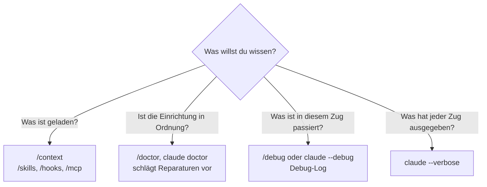

# S4.9 · Fehlersuche: /debug, --verbose, /doctor

<!-- meta:start -->
> **Regal:** [Fehlersuche](README.md#troubleshooting) · **Stufe:** Kern · **~30 Min** · **Voraussetzungen:** [S1.4 Eingebaute Werkzeuge und ihre Namen](s1-04-werkzeuge.md)
>
> ← [S4.8 Abschlussprojekt mit Bewertung](s4-08-abschlussprojekt.md) · [Bibliothek](README.md) · [S4.10 Diagnose Schritt für Schritt](s4-10-diagnose-schritt-fuer-schritt.md) →
<!-- meta:end -->

## Schnellcheck

- Hast du schon einmal mit `/hooks`, `/skills` oder `/mcp` nachgesehen, warum etwas, das du eingerichtet hast, nicht greift?
- Kannst du ohne Nachschlagen sagen, welches Werkzeug du für „Was ist geladen?", „Ist meine Einrichtung in Ordnung?" und „Was ist in diesem Zug passiert?" nimmst?

## Auf einen Blick

Für jede Diagnosefrage gibt es ein eigenes Werkzeug. `/context` und die Listen `/skills`, `/hooks` und `/mcp` zeigen, was geladen ist; `/doctor` prüft Installation und Einstellungen und schlägt Reparaturen vor, die du erst bestätigst; `/debug` schaltet das Debug-Log ein und lässt Claude darin nach der Ursache suchen. `claude --verbose` zeigt jeden Zug vollständig an, ist aber kein Startprotokoll. Wer eine Einrichtung debuggt, fragt zuerst, ob etwas überhaupt geladen wurde.

## Bild im Kopf

Stell dir eine Zutrittsanlage vor, an der eine Tür nicht aufgeht. Der Fehler kann am Sensor sitzen, in der Verkabelung, in der Zentrale oder in der Übertragung zur Leitstelle. Ein guter Techniker tauscht nicht zuerst den Leser. Er geht die Ebenen der Reihe nach durch und schließt jede mit einem kurzen Test aus.

Dafür hat er drei Instrumente. Die Bestandsliste der Zentrale zeigt, was angemeldet ist (`/context`, `/hooks`, `/mcp`). Der eingebaute Selbsttest meldet Fehler und bietet eine Reparatur an (`/doctor`). Das Ereignisprotokoll zeigt, was bei genau diesem Lesevorgang passiert ist (`/debug`). In welcher Reihenfolge du die Ebenen prüfst, steht in [S4.10](s4-10-diagnose-schritt-fuer-schritt.md).



## Im Detail

### Welches Werkzeug für welche Frage

Claude Code verteilt seine Konfiguration auf viele Dateien, und ein einziges falsches Feld kann den Ablauf still verbiegen. Statt zu raten, fragst du das Werkzeug, das zu deiner Frage passt:

| Frage | Werkzeug |
|---|---|
| „Was ist in dieser Sitzung geladen?" | `/context`, dazu `/skills`, `/hooks`, `/mcp`, `/permissions`, `/memory` |
| „Ist meine Einrichtung in Ordnung?" | `/doctor` in der Sitzung, `claude doctor` im Terminal |
| „Warum hat dieser Prompt meinen Skill nicht ausgelöst?" | `/debug` |
| „Warum hat dieser Hook gefeuert oder nicht gefeuert?" | `/debug` oder `claude --debug`, dann das Debug-Log |
| „Was hat jeder Zug genau ausgegeben?" | `claude --verbose` |
| „Liegt es an meiner Konfiguration überhaupt?" | `claude --safe-mode` |

Kurz gesagt: `/context` und `--verbose` **beschreiben** (was geladen ist, was jeder Zug ausgibt), `/doctor` **verordnet** (was falsch ist, mit Reparaturvorschlag), `/debug` **ermittelt** (was in diesem Zug passiert ist, anhand des Logs).

### `/context` und die Listen: was ist geladen?

`/context` zeigt alles, was das Kontextfenster füllt: Systemprompt, Werkzeuge, MCP-Werkzeuge, Subagenten mit ihrer Quelle, Gedächtnis-Dateien, Skills und Nachrichten. Lauf ihn zuerst: Fehlt dein `CLAUDE.md` oder deine Skill-Beschreibung dort, ist sie gar nicht geladen. Für Einzelheiten gibt es die Listen:

- `/hooks` zeigt alle für die Sitzung registrierten Hooks, nach Ereignis geordnet. Steht ein definierter Hook nicht darin, hat Claude Code ihn nicht geladen.
- `/skills` listet verfügbare Skills aus Projekt, Benutzer und Plugins. Die mitgelieferten Skills ([S2.4](s2-04-mitgelieferte-skills.md)) stehen nur in `/context`.
- `/mcp` zeigt jeden konfigurierten MCP-Server mit Verbindungsstatus und ob du ihn für das Projekt freigegeben hast. Ein Server, der nicht startet, steht dort als gescheitert.

### `/doctor` und `claude doctor`

`/doctor` ist eine Einrichtungsprüfung, die Fehler findet und beheben kann. Sie prüft unter anderem:

- die Installation: doppelte oder übrig gebliebene Installationen, Probleme mit `PATH`, Einstellungsdateien, die sich nicht lesen lassen
- Skills, MCP-Server und Plugins, die du nicht nutzt, gemessen an dem, was sie im Kontext kosten
- langsame Hooks und ob es eine neuere Version gibt
- eingecheckte `CLAUDE.md`-Dateien: Doppelungen mit lokalen Dateien und Inhalte, die Claude aus dem Code ableiten kann ([S1.10](s1-10-claude-md.md))
- doppelte Subagent-Namen im selben Ordner

`/doctor` meldet zuerst, was es gefunden hat, und fragt, bevor es etwas ändert. Lies die Vorschläge genau: Es bietet unter anderem an, den Rechte-Modus `auto` zu deinem Standard zu machen und häufig abgelehnte Nur-Lese-Befehle vorab freizugeben ([S1.6](s1-06-rechte-modi.md)). Das sind Entscheidungen über Rechte, keine Reparaturen.

Startet Claude Code gar nicht, nimmst du `claude doctor` im Terminal. Es gibt die Diagnose von Installation und Einstellungen nur aus, ohne Sitzung und ohne etwas zu ändern. Den Zustand der MCP-Server prüfst du mit `/mcp`, Plugins mit `claude plugin validate` ([S4.10](s4-10-diagnose-schritt-fuer-schritt.md)).

### `/debug`: das Debug-Log einschalten und auswerten

`/debug` ist ein mitgelieferter Skill. Er schaltet für die laufende Sitzung das Debug-Log ein und lässt Claude das Log und die Pfade deiner Einstellungen auswerten. Ohne `claude --debug` ist das Log aus, und `/debug` zeichnet erst **ab dem Aufruf** auf. Lös das Problem danach also noch einmal aus.

Hinter `/debug` darfst du das Problem in freien Worten beschreiben; das lenkt die Auswertung:

<!-- cockpit:example -->
```
/debug skill-not-triggering
```

Der typische Fall: „Mein Skill ist installiert, aber Claude nimmt ihn nicht. Warum?" Claude sucht dann im Log und in deiner Konfiguration nach der Ursache: eine zu allgemeine Beschreibung, ein `paths`-Filter, der nicht passt, ein abgeschalteter automatischer Aufruf oder ein Frontmatter, das sich nicht lesen lässt. Die Felder dazu erklärt [S2.3](s2-03-wer-skills-ausloest.md).

### `claude --debug`: das Log von Anfang an

Willst du das Log schon ab dem Start, startest du Claude Code mit `claude --debug`. Einen Filter setzt du in der `=`-Form, etwa `claude --debug=mcp`; mit Leerzeichen statt `=` schaltet Claude Code das Log ohne Filter ein. Das Log erscheint nicht im Terminal, es landet in `~/.claude/debug/<session-id>.txt`. Mit `--debug-file <path>` legst du den Ort selbst fest.

Für Hooks ist das die genaueste Quelle: Das Log hält fest, welche Matcher geprüft wurden, mit welchem Exit-Code der Hook endete und was er ausgegeben hat. Wie du damit Schicht für Schicht vorgehst, zeigt [S4.10](s4-10-diagnose-schritt-fuer-schritt.md).

### `claude --verbose` und `claude --safe-mode`

`claude --verbose` schaltet die ausführliche Ausgabe ein und zeigt jeden Zug vollständig; für diese Sitzung übersteuert es die Einstellung `viewMode`. So siehst du zum Beispiel auch die Abschlussmeldungen von Hooks, die im Hintergrund laufen und sonst unterdrückt werden. Es ist kein Startprotokoll: Was geladen ist, zeigt `/context`.

`claude --safe-mode` startet mit allen Anpassungen aus: ohne `CLAUDE.md`, Skills, Plugins, Hooks, MCP-Server, eigene Commands und Agenten und Auto-Memory. Anmeldung, Modell, eingebaute Werkzeuge und Rechte gelten normal. Verschwindet das Problem im Safe Mode, liegt es in einer dieser Anpassungen; die gezielten Prüfungen oben finden, in welcher.

### Häufige Ursachen, die die Doku nennt

| Symptom | Ursache |
|---|---|
| Ein Hook feuert nie | `matcher` ist ein JSON-Array statt eines Strings; er gehört als ein String mit `\|`, etwa `"Edit\|Write"` |
| Ein Hook feuert nie | `matcher` ist kleingeschrieben (`"bash"`); Namen sind groß geschrieben und die Prüfung beachtet die Schreibweise |
| Ein Hook feuert nie | Er steht in einer eigenen Datei statt unter `"hooks"` in `settings.json` (nur Plugins laden eine `hooks/hooks.json`) |
| Ein Skill fehlt in `/skills` | Die Datei liegt als `.claude/skills/name.md` statt in einem Ordner `.claude/skills/name/SKILL.md` |
| Ein MCP-Server in `.mcp.json` fehlt | Die Datei liegt unter `.claude/` statt im Repository-Stamm, oder die Server stehen nicht unter `mcpServers` |
| Ein MCP-Server startet nicht aus manchen Ordnern | `command` oder `args` nutzen einen relativen Pfad |

## Selbst machen

### Übung: drei Fehler finden, zwei beheben (etwa 20 Minuten)

**Ziel:** Du benutzt `claude doctor`, `/hooks`, `/skills`, `/mcp` und das Debug-Log in einem Testordner mit drei eingebauten Fehlern und findest zu jedem das Werkzeug, das ihn zeigt.

**Startzustand:** ein neuer Ordner `~/cc-workshop/fehlersuche`. Alles darin ist harmlos: Der Hook schreibt nur eine Zeile in eine Datei, der Skill grüßt, und der „MCP-Server" ist ein Befehl, den es nicht gibt. Du schreibst die Dateien selbst mit einem Editor; `.claude` ist ein geschützter Pfad, Claude würde dort nachfragen. Nichts läuft danach weiter, an deiner globalen Konfiguration ändert sich nichts. Das Debug-Log legt Claude Code in seinem eigenen Ordner `~/.claude/debug/` ab.

Bash:

```bash
mkdir -p ~/cc-workshop/fehlersuche/.claude/skills && cd ~/cc-workshop/fehlersuche
```

PowerShell:

```powershell
New-Item -ItemType Directory -Force "$HOME\cc-workshop\fehlersuche\.claude\skills"; Set-Location "$HOME\cc-workshop\fehlersuche"
```

Leg diese drei Dateien an. **Fehler 1** (`.claude/settings.json`):

```json
{
  "hooks": {
    "PreToolUse": [
      {
        "matcher": ["Bash", "Edit"],
        "hooks": [
          {"type": "command", "command": "echo checked >> \"${CLAUDE_PROJECT_DIR}/hook-ran.txt\""}
        ]
      }
    ]
  }
}
```

**Fehler 2** (`.claude/skills/greeter.md`):

```markdown
---
name: greeter
description: Greets the user in German. Use when the user says hello.
---

Greet the user in German, in one short sentence.
```

**Fehler 3** (`.mcp.json` im Ordner selbst):

```json
{
  "mcpServers": {
    "broken-demo": {
      "command": "no-such-command-xyz",
      "args": []
    }
  }
}
```

1. **`claude doctor`, ohne Sitzung.** Führ im Ordner `claude doctor` aus. Erwartet: Es gibt die Diagnose aus und ändert nichts. Laut Doku erscheint dort ein `matcher`, der ein Array ist, als ungültige Einstellung; lies, was zu `.claude/settings.json` dasteht. Den genauen Wortlaut nennt die Doku nicht; im Probelauf stand dort `hooks.PreToolUse.0: Invalid hook matcher` mit einem Korrekturvorschlag.
2. **Starten und listen.** Starte `claude --permission-mode default` und bestätige den Vertrauensdialog. Danach meldet Claude Code die ungültige Einstellung in einem eigenen Dialog (im Probelauf mit dem Satz `Files with errors are skipped entirely, not just the invalid settings.` und drei Antworten). Wähl `Continue without these settings`, nicht das vorausgewählte `Fix with Claude`, denn du willst den Fehler selbst finden. Nach dem MCP-Server fragt Claude Code in diesem Zustand nicht; im Probelauf stand stattdessen die Zeile `skipping .mcp.json server approval (settings errors in …)`. Gib dann nacheinander `/hooks`, `/skills` und `/mcp` ein und schließ jede Ansicht mit `Esc`. Erwartet: In `/hooks` steht kein Hook (Fehler 1: Der `matcher` ist ein Array, und Claude Code überspringt die ganze Datei). In `/skills` fehlt `greeter` (Fehler 2: kein Ordner mit `SKILL.md`). In `/mcp` fehlt `broken-demo` noch ganz: Solange die Einstellungsdatei fehlerhaft ist, kommt der Server gar nicht bis zur Freigabe. Fehler 3 siehst du deshalb erst in Schritt 6.
3. **Fehler 1 beheben.** Ändere in einem zweiten Terminal in `.claude/settings.json` den `matcher` in einen String: `"matcher": "Bash|PowerShell|Edit"` (unter Windows laufen Shell-Befehle meist über das PowerShell-Tool, [S2.8](s2-08-hook-einrichten.md)). Warte ein paar Sekunden und gib in der Sitzung `/hooks` ein. Erwartet: Der Eintrag steht jetzt unter PreToolUse. Zeigt die Ansicht noch den alten Stand, ruf `/hooks` erneut auf; die Doku nennt eine kurze Verzögerung, einen Neustart brauchst du nicht.
4. **Fehler 2 beheben.** Mach aus der Datei einen Ordner. Bash:

   ```bash
   mkdir .claude/skills/greeter && mv .claude/skills/greeter.md .claude/skills/greeter/SKILL.md
   ```

   PowerShell:

   ```powershell
   New-Item -ItemType Directory .claude\skills\greeter; Move-Item .claude\skills\greeter.md .claude\skills\greeter\SKILL.md
   ```

   Gib nach ein paar Sekunden `/skills` ein. Erwartet: `greeter` steht in der Liste.
5. **Den Hook feuern sehen.** Gib ein: `Run the shell command echo hi.` Lies danach `hook-ran.txt` im Ordner (`cat hook-ran.txt`, in PowerShell `Get-Content hook-ran.txt`). Erwartet: mindestens eine Zeile `checked`. Fehlt die Datei, prüf `/hooks` und das Transkript (`Ctrl+O`): Welches Werkzeug hat Claude für den Befehl benutzt?
6. **Fehler 3 sehen und im Log lesen.** Beende die Sitzung mit `/exit` und starte `claude --debug=mcp --permission-mode default`. Die Einstellungsdatei ist jetzt gültig, deshalb fragt Claude Code nach dem MCP-Server. Wähl `Use this MCP server`, nicht die vorausgewählte Antwort `Continue without using this MCP server`, sonst startet er nie. Gib `/mcp` ein. Erwartet: `broken-demo` steht mit einem `✘` in der Liste, und `Enter` öffnet die Detailansicht mit `Status: ✘ failed`. Ein Fehler hatte den anderen verdeckt: Erst seit Fehler 1 behoben ist, kommt der Server bis zum Startversuch. Schließ die Ansicht (zweimal `Esc`) und beende die Sitzung wieder. Such den Servernamen im neuesten Log (`~/.claude/debug/`): Bash `grep -il broken-demo ~/.claude/debug/*.txt`, PowerShell `Select-String -Path "$HOME\.claude\debug\*.txt" -Pattern broken-demo -List | Select-Object Path`. Erwartet: mindestens eine Logdatei erwähnt `broken-demo`; die Zeilen dazu nennen, warum der Start scheiterte (im Probelauf `Connection failed (ENOENT): Executable not found in $PATH: "no-such-command-xyz"`). Der Wortlaut hängt von deinem System ab. Ein relativer Pfad in `command` ist laut Doku eine häufige Ursache; hier fehlt der Befehl ganz.

**Aufräumen:** Lösch den Ordner `~/cc-workshop/fehlersuche` selbst. Willst du die Logdateien loswerden, lösch die, die `broken-demo` erwähnen.

**Geschafft, wenn:**

- [ ] `/hooks` den Hook vor der Reparatur nicht und danach unter PreToolUse zeigte
- [ ] `/skills` `greeter` vor der Reparatur nicht und danach zeigte
- [ ] `/mcp` `broken-demo` erst nach der Reparatur von Fehler 1 und deiner Freigabe zeigte, und zwar als `failed`, und du ihn im Debug-Log wiedergefunden hast
- [ ] du zu jedem der drei Fehler sagen kannst, welches Werkzeug ihn gezeigt hat

### Extra: nichts geladen (Safe Mode; etwa 5 Minuten)

Starte im selben Ordner `claude --safe-mode` und gib `/hooks`, `/skills` und `/mcp` ein; schließ jede Ansicht mit `Esc`. Erwartet: `/skills` zeigt den reparierten Skill nicht und `/mcp` keinen Server, denn der Safe Mode schaltet alle Anpassungen ab. `/hooks` listet deinen reparierten Hook weiterhin auf, im Probelauf mit dem Hinweis `Safe mode: hooks from settings files won't run this session.` Prüf das nach: Gib `Run the shell command echo hi.` ein und lies `hook-ran.txt` erneut. Erwartet: Es ist keine Zeile dazugekommen. Beende die Sitzung.

## Typische Fallen

- **`/debug` erst einschalten, wenn der Fehler schon passiert ist.** Das Log beginnt beim Aufruf. Lös das Problem danach noch einmal aus, sonst steht nichts Brauchbares darin.
- **Das Debug-Log im Terminal suchen.** `claude --debug` schreibt nicht ins Terminal, sondern nach `~/.claude/debug/<session-id>.txt`.
- **`--verbose` als Startprotokoll lesen.** Es zeigt die Züge ausführlich, keine Liste der geladenen Konfiguration. Die gibt dir `/context`.
- **`/doctor`-Vorschläge ungelesen bestätigen.** Unter den Vorschlägen stehen auch Änderungen an deinen Rechten, etwa `auto` als Standard-Modus.
- **Die Ansicht von `/hooks` bleibt alt.** Nach dem Speichern der `settings.json` dauert es einen Moment; ruf `/hooks` erneut auf.

## Check

Du kannst für eine Diagnosefrage das passende Werkzeug nennen und erklären, warum `/context` und `--verbose` beschreiben, `/doctor` verordnet und `/debug` ermittelt.

1. Ab wann zeichnet `/debug` auf, und was musst du danach tun?
2. Wo findest du das Log, das `claude --debug` schreibt?
3. Was tut `/doctor`, bevor es etwas an deiner Einrichtung ändert, und was zeigt `claude doctor` im Terminal?

<details><summary>Auflösung</summary>

1. Ab dem Aufruf. Danach löst du das Problem noch einmal aus, damit es im Log steht.
2. In `~/.claude/debug/<session-id>.txt`, nicht im Terminal; mit `--debug-file <path>` bestimmst du den Ort selbst.
3. `/doctor` meldet zuerst, was es gefunden hat, und fragt, bevor es etwas ändert. `claude doctor` gibt die Diagnose von Installation und Einstellungen nur aus, ohne Sitzung und ohne etwas zu ändern.

</details>

<details><summary>Quizfrage</summary>

**Frage:** Du hast einen PreToolUse-Hook in die `settings.json` eingetragen, aber `/hooks` listet ihn nicht auf. Was ist die wahrscheinlichste Ursache?

- **Richtig:** Der `matcher` ist ein JSON-Array statt eines Strings; Claude Code lädt den Eintrag dann nicht.
- Falsch: Der Hook erscheint erst in `/hooks`, nachdem er zum ersten Mal gefeuert hat; vorher kennt Claude Code ihn noch nicht.
- Falsch: `/hooks` zeigt nur Hooks aus deiner Benutzerdatei `~/.claude/settings.json`, nicht die aus der Projektdatei.
- Falsch: Hooks gehören in eine eigene Datei `.claude/hooks.json`; in der `settings.json` liest Claude Code sie nicht.

</details>

## Weiterlesen

- [Konfiguration debuggen](https://code.claude.com/docs/en/debug-your-config)
- [Befehle: /debug, /doctor, /context](https://code.claude.com/docs/en/commands)
- [CLI-Referenz: --debug, --verbose, --safe-mode](https://code.claude.com/docs/en/cli-reference)
- [Hooks debuggen](https://code.claude.com/docs/en/hooks#debug-hooks)
- [S4.10 · Diagnose Schritt für Schritt](s4-10-diagnose-schritt-fuer-schritt.md)
- [S2.4 · Mitgelieferte Skills](s2-04-mitgelieferte-skills.md)
- [S1.4 · Eingebaute Werkzeuge und ihre Namen](s1-04-werkzeuge.md)
- [S1.9 · Kontext steuern mit /compact und /rewind](s1-09-kontext-steuern.md)
