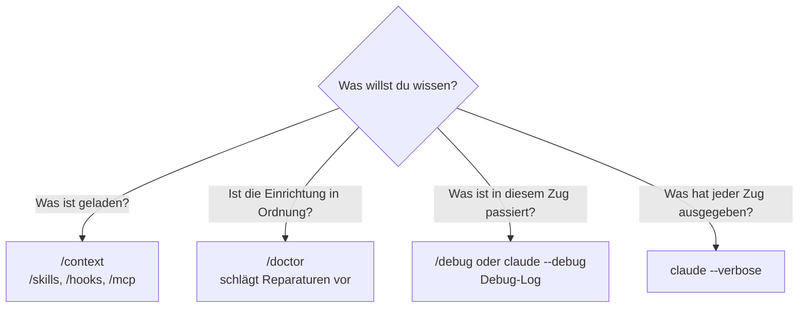

# S4.9 · Fehlersuche: /debug, --verbose, /doctor

<!-- meta:start -->
> **Regal:** [Fehlersuche](README.md#troubleshooting) · **Stufe:** Kern · **~15 Min** · **Voraussetzungen:** [S1.4 Eingebaute Werkzeuge und ihre Namen](s1-04-werkzeuge.md)
>
> ← [S4.8 Abschlussprojekt mit Bewertung](s4-08-abschlussprojekt.md) · [Bibliothek](README.md) · [S4.10 Diagnose Schritt für Schritt](s4-10-diagnose-schritt-fuer-schritt.md) →
<!-- meta:end -->

## Schnellcheck

- Hast du schon einmal mit `/debug` oder dem Debug-Log nachvollzogen, warum ein Skill oder Hook bei einem bestimmten Prompt nicht gegriffen hat?
- Kannst du ohne Nachschlagen sagen, welches Werkzeug du für „Was ist geladen?", „Ist meine Einrichtung in Ordnung?" und „Was ist in diesem Zug passiert?" nimmst?

## Auf einen Blick

Für jede Diagnosefrage gibt es ein eigenes Werkzeug. `/context` und die Listen `/skills`, `/hooks` und `/mcp` zeigen, was geladen ist; `/doctor` prüft Installation und Einstellungen und schlägt Reparaturen vor, die du erst bestätigst; `/debug` schaltet das Debug-Log ein und lässt Claude darin nach der Ursache suchen. `claude --verbose` zeigt jeden Zug vollständig an, ist aber kein Startprotokoll.

## Bild im Kopf

Stell dir eine Zutrittsanlage vor, an der eine Tür nicht aufgeht. Der Fehler kann am Sensor sitzen, in der Verkabelung, in der Zentrale oder in der Übertragung zur Leitstelle. Ein guter Techniker tauscht nicht zuerst den Leser. Er geht die Ebenen der Reihe nach durch und schließt jede mit einem kurzen Test aus: Störungssuche an der Alarmzentrale, Sensor → Verkabelung → Zentrale → Übertragung.

Dafür hat er drei Instrumente. Die Bestandsliste der Zentrale zeigt, was angemeldet ist (`/context`, `/hooks`, `/mcp`). Der eingebaute Selbsttest meldet Fehler und bietet eine Reparatur an (`/doctor`). Das Ereignisprotokoll zeigt, was bei genau diesem Lesevorgang passiert ist (`/debug`). Claude Code ist genauso aufgebaut; in welcher Reihenfolge du die Ebenen prüfst, steht in [S4.10](s4-10-diagnose-schritt-fuer-schritt.md).



## Im Detail

### Welches Werkzeug für welche Frage

Claude Code verteilt seine Konfiguration auf viele Dateien, und ein einziges falsches Feld kann den Ablauf still verbiegen. Statt zu raten, fragst du das Werkzeug, das zu deiner Frage passt:

| Frage | Werkzeug |
|---|---|
| „Was ist in dieser Sitzung geladen?" | `/context`, dazu `/skills`, `/hooks`, `/mcp`, `/permissions` |
| „Ist meine Einrichtung in Ordnung?" | `/doctor` in der Sitzung, `claude doctor` im Terminal |
| „Warum hat dieser Prompt meinen Skill nicht ausgelöst?" | `/debug` |
| „Warum hat dieser Hook gefeuert oder nicht gefeuert?" | `/debug` oder `claude --debug`, dann das Debug-Log |
| „Was hat jeder Zug genau ausgegeben?" | `claude --verbose` |

Kurz gesagt: `/context` und `--verbose` **beschreiben** (was geladen ist, was jeder Zug ausgibt), `/doctor` **verordnet** (was falsch ist, mit Reparaturvorschlag), `/debug` **ermittelt** (was in diesem Zug passiert ist, anhand des Logs).

### `/debug`: das Debug-Log einschalten und auswerten

`/debug` ist ein mitgelieferter Skill ([S2.4](s2-04-mitgelieferte-skills.md)). Er schaltet für die laufende Sitzung das Debug-Log ein und lässt Claude das Log und die Pfade deiner Einstellungen auswerten. Ohne `claude --debug` ist das Log aus, und `/debug` zeichnet erst **ab dem Aufruf** auf. Lös das Problem danach also noch einmal aus.

Hinter `/debug` darfst du das Problem beschreiben; das lenkt die Auswertung:

<!-- cockpit:example -->
```
/debug skill-not-triggering
```

Das Argument ist eine freie Beschreibung. Ältere Fassungen dieses Kurses nannten feste Schwerpunkte wie `hook-firing`, `mcp-handshake` oder `instructions-loaded`; eine solche Liste kennt die Doku nicht. Solche Stichworte sind einfach eine kurze Beschreibung, ein ganzer Satz geht genauso.

Der typische Fall: „Mein Skill ist installiert, aber Claude nimmt ihn nicht. Warum?" Claude sucht dann im Log und in deiner Konfiguration nach der Ursache: eine zu allgemeine Beschreibung, ein `paths`-Filter, der nicht passt, ein abgeschalteter automatischer Aufruf oder ein Frontmatter, das sich nicht lesen lässt. Die Felder dazu erklärt [S2.3](s2-03-wer-skills-ausloest.md). Wie `/debug` in einer ganzen Diagnose sitzt, zeigt Schritt 4 der Abläufe in [S4.10](s4-10-diagnose-schritt-fuer-schritt.md).

### `claude --debug`: das Log von Anfang an

Willst du das Log schon ab dem Start, startest du Claude Code mit `claude --debug`. Einen Filter setzt du in der `=`-Form, etwa `claude --debug='mcp,startup'`; mit Leerzeichen statt `=` schaltet Claude Code das Log ohne Filter ein. Das Log erscheint nicht im Terminal, es landet in `~/.claude/debug/<session-id>.txt`. Mit `--debug-file <path>` legst du den Ort selbst fest.

Für Hooks ist das die genaueste Quelle: Das Log hält fest, welche Matcher geprüft wurden, mit welchem Exit-Code der Hook endete und was er ausgegeben hat. Wie du damit Schicht für Schicht vorgehst, zeigt [S4.10](s4-10-diagnose-schritt-fuer-schritt.md).

### `claude --verbose`: jeder Zug vollständig

`claude --verbose` schaltet die ausführliche Ausgabe ein und zeigt jeden Zug vollständig; für diese Sitzung übersteuert es die Einstellung `viewMode`. So siehst du zum Beispiel auch die Abschlussmeldungen von Hooks, die im Hintergrund laufen und sonst unterdrückt werden.

Ältere Fassungen dieses Kurses beschrieben `--verbose` als Startprotokoll, das auflistet, welche CLAUDE.md-Dateien, Plugins, Skills, Hooks und MCP-Server geladen wurden. Das steht so nicht in der Doku. Was geladen ist, zeigt `/context`; ein Protokoll ab dem Start schreibt `claude --debug`.

### `/doctor` und `claude doctor`

`/doctor` ist eine Einrichtungsprüfung, die Fehler findet und beheben kann. Sie prüft unter anderem:

- die Installation: doppelte oder übrig gebliebene Installationen, Probleme mit `PATH`, Einstellungsdateien, die sich nicht lesen lassen
- Skills, MCP-Server und Plugins, die du nicht nutzt, gemessen an dem, was sie im Kontext kosten
- langsame Hooks und ob es eine neuere Version gibt
- eingecheckte `CLAUDE.md`-Dateien: Doppelungen mit lokalen Dateien und Inhalte, die Claude aus dem Code ableiten kann ([S1.10](s1-10-claude-md.md))
- doppelte Subagent-Namen im selben Ordner

`/doctor` meldet zuerst, was es gefunden hat, und fragt, bevor es etwas ändert. Lies die Vorschläge genau: Es bietet unter anderem an, den Rechte-Modus `auto` zu deinem Standard zu machen und häufig abgelehnte Nur-Lese-Befehle vorab freizugeben ([S1.6](s1-06-rechte-modi.md)). Das sind Entscheidungen über Rechte, keine Reparaturen.

Startet Claude Code gar nicht, nimmst du `claude doctor` im Terminal. Es gibt die Diagnose von Installation und Einstellungen nur aus, ohne Sitzung und ohne etwas zu ändern.

Ältere Fassungen dieses Kurses beschrieben `/doctor` als reinen Bericht und nannten dabei auch abgelaufene OAuth-Tokens, unerreichbare MCP-Server und widersprüchliche Rechte-Regeln. Diese Punkte nennt die Doku für `/doctor` nicht. Den Zustand der MCP-Server prüfst du mit `/mcp`, Plugins mit `claude plugin validate` ([S4.10](s4-10-diagnose-schritt-fuer-schritt.md)).

## Typische Fallen

- **`/debug` erst einschalten, wenn der Fehler schon passiert ist.** Das Log beginnt beim Aufruf. Lös das Problem danach noch einmal aus, sonst steht nichts Brauchbares darin.
- **Das Debug-Log im Terminal suchen.** `claude --debug` schreibt nicht ins Terminal, sondern nach `~/.claude/debug/<session-id>.txt`.
- **`--verbose` als Startprotokoll lesen.** Es zeigt die Züge ausführlich, keine Liste der geladenen Konfiguration. Die gibt dir `/context`.
- **`/doctor`-Vorschläge ungelesen bestätigen.** Unter den Vorschlägen stehen auch Änderungen an deinen Rechten, etwa `auto` als Standard-Modus.

## Check

Du kannst für eine Diagnosefrage das passende Werkzeug nennen und erklären, warum `/context` und `--verbose` beschreiben, `/doctor` verordnet und `/debug` ermittelt.

1. Ab wann zeichnet `/debug` auf, und was musst du danach tun?
2. Wo findest du das Log, das `claude --debug` schreibt?
3. Was tut `/doctor`, bevor es etwas an deiner Einrichtung ändert?

<details><summary>Quizfrage</summary>

**Frage:** Deine Einrichtung verhält sich seltsam, und du willst wissen, was daran kaputt ist. Was unterscheidet `/doctor` von `claude --verbose`?

- **Richtig:** `/doctor` prüft Installation und Einstellungen auf Fehler und schlägt Reparaturen vor; `--verbose` zeigt nur jeden Zug ausführlich.
- Falsch: `/doctor` gibt es nur in Team- und Enterprise-Plänen, weil es deine Kontodaten liest; `--verbose` prüft dasselbe in jedem Plan.
- Falsch: `--verbose` bleibt für alle folgenden Sitzungen an, bis du es abschaltest; `/doctor` prüft einmal und ändert nie etwas.
- Falsch: Nur das Format unterscheidet sie: `--verbose` gibt YAML aus, `/doctor` gibt JSON aus, damit CI-Pipelines die Befunde maschinell lesen.

</details>

## Weiterlesen

- [Konfiguration debuggen](https://code.claude.com/docs/en/debug-your-config)
- [Befehle: /debug, /doctor, /context](https://code.claude.com/docs/en/commands)
- [CLI-Referenz: --debug und --verbose](https://code.claude.com/docs/en/cli-reference)
- [Hooks debuggen](https://code.claude.com/docs/en/hooks#debug-hooks)
- [S4.10 · Diagnose Schritt für Schritt](s4-10-diagnose-schritt-fuer-schritt.md)
- [S2.4 · Mitgelieferte Skills](s2-04-mitgelieferte-skills.md)
- [S1.4 · Eingebaute Werkzeuge und ihre Namen](s1-04-werkzeuge.md)
- [S1.9 · Kontext steuern mit /compact und /rewind](s1-09-kontext-steuern.md)
