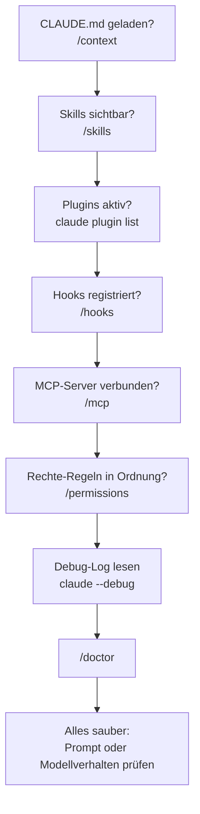

# S4.10 · Diagnose Schritt für Schritt

<!-- meta:start -->
> **Regal:** [Fehlersuche](README.md#troubleshooting) · **Stufe:** Kern · **~18 Min** · **Voraussetzungen:** [S4.9 Fehlersuche: /debug, --verbose, /doctor](s4-09-fehlersuche-werkzeuge.md) · [S2.8 Einen Hook einrichten, der wirklich blockt](s2-08-hook-einrichten.md)
>
> ← [S4.9 Fehlersuche: /debug, --verbose, /doctor](s4-09-fehlersuche-werkzeuge.md) · [Bibliothek](README.md)
<!-- meta:end -->

## Schnellcheck

- Hast du schon einmal einen Hook von Hand mit einer Eingabe im echten Format gefüttert (`echo '{…}' | bash script.sh`) und den Exit-Code geprüft?
- Kannst du ohne Nachschlagen sagen, in welcher Reihenfolge du vorgehst, wenn ein Skill installiert ist, aber nie ausgelöst wird?

## Auf einen Blick

Wenn etwas nicht greift, gehst du die Schichten in fester Reihenfolge durch: CLAUDE.md, Skills, Plugins, Hooks, MCP, Rechte, dann Debug-Log und `/doctor`. Du fragst die Werkzeuge, was sie sehen, statt zu raten, und reparierst erst, wenn eine Schicht ihren Fehler zeigt. Bei Hooks zählt die Fehlerrichtung: Ein Schutz-Hook, der abstürzt oder in einen Timeout läuft, blockt nicht, der Befehl läuft weiter.

Deshalb testest du einen Hook immer auch von Hand, mit einer Eingabe im echten Format, und prüfst den Exit-Code: Nur 2 blockt.

## Bild im Kopf

Eine Tür geht nicht auf. Der Techniker tauscht nicht zuerst den Leser, sondern geht seine Liste in fester Reihenfolge durch und schließt jede Stufe mit einem kurzen Test aus: Ist das Programm der Zentrale geladen? Sind die Leser angemeldet? Stecken die Zusatzmodule? Ist die Controller-Logik scharf? Steht die Verbindung zur Leitstelle? Ist die Berechtigungsstufe für diese Kartenklasse freigegeben? Erst wenn all das stimmt, nimmt er sich die Karte selbst vor. In Claude Code heißen die Stufen CLAUDE.md, Skills, Plugins, Hooks, MCP und Rechte; die Karte ist dein Prompt.

Dazu kommt die Fehlerrichtung. Ein Türcontroller, der den Strom verliert, soll verriegeln (fail-secure), nicht öffnen. Hooks in Claude Code fallen bei Absturz und Timeout offen. Das sichere Verhalten musst du deshalb selbst ins Skript einbauen.



## Im Detail

### Vier klassische Hook-Fehler

Hooks sind die Schicht, die am schnellsten falsch eingerichtet ist: ein Shell-Skript an einem Ereignis mit Matcher, und beide Seiten können falsch sein.

1. **Der Hook blockt alles.** Der Matcher ist zu breit, typischerweise `".*"` statt eines bestimmten Tools. Dann feuert der Hook bei jedem Aufruf, und wenn sein Skript ablehnt, läuft im Terminal kein Befehl mehr glatt durch.
2. **Das Skript läuft gar nicht.** Die Datei ist nicht ausführbar (`chmod +x` fehlt), die Shebang-Zeile fehlt, oder der Pfad in `settings.json` stimmt nicht: ein Tippfehler, ein relativer Pfad, der sich nicht auflösen lässt, ein Backslash im Windows-Stil.
3. **Das Skript bricht mit einem Fehler ab, und dein Wächter steht offen.** Nur Exit-Code **2** blockt. Ein Syntaxfehler in Zeile 12, ein fehlendes `jq` (Exit 127) oder ein schlichtes `exit 1` gelten als Hook-Fehler, der *nicht* blockt: Im Transkript steht ein `hook error`, und der Aufruf **läuft weiter**. Für einen Log-Hook ist das harmlos. Bei einem Schutz-Hook steht die Tür offen, während alles eingerichtet aussieht. Bau Wächter deshalb so, dass sie geschlossen fallen: Prüf die eigene Eingabe und ende mit `exit 2`, wenn du sie nicht lesen kannst ([S2.8](s2-08-hook-einrichten.md)).
4. **Das Skript hängt.** Es wartet auf eine Eingabe, die nie kommt, oder ruft einen langsamen Befehl auf. Ein `command`-Hook hat standardmäßig **600 Sekunden** Timeout; du stellst ihn mit `timeout` am Handler in Sekunden ein. Läuft er ab, bricht Claude Code den Hook ab und verwirft seine Ausgabe, und ein PreToolUse-Hook im Timeout blockt den Aufruf **nicht**. Ein hängender Wächter ist eine weitere offene Tür.

### Einen Hook diagnostizieren

1. **`/hooks`** listet alle Hooks, die für die Sitzung registriert sind, nach Ereignis gruppiert. So siehst du, ob dein Hook überhaupt registriert ist. Fehlt er, liest Claude Code ihn nicht; überraschend oft steckt ein Tippfehler im JSON-Schlüssel dahinter.
2. **Lass das Skript von Hand laufen.** `bash ~/.claude/hooks/security-check.sh < /dev/null`: Läuft es überhaupt, und was macht es mit einer Eingabe, die es nicht lesen kann?
3. **Spiel die Eingabe im echten Format ein.** Ein Hook bekommt das ganze Ereignis als JSON auf stdin; der Bash-Befehl steht in `tool_input.command`. So spielst du es nach:

```bash
   echo '{"hook_event_name":"PreToolUse","tool_name":"Bash","tool_input":{"command":"rm -rf /"}}' \
     | bash ~/.claude/hooks/security-check.sh
   echo $?    # 2 = block, 0 = allow, anything else = hook error (the call would go ahead!)
```

4. **Schau Claude Code beim Auswerten zu.** Starte mit `claude --debug` (oder schalte mitten in der Sitzung `/debug` ein) und lös die Aktion noch einmal aus. Das Debug-Log hält jedes Ereignis fest, welche Matcher geprüft wurden, den Exit-Code und die Ausgabe des Hooks ([S4.9](s4-09-fehlersuche-werkzeuge.md)). Für einen schnellen Blick ohne Log öffnet `Ctrl+O` die Transkript-Ansicht: Dort siehst du, ob der Hook geblockt oder einen `hook error` gemeldet hat.

Die Begriffe dazu (Ereignisse, Matcher, `if`) stehen in [S2.7](s2-07-hook-ereignisse.md) und [S2.8](s2-08-hook-einrichten.md); hier nutzt du sie, um Fehler zu finden.

### „Mein Skill greift nicht"

Der Skill liegt im richtigen Ordner, `/skills` listet ihn, aber Claude ruft ihn nie auf. Vier häufige Ursachen:

1. **Die Beschreibung ist zu allgemein.** Ohne konkrete Auslöser kann Claude nicht entscheiden, dass *dieser* Prompt zu *diesem* Skill gehört. Abhilfe: die Beschreibung mit Beispiel-Formulierungen neu schreiben.
2. **`disable-model-invocation: true`** steht im Frontmatter. Der Skill ist registriert, aber nur von Hand als Slash-Befehl aufrufbar; der automatische Aufruf ist absichtlich aus.
3. **Ein `paths`-Filter.** Der Skill hat einen Filter wie `paths: ["src/**/*.py"]`, und du arbeitest gerade nicht an passenden Dateien. Dann lädt Claude ihn nicht automatisch, und nichts meldet das.
4. **Das YAML im Frontmatter ist kaputt.** Ein fehlender Doppelpunkt, eine falsche Einrückung, ein typografisches Anführungszeichen aus einer Kopie. Dann lädt Claude Code den Skill-Text mit leeren Metadaten: `/skill-name` funktioniert noch, aber Claude kann deinen Prompt nicht mehr mit der Beschreibung abgleichen. Den Lesefehler zeigt `claude --debug`; `claude plugin validate ~/.claude/skills` findet `SKILL.md`-Dateien, deren Frontmatter sich nicht lesen lässt.

**Diagnose-Reihenfolge:**

1. **`/skills`:** Steht der Skill überhaupt in der Liste? Wenn nicht, liegt er im falschen Ordner, etwa als `.claude/skills/name.md` statt als Ordner mit einer `SKILL.md` darin.
2. **Das Frontmatter ansehen:** `cat ~/.claude/skills/<name>/SKILL.md | head -20`. Achte auf `disable-model-invocation`, auf `paths` und darauf, wie konkret die Beschreibung ist.
3. **Ausdrücklich auslösen.** Schreib in den Prompt: *„Use the `<skill-name>` skill to …"*. Greift er jetzt, liegt es am Abgleich, also an einer vagen Beschreibung. Greift er nicht, liegt es am Frontmatter oder am `paths`-Filter.
4. **`/debug`** mit einer Beschreibung des Problems, dann denselben Prompt noch einmal; lies Claudes Auswertung des Logs ([S4.9](s4-09-fehlersuche-werkzeuge.md)).

**Kein Neustart nötig:** Claude Code bemerkt Änderungen an Skill-Dateien in der laufenden Sitzung (außer im Bare-Modus); die Ausnahmen, etwa einen Skill-Ordner, den du erst während der Sitzung anlegst, nennt [S2.5](s2-05-lebendige-prompts.md). Wirkt ein Skill trotzdem wie die alte Fassung, hast du vermutlich eine andere Kopie der Datei bearbeitet, etwa im Benutzer- statt im Projekt-Ordner. Die Frontmatter-Felder erklären [S2.2](s2-02-skill-schreiben.md) und [S2.3](s2-03-wer-skills-ausloest.md).

### Plugins prüfen

Plugins sitzen eine Schicht höher: Sie enthalten Skills, Agents, Hooks und MCP-Server. Ein Plugin kann **installiert, aber wirkungslos** sein oder **geladen, aber mit kaputtem Inhalt**.

- **`claude plugin list`** zeigt jedes installierte Plugin mit Version, Scope und Status.
- **`claude plugin validate <path>`** prüft das Manifest gegen das Schema und die Pfade darin. Der Befehl braucht einen Pfad, keinen Plugin-Namen. Er meldet auch den häufigen Fehler, `plugin.json` ins Plugin-Root statt nach `.claude-plugin/plugin.json` zu legen.
- **`/reload-plugins`** lädt die Plugins in der laufenden Sitzung neu. Du brauchst es nach Änderungen außerhalb des `/plugin`-Panels, etwa nach einem `claude plugin`-Befehl in einem anderen Terminal.

**Häufiger Fehler: Das Plugin lädt, der Skill darin nicht.** Meist ist es ein Pfadproblem. Ein Pfad im Manifest zeigt auf einen Ort, an dem nichts liegt (Pfade beginnen mit `./` und gelten relativ zum Plugin-Root), oder der Ordner `skills/` liegt in `.claude-plugin/` statt im Plugin-Root. `claude plugin validate` meldet einen fehlenden Pfad als `Path not found`. Den Aufbau eines Plugins zeigt [S2.11](s2-11-plugins-buendeln.md), Updates und Scopes [S2.12](s2-12-plugin-lebenszyklus.md).

### MCP-Server, die sich nicht verbinden

MCP-Server sind eigene Prozesse mit eigenem Lebenszyklus, eigener Anmeldung und eigenen Timeouts. Zum Nachsehen:

- **`/mcp`** zeigt jeden eingerichteten Server mit Verbindungsstatus, ob du ihn für dieses Projekt freigegeben hast, und bei einem Fehler die Meldung des Servers.
- **`claude mcp get <name>`** zeigt die Einrichtung eines Servers im Detail, bei einem Verbindungsfehler mit einer `Issue:`-Zeile.
- **`claude mcp reset-project-choices`** setzt deine Freigabe-Entscheidungen für die Server aus `.mcp.json` zurück; danach fragt Claude Code wieder.

**Anmeldung abgelaufen:** Gestern ging der Server, heute kommt `401`. Bei einem `401` erneuert Claude Code das gespeicherte Token selbst und versucht es einmal neu. Klappt das nicht, markiert es den Server in `/mcp`. Dort wählst du beim Server **Re-authenticate** und meldest dich im Browser neu an. Einrichtung und Scopes stehen in [S2.15](s2-15-mcp-einrichten.md), OAuth im Detail in [S2.16](s2-16-mcp-im-detail.md).

### `InstructionsLoaded`: sehen, welche Anweisungen wirklich geladen werden

`InstructionsLoaded` ist ein Hook-Ereignis ([S2.7](s2-07-hook-ereignisse.md)). Es feuert, wenn eine `CLAUDE.md` oder eine Datei aus `.claude/rules/` in den Kontext geladen wird: beim Start für die sofort geladenen Dateien und später noch einmal, wenn Dateien nachgeladen werden, etwa eine `CLAUDE.md` in einem Unterordner. Jedes Ereignis nennt genau eine Datei in `file_path`, dazu `memory_type` (`User`, `Project`, `Local` oder `Managed`) und `load_reason` (etwa `session_start`, `nested_traversal` oder `include`). Blocken kann dieser Hook nicht; er läuft asynchron und dient nur der Beobachtung.

**Einsatz:** „Ich habe eine neue Regel in meine CLAUDE.md geschrieben. Lädt Claude sie überhaupt?" Häng einen kleinen Log-Hook an das Ereignis und sieh nach:

```bash
# In ~/.claude/hooks/inspect-instructions.sh
INPUT=$(cat)
echo "$INPUT" | jq -c '{load_reason, memory_type, file_path}' >> ~/.claude/loaded-instructions.log
exit 0
```

Trag das Skript in `settings.json` unter dem Ereignis `InstructionsLoaded` ein, im Aufbau wie in [S2.8](s2-08-hook-einrichten.md). Ein `matcher` wird hier gegen `load_reason` geprüft; mit `"session_start"` schreibt der Hook nur die Dateien vom Start ins Log. Danach hinterlässt jede geladene Anweisungsdatei eine Zeile in einem Log, das du durchsuchen kannst. Pflegst du eine verschachtelte CLAUDE.md-Hierarchie, lohnt es sich, diesen Hook dauerhaft scharf zu lassen.

Ältere Fassungen dieses Kurses lasen hier ein Feld `loadedFiles`. Das gibt es nicht, und der Hook schrieb nur `null` ins Log. Laut Doku feuert das Ereignis für CLAUDE.md und `.claude/rules/`; Auto-Memory-Dateien nennt sie dabei nicht. Eine `AGENTS.md`, die Claude direkt liest, meldet es nicht, wohl aber eine, die eine `CLAUDE.md` importiert.

### Auto-Memory-Drift erkennen und beheben

Claude führt je Projekt einen Auto-Memory-Ordner, in dem es sich aus eigenem Antrieb Dinge merkt ([S1.11](s1-11-gedaechtnis-ebenen.md)). Meist hilft das. Manchmal notiert Claude aber einen **falschen Schluss** („der Nutzer mag Tabs", obwohl nur eine Datei zufällig Tabs hatte), und der färbt danach das Verhalten in jeder Sitzung.

**Symptom:** Claude verhält sich auf eine Weise, die deine CLAUDE.md nicht vorsieht, und das in jeder Sitzung gleich.

**Diagnose:**

```bash
cat ~/.claude/projects/<hash>/memory/MEMORY.md
# Plus any topic files in the same directory
```

Denselben Ordner öffnest du auch über `/memory`.

**Beheben:** Lösch die falsche Notiz direkt aus `MEMORY.md`; die Dateien sind einfaches Markdown. Oder sag Claude ausdrücklich: *„Forget that I prefer tabs — that was incorrect."* Schau danach in der Datei nach, ob die Notiz wirklich weg ist.

### Die Diagnose-Checkliste

Wenn **irgendetwas** nicht tut, was es soll, gehst du die Schichten in dieser Reihenfolge durch. Überspring keine.

1. **CLAUDE.md geladen?** `/context` zeigt unter **Memory files**, welche Dateien geladen sind. Schneller Gegencheck: Frag Claude *„What CLAUDE.md files do you see?"*
2. **Skills sichtbar?** `/skills`
3. **Plugins aktiv?** `claude plugin list`
4. **Hooks registriert?** `/hooks`
5. **MCP-Server verbunden?** `/mcp`
6. **Rechte-Regeln in Ordnung?** `/permissions`
7. **Debug-Log lesen.** Starte mit `claude --debug` neu und lies das Log in `~/.claude/debug/<session-id>.txt`.
8. **`/doctor` ausführen.** Der letzte Durchgang findet, was übrig bleibt.

Bestehen alle acht Prüfungen und das Problem bleibt, liegt es an der **Form des Prompts** ([S1.13](s1-13-vager-und-praeziser-auftrag.md)) oder am **Verhalten des Modells**, nicht an der Konfiguration.

### Was du lassen solltest

- **Nicht zuerst neu installieren.** Fast immer ist die Konfiguration die Ursache, nicht eine kaputte Installation. Eine Neuinstallation wirft deinen Diagnose-Stand weg, ohne den Fehler zu beheben.
- **Nichts mit `--dangerously-skip-permissions` „reparieren".** Das unterdrückt das Symptom, statt die Ursache zu finden. In der nächsten Sitzung ist das Problem wieder da.
- **Den Auto-Memory-Ordner nicht übersehen.** Erstaunlich viele Probleme der Art „Claude hat eine seltsame Meinung zu X" gehen auf einen einzigen veralteten Eintrag zurück.
- **`.claude.json` oder `.mcp.json` nicht als Erstes von Hand bearbeiten.** Beide sind geschützte Pfade: Claude Code gibt Schreibzugriffe darauf nie automatisch frei, außer in `bypassPermissions` ([S3.9](s3-09-geschuetzte-pfade-und-sandbox.md)), und das hat seinen Grund. Für Änderungen gibt es die CLI-Befehle `claude plugin` und `claude mcp`.

## Selbst machen

### Übung: einen kaputten Hook reparieren (etwa 20 Minuten, Bonus etwa 5 Minuten)

**Ziel:** Einen falsch eingerichteten Hook nur mit den üblichen Prüfwerkzeugen finden und beheben, ohne zuerst ins Hook-Skript zu schauen. Ohne diese Fähigkeit hängst du jedes Mal fest, wenn ein Hook sich seltsam verhält.

**Ausgangslage:** Jemand anderes (die Moderation oder dein Übungspartner) hat in einer projekt-lokalen `.claude/settings.json` einen Hook eingerichtet, der **jeden Bash-Befehl blockt**, auch die harmlosen. Symptom: Jedes `ls`, jedes `cat`, jedes `git status` löst eine Rückfrage aus oder wird abgelehnt. Das Terminal wirkt kaputt.

Deine Aufgabe ist **nicht**, ins Hook-Skript zu schauen. Du findest das Problem so, wie du es auf dem Rechner einer Kollegin finden würdest: nur mit `/hooks`, dem Debug-Log (`claude --debug`) und der Checkliste aus „Im Detail".

**Bild dazu:** Über Nacht wurde eine neue Zutrittsrichtlinie eingespielt. Jede Tür lehnt jede Karte ab, und der Hersteller ruft nicht zurück. Du gehst die Ebenen durch: Karte → Leser → Controller. Dieselbe Schleife, als Software.

**Schritt 1: das Problem erkennen, ohne das Skript zu lesen**

- Führ `/hooks` aus: Wie sieht der Matcher aus? Ist er verdächtig breit, etwa `".*"` oder `"Bash.*"` ohne weitere Einschränkung?
- Starte Claude mit `claude --debug` neu, lös einen harmlosen Befehl aus und lies das Debug-Log: Welcher Hook wurde geprüft, welcher Matcher hat gegriffen, mit welchem Exit-Code endete er?

Schreib deine Hypothese auf, **bevor** du das Skript öffnest.

**Schritt 2: das Hook-Skript analysieren**

- Öffne `~/.claude/hooks/<name>.sh`.
- Lies den Matcher in der `settings.json` und den Körper des Skripts. Was trifft der Matcher wirklich? Ist er breiter, als der Kommentar im Skript behauptet?
- Was macht der Körper? Protokollieren, blocken oder beides?

**Schritt 3: den Fehler beheben**

Wähl einen von zwei Wegen:

- **Den Matcher enger ziehen.** Ersetz `".*"` durch den Matcher `"Bash"` und filtere mit dem Feld `if` genau das, was der Hook prüfen soll, etwa `"if": "Bash(rm *)"` für eine Prüfung auf zerstörerische Befehle statt für `ls` ([S2.8](s2-08-hook-einrichten.md)). Schreib `Bash(rm *)` nicht in den `matcher`: Mit Klammern und Stern wird er als Regex gelesen, der nie auf den Tool-Namen `Bash` passt, und dein Wächter feuert gar nicht mehr.
- **Den Hook vorübergehend abschalten**, indem du ihn aus der Liste in `settings.json` entfernst. Das entsperrt dich, während du über den richtigen Matcher nachdenkst. Prüf die Datei nach jeder Handänderung mit `python -m json.tool .claude/settings.json`; ein verirrtes Komma ist eine eigene Sorte „kaputtes Claude".

**Schritt 4: prüfen**

- Führ einen harmlosen Befehl wie `ls` oder `git status` aus. Er soll jetzt **ohne Rückfrage** laufen.
- Führ `/hooks` noch einmal aus und bestätige, dass der Matcher jetzt so aussieht, wie du ihn wolltest.
- Soll der Hook etwas blocken, prüf mit einer Eingabe im echten Format (siehe „Einen Hook diagnostizieren"), dass er es noch tut.

**Bonus (etwa 5 Minuten): ein Hook, der Spuren hinterlässt**

Erweitere den reparierten Hook so, dass er bei jedem Treffer eine Zeile an `~/.claude/hook-trace.log` anhängt:

<!-- cockpit:example -->
```bash
TIMESTAMP=$(date -Iseconds)
ACTION=$(echo "$INPUT" | jq -r '.tool_name // "unknown"')
DECISION="allow"   # or "block" depending on your hook logic
echo "$TIMESTAMP | $ACTION | $DECISION" >> ~/.claude/hook-trace.log
```

Die Zeilen setzen voraus, dass dein Skript die Eingabe schon mit `INPUT=$(cat)` gelesen hat. Das Tool steht im Feld `tool_name`; ältere Fassungen dieses Kurses lasen `.tool` und schrieben deshalb immer `unknown`.

Jetzt hast du eine **Spur** der Hook-Aktivität. Fühlt sich später etwas falsch an („Hat mein Hook bei diesem Befehl gefeuert?"), zeigt dir `tail -20 ~/.claude/hook-trace.log` es sofort. So sieht es im Betrieb aus: Jeder Hook sollte eine Spur hinterlassen, nicht nur still blocken.

**Auswertung**

Besprecht danach:

1. **Was war die Ursache?** Matcher zu breit? Falscher Exit-Code? Falscher Pfad?
2. **Wie hättest du das ohne `/hooks` und das Debug-Log gefunden?** *(Ehrliche Antwort: viel schwerer. Ohne `/hooks` wüsstest du nicht, welcher Hook mit welchem Matcher registriert ist. Ohne das Debug-Log wüsstest du nicht, welcher Matcher bei einem Aufruf gegriffen hat und wie der Hook geendet ist.)*
3. **Was würdest du am Skript ändern, wenn du es dauerhaft pflegen müsstest?** *(Den Matcher enger ziehen, das Trace-Log ergänzen, einen ausdrücklichen `timeout` setzen, die Absicht des Matchers in einem Kommentar festhalten.)*

**Warum das zählt:** Hooks sind schnell falsch eingerichtet. Wer viel mit ihnen arbeitet, landet immer wieder genau in dieser Lage. Mit der Übung wird daraus eine kurze Diagnose mit gezieltem Fix statt „Claude ist kaputt, ich geb auf".

### Extra: Saboteur on Shift (zu zweit, etwa 20 Minuten, wild)

**Ziel:** Hook-Diagnose unter Zeitdruck, gegen einen *menschlichen* Saboteur statt gegen eine Maschine. Du trainierst die Diagnose-Schleife dieses Kapitels als Wettlauf.

**Bild dazu:** Ein Insider hat über Nacht die Zutrittsrichtlinie manipuliert; die Tagschicht muss die Ebenen durchgehen: Karte → Leser → Controller.

1. Bildet Paare. Person A geht aus dem Raum.
2. Person B sabotiert die **projekt-lokale** `.claude/settings.json` mit genau **einer** gemeinen Änderung: Matcher zu breit (`".*"`), ein verbogener Pfad zum Hook-Skript, ein vertauschter Exit-Code im Skript oder ein zweiter, stiller Hook. Projekt-lokal, nicht global, wie beim Honeypot in [S2.8](s2-08-hook-einrichten.md).
3. A kommt zurück, die Stoppuhr läuft. Erlaubt sind **nur** `/hooks`, das Debug-Log (`claude --debug`) und das Lesen von Logs; das Skript öffnet A *zuletzt*.
4. A spricht die Hypothese laut aus, **bevor** das Skript aufgeht, mit derselben Disziplin wie in der Übung oben.
5. Tauscht die Rollen. Die schnellste saubere Diagnose gewinnt. Nachbesprechung: Welche der vier Sabotagen war am schwersten, und warum waren `/hooks` und das Debug-Log der entscheidende Hebel?

## Typische Fallen

- **Der Wächter ist still offen, und alles sieht ruhig aus.** Ein abgestürzter Schutz-Hook meldet nur einen `hook error`, ein hängender wird nach dem Timeout abgebrochen; in beiden Fällen läuft der Befehl. Prüf nach jeder Änderung auch den Fall, der blocken soll.
- **Den Matcher in Rechte-Regel-Syntax schreiben.** `"matcher": "Bash(rm *)"` wird als Regex gelesen und trifft das Bash-Tool nie. Die Rechte-Regel-Syntax gehört ins Feld `if`.
- **Im Eingabe-JSON das falsche Feld lesen.** Der Tool-Name steht in `tool_name`, der Bash-Befehl in `tool_input.command`. Ein Skript, das `.tool` oder ein `command` auf oberster Ebene liest, sieht nichts.
- **Die falsche Kopie bearbeiten.** Wirkt ein Skill nach der Änderung wie vorher, liegt die bearbeitete Datei meist an einem anderen Ort als die geladene.
- **Ladezustand und Hook-Verlauf an derselben Stelle suchen.** Was geladen ist, zeigt `/context`; was ein Hook bei einem Aufruf getan hat, steht im Debug-Log ([S4.9](s4-09-fehlersuche-werkzeuge.md)).

## Check

Du kannst die Diagnose-Checkliste in der richtigen Reihenfolge durchgehen, für jeden der vier klassischen Hook-Fehler die Abhilfe nennen und einen Hook mit einer Eingabe im echten Format von Hand testen.

1. Warum ist ein abgestürzter Schutz-Hook gefährlicher als einer, der alles blockt?
2. In welcher Reihenfolge prüfst du, wenn ein Skill installiert ist, aber nie ausgelöst wird?
3. Was gehört in den `matcher`, was ins Feld `if`?

<details><summary>Quizfrage</summary>

**Frage:** Dein Schutz-Hook steht in `/hooks`, lässt aber `rm -rf` durch, und im Transkript erscheint ein `hook error`. Was ist der nächste Diagnoseschritt?

- **Richtig:** Das Skript von Hand mit dem echten JSON auf stdin füttern und den Exit-Code prüfen, denn nur Exit 2 blockt.
- Falsch: Den Hook löschen und neu anlegen, weil ein `hook error` fast immer eine beschädigte Installation meldet.
- Falsch: Die Sitzung mit `--dangerously-skip-permissions` neu starten, damit der Hook ohne Rechte-Prüfung sauber läuft.
- Falsch: Den Matcher auf `".*"` erweitern, damit der Hook bei jedem Tool feuert und keinen Aufruf mehr verpasst.

</details>

## Weiterlesen

- [Konfiguration debuggen](https://code.claude.com/docs/en/debug-your-config)
- [Hooks-Referenz: Hooks debuggen](https://code.claude.com/docs/en/hooks#debug-hooks)
- [Hooks-Leitfaden: Grenzen und Fehlersuche](https://code.claude.com/docs/en/hooks-guide#limitations-and-troubleshooting)
- [Skills: wenn ein Skill nicht greift](https://code.claude.com/docs/en/skills#skill-not-triggering)
- [S4.9 · Fehlersuche: /debug, --verbose, /doctor](s4-09-fehlersuche-werkzeuge.md)
- [S2.8 · Einen Hook einrichten, der wirklich blockt](s2-08-hook-einrichten.md)
- [S2.7 · Die wichtigsten Hook-Ereignisse](s2-07-hook-ereignisse.md)
- [S2.3 · Skills oder Commands, und wer sie auslösen darf](s2-03-wer-skills-ausloest.md)
- [S2.11 · Plugins: ein Bündel schnüren](s2-11-plugins-buendeln.md)
- [S2.15 · MCP einrichten: Transporte, Scopes, CLI](s2-15-mcp-einrichten.md)
- [S1.11 · Alle Gedächtnis-Ebenen im Überblick](s1-11-gedaechtnis-ebenen.md)
- [S3.9 · Geschützte Pfade und Sandbox-Stufen](s3-09-geschuetzte-pfade-und-sandbox.md)
- Demo-Datei: [`broken-greeter/SKILL.md`](../demos/assets/broken-greeter/SKILL.md)
