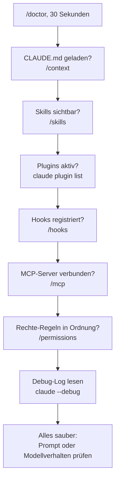

# S4.10 · Diagnose Schritt für Schritt

<!-- meta:start -->
> **Regal:** [Fehlersuche](README.md#troubleshooting) · **Stufe:** Kern · **~30 Min** · **Voraussetzungen:** [S4.9 Fehlersuche: /debug, --verbose, /doctor](s4-09-fehlersuche-werkzeuge.md) · [S2.8 Einen Hook einrichten, der wirklich blockt](s2-08-hook-einrichten.md)
>
> ← [S4.9 Fehlersuche: /debug, --verbose, /doctor](s4-09-fehlersuche-werkzeuge.md) · [Bibliothek](README.md) · [S4.11 Abschluss: ein kleiner Build](s4-11-abschluss-kleiner-build.md) →
<!-- meta:end -->

## Schnellcheck

- Hast du schon einmal einen Hook von Hand mit einer Eingabe im echten Format gefüttert (`echo '{…}' | python script.py`) und den Exit-Code geprüft?
- Kannst du ohne Nachschlagen sagen, in welcher Reihenfolge du vorgehst, wenn ein Skill installiert ist, aber nie ausgelöst wird?

## Auf einen Blick

Wenn etwas nicht greift, prüfst du zuerst die Einrichtung mit `/doctor`, dann die Schichten in fester Reihenfolge: CLAUDE.md, Skills, Plugins, Hooks, MCP, Rechte, schließlich das Debug-Log. Du fragst die Werkzeuge, was sie sehen, statt zu raten, und reparierst erst, wenn eine Schicht ihren Fehler zeigt. Bei Hooks zählt die Fehlerrichtung: Ein Schutz-Hook, der abstürzt, in einen Timeout läuft oder seinen Fehler verschluckt, blockt nicht, der Befehl läuft weiter. Der gefährlichste Fall ist der, der still bleibt: Nichts meldet einen Fehler, und der Wächter winkt alles durch.

Deshalb testest du einen Hook auch von Hand, mit einer Eingabe im echten Format: Nur Exit 2 blockt.

## Bild im Kopf

Eine Tür geht nicht auf. Der Techniker tauscht nicht zuerst den Leser, sondern macht den Selbsttest der Anlage und geht dann seine Liste in fester Reihenfolge durch: Programm der Zentrale, Leser, Zusatzmodule, Controller-Logik, Verbindung zur Leitstelle, Berechtigungsstufe. In Claude Code heißen die Stufen CLAUDE.md, Skills, Plugins, Hooks, MCP und Rechte.

Dazu kommt die Fehlerrichtung. Ein Türcontroller, der den Strom verliert, soll verriegeln (fail-secure). Hooks in Claude Code fallen bei Absturz und Timeout offen; das sichere Verhalten musst du selbst ins Skript einbauen.



## Im Detail

### Vier klassische Hook-Fehler

Hooks sind die Schicht, die am schnellsten falsch eingerichtet ist: ein Skript an einem Ereignis mit Matcher, und beide Seiten können falsch sein.

1. **Der Hook blockt alles.** Der Matcher ist zu breit, typischerweise `".*"` statt eines bestimmten Tools; dann feuert er bei jedem Aufruf.
2. **Das Skript läuft gar nicht.** Die Datei ist nicht ausführbar, die Shebang-Zeile fehlt oder der Pfad in `settings.json` stimmt nicht.
3. **Das Skript bricht ab, und dein Wächter steht offen.** Nur Exit-Code **2** blockt. Ein Syntaxfehler, ein fehlendes Programm (Exit 127) oder ein schlichtes `exit 1` gelten als Hook-Fehler, der *nicht* blockt: Im Transkript steht ein `hook error`, und der Aufruf **läuft weiter**. Die schlimmere Spielart meldet nicht einmal das: Ein Skript, das alle Fehler abfängt und mit `exit 0` endet, sieht für Claude Code aus wie ein Hook, der zugestimmt hat. Bau Wächter so, dass sie geschlossen fallen: Prüf die eigene Eingabe und ende mit `exit 2`, wenn du sie nicht lesen kannst ([S2.8](s2-08-hook-einrichten.md)).
4. **Das Skript hängt.** Ein `command`-Hook hat standardmäßig **600 Sekunden** Timeout (`timeout` am Handler, in Sekunden). Ein PreToolUse-Hook im Timeout blockt den Aufruf **nicht**.

### Einen Hook diagnostizieren

1. **`/hooks`** listet alle Hooks, die für die Sitzung registriert sind, nach Ereignis gruppiert. Steht dein Hook dort, ist die Registrierung in Ordnung; fehlt er, liest Claude Code ihn nicht ([S4.9](s4-09-fehlersuche-werkzeuge.md)).
2. **Spiel die Eingabe im echten Format von Hand ein.** Ein Hook bekommt das ganze Ereignis als JSON auf stdin; der Shell-Befehl steht in `tool_input.command`. Danach liest du den Exit-Code: 2 blockt, 0 lässt durch, alles andere ist ein Hook-Fehler (der Aufruf liefe weiter). Läuft das Skript von Hand durch und liefert 0, obwohl es blocken soll, liegt der Fehler im Skript, nicht in der Registrierung.
3. **Schau Claude Code beim Auswerten zu.** Starte mit `claude --debug-file <pfad>` (schaltet das Debug-Log ein und legt es an einen bekannten Ort; `claude --debug` schreibt nach `~/.claude/debug/<session-id>.txt`) und lös die Aktion aus. Das Log hält laut Doku jedes Hook-Ereignis fest, in der Form `Hook PostToolUse:Write (PostToolUse) success:` mit der Ausgabe des Hooks. Meldet es „success" bei leerer Ausgabe, hat der Hook aus Sicht von Claude Code zugestimmt. `Ctrl+O` öffnet die Transkript-Ansicht: Dort siehst du, ob der Hook geblockt oder einen `hook error` gemeldet hat.
4. **Mach verschluckte Fehler laut.** Findest du im Skript einen `try`/`except` oder ein `|| true`, der Fehler abfängt und mit 0 endet, lass ihn den Fehler zuerst ausgeben, bevor du etwas anderes ändest. Erst dann siehst du, was das Skript wirklich tut.

### „Mein Skill greift nicht"

`/skills` listet den Skill, aber Claude ruft ihn nie auf. Vier häufige Ursachen: eine **zu allgemeine Beschreibung**, `disable-model-invocation: true` im Frontmatter, ein **`paths`-Filter**, der gerade nicht passt, oder **kaputtes YAML** im Frontmatter (dann lädt Claude Code den Text mit leeren Metadaten; `/skill-name` geht noch, der automatische Abgleich nicht). Die Felder erklären [S2.2](s2-02-skill-schreiben.md) und [S2.3](s2-03-wer-skills-ausloest.md).

**Diagnose-Reihenfolge:**

1. **`/skills`:** Steht der Skill in der Liste? Wenn nicht, liegt er im falschen Ordner, etwa als `.claude/skills/name.md` statt als Ordner mit einer `SKILL.md`.
2. **Das Frontmatter ansehen** (`disable-model-invocation`, `paths`, Konkretheit der Beschreibung).
3. **Ausdrücklich auslösen:** *„Use the `<skill-name>` skill to …"*. Greift er jetzt, liegt es an einer vagen Beschreibung; sonst am Frontmatter oder am `paths`-Filter.
4. **`/debug`** mit einer Beschreibung des Problems, dann denselben Prompt noch einmal ([S4.9](s4-09-fehlersuche-werkzeuge.md)). `claude plugin validate <pfad>` findet `SKILL.md`-Dateien, deren Frontmatter sich nicht lesen lässt.

Wirkt ein Skill nach der Änderung wie die alte Fassung, hast du vermutlich eine andere Kopie bearbeitet, etwa im Benutzer- statt im Projekt-Ordner ([S2.5](s2-05-lebendige-prompts.md)).

### Plugins und MCP-Server

- **`claude plugin list`** zeigt jedes installierte Plugin mit Version, Scope und Status. **`claude plugin validate <path>`** prüft das Manifest gegen das Schema und die Pfade darin (der Befehl braucht einen Pfad, keinen Namen) und meldet einen fehlenden Pfad als `Path not found`. **`/reload-plugins`** lädt Plugins in der laufenden Sitzung neu. ([S2.11](s2-11-plugins-buendeln.md), [S2.12](s2-12-plugin-lebenszyklus.md))
- **`/mcp`** zeigt jeden eingerichteten Server mit Verbindungsstatus, ob du ihn für das Projekt freigegeben hast, und bei einem Fehler die Meldung des Servers. **`claude mcp get <name>`** zeigt die Einrichtung im Detail, bei einem Verbindungsfehler mit einer `Issue:`-Zeile. **`claude mcp reset-project-choices`** setzt deine Freigaben für die Server aus `.mcp.json` zurück. Klappt die Anmeldung nicht mehr (`401`), wählst du in `/mcp` beim Server **Re-authenticate** ([S2.15](s2-15-mcp-einrichten.md), [S2.16](s2-16-mcp-im-detail.md)).

### Die Diagnose-Checkliste

Wenn **irgendetwas** nicht tut, was es soll, gehst du so vor. Überspring keine Stufe.

0. **`/doctor`** (oder `claude doctor` im Terminal, wenn Claude Code gar nicht startet): Es findet Einstellungsdateien, die sich nicht lesen lassen, und anderes, was die Einrichtung stört, in 30 Sekunden.
1. **CLAUDE.md geladen?** `/context` zeigt, welche Gedächtnis-Dateien geladen sind (`/memory` öffnet sie).
2. **Skills sichtbar?** `/skills`
3. **Plugins aktiv?** `claude plugin list`
4. **Hooks registriert?** `/hooks`, bei einem Wächter zusätzlich der Handlauf mit echter Eingabe
5. **MCP-Server verbunden?** `/mcp`
6. **Rechte-Regeln in Ordnung?** `/permissions`
7. **Debug-Log lesen.** Starte mit `claude --debug` neu und lies das Log.

Bestehen alle Prüfungen und das Problem bleibt, liegt es an der **Form des Prompts** ([S1.13](s1-13-vager-und-praeziser-auftrag.md)) oder am **Verhalten des Modells**, nicht an der Konfiguration.

### Was du lassen solltest

- **Nicht zuerst neu installieren und nichts mit `--dangerously-skip-permissions` „reparieren".** Beides unterdrückt nur das Symptom oder wirft den Diagnose-Stand weg.
- **`.claude.json` und `.mcp.json` nicht als Erstes von Hand bearbeiten.** Beide sind geschützte Pfade ([S3.9](s3-09-geschuetzte-pfade-und-sandbox.md)); nimm `claude plugin` und `claude mcp`.

## Selbst machen

### Übung: ein Wächter, der still offen fällt (etwa 20 Minuten)

**Ziel:** Du findest in einem Wächter-Hook einen Fehler, der keine Meldung erzeugt, machst ihn sichtbar, reparierst ihn und belegst die Reparatur mit einem geblockten Befehl.

**Startzustand:** ein neuer Ordner `~/cc-workshop/waechter-defekt` mit zwei Dateien. Der Wächter ist ein kleines Python-Skript und blockt jeden Shell-Befehl, der die Datei `release.lock` erwähnt. Er hat einen eingebauten Fehler. Du brauchst nur Claude Code und Python; unter macOS und Linux schreib überall `python3`, wo hier `python` steht, auch in der `settings.json`. Nichts läuft danach weiter, an deiner globalen Konfiguration ändert sich nichts. Schreib die Dateien selbst mit einem Editor; `.claude` ist ein geschützter Pfad.

Bash:

```bash
mkdir -p ~/cc-workshop/waechter-defekt/.claude/hooks && cd ~/cc-workshop/waechter-defekt
```

PowerShell:

```powershell
New-Item -ItemType Directory -Force "$HOME\cc-workshop\waechter-defekt\.claude\hooks"; Set-Location "$HOME\cc-workshop\waechter-defekt"
```

`.claude/settings.json` (Exec-Form, ohne Quoting-Fallen):

```json
{
  "hooks": {
    "PreToolUse": [
      {
        "matcher": "Bash|PowerShell",
        "hooks": [
          {
            "type": "command",
            "command": "python",
            "args": ["${CLAUDE_PROJECT_DIR}/.claude/hooks/guard.py"]
          }
        ]
      }
    ]
  }
}
```

`.claude/hooks/guard.py`:

```python
# guard.py - PreToolUse hook: block shell commands that mention release.lock
import json
import re
import sys

BLOCKED = [r"release\.lock"]


def check(event):
    command = event["tool_input"]["cmd"]
    for pattern in BLOCKED:
        if re.search(pattern, command):
            print("GUARD: blocked, release.lock is protected", file=sys.stderr)
            return 2
    return 0


try:
    sys.exit(check(json.load(sys.stdin)))
except Exception:
    # never let the guard itself get in the way
    sys.exit(0)
```

1. **Reproduzieren.** Starte `claude --permission-mode default --debug-file debug.log`, bestätige den Vertrauensdialog und gib ein: `Run the shell command echo x > release.lock.` Bestätige eine Rückfrage zum Befehl mit „Yes". Erwartet: Der Befehl läuft, und im Transkript (`Ctrl+O`) steht kein `hook error`. Beende die Sitzung mit `/exit` und prüf, dass `release.lock` existiert (`ls release.lock`, in PowerShell `Test-Path release.lock`); lösch die Datei dann (`rm release.lock`, `Remove-Item release.lock`).
2. **Die Registrierung prüfen.** Starte `claude --permission-mode default`, gib `/hooks` ein und schließ die Ansicht mit `Esc`. Erwartet: Ein Eintrag steht unter PreToolUse, die Registrierung ist also in Ordnung. Beende die Sitzung.
3. **Von Hand mit echter Eingabe.** Spiel das Ereignis im Format ein, das Claude Code schickt. Bash:

   <!-- cockpit:example -->
   ```bash
   echo '{"hook_event_name":"PreToolUse","tool_name":"Bash","tool_input":{"command":"echo x > release.lock"}}' | python .claude/hooks/guard.py; echo "exit=$?"
   ```

   PowerShell:

   ```powershell
   '{"hook_event_name":"PreToolUse","tool_name":"Bash","tool_input":{"command":"echo x > release.lock"}}' | python .claude/hooks/guard.py; "exit=$LASTEXITCODE"
   ```

   Erwartet: keine Ausgabe und `exit=0`, obwohl der Befehl `release.lock` nennt: Der Wächter sagt leise „kein Einwand".
4. **Das Debug-Log lesen.** Such in `debug.log` (aus Schritt 1) die Zeilen zu deinem Hook: Bash `grep "Hook PreToolUse" debug.log`, PowerShell `Select-String "Hook PreToolUse" debug.log`. Erwartet: entweder Zeilen mit `Hook PreToolUse:Bash` oder `Hook PreToolUse:PowerShell` und dem Ergebnis `success` (so nennt es die Doku), oder gar keine Zeile zu deinem Hook (so in der interaktiven Sitzung des Probelaufs; in einem `-p`-Lauf stand die Zeile im Log). In beiden Fällen meldet das Log keinen Fehler: Aus Sicht von Claude Code hat der Hook zugestimmt. Das Log allein hätte dich hier nicht gewarnt; der Lauf von Hand aus Schritt 3 ist das verlässlichere Werkzeug.
5. **Den verschluckten Fehler laut machen.** Ersetz im Skript im `except`-Block die Zeile `sys.exit(0)` durch diese zwei Zeilen und lauf Schritt 3 noch einmal:

   ```python
       import traceback; traceback.print_exc()
       sys.exit(0)
   ```

   Erwartet: eine Python-Fehlermeldung, die auf `KeyError: 'cmd'` endet, danach weiter `exit=0`. Das Skript sucht das Feld `cmd`; im Ereignis heißt es `command`.
6. **Reparieren, geschlossen.** Mach zwei Änderungen. Das Feld heißt `command`. Und der `except`-Block fällt geschlossen: Er schreibt die Meldung `GUARD: could not check the command, blocking to stay safe` mit `print(..., file=sys.stderr)` und endet mit `sys.exit(2)`. Lauf die Handtests: Schritt 3 soll jetzt die Meldung `GUARD: blocked, release.lock is protected` und `exit=2` zeigen. Wiederhol ihn mit `echo hi` (Erwartet: keine Ausgabe, `exit=0`) und mit dem Text `not json` als Eingabe (Erwartet: deine Meldung, `exit=2`).
7. **Mit einem geblockten Befehl belegen.** Starte `claude --permission-mode default` und gib den Auftrag aus Schritt 1 noch einmal ein. Erwartet: Claude meldet, dass der Befehl geblockt wurde, und nennt `GUARD: blocked, release.lock is protected`; es gab keine Rückfrage zum Befehl, und `release.lock` existiert nicht. Weicht Claude auf ein anderes Werkzeug aus und fragt nach einer Dateiänderung, lehne mit „No" ab. Beende die Sitzung.

**Aufräumen:** Es läuft nichts weiter. Lösch den Ordner `~/cc-workshop/waechter-defekt` selbst; mit ihm sind Hook und Log weg. Das Debug-Log lag im Ordner (`debug.log`).

**Geschafft, wenn:**

- [ ] der Befehl mit `release.lock` vor der Reparatur lief, ohne dass ein `hook error` erschien
- [ ] `/hooks` den Eintrag unter PreToolUse zeigte und der Handtest trotzdem `exit=0` lieferte
- [ ] du den `KeyError: 'cmd'` sichtbar gemacht hast
- [ ] nach der Reparatur der Handtest `exit=2` für `release.lock` und für `not json` lieferte, `exit=0` für `echo hi`
- [ ] der Befehl in der Sitzung geblockt wurde und `release.lock` nicht existierte

## Typische Fallen

- **Der Wächter ist still offen, und alles sieht ruhig aus.** Ein abgestürzter Schutz-Hook meldet nur einen `hook error`, ein hängender wird nach dem Timeout abgebrochen, ein Skript mit verschlucktem Fehler meldet gar nichts; in allen Fällen läuft der Befehl. Prüf nach jeder Änderung auch den Fall, der blocken soll.
- **Den Matcher in Rechte-Regel-Syntax schreiben.** `"matcher": "Bash(rm *)"` wird als Regex gelesen und trifft nie; das gehört ins Feld `if` ([S2.8](s2-08-hook-einrichten.md)).
- **Im Eingabe-JSON das falsche Feld lesen.** Der Tool-Name steht in `tool_name`, der Shell-Befehl in `tool_input.command`.

## Check

Du kannst die Diagnose-Checkliste in der richtigen Reihenfolge durchgehen, für die klassischen Hook-Fehler die Abhilfe nennen und einen Hook mit einer Eingabe im echten Format von Hand testen.

1. Warum ist ein Schutz-Hook, der seine Fehler verschluckt und mit 0 endet, gefährlicher als einer, der alles blockt?
2. In welcher Reihenfolge prüfst du, wenn ein Skill installiert ist, aber nie ausgelöst wird?
3. Was gehört in den `matcher`, was ins Feld `if`?

<details><summary>Auflösung</summary>

1. Er blockt nichts und meldet nichts: Claude Code wertet Exit 0 als Zustimmung, und der Wächter wirkt eingerichtet, obwohl alles durchläuft. Ein Hook, der alles blockt, fällt sofort auf.
2. `/skills`, dann das Frontmatter, dann ausdrücklich auslösen, dann `/debug` mit demselben Prompt.
3. In den `matcher` kommt der Tool-Name (oder eine Liste mit `|`), etwa `"Bash|PowerShell"`; die Rechte-Regel-Syntax wie `Bash(git *)` gehört ins Feld `if`.

</details>

<details><summary>Quizfrage</summary>

**Frage:** Dein Wächter steht in `/hooks`, im Transkript erscheint kein `hook error`, aber ein Befehl, den er blocken soll, läuft durch. Von Hand liefert das Skript mit echter Eingabe `exit=0` ohne Ausgabe. Was ist der nächste Diagnoseschritt?

- **Richtig:** Im Skript einen abgefangenen Fehler suchen, ihn sichtbar machen und den Handler geschlossen fallen lassen (`exit 2`).
- Falsch: Den Matcher auf `".*"` erweitern, damit der Hook bei jedem Tool feuert und so keinen einzigen Aufruf mehr verpasst.
- Falsch: Den `timeout` des Hooks verlängern, weil ein zu kurzer Timeout das Urteil des Skripts abschneidet und sonst alles durchläuft.
- Falsch: Den Hook löschen und neu anlegen, weil ein Hook, der in `/hooks` steht und doch nichts blockt, auf eine beschädigte Installation hindeutet.

</details>

## Weiterlesen

- [Konfiguration debuggen](https://code.claude.com/docs/en/debug-your-config)
- [Hooks-Referenz: Hooks debuggen](https://code.claude.com/docs/en/hooks#debug-hooks)
- [Hooks-Leitfaden: Grenzen und Fehlersuche](https://code.claude.com/docs/en/hooks-guide#limitations-and-troubleshooting)
- [Skills: wenn ein Skill nicht greift](https://code.claude.com/docs/en/skills#skill-not-triggering)
- [S4.9 · Fehlersuche: /debug, --verbose, /doctor](s4-09-fehlersuche-werkzeuge.md)
- [S2.8 · Einen Hook einrichten, der wirklich blockt](s2-08-hook-einrichten.md)
- [S2.7 · Die wichtigsten Hook-Ereignisse](s2-07-hook-ereignisse.md)
- [S2.3 · Skills oder Commands, und wer sie auslösen darf](s2-03-wer-skills-ausloest.md)
- [S2.11 · Plugins: ein Bündel schnüren](s2-11-plugins-buendeln.md)
- [S2.15 · MCP einrichten: Transporte, Scopes, CLI](s2-15-mcp-einrichten.md)
- [S1.11 · Alle Gedächtnis-Ebenen im Überblick](s1-11-gedaechtnis-ebenen.md)
- [S3.9 · Geschützte Pfade und Sandbox-Stufen](s3-09-geschuetzte-pfade-und-sandbox.md)
- Demo-Datei: [`broken-greeter/SKILL.md`](../demos/assets/broken-greeter/SKILL.md)
