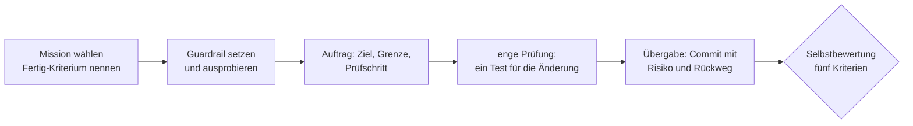

# S4.11 · Abschluss: ein kleiner Build

<!-- meta:start -->
> **Regal:** [Abschlussprojekt](README.md#capstone) · **Stufe:** Kern · **~30 Min** · **Voraussetzungen:** [S1.5 Rechte im Alltag: default und acceptEdits](s1-05-rechte-im-alltag.md) · [S1.13 Vager und präziser Auftrag im Vergleich](s1-13-vager-und-praeziser-auftrag.md) · [S1.16 Git in einem Fluss: Branch, Commit, PR](s1-16-git-in-einem-fluss.md)
>
> ← [S4.10 Diagnose Schritt für Schritt](s4-10-diagnose-schritt-fuer-schritt.md) · [Bibliothek](README.md)
<!-- meta:end -->

## Schnellcheck

- Hast du schon einmal mit Claude Code eine Änderung geliefert, zu der ein Test gehörte, der genau diese Änderung prüft?
- Hast du dabei eine Deny-Regel gesetzt und ausprobiert, ob sie hält?

## Auf einen Blick

Am Ende deines Pfads setzt du zusammen, was du gelernt hast: einen präzisen Auftrag, eine Rechte-Regel und einen Commit auf einem eigenen Branch. In etwa 20 Minuten lieferst du im Playground eine kleine Änderung mit vier Ergebnissen: der Änderung selbst, einem Guardrail, einer engen Prüfung und einer Übergabe. Danach bewertest du dich selbst an fünf Kriterien.

Der Ablauf ist absichtlich klein. Du sollst ihn morgen im eigenen Repository wiederholen können.

## Bild im Kopf

Bevor eine neue Tür in Betrieb geht, gibt es eine Abnahme mit vier Unterschriften. Die Tür tut, was bestellt wurde. Die Sperre ist nicht nur eingebaut, jemand hat an der Klinke gerüttelt. Im Prüfprotokoll steht, was getestet wurde und was nicht. Und im Übergabeprotokoll steht, was schiefgehen kann und wie man zurückbaut.



## Im Detail

### Die vier Ergebnisse

1. **Eine Änderung**, die genau ein Verhalten ändert. Du beschreibst sie mit Ziel, Grenze und Prüfschritt ([S1.13](s1-13-vager-und-praeziser-auftrag.md)).
2. **Ein Guardrail**: eine Deny-Regel im Projekt ([S1.5](s1-05-rechte-im-alltag.md)), die zu dieser Arbeit passt. Sie zählt erst, wenn du gesehen hast, dass sie ablehnt.
3. **Eine enge Prüfung**: ein Test, der genau das neue Verhalten trifft. Dass die ganze Suite grün ist, zeigt nur, dass nichts anderes kaputtging.
4. **Eine Übergabe**: ein Commit auf einem eigenen Branch ([S1.16](s1-16-git-in-einem-fluss.md)), dessen Nachricht Prüfung, Risiko und Rückweg nennt.

### Drei Missionen zur Wahl

Alle drei betreffen `access_control.py` im Playground, das kleine Programm, das eine Zutrittsliste führt.

| Mission | Heute | Danach | Ein Test, der es zeigt |
|---|---|---|---|
| A · Leere Namen abweisen | `add_user` nimmt auch einen leeren Namen oder nur Leerzeichen an | solche Namen werden abgelehnt, die Liste bleibt unverändert | `add_user("  ")` gibt `False` zurück, `list_users()` ist danach leer |
| B · Groß- und Kleinschreibung | „Alice“ und „alice“ gelten als zwei Personen | Namen werden ohne Rücksicht auf Groß- und Kleinschreibung verglichen | nach `add_user("Alice")` gibt `check_access("alice")` `True` zurück |
| C · Sortierte Liste | `list_users()` liefert die Namen in der Reihenfolge des Anlegens | die Liste kommt alphabetisch sortiert | nach `add_user("b")` und `add_user("a")` liefert `list_users()` `["a", "b"]` |

Eine eigene Mission geht auch, wenn sie ein einzelnes Verhalten ändert und sich mit einem Test zeigen lässt.

### Der Guardrail

Die Übergabe ist hier ein lokaler Commit. Nichts soll deinen Rechner verlassen, ohne dass du es selbst tust. Diese Regel sperrt den Push, für Bash und für PowerShell:

```json
{
  "permissions": {
    "deny": ["Bash(git push *)", "PowerShell(git push *)"]
  }
}
```

Wie jede Bash-Regel prüft sie den Befehlstext: `git push origin main` trifft sie, `git -C . push origin main` nicht. Für diese Übung reicht das. Die Datei gehört mit in den Commit: Wer den Branch übernimmt, übernimmt die Regel. Wer Hooks schon kennt ([S2.8](s2-08-hook-einrichten.md)), kann stattdessen einen Hook nehmen.

### Die Übergabe

Die Commit-Nachricht folgt dieser Vorlage. Nutzt du GitHub, wird derselbe Text zur Beschreibung des Pull Requests.

```text
<one line: what changed>

What: <behaviour before and after, one or two sentences>
Verified: <exact command> -> <result>. Proves: <...>. Does not prove: <...>.
Risk: <what could break, and for whom>
Rollback: git revert <this commit>
Guardrail: <the permission rule in .claude/settings.json, and which command you saw it refuse>
```

## Selbst machen

### Übung: der kleine Build (etwa 20 Minuten)

**Ziel:** Du lieferst eine der drei Missionen mit allen vier Ergebnissen und bewertest dich danach selbst.

**Startzustand:** Das Workshop-Repo liegt unter `~/cc-workshop/dynamic-workshop`, und die Tests des Playgrounds sind grün; beides richtest du nach der Karte [Werkstatt erweitern](../reference/werkstatt-erweitern.md#workshop-repo-und-playground) ein. Du arbeitest auf einem eigenen Branch:

```bash
cd ~/cc-workshop/dynamic-workshop/workshop-playground
source .venv/bin/activate   # macOS / Linux, if you set up the virtual environment from the card
git switch -c abschluss
python -m pytest -q         # 18 passed
```

1. **Mission und Fertig-Kriterium (2 Minuten).** Wähl eine Mission und schreib dir einen Satz auf: Woran sehe ich, dass sie fertig ist?
2. **Guardrail setzen und ausprobieren (4 Minuten).** Leg im Ordner `workshop-playground` die Datei `.claude/settings.json` mit der Regel aus „Der Guardrail“ an. Starte dann `claude --permission-mode default` und gib den Auftrag `Push this branch to origin.` Erwartet: Claude Code lehnt den Befehl ab. Erst jetzt weißt du, dass die Regel hält.
3. **Auftrag geben (8 Minuten).** Formuliere Ziel, Grenze und Prüfschritt. Für Mission A etwa so:

<!-- cockpit:example -->
```text
In access_control.py, make add_user reject empty or whitespace-only usernames: return False and leave the database unchanged.
Change only add_user. Do not touch other functions or existing tests.
Add one test to test_access_control.py that proves the new behaviour, then run only that test.
```

   Lies jeden Vorschlag, bevor du ihn freigibst. Ändert Claude mehr als bestellt, lehn ab und sag, was zu viel ist.

4. **Eng prüfen (2 Minuten).** Lass erst nur den neuen Test laufen, dann die ganze Suite: `Run only the new test, then the whole suite.` Notier einen Satz: Was beweist der neue Test, und was beweist er nicht?
5. **Übergeben (4 Minuten).** Lass Claude committen und gib die Vorlage aus „Die Übergabe“ mit: `Commit all changes on this branch, including .claude/settings.json. Use this message template and fill it in from what we did:`, gefolgt von der Vorlage. Claude fragt dabei mehrmals nach (Stand ansehen, Dateien vormerken, committen). Lies die Nachricht in der letzten Rückfrage, bevor du freigibst, und lass korrigieren, was nicht stimmt.

**Geschafft, wenn:**

- [ ] der Push abgelehnt wurde, bevor du den Auftrag gegeben hast
- [ ] der neue Test allein grün ist und die ganze Suite auch
- [ ] `git log -1 --stat` auf dem Branch `abschluss` drei Dateien und eine Nachricht mit Verified, Risk, Rollback und Guardrail zeigt
- [ ] du in der Selbstbewertung alle fünf Kriterien erfüllst oder weißt, welchen Schritt du wiederholst

### Selbstbewertung

| Kriterium | Erfüllt, wenn … | Beispiel für „erfüllt“ |
|---|---|---|
| Auftrag | Ziel, Grenze und Prüfschritt standen im Auftrag, bevor Claude etwas geändert hat | „reject empty … usernames“, „Change only add_user“, „Add one test … run only that test“ |
| Änderung | genau das bestellte Verhalten, keine Nebenänderungen | der Commit enthält `access_control.py`, die Testdatei und `.claude/settings.json`, sonst nichts |
| Guardrail | die Regel liegt im Commit, und du hast gesehen, dass sie ablehnt | „I saw it refuse `git push -u origin abschluss`“ steht in der Nachricht, und du hast es selbst gesehen |
| Prüfung | ein Test trifft genau die Änderung, und du kannst sagen, was er nicht beweist | „beweist: leere Namen werden abgelehnt; beweist nicht: Namen mit Sonderzeichen“ |
| Übergabe | Commit auf eigenem Branch; die Nachricht nennt Prüfung, Risiko und Rückweg | „Risk: callers that relied on empty names now get False. Rollback: git revert <commit>“ |

Fehlt eines der fünf, wiederhol nur diesen Schritt. Fehlen Guardrail oder Prüfung, ist der Build nicht fertig, auch wenn die Änderung funktioniert.

### Extra: derselbe Ablauf im eigenen Projekt (etwa 30 Minuten)

Nimm ein Repository, an dem du wirklich arbeitest, und eine Änderung, die du ohnehin vorhast. Gleicher Ablauf, gleiche fünf Kriterien. Die Regel für den Guardrail wählst du passend zu deinem Projekt: Was darf bei dieser Arbeit auf keinen Fall passieren?

## Typische Fallen

- **Die ganze Suite als Beleg nehmen.** Grüne alte Tests zeigen, dass nichts kaputtging. Dass das neue Verhalten stimmt, zeigt nur ein Test, der es trifft.
- **Den Guardrail aufschreiben, aber nicht ausprobieren.** Ein Tippfehler in der Regel, und sie greift nie. Du merkst es erst, wenn du den verbotenen Befehl wirklich verlangst.
- **Auf `main` arbeiten.** Der Stand auf `main` ist das Übungsmaterial des Playgrounds. Prüf vor dem ersten Auftrag mit `git branch --show-current`, dass du auf `abschluss` bist.
- **Die Übergabe ungelesen freigeben.** Claude füllt die Vorlage aus dem Gespräch. Steht unter „Guardrail“ etwas anderes als deine Regel, etwa die fachliche Regel der Änderung, oder fehlt die Settings-Datei im Commit, lass es korrigieren, bevor du freigibst.
- **Den Auftrag zu groß schneiden.** „Räum die Benutzerverwaltung auf“ lässt sich nicht mit einem Test zeigen. Eine Mission, ein Verhalten, ein Test.

## Check

Du kannst eine kleine Änderung mit Claude Code allein liefern und an fünf Kriterien selbst beurteilen, ob sie fertig ist.

1. Welche vier Ergebnisse gehören zu deinem Build?
2. Wann zählt ein Guardrail als erfüllt?
3. Warum reicht es nicht, dass die ganze Testsuite grün ist?

<details><summary>Auflösung</summary>

1. Eine Änderung, die genau ein Verhalten ändert, ein Guardrail, eine enge Prüfung und eine Übergabe: ein Commit auf einem eigenen Branch, dessen Nachricht Prüfung, Risiko und Rückweg nennt.
2. Wenn die Regel im Projekt liegt und du gesehen hast, dass sie ablehnt. Eine Regel, die nur aufgeschrieben ist, kann wegen eines Tippfehlers nie greifen.
3. Grüne alte Tests zeigen nur, dass nichts anderes kaputtging. Das neue Verhalten belegt erst ein Test, der genau diese Änderung trifft.

</details>

<details><summary>Quizfrage</summary>

**Frage:** Du hast Mission A umgesetzt. Alle 18 alten Tests sind grün, einen neuen Test hast du nicht geschrieben. Was kannst du über deine Änderung sagen?

- **Richtig:** Nur, dass nichts anderes kaputtging; ob leere Namen jetzt abgelehnt werden, hat kein Test geprüft.
- Falsch: Dass sie stimmt; die Suite deckt `add_user` ab, also prüft sie auch das neue Verhalten mit.
- Falsch: Nichts; grüne Tests sagen bei einer von Claude geschriebenen Änderung grundsätzlich nichts aus.
- Falsch: Dass sie stimmt, sobald Claude im Gespräch bestätigt, den Fall mit leeren Namen bedacht zu haben.

</details>

## Weiterlesen

- [Best Practices: Claude die eigene Arbeit prüfen lassen](https://code.claude.com/docs/en/best-practices)
- [Rechte-Regeln (offizielle Doku)](https://code.claude.com/docs/en/permissions)
- [S1.5 · Rechte im Alltag: default und acceptEdits](s1-05-rechte-im-alltag.md)
- [S1.13 · Vager und präziser Auftrag im Vergleich](s1-13-vager-und-praeziser-auftrag.md)
- [S1.16 · Git in einem Fluss: Branch, Commit, PR](s1-16-git-in-einem-fluss.md)
- [S4.8 · Abschlussprojekt mit Bewertung](s4-08-abschlussprojekt.md), die große Fassung mit Agenten, Hooks und Rubrik
- [Lösungen zum Playground](../reference/playground-loesungen.md), falls du danach eine der eingebauten Schwachstellen auf deinem Branch beheben willst
