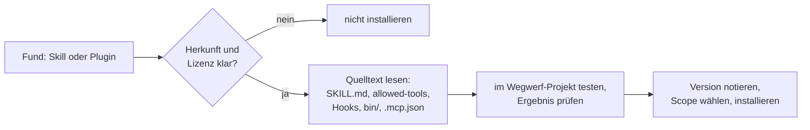

# X.1 · Community-Skills: wer baut was, das wirklich hilft

<!-- meta:start -->
> **Regal:** [Community & Lernen](README.md#community) · **Stufe:** Kür · **~30 Min** · **Voraussetzungen:** keine
>
> ← [S2.20 Praxis-Station Session 2: alles in einem Ablauf](s2-20-praxis-station-2.md) · [Bibliothek](README.md) · [S3.1 Was ist ein Agent? Spezialisierung statt Allrounder](s3-01-was-ist-ein-agent.md) →
<!-- meta:end -->

## Auf einen Blick

Vier Quellen für fremde Skills sind hier belegt: Matt Pocock (`mattpocock/skills`), Jesse Vincent (`obra/superpowers`), Anthropic (`anthropics/skills` und der offizielle Marketplace `anthropics/claude-plugins-official`) und Garry Tan (`garrytan/gstack`). Jede Sammlung bringt eine eigene Arbeitsweise mit, und die Lizenzen sind verschieden. Ein fremder Skill ist fremder Text in Claudes Kontext, ein fremdes Plugin ist fremder Code mit deinen Rechten: Lies beides, bevor du es installierst.

Zu jeder Sammlung findest du Skills, Lizenz, Installationsweg und Vorbehalte, Stand 30.09.2026. Mit der Prüfliste unter „Selbst machen“ bewertest du jeden weiteren Fund selbst. Was ein Plugin auf deinem Rechner tun kann, steht in [S2.13](s2-13-plugin-lieferkette.md). Was ein Marketplace und ein Scope sind, steht in [S2.12](s2-12-plugin-lebenszyklus.md); hier genügt: Ein **Marketplace** ist ein Katalog von Plugins, installiert wird mit `<plugin>@<marketplace>`, und einen Skill aus einem Plugin rufst du mit Präfix auf, als `/plugin-name:skill-name`.

## Bild im Kopf

Ein anderer Wachdienst bietet dir seine bewährten Dienstanweisungen an: Alarmverfolgung, Schlüsselübergabe, Revierfahrt. Eine gute Vorlage spart dir Wochen. Trotzdem kommt keine fremde Dienstanweisung ungelesen in den Ordner der Leitstelle. Du prüfst, wer sie geschrieben hat, ob du sie verwenden darfst, welche Befugnisse sie verlangt und wen sie im Ernstfall anruft. Ein Skill ist so eine Dienstanweisung.

Manche Anweisungen kommen als ganzes Paket mit eigener Verkabelung. Das ist ein Plugin mit Hooks, Programmen und MCP-Servern. So ein Paket prüfst du wie ein fremdes Gerät: erst lesen, dann auf dem Prüfstand testen, dann einbauen.



## Im Detail

### So liest du die Einträge

Jeder Eintrag ist an drei Stellen geprüft: am Repository selbst, an seiner LICENSE-Datei und an README oder Manifest (`plugin.json`, `marketplace.json`). Sternzahlen stehen hier bewusst nicht; sie sagen nichts darüber, ob ein Skill zu deiner Arbeit passt. Die Sammlungen ändern sich oft, auch die Namen einzelner Skills. Prüf vor der Installation, ob ein genannter Skill noch so heißt.

| Wer | Repo | Lizenz | Installation in Claude Code |
|---|---|---|---|
| Matt Pocock | `mattpocock/skills` | MIT | `/plugin install mattpocock-skills@claude-plugins-official` |
| Jesse Vincent | `obra/superpowers` | MIT | `/plugin install superpowers@claude-plugins-official` |
| Anthropic | `anthropics/skills` | je Skill: Apache-2.0 oder source-available | `/plugin marketplace add anthropics/skills`, dann `document-skills` oder `example-skills` |
| Anthropic | `anthropics/claude-plugins-official` | Apache-2.0 für das Verzeichnis, Plugins mit eigener Lizenz | richtet Claude Code selbst ein; `/plugin install <name>@claude-plugins-official` |
| Garry Tan | `garrytan/gstack` | MIT | Klon plus `./setup` laut README; vorher lesen, was das Setup einträgt |

### Matt Pocock: `mattpocock/skills`

**Was es ist:** eine Sammlung kleiner Skills für die tägliche Entwicklungsarbeit, gedacht zum Umbauen. Das README nennt sie „small, easy to adapt, and composable“. Sie eignet sich, um einen Plan zu schärfen, bevor Code entsteht, test-first zu arbeiten und mit einem Agenten zu lernen.

**Drei Skills:**

- `grill-with-docs`: ein hartnäckiges Interview, das einen Plan oder Entwurf schärft und nebenbei Architektur-Entscheidungen (ADRs) und ein Glossar anlegt.
- `tdd`: test-first entwickeln im Red-Green-Zyklus, mit Regeln dafür, was einen Test wertvoll macht.
- `teach`: Lernbegleitung über mehrere Sitzungen, deren Bausteine [X.2](x-02-lernen-mit-claude-code.md) vorstellt.

**Lizenz:** MIT. Die `LICENSE` beginnt mit „MIT License, Copyright (c) 2026 Matt Pocock“, `plugin.json` nennt `"license": "MIT"`.

**Installation:** Das Plugin `mattpocock-skills` steht im offiziellen Marketplace:

```text
/plugin install mattpocock-skills@claude-plugins-official
```

Danach laut README einmal je Repo den Einrichtungs-Skill ausführen, als Plugin-Skill `/mattpocock-skills:setup-matt-pocock-skills`. Der Skill fragt nach deinem Issue-Tracker, deinen Triage-Labels und dem Ablageort für Dokumente.

**Vorbehalte:**

- Das Plugin bringt alle Skills der Sammlung auf einmal mit, nicht nur die, die du brauchst. `claude --plugin-dir <ordner> plugin details mattpocock-skills` zeigt dir die Liste vor der Installation (Übung unten).
- Aus dem offiziellen Marketplace aktualisiert Claude Code das Plugin standardmäßig automatisch. Der Eintrag dort legt per `sha` einen bestimmten Commit fest und kann deshalb hinter dem neuesten Stand im Repo liegen. Das Repo bringt zusätzlich einen eigenen Marketplace mit (`.claude-plugin/marketplace.json`, Name `mattpocock`): `claude plugin marketplace add mattpocock/skills`, dann `claude plugin install mattpocock-skills@mattpocock`. Das README beschreibt diesen Weg in der Fassung vom 30.09.2026 nicht mehr; er funktioniert, weil die Datei im Repo liegt.
- Einige Skills, etwa `grill-with-docs` und `teach`, setzen `disable-model-invocation: true`: Claude startet sie nicht von selbst, du rufst sie auf ([S2.3](s2-03-wer-skills-ausloest.md)).

### Jesse Vincent: `obra/superpowers`

**Was es ist:** laut README eine vollständige Entwicklungsmethodik für Coding-Agenten, gebaut aus kombinierbaren Skills und Startanweisungen, die dafür sorgen, dass der Agent die Skills auch nutzt. Der Ablauf: erst das Design im Gespräch klären, dann ein Worktree, ein Plan in kleinen Schritten, die Umsetzung mit Subagenten oder im selben Kontext, test-first, Reviews zwischen den Aufgaben und am Ende die Entscheidung über den Branch. Sie passt, wenn du einen festen, prüfbaren Ablauf von der Idee bis zum Merge willst ([S3.4](s3-04-orchestrierungsmuster.md), [S3.6](s3-06-devils-advocate.md)).

**Drei Skills:**

- `brainstorming`: klärt vor kreativer Arbeit Absicht, Anforderungen und Design, bevor etwas gebaut wird.
- `systematic-debugging`: bei einem Bug oder roten Test erst die Ursache finden, dann einen Fix vorschlagen.
- `verification-before-completion`: Prüfbefehle laufen lassen und die Ausgabe lesen, bevor Erfolg gemeldet wird („evidence before assertions always“).

**Lizenz:** MIT. Die `LICENSE` beginnt mit „MIT License, Copyright (c) 2025 Jesse Vincent“.

**Installation:** aus dem offiziellen Marketplace:

```text
/plugin install superpowers@claude-plugins-official
```

Alternativ über den eigenen Marketplace des Projekts: `/plugin marketplace add obra/superpowers-marketplace`, dann `/plugin install superpowers@superpowers-marketplace`.

**Vorbehalte:**

- Das Plugin bringt einen `SessionStart`-Hook mit (Matcher `startup|clear|compact`). Der Hook lädt den ganzen Skill `using-superpowers` in jede neue, geleerte oder verdichtete Sitzung. Dieser Skill verlangt: „If you think there is even a 1% chance a skill might apply to what you are doing, you ABSOLUTELY MUST invoke the skill.“ Bei kleinen Aufgaben ist das viel Ablauf; setz die Sammlung gezielt ein.
- Die optionale visuelle Begleitung von `brainstorming` lädt laut README ein Logo von der Website des Projekts, samt Versionsnummer. Abschalten kannst du das mit der Umgebungsvariable `SUPERPOWERS_DISABLE_TELEMETRY`; `DISABLE_TELEMETRY` und `CLAUDE_CODE_DISABLE_NONESSENTIAL_TRAFFIC` werden ebenfalls beachtet.

### Anthropic: `anthropics/skills` und der offizielle Marketplace

**Was es ist:** zwei Repos. `anthropics/skills` enthält Beispiel-Skills, die zeigen, was mit Skills möglich ist, dazu die Dokument-Skills, auf denen Claudes Dokumentfunktionen beruhen, die Spezifikation der Agent Skills und eine Vorlage. `anthropics/claude-plugins-official` ist der offizielle Marketplace `claude-plugins-official`. Claude Code fügt ihn beim ersten Start einer interaktiven Terminal-Sitzung selbst hinzu. Das meiste darin stammt laut Doku von Partnern und anderen Autoren; auch `superpowers` und `mattpocock-skills` stehen dort. Die Sammlung dient als Muster und Vorlage für eigene Skills, zum Messen von Skills und zum Bearbeiten von Office- und PDF-Dateien.

**Drei Skills:**

- `skill-creator`: Skills anlegen, verbessern und mit Evals messen, jeweils mit und ohne Skill ([S2.2](s2-02-skill-schreiben.md)).
- `mcp-builder`: Anleitung für den Bau eines MCP-Servers, in Python oder TypeScript ([S2.17](s2-17-mcp-sicherheit.md)).
- `pdf` aus den Dokument-Skills (daneben `docx`, `pptx`, `xlsx`): PDF-Dateien lesen, erzeugen, zusammenführen und Formulare ausfüllen.

**Lizenz:** gemischt, und zwar je Skill. Im Wurzelverzeichnis von `anthropics/skills` liegt keine LICENSE-Datei; jeder Skill trägt eine eigene `LICENSE.txt`. `skill-creator` und `mcp-builder` stehen unter Apache-2.0. Die Dokument-Skills sind laut README „source-available, not open source“; ihre `LICENSE.txt` beginnt mit „© 2025 Anthropic, PBC. All rights reserved.“ Das Repo des Marketplace `claude-plugins-official` steht unter Apache-2.0; für die Plugins darin gilt das nicht automatisch. Das README verweist für die Lizenz auf jedes einzelne Plugin: „Please see each linked plugin for the relevant LICENSE file.“

**Installation:** `anthropics/skills` fügst du als Marketplace hinzu, er heißt danach `anthropic-agent-skills`:

```text
/plugin marketplace add anthropics/skills
/plugin install document-skills@anthropic-agent-skills
/plugin install example-skills@anthropic-agent-skills
```

`skill-creator` gibt es laut Skills-Doku auch im offiziellen Marketplace: `/plugin install skill-creator@claude-plugins-official`.

**Vorbehalte:**

- Das README sagt, die Skills seien „for demonstration and educational purposes only“, und rät: „Always test skills thoroughly in your own environment before relying on them for critical tasks.“
- Die Dokument-Skills kopierst oder verteilst du nicht einfach weiter; lies vorher ihre `LICENSE.txt`.
- `claude-plugins-official` und `anthropic-agent-skills` gehören zu den offiziellen Marketplace-Namen. Dort ist Auto-Update standardmäßig an. Der Name sagt, wer den Katalog herausgibt, nicht, was ein einzelnes Plugin darin tut ([S2.13](s2-13-plugin-lieferkette.md)).

### Garry Tan: `garrytan/gstack`

**Was es ist:** laut README ein Prozess, keine lose Werkzeugsammlung. Die Skills sind Slash-Commands in der Reihenfolge eines Sprints: „Think → Plan → Build → Review → Test → Ship → Reflect“. Jeder Schritt liest, was der vorige geschrieben hat. Der Ansatz heißt: erst denken, dann bauen. Du prüfst, ob und was du überhaupt bauen solltest, bevor ein Plan entsteht.

**Drei Skills:**

- `/office-hours`: sechs Leitfragen („forcing questions“), die ein Produkt vor dem ersten Code neu einordnen; hinterfragt Annahmen, schlägt Alternativen vor und schreibt ein Design-Dokument.
- `/plan-ceo-review`: prüft einen Plan auf das eigentliche Problem, in vier Modi (Expansion, Selective Expansion, Hold Scope, Reduction).
- `/investigate`: systematische Ursachensuche nach der Regel „no fixes without investigation“.

**Lizenz:** MIT. Die `LICENSE` beginnt mit „MIT License, Copyright (c) 2026 Garry Tan“.

**Installation:** Laut README klonst du das Repo nach `~/.claude/skills/gstack` und startest dort `./setup`. Voraussetzungen sind Git und Bun, unter Windows zusätzlich Node.js. Das ist keine Übung: Der Befehl ändert deine globale Konfiguration. Lies zuerst die Vorbehalte:

```bash
git clone --single-branch --depth 1 https://github.com/garrytan/gstack.git ~/.claude/skills/gstack && cd ~/.claude/skills/gstack && ./setup
```

**Vorbehalte:**

- Die Vollinstallation bringt viel mit. `./setup` trägt laut README einen standardmäßig aktiven `Stop`-Hook (`gstack-timeline-stop`) in `~/.claude/settings.json` ein. Die Installationsanweisung im README lässt Claude außerdem einen gstack-Abschnitt in deine `CLAUDE.md` schreiben, unter anderem mit der Regel, die `mcp__claude-in-chrome__*`-Tools nie zu nutzen. Im Team-Modus prüft jede Sitzung beim Start, ob es ein Update gibt.
- Die Skills hängen an der Installation. `office-hours` weist Claude an, zuerst ein Hilfsprogramm aus `~/.claude/skills/gstack/bin/` auszuführen, und gibt sich per `allowed-tools` unter anderem `Bash`, `Write` und `Edit` frei. Einen einzelnen Skill ohne `./setup` zu übernehmen heißt deshalb: lesen, anpassen und den MIT-Lizenzhinweis mitnehmen.
- Das README enthält Produktivitätsangaben von Garry Tan über die eigene Arbeit. Das sind Selbstauskünfte, keine geprüften Messungen.

### Was ein fremder Skill darf

Ein Skill ist zunächst Text: Seine Anweisungen landen in Claudes Kontext und steuern, was Claude mit seinen Werkzeugen tut. Zwei Stellen im Skill machen daraus mehr:

- **`allowed-tools`** im Frontmatter gibt die genannten Tools in dem Zug, der den Skill aufruft, ohne Rückfrage frei. Die Skills-Doku warnt: „A skill can grant itself broad tool access“. Das gilt auch für Projekt-Skills in einem Repo, dem du noch nie vertraut hast.
- **`` !`<command>` ``** im Skill-Text führt einen Shell-Befehl aus, bevor Claude den Skill sieht; die Ausgabe ersetzt die Zeile.

Kommt der Skill in einem Plugin, kommen Hooks, `bin/` und MCP-Server dazu ([S2.13](s2-13-plugin-lieferkette.md)). Wie du Skills und Netzwerkzugriffe härtest, steht in [S3.10](s3-10-netzwerk-und-skills-haerten.md).

## Selbst machen

### Übung: einen fremden Skill vor der Installation bewerten (etwa 15 Minuten)

**Ziel:** Du prüfst zwei Sammlungen mit der Prüfliste, ohne sie zu installieren, und entscheidest danach bewusst. Als Beispiel dient `obra/superpowers`; die Übung funktioniert genauso mit einem eigenen Fund.

**Startzustand:** ein leerer Ordner `~/cc-workshop/community` (`mkdir -p ~/cc-workshop/community && cd ~/cc-workshop/community`, in PowerShell `New-Item -ItemType Directory -Force "$HOME\cc-workshop\community"; Set-Location "$HOME\cc-workshop\community"`). Du brauchst Git und eine Internetverbindung, aber kein GitHub-Konto: Die Repos sind öffentlich. Du installierst nichts und startest keine Sitzung mit den Plugins.

**Die Prüfliste**

*Herkunft und Lizenz*

1. **Herkunft:** Bestätige die offizielle Repo-URL (Owner und Name). Vergleiche den Marketplace-Eintrag mit `repository` und `homepage` in `plugin.json` und schließ Forks und Namensdoppelungen aus.
2. **Lizenz:** Lies die LICENSE-Datei selbst, nicht nur das README. Bei gemischten Repos prüfst du je Skill (Beispiel `anthropics/skills`).
3. **Aktivität und Ruf:** letzter Commit, offene Issues, Zahl der Beitragenden. Sterne allein sind kein Qualitätsbeleg.

*Was läuft*

4. **Quelltext:** Lies `SKILL.md`, alle verlinkten Dateien und `scripts/`. Markiere Shell-Aufrufe, `` !`…` ``-Zeilen, Netzwerkzugriffe und Schreibzugriffe außerhalb des Projekts.
5. **Hooks und Setup-Skripte:** `SessionStart`- und `PreToolUse`-Hooks laufen automatisch, `./setup` läuft mit deinen Rechten. Prüf sie gesondert ([S2.13](s2-13-plugin-lieferkette.md)).
6. **Berechtigungen:** Sieh dir `allowed-tools` im Frontmatter und angeforderte MCP-Server an. Installier nichts, was mehr Rechte will, als die Aufgabe braucht.
7. **Datenschutz:** Gehen Inhalte an externe Dienste? Gib keine privaten Notizen oder Secrets an fremde Skills.
8. **Konflikte:** Vergleiche Skill-Namen und Beschreibungen mit deinen vorhandenen Skills, damit nichts unbeabsichtigt anspringt oder sich überlagert.

*Installieren und behalten*

9. **Erst testen:** Wähl den Scope bewusst (user, project oder local) und probier die Sammlung zuerst in einem Wegwerf-Projekt mit local-Scope.
10. **Wirkung prüfen:** Gib dem Skill eine kleine Aufgabe und kontrolliere das Ergebnis, nicht nur, ob er ohne Fehler durchläuft.
11. **Version festhalten:** Notier Version oder Commit (`claude plugin list` zeigt die Version), aktualisiere bewusst und lies das Änderungslog. Bei offiziellen Marketplace-Namen ist Auto-Update standardmäßig an.
12. **Weitergabe:** Kopierst du einen Skill in eigenes Material, nimm Lizenzhinweis und Urheber mit und kennzeichne deine Änderungen. Die MIT-Lizenz verlangt, dass der Lizenztext in Kopien mitgeht.

**Schritt 1: klonen und lesen, ohne zu installieren.**

<!-- cockpit:example -->
```bash
git clone --depth 1 https://github.com/obra/superpowers.git
head -3 superpowers/LICENSE
cat superpowers/.claude-plugin/plugin.json
cat superpowers/hooks/hooks.json
grep -rn "allowed-tools" superpowers/skills/
claude --plugin-dir ./superpowers plugin details superpowers
```

```powershell
git clone --depth 1 https://github.com/obra/superpowers.git
Get-Content superpowers\LICENSE -TotalCount 3
Get-Content superpowers\.claude-plugin\plugin.json
Get-Content superpowers\hooks\hooks.json
Get-ChildItem -Recurse superpowers\skills | Select-String "allowed-tools"
claude --plugin-dir .\superpowers plugin details superpowers
```

Erwartet: Die ersten Zeilen der `LICENSE` nennen die MIT-Lizenz und den Namen des Urhebers. `plugin.json` zeigt Name und Version. `hooks.json` enthält einen `SessionStart`-Hook. `plugin details` liest die Dateien, ohne eine Sitzung zu starten, und gibt ein `Component inventory` aus: Skills, Agents, Hooks mit ihrem Ereignis, MCP- und LSP-Server. Findet `grep` oder `Select-String` nichts, ist das ein Befund: Dann verlangt kein Skill im geprüften Stand `allowed-tools`.

**Schritt 2: auswerten.** Beantworte mit der Ausgabe die Punkte 1, 2, 5 und 6 der Liste. Öffne dann das Skript, das der Hook über `run-hook.cmd` startet (`superpowers/hooks/session-start`): Welcher Text landet zu Beginn jeder Sitzung in Claudes Kontext?

**Schritt 3: vergleichen.** Mach dasselbe mit `https://github.com/mattpocock/skills.git`. Der Klon heißt `skills`, das Plugin `mattpocock-skills`: `claude --plugin-dir ./skills plugin details mattpocock-skills`. Notier für beide Plugins die Zahl der Skills und ob das Inventar einen Hook enthält.

**Schritt 4: entscheiden.** Geh die übrigen Punkte durch und schreib einen Satz auf: installieren, mit welchem Scope und welcher Version, oder nicht.

<details><summary>Vergleich</summary>

Zu Schritt 2: Die Lizenz ist MIT und steht in der `LICENSE`, so wie das Kapitel sie belegt; das README ist nur der Hinweis. Der `SessionStart`-Hook läuft automatisch zu Beginn jeder neuen, geleerten oder verdichteten Sitzung und lädt den Skill `using-superpowers` in Claudes Kontext (siehe oben). Zu Schritt 3: Die Zahlen können sich seit der Prüfung am 30.09.2026 geändert haben; entscheidend ist, dass du sie selbst abliest. Das Kapitel nennt für `mattpocock-skills`: alle Skills der Sammlung kommen auf einmal mit.

</details>

**Aufräumen:** Du hast nichts installiert. Lösch den Ordner `~/cc-workshop/community` mit den beiden Klonen.

**Geschafft, wenn:**

- [ ] du die Lizenz aus der LICENSE-Datei belegt hast, nicht aus dem README
- [ ] du sagen kannst, was ohne dein Zutun läuft (Hooks) und was in Claudes Kontext landet
- [ ] deine Entscheidung mit Scope und Version notiert ist

## Typische Fallen

- **„Steht im offiziellen Marketplace, also ist es geprüft.“** Die Plugin-Sicherheitsseite sagt: „A marketplace's name tells you who publishes the catalog, not what each plugin in it does“. Das meiste im offiziellen Marketplace stammt von Partnern und anderen Autoren.
- **Lizenz aus dem README abgelesen.** Bei `anthropics/skills` gibt es keine Lizenz für das ganze Repo; jeder Skill hat seine eigene.
- **Zwei Installationswege für dieselbe Sammlung.** Plugin und zusätzlich kopierte Skill-Ordner laden beide, weil Plugin-Skills getrennt als `/plugin-name:skill-name` laufen. Du hast dann jeden Skill doppelt.
- **Zwei Sammlungen für dasselbe Thema.** `tdd` aus `mattpocock-skills` und `test-driven-development` aus `superpowers` sind dann beide verfügbar, und Claude wählt anhand der Beschreibung. Nimm für ein Thema eine Sammlung, oder ruf den Skill mit vollem Namen auf, etwa `/mattpocock-skills:tdd`.
- **Vollinstallation, obwohl du einen Skill willst.** Bei gstack trägt `./setup` einen Hook ein und ändert deine Einstellungen. Lies zuerst den Skill, der dich interessiert.

## Check

Du kannst vier Quellen für Skills nach Lizenz und Installationsweg einordnen und einen fremden Skill mit der Prüfliste bewerten, bevor du ihn installierst.

1. Nenn für `mattpocock/skills`, `obra/superpowers`, `anthropics/skills` und `garrytan/gstack` je Lizenz und Installationsweg in Stichworten.
2. Warum reicht die Lizenzangabe im README nicht, und woher nimmst du sie stattdessen?
3. Was läuft bei `superpowers` zu Beginn jeder Sitzung, und was bewirkt `allowed-tools` in einem fremden Skill?

<details><summary>Auflösung</summary>

1. `mattpocock/skills`: MIT, Plugin `mattpocock-skills` aus dem offiziellen Marketplace. `obra/superpowers`: MIT, `superpowers` aus dem offiziellen Marketplace oder aus dem eigenen Marketplace des Projekts. `anthropics/skills`: Lizenz je Skill (Apache-2.0 oder source-available), Marketplace `anthropics/skills` hinzufügen. `garrytan/gstack`: MIT, Klon nach `~/.claude/skills/gstack` plus `./setup`.
2. Das README kann von der Lizenz abweichen, und bei gemischten Repos wie `anthropics/skills` gibt es keine Lizenz für das ganze Repo. Du liest die LICENSE-Datei, bei gemischten Repos je Skill.
3. Ein `SessionStart`-Hook lädt den Skill `using-superpowers` in jede neue, geleerte oder verdichtete Sitzung; du erkennst das an `hooks/hooks.json` und am `Component inventory`. `allowed-tools` gibt Tools in dem Zug, der den Skill aufruft, ohne Rückfrage frei, deshalb schaust du dort zuerst hin.

</details>

## Weiterlesen

- [Anthropics Marketplaces](https://code.claude.com/docs/en/plugins/anthropic-marketplaces)
- [Plugin-Sicherheit und Vertrauen](https://code.claude.com/docs/en/plugins/security)
- [Skills: Frontmatter, `allowed-tools`, dynamischer Kontext](https://code.claude.com/docs/en/skills)
- [Plugins installieren: Scopes und Updates](https://code.claude.com/docs/en/plugins/install)
- Die Repos: [mattpocock/skills](https://github.com/mattpocock/skills), [obra/superpowers](https://github.com/obra/superpowers), [anthropics/skills](https://github.com/anthropics/skills), [anthropics/claude-plugins-official](https://github.com/anthropics/claude-plugins-official), [garrytan/gstack](https://github.com/garrytan/gstack)
- [S2.13 · Lieferkettenrisiken bei Plugins](s2-13-plugin-lieferkette.md)
- [S2.12 · Plugin-Lebenszyklus, Scopes und Marketplaces](s2-12-plugin-lebenszyklus.md)
- [S2.2 · Eine SKILL.md schreiben](s2-02-skill-schreiben.md)
- [S3.10 · Netzwerk und Skills härten](s3-10-netzwerk-und-skills-haerten.md)
- [X.2 · Mit Claude Code lernen](x-02-lernen-mit-claude-code.md)
