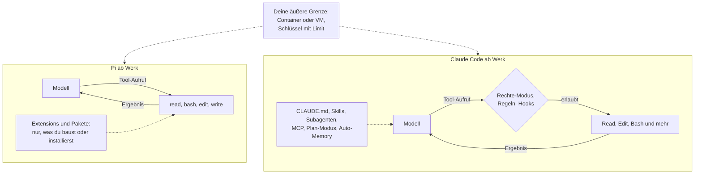

# X.3 · Der minimale Agent: Pi als Spiegel

<!-- meta:start -->
> **Regal:** [Community & Lernen](README.md#community) · **Stufe:** Kür · **~25 Min** · **Voraussetzungen:** keine
>
> ← [S3.15 Praxis-Station Session 3: alles in einem Ablauf](s3-15-praxis-station-3.md) · [Bibliothek](README.md) · [S4.1 Das richtige Modell pro Phase](s4-01-modell-pro-phase.md) →
<!-- meta:end -->

## Auf einen Blick

Pi ist ein quelloffener Coding-Agent-Harness, den Earendil Inc. mit Mitwirkenden unter MIT-Lizenz herausgibt. Ein Harness ist die Software um das Modell herum: Sie schickt Anfragen an das Modell, führt die Werkzeuge aus, die es aufruft, und verwaltet den Verlauf. Pi ist mit Absicht minimal: ein Modell, eine Schleife, vier Standard-Werkzeuge und ein kurzer System-Prompt. Subagenten, Plan-Modus und Freigabe-Dialoge sind nicht eingebaut; wer sie braucht, baut sie als Extension oder installiert ein Paket. Genau das macht Pi zum Spiegel: Du siehst, wie wenig ein Agent im Kern braucht, und erkennst, welche Schichten Claude Code darüberlegt.

Die wichtigste Lehre betrifft die Sicherheit: Pi fragt laut Doku nicht vor jedem Tool-Aufruf und läuft mit den Rechten des Benutzers, der ihn startet, also bringst du den Schutz selbst mit: einen Container oder eine VM, knappe Schlüssel und einen Arbeitsordner, in dem nichts Wertvolles liegt. Stand aller Angaben zu Pi: 30.09.2026.

## Bild im Kopf

Stell dir zwei Gebäude mit denselben Türen vor. Das erste ist vorbereitet, aber nicht ausgestattet: Die Türen haben Schlösser, und wer den Schlüssel hat, kommt überall hin, wo er passt. Leerrohre für Kartenleser, Sensoren und Zonen liegen schon in der Wand; was hineinkommt, entscheidest du. Im zweiten Gebäude ist die Zutrittsanlage eingebaut: Kartenleser mit Berechtigungsstufen, Sensoren an der Alarmmatrix, die Hausordnung am Eingang, Streifen für Sonderaufträge. Pi gleicht dem ersten Gebäude, Claude Code dem zweiten.

Der Schlüssel ist in beiden Gebäuden gleich mächtig, denn der Agent arbeitet mit deinen Benutzerrechten. Im vorbereiteten Gebäude hält ihn nur auf, was du selbst einbaust oder drumherum stellst. Wer dort Wertvolles lagert, sichert das Gelände: einen Zaun, eine abgeschlossene Halle für Versuche, nur die Schlüssel, die der Auftrag braucht. Beim Agenten heißt das: Container oder VM und eigene Schlüssel mit Limit. Ein Wegwerf-Ordner oder Worktree kommt dazu, damit im Arbeitsordner nichts Wertvolles liegt; eine Grenze ist er nicht.



## Im Detail

### Was Pi ist

Pi beschreibt sich als minimalen Agent-Harness mit dem Leitsatz, Pi an deine Arbeitsweise anzupassen statt umgekehrt. Pi läuft im Terminal, arbeitet mit vielen Modellanbietern und braucht Zugang zu einem Modell: über ein Abo, einen API-Schlüssel oder ein lokales Modell.

Das Repository `earendil-works/pi` macht die Schichten eines Agenten sichtbar, weil sie dort als eigene Pakete liegen:

- `@earendil-works/pi-ai`: eine gemeinsame API für viele Modellanbieter
- `@earendil-works/pi-agent-core`: die Agenten-Laufzeit mit Tool-Aufrufen und Zustandsverwaltung
- `@earendil-works/pi-coding-agent`: die interaktive CLI, die du startest

### Die Kern-Schleife

Die Doku beschreibt die Schleife in wenigen Sätzen (Seite „How Pi Works", sinngemäß übersetzt):

1. Deine Nachricht kommt in den aktiven Zweig der Sitzung.
2. Pi baut daraus eine Modellanfrage: System-Prompt, aktiver Zweig, verfügbare Werkzeuge, Modelleinstellungen. Die Anfrage geht an den gewählten Anbieter.
3. Die Antwort kann Text und Tool-Aufrufe enthalten. Pi zeichnet sie auf, führt jeden Tool-Aufruf aus und zeichnet die Ergebnisse auf. Das ist ein Turn.
4. Verlangen die Ergebnisse eine weitere Modellanfrage, beginnt der nächste Turn. Sonst endet der Lauf.

Mehr braucht ein Agent nicht, um zu handeln. Es ist dieselbe Schleife, die du in [S1.1](s1-01-erster-kontakt.md) beim ersten `hello.py` gesehen hast und die [S1.2](s1-02-agent-statt-chat.md) als Denkmodell zeigt: beschreiben, handeln, Ergebnis prüfen, weiter. Alle vier Betriebsarten von Pi (interaktiv, Print/JSON, RPC, SDK) nutzen laut Doku denselben Agenten- und Sitzungsmechanismus. Die Oberfläche ist eine Hülle um die Schleife, nicht die Schleife selbst.

### Vier Werkzeuge und ein kurzer System-Prompt

Ab Werk schaltet Pi vier Werkzeuge ein:

| Werkzeug | Zweck laut Doku |
|---|---|
| `read` | Textdateien und unterstützte Bilder lesen |
| `bash` | Shell-Befehle ausführen |
| `edit` | exakte Textstellen in einer bestehenden Datei ersetzen |
| `write` | eine Datei anlegen oder überschreiben |

Zuschalten kannst du `grep`, `find`, `ls` und unter Windows `powershell`. Mit `--tools` legst du die Auswahl für einen Aufruf fest. Dieses Beispiel aus der Doku lässt nur lesende Werkzeuge zu:

```sh
pi --tools read,grep,find,ls --print "Review this project"
```

Den System-Prompt hält Pi bewusst kurz; die Website nennt ihn minimal und deshalb sparsam mit Tokens. Mit `.pi/SYSTEM.md` ersetzt du ihn für ein Projekt, mit `.pi/APPEND_SYSTEM.md` ergänzt du ihn.

Claude Code kennt denselben Gedanken als Minimalmodus. `claude --bare` überspringt laut Doku das automatische Laden von Hooks, Skills, eigenen Commands, Subagenten, Plugins, MCP-Servern, Auto-Memory und CLAUDE.md; Claude hat dann Bash und Werkzeuge zum Lesen und Bearbeiten von Dateien. Gedacht ist das für Skripte und CI ([S4.3](s4-03-headless.md)). Auch `--tools` gibt es in Claude Code: Der Schalter schränkt die eingebauten Werkzeuge ein.

### Schicht für Schicht: Claude Code und Pi

Die Tabelle legt beide Werkzeuge nebeneinander. Die Pi-Spalte gibt nur wieder, was Pis Doku, README oder Website sagen (Stand oben).

| Baustein | Claude Code | Pi laut Doku | Was du daraus lernst |
|---|---|---|---|
| Rechte und Freigaben | Rechte-Modi von `default` bis `bypassPermissions`, dazu Allow- und Deny-Regeln ([S1.5](s1-05-rechte-im-alltag.md), [S1.6](s1-06-rechte-modi.md)) | Kein eingebautes Rechtesystem. Pi fragt nicht vor jedem Tool-Aufruf und läuft mit den Rechten des Benutzers, der ihn startet. Eine eigene Bestätigung baust du als Extension, oder du lässt Pi im Container laufen. | Freigaben sind eine Schicht des Harness, nicht des Modells. Fehlt sie, schützt nur eine Grenze außerhalb. |
| Hooks | Hooks an festen Ereignissen; PreToolUse blockt über den Exit-Code nur mit `exit 2`, ein abgestürzter Hook lässt die Aktion laufen ([S2.6](s2-06-hooks-als-sensoren.md), [S2.8](s2-08-hook-einrichten.md)) | Extensions (TypeScript-Module im Pi-Prozess) reagieren auf Ereignisse; ein `tool_call`-Handler kann die Eingabe ändern oder die Ausführung blocken. Scheitert der Handler, blockt Pi das Tool zur Sicherheit. | Ereignis, Prüfung, Blocken ist ein allgemeines Muster. In welche Richtung ein kaputter Wächter fällt, legt jeder Harness selbst fest: Prüf es. |
| Subagenten | Explore, Plan und general-purpose sind eingebaut ([S3.2](s3-02-eingebaute-subagenten.md)) | Nicht eingebaut. Weitere Pi-Instanzen startest du per tmux, baust sie als Extension oder installierst ein Paket. | Ein Subagent ist ein frischer Kontext mit eigenem Auftrag ([S3.1](s3-01-was-ist-ein-agent.md)). Das geht auch mit einem zweiten Prozess, den du selbst startest. |
| Plan-Modus | Claude liest und plant, Bearbeitungen bleiben gesperrt, bis du den Plan freigibst ([S1.14](s1-14-plan-modus.md)) | Nicht eingebaut. Pläne schreibst du in Dateien, oder du baust den Modus als Extension oder installierst ein Paket. | Erst planen, dann bauen geht in jedem Harness. Die Sperre ist das, was der Harness dazugibt. |
| MCP | MCP-Server verbinden Claude mit externen Diensten ([S2.14](s2-14-mcp-stecker.md)) | Eingebaut, über stdio oder streamable HTTP. Die `mcp.json` hat das Format anderer MCP-Clients; Projekt-Server liest Pi erst nach dem Projekt-Vertrauen. | MCP ist ein offener Standard: Ein Server passt in mehrere Clients, und seine Risiken wandern mit ([S2.17](s2-17-mcp-sicherheit.md)). |
| Skills | `SKILL.md`, geladen bei Aufruf oder wenn sie zur Anfrage passt; folgt dem offenen Standard Agent Skills ([S2.1](s2-01-skills-und-commands.md)) | Implementiert die Agent-Skills-Spezifikation. Name und Beschreibung stehen im System-Prompt, die volle Anleitung liest das Modell erst bei Bedarf; `/skill:name` erzwingt das Laden. | Format und schrittweises Nachladen sind übertragbar. Ein Skill im Standardformat ist nicht an ein Werkzeug gebunden. |
| Projektregeln | CLAUDE.md zu Beginn jeder Session; eine AGENTS.md liest Claude Code, wenn keine CLAUDE.md da ist, oder per Import ([S1.10](s1-10-claude-md.md), [S1.12](s1-12-imports-und-agents-md.md)) | Lädt `AGENTS.md` oder `CLAUDE.md` beim Start aus dem Agent-Verzeichnis, dem Arbeitsordner und dessen Elternordnern, auch ohne Projekt-Vertrauen. | Die Hausordnung als Datei im Repo erreicht mehrere Agenten. Sie bleibt Kontext, kein Schloss. |
| Sitzungen und Kontext | Begrenztes Kontextfenster, automatische Verdichtung, `/compact` und `/rewind` ([S1.8](s1-08-kontextfenster.md), [S1.9](s1-09-kontext-steuern.md)) | Sitzungen als Baum in einer JSONL-Datei; `/tree` springt zu früheren Punkten und verzweigt. Nahe am Kontextlimit fasst Pi ältere Nachrichten automatisch zusammen, `/compact` tut es von Hand; die Originaleinträge bleiben in der Datei. | Jedes Kontextfenster ist begrenzt, und jede Zusammenfassung verliert Details. Was zählt, gehört in eine Datei. |

### Was übertragbar ist

Vieles in der Tabelle ist Bedienung eines bestimmten Werkzeugs. Einiges gilt aber in jedem Harness, und das lohnt sich zu behalten:

- **Die Agenten-Schleife.** Anfrage, Antwort mit Tool-Aufrufen, Ausführen, Ergebnis zurück, nächster Turn. Wer sie kennt, findet sich in jedem Agenten zurecht.
- **Kontext ist ein Budget.** In die Anfrage kommen System-Prompt, Verlauf, Werkzeug- und Skill-Beschreibungen, und irgendwann wird verdichtet. Was nicht verloren gehen darf, schreibst du in eine Datei; Pi rät für Pläne und To-dos genau dazu ([S1.8](s1-08-kontextfenster.md)).
- **Skills im Standardformat.** Pi implementiert die Agent-Skills-Spezifikation, und Claude-Code-Skills folgen demselben offenen Standard. Ein Skill, der sich an die Felder des Standards hält, lässt sich in beiden laden ([S2.2](s2-02-skill-schreiben.md)).
- **Die Hausordnung als Datei.** Eine `AGENTS.md` im Repo erreicht beide Agenten. Sie ist Kontext, keine erzwungene Regel ([S1.10](s1-10-claude-md.md)).
- **Werkzeugauswahl ist die gröbste Rechtestufe.** Ein Werkzeug, das nicht eingeschaltet ist, kann das Modell nicht aufrufen. Beide Harnesses haben dafür `--tools`.
- **Die Fehlerrichtung eines Wächters ist eine Entscheidung.** Prüf bei jedem Harness, ob ein kaputter Wächter blockt oder durchlässt.

Eher Produkt als Denkmodell ist die konkrete Bedienung: welche Rechte-Modi es gibt, wie der Plan-Modus sperrt, welche Subagenten mitkommen. Die Idee dahinter nimmst du mit, die Tastenkürzel nicht.

### Sicherheitslehre: Wo der Harness nichts erzwingt, schützt du

Pi sagt es offen. Das README hält fest, dass Pi kein eingebautes Rechtesystem hat, das Dateisystem, Prozesse, Netzwerk oder Zugangsdaten einschränkt; Pi läuft mit den Rechten des Benutzers und Prozesses, der Pi gestartet hat. Die Sicherheitsseite der Doku zieht daraus drei Schlüsse:

- **Generierte Befehle und generierter Code sind nicht vertrauenswürdig.** Dateien, Kommentare, Befehlsausgaben und Modellantworten können das Modell per Prompt Injection steuern (versteckte Anweisungen in Inhalten, die das Modell liest).
- **Zuschauen ist keine Grenze.** Den Verlauf beobachten, Projekt-Vertrauen erteilen und Änderungen prüfen schafft laut Doku keine Sicherheitsgrenze.
- **Schutz entsteht durch Begrenzen.** Was Pi an Dateien, Zugangsdaten, Prozessen und Netzwerk erreichen kann, bestimmt den Schaden, wenn eine Aktion falsch oder feindlich ist.

Pi kennt ein Projekt-Vertrauen (project trust): Bevor Pi Einstellungen, MCP-Server, Extensions oder Skills aus einem Projektordner lädt, fragt Pi standardmäßig nach. Das verhindert, dass ein Ordner still ausführbare Extensions lädt. Es begrenzt aber nicht, was Tool-Aufrufe dürfen, und Kontextdateien wie `AGENTS.md` und `CLAUDE.md` lädt Pi auch ohne Vertrauen. Auch der Arbeitsordner ist keine Grenze: Er bestimmt, wo Pi sucht und wo Werkzeuge standardmäßig arbeiten, hält Befehle aber nicht von anderen Pfaden fern.

Wie viel geschützt bleibt, hängt davon ab, wie Pi läuft (nach der Sicherheitsseite der Doku):

| Wie Pi läuft | Was geschützt bleibt |
|---|---|
| Direkt mit den Rechten deines Benutzers | Nur, worauf dieser Benutzer keinen Zugriff hat. Ein eigener Benutzer engt das ein, teilt aber Betriebssystem und Netzwerk. |
| Ganz in Container, VM oder Sandbox | Dateien und Prozesse des Hosts, die du nicht hineingibst. Zugangsdaten und Netzwerk bleiben erreichbar, wenn du sie hineingibst. Laut Doku meist die stärkste praktische Wahl. |
| Pi draußen, nur die eingebauten Werkzeuge isoliert | Host-Ressourcen gegenüber diesen Werkzeugen. Pi selbst und andere Extensions bleiben außerhalb; die Isolation ist schmaler. |

Dein Werkzeugkasten, ob für Pi oder einen anderen minimalen Harness:

- **Wegwerf-Umgebung:** ein frischer Ordner oder ein Worktree ([S1.18](s1-18-worktrees.md)) statt deines Arbeitsrepos, und vorher ein Commit oder Backup.
- **Container oder VM:** der ganze Agent drinnen, nur der Arbeitsordner hineingereicht. Die Pi-Doku beschreibt dafür Docker und weitere Wege.
- **Eigene Schlüssel mit Limit:** ein Schlüssel nur für den Versuch, eng gefasst und kurzlebig, beim Anbieter mit Ausgabenlimit, wenn er eins anbietet. Zugangsdaten, die der Auftrag nicht braucht, bleiben draußen.
- **Netzwerk begrenzen,** wenn die Befehle es nicht brauchen.

Das gilt nicht nur für Pi. Auch in Claude Code ersetzt keine Schicht die äußere Grenze vollständig: Die eingebaute Sandbox begrenzt nur Shell-Befehle ([S3.9](s3-09-geschuetzte-pfade-und-sandbox.md)), und `bypassPermissions` gehört in einen Container oder eine VM ([S1.6](s1-06-rechte-modi.md)). Wie du Isolation in Stufen stapelst, zeigt ebenfalls S3.9.

## Selbst machen

### Übung: Schicht-Inventur (etwa 10 Minuten)

**Ziel:** Du siehst an deiner eigenen Sitzung, welche Claude-Code-Schicht dich wo geschützt oder entlastet hat, und schreibst auf, was du in einem minimalen Harness selbst mitbringen müsstest. Auch eine Schicht, die bei dir nicht aktiv ist, zählt, wenn du aufschreibst, was dir dann fehlt.

**Startzustand:** ein Projektordner, in dem du schon mit Claude Code gearbeitet hast, etwa der Ordner aus [S1.1](s1-01-erster-kontakt.md), oder ein neuer, leerer Ordner `~/cc-workshop/inventur` (`mkdir -p ~/cc-workshop/inventur && cd ~/cc-workshop/inventur`, in PowerShell `New-Item -ItemType Directory -Force "$HOME\cc-workshop\inventur"; Set-Location "$HOME\cc-workshop\inventur"`). In einem leeren Ordner sind viele Schichten nicht aktiv; das ist erlaubt. Starte darin `claude --permission-mode default`. Die Übung liest nur und braucht keine Installation.

1. Ruf nacheinander diese Befehle auf. Jeder zeigt eine Schicht: Regeln, Hooks, MCP-Server, Kontext. Eine Ansicht, die sich öffnet, schließt du mit `Esc`, bevor du den nächsten Befehl eingibst.

   <!-- cockpit:example -->
   ```text
   /permissions
   /hooks
   /mcp
   /context
   ```

   Erwartet: vier Anzeigen. Gibt es in deinem Ordner keine Regeln, Hooks oder Server, sind die Listen leer. Das ist ein Befund: Die Schicht ist nicht aktiv.
2. Schau in der Statusleiste nach, welcher Rechte-Modus gilt ([S1.6](s1-06-rechte-modi.md)), und ob der Ordner eine CLAUDE.md hat ([S1.10](s1-10-claude-md.md)).
3. Füll für jede Schicht eine Zeile aus: *Schicht · bei mir aktiv? · wo hat sie mich geschützt oder entlastet? · was müsste ich in einem minimalen Harness selbst mitbringen (Container, Extension, Datei, zweiter Prozess)?* Ist eine Schicht bei dir nicht aktiv, schreib stattdessen auf, was dir ohne sie fehlt.
4. Markier jede Zeile als **Denkmodell** (gilt in jedem Harness) oder **Produktfunktion** (Bedienung von Claude Code).

<details><summary>Vergleich</summary>

So kann eine Zeile für eine Schicht aussehen, die nicht aktiv ist: *Hooks · nicht aktiv · hier keiner eingerichtet · ohne sie läuft jeder Befehl ohne Wächter, ein Verbot wäre nur ein Satz in der CLAUDE.md · in einem minimalen Harness bräuchte ich eine Extension oder einen Container · Denkmodell (Ereignis, Prüfung, Blocken).* Und so für eine aktive: *Rechte-Modus · `default` · hat jede Dateiänderung zur Rückfrage gemacht · ohne ihn nur eine äußere Grenze wie ein Wegwerf-Ordner · Produktfunktion, das Denkmodell dahinter ist „Freigaben sind eine Schicht des Harness“.*

</details>

**Geschafft, wenn:**

- [ ] du mindestens vier Schichten eingetragen hast, aktive oder nicht aktive
- [ ] du für jede sagen kannst, was ohne sie passiert wäre, bei einer nicht aktiven, was dir fehlt
- [ ] du mindestens eine Stelle gefunden hast, an der dich in einem Harness ohne Freigaben nur eine äußere Grenze geschützt hätte

### Extra: Pi in einer Wegwerf-Umgebung (etwa 20 Minuten, freiwillig, kostet Modell-Guthaben)

Nur, wenn du Docker hast und einen eigenen Modellzugang ausprobieren willst. Pi braucht ein Abo, einen API-Schlüssel oder ein lokales Modell.

1. Leg einen Wegwerf-Ordner an, etwa eine Kopie des `hello`-Ordners aus S1.1. Nie dein Arbeitsrepo.
2. Bau das Image nach dem Abschnitt „Run Pi in plain Docker" der Pi-Doku ([Run Pi in an isolated environment](https://pi.dev/docs/latest/containerization)).
3. Starte Pi aus dem Wegwerf-Ordner. So steht der Befehl in der Doku (bash-Syntax, also macOS, Linux, WSL oder Git Bash):

```bash
docker run --rm -it \
  -e ANTHROPIC_API_KEY \
  -v "$PWD:/workspace" \
  -v pi-agent-home:/root/.pi/agent \
  pi-sandbox
```

Ersetze `ANTHROPIC_API_KEY` durch die Zugangsdaten deines Anbieters. `-v "$PWD:/workspace"` reicht genau diesen Ordner hinein, und Änderungen dort landen auf deinem Rechner. Den `~/.pi/agent`-Ordner deines Rechners mountest du nicht: Die Doku warnt, dass der Container sonst an deine Pi-Konfiguration und Zugangsdaten kommt.

4. Nimm einen eigenen, kurzlebigen Schlüssel nur für diesen Versuch und setz beim Anbieter ein Ausgabenlimit, wenn er eins anbietet. Lösch den Schlüssel danach.
5. Gib Pi dieselbe Aufgabe wie in S1.1. Pi zeigt jeden Lesezugriff, jede Suche, jeden Befehl und jede Änderung, fragt aber nicht vor jedem Tool-Aufruf. Notiere, an welcher Stelle Claude Code dich gefragt hätte.

## Typische Fallen

- **„Minimal heißt sicher."** Weniger eingebaute Funktionen heißt auch weniger eingebaute Schranken. Pi läuft mit deinen Rechten und fragt nicht vor jedem Tool-Aufruf; ein fehlender Freigabe-Dialog ist kein Sicherheitsmerkmal.
- **„Ich schau ja zu."** Zuschauen, Projekt-Vertrauen und Diffs lesen helfen beim Aufräumen, sind laut Pi-Doku aber keine Sicherheitsgrenze. Eine Grenze ziehen der Container oder die VM und ein Schlüssel mit Limit. Ein Wegwerf-Ordner hilft nur, weil darin nichts Wertvolles liegt; aus ihm heraus kommt ein Befehl trotzdem.
- **Fremde Extensions und Pakete sind Lieferkette.** Eine Pi-Extension läuft im Pi-Prozess mit denselben Rechten und kann Prompts, Tool-Aufrufe, Dateien, Zugangsdaten und den Sitzungsverlauf einsehen. Pakete können Extension-Code ausführen und Skills mitbringen, die das Modell Programme starten lassen. Das gilt auch für eine Extension, die Pi auf deinen Wunsch selbst schreibt. Lies den Code vor dem Installieren und halt Versionen fest, genau wie bei Plugins ([S2.13](s2-13-plugin-lieferkette.md)).
- **Geteilte Sitzungen verraten mehr als gedacht.** `/share` lädt eine Pi-Sitzung hoch und liefert einen Link. Sie kann Prompts, Befehlsausgaben, Dateiinhalte und Zugangsdaten enthalten; lies sie vorher durch.
- **Vergleiche veralten schnell.** Auf pi.dev steht „No MCP" inzwischen durchgestrichen, daneben „Now with MCP+Codemode". Die Tabelle oben ist eine Momentaufnahme vom 30.09.2026; prüf vor einer Entscheidung die aktuelle Doku beider Werkzeuge.

## Check

Du kannst an Pi zeigen, welche Schichten Claude Code um die Schleife legt, nennen, welche davon übertragbar sind, und begründen, warum du bei einem Harness ohne erzwungene Freigaben den Schutz selbst mitbringst.

1. Welche Schleife steckt in jedem Agenten, und welche Schichten legt Claude Code darum, die Pi ab Werk nicht mitbringt?
2. Nenne je ein Beispiel für ein übertragbares Denkmodell und für eine reine Produktfunktion.
3. Du startest Pi in deinem Arbeitsrepo, schaust zu und erteilst das Projekt-Vertrauen. Eine Datei im Repo enthält eine versteckte Anweisung, die das Modell befolgt. Was begrenzt den Schaden, und was nicht?

<details><summary>Auflösung</summary>

1. Anfrage an das Modell, Antwort mit Tool-Aufrufen, Ausführen, Ergebnis zurück, nächster Turn. Claude Code legt darum Rechte-Modi und Freigaben, Subagenten und den Plan-Modus, dazu Hooks als eingebaute Ereignisse; bei Pi baust du das als Extension oder Paket oder startest zusätzliche Prozesse selbst.
2. Übertragbar sind zum Beispiel die Agenten-Schleife, „Kontext ist ein Budget“, Skills im Standardformat oder die Entscheidung über die Fehlerrichtung eines Wächters. Produktfunktion ist zum Beispiel, welche Rechte-Modi es gibt, wie der Plan-Modus sperrt oder welche Subagenten mitkommen.
3. Nur eine äußere Grenze: Container oder VM, eigene Schlüssel mit Limit, ein begrenztes Netzwerk. Ein Wegwerf-Ordner ist keine Grenze; er sorgt nur dafür, dass im Arbeitsordner nichts Wertvolles liegt. Zuschauen und das Projekt-Vertrauen sind laut Pi-Doku keine Sicherheitsgrenze; Pi läuft mit den Rechten des Benutzers, der es gestartet hat.

</details>

## Weiterlesen

Stand: 30.09.2026. Fremdprojekte ändern sich schnell; prüf die verlinkte Doku, bevor du dich auf ein Detail verlässt.

- [Pi: Website](https://pi.dev/)
- [Pi: Dokumentation](https://pi.dev/docs/latest)
- [Pi: How Pi Works](https://pi.dev/docs/latest/how-pi-works)
- [Pi: Run Pi safely](https://pi.dev/docs/latest/security)
- [Pi: Run Pi in an isolated environment](https://pi.dev/docs/latest/containerization)
- [Pi auf GitHub](https://github.com/earendil-works/pi)
- [Claude Code: Bare Mode (offizielle Doku)](https://code.claude.com/docs/en/headless)
- [S3.1 · Was ist ein Agent? Spezialisierung statt Allrounder](s3-01-was-ist-ein-agent.md)
- [S3.2 · Eingebaute Subagenten nutzen](s3-02-eingebaute-subagenten.md)
- [S3.9 · Geschützte Pfade und Sandbox-Stufen](s3-09-geschuetzte-pfade-und-sandbox.md)
- [S2.13 · Lieferkettenrisiken bei Plugins](s2-13-plugin-lieferkette.md)
- [S1.18 · Worktrees als Testlabor](s1-18-worktrees.md)
- [S4.3 · Headless: claude -p als Pipeline-Stufe](s4-03-headless.md)
