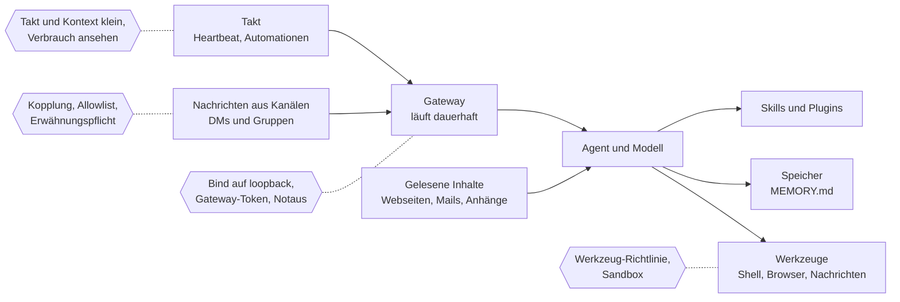

# X.4 · Agenten im Dauerbetrieb: OpenClaw und was dabei schiefgehen kann

<!-- meta:start -->
> **Regal:** [Community & Lernen](README.md#community) · **Stufe:** Kür · **~35 Min** · **Voraussetzungen:** keine
>
> ← [S4.7 Isolation mit Docker und Worktrees](s4-07-isolation-docker-worktrees.md) · [Bibliothek](README.md) · [S4.8 Abschlussprojekt mit Bewertung](s4-08-abschlussprojekt.md) →
<!-- meta:end -->

## Auf einen Blick

OpenClaw ist ein quelloffener persönlicher Agent, den du selbst betreibst: Ein Gateway-Prozess läuft dauerhaft auf deinem Rechner oder Server, verbindet Chat-Apps wie Telegram, Discord oder WhatsApp mit einem Agenten und weckt ihn auch nach Zeitplan. Daraus folgt die eine Lehre dieses Kapitels, und sie gilt für jede Automation, auch für deine mit Claude Code: Jede Nachricht aus einem Kanal und jeder Inhalt, den der Agent liest, ist nicht vertrauenswürdige Eingabe an einen Agenten mit Werkzeugen und Rechten.

Aus „ein Agent läuft einmal" ([S4.3](s4-03-headless.md)) wird hier „ein Agent läuft immer und hört auf Nachrichten von außen". Das Kapitel zeigt, was dabei schiefgehen kann, welche Gegenmittel die OpenClaw-Doku nennt und wo du dasselbe in Claude Code findest. Stand: 30.09.2026 — Fremdprojekte ändern sich schnell; prüf die verlinkte Doku.

## Bild im Kopf

Ein headless-Lauf ist die nächtliche Wachrunde nach Checkliste: Sie beginnt, arbeitet ihre Punkte ab und endet. Ein Dauer-Agent ist der Wachmann, der rund um die Uhr in der Pforte sitzt, einen Schlüsselbund trägt und Aufträge per Funk annimmt. Die entscheidende Frage ist nicht, ob er fleißig ist, sondern wer auf seiner Frequenz funken kann, und dass jeder Zettel, den er auf dem Rundgang aufhebt, eine neue Anweisung enthalten kann.

Die Sicherungen baust du wie an einer echten Pforte: eine Liste der Rufzeichen, auf die er hört (Kopplung, Allowlist), eine Pforte, die nur von innen erreichbar ist (Gateway auf `loopback`), nur die Schlüssel am Bund, die der Auftrag braucht (Werkzeug-Richtlinie), ein abgetrennter Raum für riskante Arbeit (Sandbox), ein Fahrtenbuch für Stunden und Sprit (Takt und Verbrauch) und ein Hauptschalter, den du umlegst, ohne ihn zu fragen (Notaus).



## Im Detail

### Die Bausteine laut Doku

- **Gateway:** ein langlebiger Prozess, der alle Messenger-Verbindungen hält. CLI, Web-Oberfläche (Control UI) und Automationen verbinden sich per WebSocket, standardmäßig auf `127.0.0.1:18789`; die Architektur-Seite sieht ein Gateway pro Host vor.
- **Kanäle, Agent und Modell:** Telegram, Discord, WhatsApp, Signal, Slack, iMessage und weitere; Modelle und Agenten-Harnesses (Claude, Codex, lokale Modelle) sind laut README Plugins.
- **Werkzeuge:** Der Agent kann laut Bedrohungsmodell der Doku Shell-Befehle ausführen, Dateien lesen und schreiben, Netzwerkdienste ansprechen und, mit Kanalzugang, Nachrichten an beliebige Empfänger schicken.
- **Skills und Plugins:** Skills sind Markdown-Anleitungen (`SKILL.md`); Plugins laufen als Code im Gateway-Prozess. Beides gibt es in der öffentlichen Registry ClawHub.
- **Speicher:** Markdown-Dateien im Workspace; `MEMORY.md` ist das Langzeit-Gedächtnis und wird zu Beginn jeder Sitzung geladen.
- **Takt:** Ein Scheduler weckt den Agenten nach Zeitplan. Dazu kommt der Heartbeat, eine regelmäßige Agenten-Runde, standardmäßig alle 30 Minuten (1 Stunde, wenn Anthropic per OAuth oder Token angemeldet ist).

Das Projekt steht unter MIT-Lizenz und wird von der OpenClaw Foundation getragen.

### Das Vertrauensmodell: eine Grenze pro Gateway

Die Doku sagt klar, wofür OpenClaw gebaut ist: eine Vertrauensgrenze pro Gateway, also ein Betreiber oder ein Team, das sich gegenseitig vertraut. Jeder, der einem Agenten mit Werkzeugen schreiben kann, teilt dessen Werkzeugrechte; für Nutzer, die sich nicht vertrauen, empfiehlt die Doku getrennte Gateways. Die `SECURITY.md` nennt, was das Projekt in der Regel nicht als Sicherheitslücke behandelt: Prompt Injection, die keine Richtlinie, Anmeldung, Freigabe, Sandbox oder Werkzeuggrenze umgeht, und ein bösartiges Plugin, das ein Betreiber selbst installiert oder aktiviert hat. Die Grenzen stellst du also ein, in dieser Reihenfolge: erst Identität (wer darf schreiben?), dann Reichweite (wo darf der Agent handeln?), zuletzt das Modell (geh davon aus, dass es sich manipulieren lässt).

### Die Standardwerte: Eingang zu, Werkzeuge offen

| Einstellung | Standard laut Doku | Was das heißt |
|---|---|---|
| `gateway.bind` | `loopback` bei einer Host-Installation | Nur lokale Clients erreichen das Gateway; Container-Images binden standardmäßig offen. |
| `dmPolicy` | `pairing` bei den meisten Kanälen | Unbekannte Absender bekommen einen Kopplungscode und werden erst nach deiner Freigabe verarbeitet. |
| `groupPolicy` | `allowlist`, Antwort nur bei Erwähnung | Gruppen-Absender sind gesperrt, bis du sie freigibst. |
| Sandbox (`agents.defaults.sandbox`) | aus | Werkzeuge der Hauptsitzung laufen direkt auf dem Host. |
| Shell auf dem Gateway-Host (`exec`) | `security: "full"`, `ask: "off"` | Befehle laufen ohne Rückfrage; die Doku nennt das gewolltes Verhalten für einen vertrauenswürdigen Einzelbetreiber. |
| `contextVisibility` | `all` | Zitate und Weitergeleitetes erreichen das Modell, wie sie ankommen: Die Allowlist regelt, wer etwas auslöst, nicht, was das Modell mitliest. |

Das Muster (Schlussfolgerung aus dieser Tabelle): Die Standardwerte halten den Eingang zu. Was ein zugelassener Absender oder ein eingeschleuster Text anstößt, läuft aber mit offenen Werkzeugen. Ob du abgewichen bist, zeigt laut Doku `openclaw security audit`; `--deep` versucht zusätzlich eine Live-Probe des Gateways.

### Was schiefgehen kann

Steht in der Spalte „Wie es passiert" *Schluss:*, folgt die Aussage aus belegten Eigenschaften; die Doku beschreibt sie nicht als Vorfall.

| Risiko | Wie es passiert | Gegenmittel laut Doku | Entsprechung in Claude Code |
|---|---|---|---|
| **Prompt Injection über Kanäle und Inhalte** | Jemand schreibt dem Bot „ignoriere deine Anweisungen", oder eine Webseite, Mail oder ein Anhang enthält solche Sätze. Dafür braucht es keine offenen DMs. | DMs dicht halten; Links, Anhänge und eingefügte Anweisungen als feindlich behandeln; `exec`, `browser`, `web_fetch` und `web_search` nur vertrauten Agenten geben; einen Lese-Agenten ohne Schreibwerkzeuge vorschalten; für Agenten mit Werkzeugen ein aktuelles, starkes Modell. | Ein MCP-Server, der Webseiten oder Tickets holt, schiebt Claude dieselben Anweisungen unter: [S2.17](s2-17-mcp-sicherheit.md). Befunde gegenprüfen: [S3.6](s3-06-devils-advocate.md). |
| **Fremde Skills und Plugins** | Ein Skill ist eine Anleitung, der der Agent folgt; ein Plugin läuft als Code im Gateway-Prozess. Beim Installieren blockt OpenClaw gefährlichen Code nicht von sich aus. | Fremde Skills als nicht vertrauenswürdigen Code vor dem Aktivieren lesen; den ClawHub-Prüfbericht lesen, ein `Pass` ersetzt kein eigenes Urteil; `security.installPolicy` und `plugins.allow`; exakte Versionen festlegen. | Ein fremdes Plugin ist fremder Code mit deinen Rechten: [S2.13](s2-13-plugin-lieferkette.md), [X.1](x-01-community-skills.md). |
| **Zu weite Werkzeugrechte** | Ohne Sandbox laufen Werkzeuge auf dem Host, und die Shell fragt nicht nach. Wer dem Agenten schreiben darf, teilt seine Werkzeugrechte. | `tools.profile: "messaging"`; für Agenten mit fremden Inhalten `gateway`, `cron`, `sessions_spawn` und `sessions_send` verbieten; Sandbox einschalten; die Shell auf `security: "deny"` und `ask: "always"`. | Rechte-Modi und Deny-Regeln: [S3.8](s3-08-rechte-fuer-autonomie.md). Sandbox-Stufen: [S3.9](s3-09-geschuetzte-pfade-und-sandbox.md). |
| **Kosten durch den Dauer-Takt** | Jeder Heartbeat ist eine volle Agenten-Runde. *Schluss:* Wer den ganzen Verlauf in jede Runde mitnimmt, bezahlt ihn bei jedem Takt. | `isolatedSession: true` und `lightContext: true`; das Intervall bewusst wählen oder `heartbeat.every: "0m"`; Verbrauch mit `/usage cost` oder `openclaw status --usage` ansehen. | Jeden unbeaufsichtigten `claude -p`-Lauf mit `--max-budget-usd` und `--max-turns` deckeln: [S4.4](s4-04-ci-zugang-und-kosten.md), [S3.13](s3-13-autonome-loops-absichern.md). |
| **Vergifteter Langzeit-Speicher** | *Schluss:* `MEMORY.md` lädt zu Beginn jeder Sitzung. Legt eine eingeschleuste Nachricht dort eine Anweisung ab, wirkt sie in jeder späteren Sitzung. ClawHubs Risikoanalyse nennt „memory or context poisoning" ausdrücklich. | Quellen von der automatischen Übernahme ausschließen (`memoryPolicy.excludeSessions`); Einträge mit `openclaw memory forget` entfernen, erst mit `--dry-run` (das löscht die Original-Transkripte nicht); die Dateien selbst lesen, einen verborgenen Zustand gibt es laut Doku nicht. | Auch Claude Codes Auto-Memory lädt in jede Sitzung: [S1.11](s1-11-gedaechtnis-ebenen.md). |

Ein Gateway, das du über `lan`, `tailnet` oder `custom` bindest, vergrößert die Angriffsfläche; für Fernzugriff nennt die Doku Tailscale Serve, nie `0.0.0.0` ohne Anmeldung. Remote Control stellt dagegen laut Doku nur ausgehende HTTPS-Verbindungen her und öffnet keine eingehenden Ports ([S4.6](s4-06-remote-und-teleport.md)).

### Dieselbe Tür in Claude Code

Claude Code kennt denselben Eingang: Channels (Forschungsvorschau) schieben Nachrichten aus Telegram, Discord oder iMessage in eine laufende Sitzung. Laut Doku hat jedes freigegebene Channel-Plugin eine Absender-Allowlist, und Telegram und Discord füllen sie über einen Kopplungscode, wie OpenClaw. Leitet ein Channel Rechte-Rückfragen weiter, kann jeder, der über den Kanal antworten darf, Werkzeugaufrufe in deiner Sitzung freigeben oder ablehnen. Nimm also nur Absender auf, denen du diese Befugnis gibst.

### Notaus und Rückweg

Ein Dauer-Agent braucht einen Hauptschalter, den du ohne seine Mitarbeit umlegst. Die OpenClaw-Doku beschreibt diese Schritte (nur Lesestoff, die Übung unten nutzt Claude Code):

1. **Lauf abbrechen:** `stop` als eigene Nachricht, ohne Schrägstrich; die Doku nennt auch `abort` und `halt`, und gängige Formulierungen anderer Sprachen, auch Deutsch, funktionieren ebenfalls.
2. **Gateway anhalten:** `openclaw gateway stop` (in einer nicht interaktiven Shell mit `--force`; unter macOS hält erst `--disable` den Dienst nach einem Neustart fern). Im Ernstfall nennt die Incident-Response-Seite als ersten Schritt: die macOS-App beenden, falls sie das Gateway überwacht, oder den `openclaw gateway`-Prozess beenden.
3. **Takt stilllegen:** `openclaw system heartbeat disable`; `openclaw automations list` und `openclaw automations disable <jobId>`; alle Automationen mit `cron.enabled: false`.
4. **Türen schließen:** `gateway.bind: "loopback"`; riskante DMs und Gruppen auf `dmPolicy: "disabled"` oder Erwähnungspflicht; einen Kanal ganz trennen mit `openclaw channels remove --channel telegram --delete`.
5. **Schlüssel rotieren,** wenn Geheimnisse abgeflossen sein könnten: Gateway-Anmeldung, Secrets entfernter Clients, Kanal-Zugangsdaten und Modell-API-Keys. `openclaw channels logout` räumt nur die gespeicherten Zugangsdaten; laut Doku sagt das nichts darüber, ob Tokens beim Anbieter widerrufen wurden. Widerrufen musst du dort.
6. **Nachsehen:** `openclaw logs` und die Transkripte lesen; prüfen, ob jemand Bind, Anmeldung, DM- und Gruppenregeln, `tools.elevated` oder Plugins geändert hat; dann `openclaw security audit --deep`.
7. **Rückbau:** erst `openclaw backup create`, dann mit `openclaw uninstall --dry-run` ansehen, was entfernt würde.

Für deine eigene Claude-Code-Automation gilt dieselbe Reihenfolge, mit anderen Befehlen: Lauf abbrechen und entfernen (`claude stop`, `claude rm`, [S3.5](s3-05-hintergrund-und-teams.md)), Zeitplan abschalten ([S3.12](s3-12-zeitgesteuert-arbeiten.md)), Zugangsdaten tauschen ([S4.4](s4-04-ci-zugang-und-kosten.md)), Protokoll lesen. Schreib dir die Befehle auf, bevor du sie brauchst. Die Übung unten führt den ersten Schritt aus.

## Selbst machen

### Übung: den Notaus ausführen und die Prüfliste ausfüllen (etwa 20 Minuten)

**Ziel:** Du startest eine kleine Automation mit Claude Code, die weiterläuft, ohne dass du daneben sitzt, stoppst und entfernst sie auf dem Weg, den du im Ernstfall brauchst, und füllst danach die Prüfliste für genau diese Automation aus.

**Startzustand:** ein neuer Ordner `~/cc-workshop/notaus`; Claude Code und Python reichen. Die Automation ist eine Hintergrund-Sitzung ([S3.5](s3-05-hintergrund-und-teams.md)), die auf eine Freigabe wartet, die du nie gibst. Es entsteht etwas außerhalb des Ordners, eine Hintergrund-Sitzung samt Hintergrunddienst; die Schritte enden damit, sie zu entfernen. Alle Befehle tippst du in der Shell.

Bash:

```bash
mkdir -p ~/cc-workshop/notaus && cd ~/cc-workshop/notaus
```

PowerShell:

```powershell
New-Item -ItemType Directory -Force "$HOME\cc-workshop\notaus"; Set-Location "$HOME\cc-workshop\notaus"
```

1. **Die Automation starten.** Starte eine Sitzung mit Rückfragen und einem Auftrag, der eine Datei schreiben will:

   ```bash
   claude --bg --name "notaus-uebung" --permission-mode default "Create a file called notaus.txt containing the word stop."
   ```

   Erwartet: Beim ersten Mal erscheint der Vertrauensdialog; bestätige ihn. Dann gibt Claude eine Kurz-ID und die Befehle zum Verwalten aus. Merk dir die ID, im Folgenden `<id>`.
2. **Sehen, dass sie lebt.** Warte einige Sekunden und lies die Liste:

   ```bash
   claude agents --json --all
   ```

   Erwartet: ein Eintrag mit `"name": "notaus-uebung"`; `state` ist `blocked` (die Sitzung wartet auf deine Freigabe, `waitingFor` nennt worauf) oder noch `working`. Wiederhol den Befehl, bis `blocked` dasteht. Prüf, dass `notaus.txt` nicht existiert: Eine Sitzung, die auf Antwort wartet, tut nichts, bis du antwortest. War sie schon `done`, hat sie die Datei geschrieben, und der Stopp in Schritt 3 hat nichts mehr zu tun; mach dann mit Schritt 4 weiter.
3. **Der Notaus.** Stopp sie und lies die Liste noch einmal:

   ```bash
   claude stop <id>
   claude agents --json --all
   ```

   Erwartet: `"state": "stopped"` für `notaus-uebung`. Antworten musstest du ihr nicht.
4. **Entfernen und nachsehen.** Entfern sie und prüf, dass sie weg ist:

   ```bash
   claude rm <id>
   claude agents --json --all
   ```

   Erwartet: `notaus-uebung` steht nicht mehr in der Liste. Zum Hintergrunddienst: `claude daemon status` zeigt, ob er läuft und wie viele Sitzungen er trägt. Hast du sonst keine Hintergrund-Sitzungen, die du behalten willst, beendet `claude daemon stop --any` ihn; der Befehl stoppt auch alle anderen Hintergrund-Sitzungen.
5. **Die Prüfliste für diese Automation ausfüllen.** Kopier die Liste unten und trag hinter jeden der zwölf Punkte einen Beleg ein, für die Übungs-Sitzung. Viele Punkte sind schnell beantwortet (Eingang: dein Prompt und die Dateien im Ordner; Reichweite: ein Rechte-Modus, der für Schreiben fragt; Betrieb: `--permission-mode default` statt `bypassPermissions`). Der Punkt zum Notaus hat jetzt einen Beleg: die Befehle aus Schritt 3 und 4. Schreib dazu, wie du den Zugang tauschst, falls ein Schlüssel abfließt: Für einen API-Key ist das die Claude Console ([S4.4](s4-04-ci-zugang-und-kosten.md)).

   <!-- cockpit:example -->
   ```markdown
   # Bevor ein Agent bei mir dauerhaft läuft
   Automation: ______________   Geprüft am: ______________

   ## Eingang
   - [ ] Alle Wege, auf denen Text den Agenten erreicht, stehen auf einer Liste:
         Kanäle, Webhooks, gelesene Webseiten, Mails, Anhänge.
         Beleg:
   - [ ] Nur Absender auf einer Allowlist lösen etwas aus; Unbekannte werden
         verworfen oder müssen erst gekoppelt werden.
         Beleg:
   - [ ] In Gruppen reagiert der Agent nur, wo ich es freigegeben habe,
         und nur, wenn er erwähnt wird.
         Beleg:
   - [ ] Der Steuerzugang (Gateway, Dashboard, API) ist nicht aus dem Netz
         erreichbar oder verlangt einen langen, zufälligen Schlüssel.
         Beleg:

   ## Reichweite
   - [ ] Für jedes erlaubte Werkzeug steht ein Grund da; alles andere ist
         ausdrücklich verboten, nicht nur „nicht erwähnt".
         Beleg:
   - [ ] Befehle mit Schreib- oder Netzwerkwirkung laufen in Sandbox,
         Container oder Worktree, nicht direkt auf meinem Arbeitsrechner.
         Beleg:
   - [ ] Geheimnisse stehen weder im Prompt noch im Gedächtnis noch in
         Dateien, die der Agent lesen kann.
         Beleg:
   - [ ] Jeder fremde Skill, jedes Plugin und jeder MCP-Server ist gelesen
         und auf eine Version festgelegt.
         Beleg:
   - [ ] Ich habe das Langzeit-Gedächtnis einmal gelesen und weiß, welche
         Quellen dort hineinschreiben dürfen.
         Beleg:

   ## Betrieb
   - [ ] Takt, Kontext pro Lauf und eine harte Kostengrenze stehen fest
         (bei claude -p: --max-budget-usd und --max-turns).
         Beleg:
   - [ ] Ich habe den Notaus einmal ausgeführt: Lauf abbrechen, Dienst
         stoppen, Zeitplan abschalten.
         Beleg:
   - [ ] Ich weiß, welche Schlüssel ich wo widerrufe, und habe eine
         Sicherung, von der ich zurückkann.
         Beleg:
   ```

   Die Grundfrage stellt die OpenClaw-Doku vor jeder Öffnung des Gateways, und sie passt auf jede Automation: Kannst du erklären, wer sie erreicht, wie sich diese Leute anmelden, welche Agenten sie auslösen und welche Werkzeuge diese Agenten nutzen? Bei einer Automation, die du wirklich betreiben willst, nimm die Liste erneut und lass Punkte offen, die du vor dem Start lösen musst.

**Aufräumen:** Die Hintergrund-Sitzung ist in Schritt 4 entfernt worden. Lösch den Ordner `~/cc-workshop/notaus` selbst.

**Geschafft, wenn:**

- [ ] `claude agents --json --all` die Sitzung `notaus-uebung` vor Schritt 3 mit `blocked` (oder `working`) und danach mit `stopped` zeigte
- [ ] die Sitzung nach `claude rm <id>` nicht mehr in der Liste stand
- [ ] jeder der zwölf Punkte einen Beleg hat oder auf deiner Liste „vor dem Start lösen" steht
- [ ] (Bonus, nur OpenClaw) du die Befunde von `openclaw security audit` gelesen hast, nicht nur seinen Exit-Code

## Typische Fallen

- **„Abgemeldet ist widerrufen."** `openclaw channels logout` löscht die gespeicherten Zugangsdaten, widerruft aber nichts beim Anbieter. Heißt: Solange du den Token dort nicht widerrufst, kann jede Kopie, die noch irgendwo liegt, ihn weiter benutzen.
- **„Für den Takt reicht ein kleines Modell."** Die Heartbeat-Seite schlägt zum Sparen ein günstigeres Modell vor; die Seite zu Prompt Injection rät für Agenten mit Werkzeugen oder fremden Inhalten ausdrücklich von kleinen und älteren Modellen ab. Brauchst du doch eins, begrenze den Schaden: nur lesende Werkzeuge, starke Sandbox, strenge Allowlists.
- **„Rückfragen schützen mich auch nachts."** Im Dauerbetrieb sitzt niemand davor. Braucht OpenClaw eine Freigabe und ist keine Oberfläche erreichbar, blockt es standardmäßig (`askFallback: "deny"`). Trifft eine Claude-Code-Sitzung auf eine Rechte-Rückfrage, während du nicht am Terminal bist, pausiert sie, bis du antwortest. Wer das mit „alles erlauben" löst, schaltet den Schutz ab, statt ihn zu ersetzen; harte Grenzen gehören in Regeln und Sandbox ([S3.8](s3-08-rechte-fuer-autonomie.md)).
- **„Port frei heißt gestoppt."** Die Gateway-Doku warnt für macOS ausdrücklich: Ein freier Gateway-Port allein beweist nicht, dass der Dienst gestoppt ist. Prüf den Dienst mit `openclaw gateway status`.

## Check

Du kannst für einen Dauer-Agenten zeigen, an welchen Stellen Text von außen zur Aktion wird, für jede Stelle ein Gegenmittel und seine Entsprechung in Claude Code nennen und eine eigene Automation stoppen und entfernen, ohne sie darum zu bitten.

1. Warum reicht es nicht, dass nur du dem Bot schreiben darfst?
2. Welche Standardwerte halten bei OpenClaw den Eingang zu, und welche zwei lassen die Werkzeuge offen?
3. Mit welchen zwei Befehlen stoppst du eine Hintergrund-Sitzung von Claude Code und nimmst sie aus der Liste, und woran siehst du, dass sie weg ist?
4. Was unterscheidet `openclaw channels logout` vom Widerruf eines Tokens beim Anbieter?

<details><summary>Auflösung</summary>

1. Prompt Injection braucht laut Doku keine öffentlichen DMs: Jeder Inhalt, den der Agent liest (Webseiten, Mails, Anhänge, eingefügte Logs), kann Anweisungen tragen.
2. Den Eingang halten `gateway.bind: loopback`, `dmPolicy: pairing` und `groupPolicy: allowlist`. Offen sind die Werkzeuge: Die Sandbox ist aus, und die Shell auf dem Gateway-Host läuft mit `security: "full"` und `ask: "off"`.
3. `claude stop <id>` stoppt sie, `claude rm <id>` entfernt sie. Ob sie weg ist, zeigt `claude agents --json --all`: erst `"state": "stopped"`, nach dem Entfernen steht sie nicht mehr in der Liste.
4. `openclaw channels logout` räumt nur die gespeicherten Zugangsdaten des Kanals. Ob das Token beim Anbieter widerrufen ist, sagt es nicht; widerrufen musst du dort.

</details>

## Weiterlesen

- [OpenClaw-Doku](https://docs.openclaw.ai/) und die offizielle [Installationsanleitung](https://docs.openclaw.ai/install); dieses Kapitel ist bewusst keine.
- OpenClaw-Sicherheit: [Übersicht](https://docs.openclaw.ai/gateway/security), [Vertrauensmodell](https://docs.openclaw.ai/gateway/security/trust-model), [Prompt Injection](https://docs.openclaw.ai/gateway/security/prompt-injection), [Zugriff und Allowlists](https://docs.openclaw.ai/gateway/security/access-control), [Werkzeugrechte](https://docs.openclaw.ai/gateway/security/tool-permissions), [gehärtete Grundkonfiguration](https://docs.openclaw.ai/gateway/security/hardened-baseline), [Exposure-Runbook](https://docs.openclaw.ai/gateway/security/exposure-runbook), [Incident Response](https://docs.openclaw.ai/gateway/security/operator-incident-response)
- OpenClaw-Betrieb: [Heartbeat](https://docs.openclaw.ai/gateway/heartbeat), [Automationen verwalten](https://docs.openclaw.ai/automation/cron-jobs/managing-jobs), [Gruppen](https://docs.openclaw.ai/channels/groups), [Skills](https://docs.openclaw.ai/tools/skills), [ClawHub-Prüfberichte](https://docs.openclaw.ai/clawhub/security-audits), [Speicher: Herkunft und Löschen](https://docs.openclaw.ai/concepts/memory-provenance)
- [OpenClaw auf GitHub](https://github.com/openclaw/openclaw) mit [SECURITY.md](https://github.com/openclaw/openclaw/blob/main/SECURITY.md) und [LICENSE](https://github.com/openclaw/openclaw/blob/main/LICENSE)
- Claude Code: [Channels](https://code.claude.com/docs/en/channels), [Remote Control](https://code.claude.com/docs/en/remote-control)
- [S4.3 · Headless: claude -p als Pipeline-Stufe](s4-03-headless.md)
- [S4.4 · CI-Zugangsdaten, Kostengrenzen und Kosten-Feinschliff](s4-04-ci-zugang-und-kosten.md)
- [S4.6 · Unterwegs: Remote Control und /teleport](s4-06-remote-und-teleport.md)
- [S3.12 · Zeitgesteuert arbeiten: /loop, /goal, /schedule, Routinen](s3-12-zeitgesteuert-arbeiten.md)
- [S3.13 · Autonome Loops absichern: Budget und Worktree](s3-13-autonome-loops-absichern.md)
- [S2.13 · Lieferkettenrisiken bei Plugins](s2-13-plugin-lieferkette.md)
- [X.1 · Community-Skills: wer baut was, das wirklich hilft](x-01-community-skills.md)
- [S2.17 · MCP-Sicherheit und ein eigener Server](s2-17-mcp-sicherheit.md)
- [S3.8 · Rechte für autonome Läufe](s3-08-rechte-fuer-autonomie.md)
- [S3.9 · Geschützte Pfade und Sandbox-Stufen](s3-09-geschuetzte-pfade-und-sandbox.md)
- Stand der OpenClaw-Doku: geprüft am 2026-10-06 (Heartbeat-Seite geändert; Takt-Standard, `0m`, `isolatedSession`, `lightContext`, Kosten-Hinweis und `system heartbeat disable` unverändert belegt).
