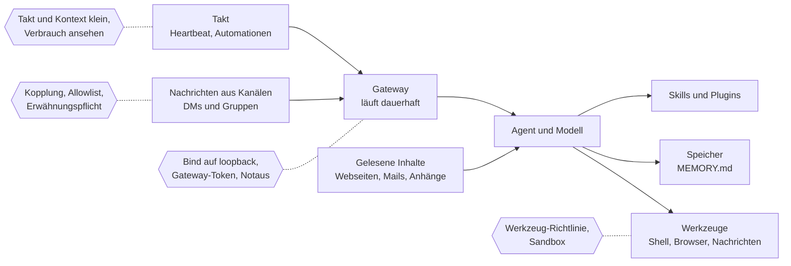

# X.4 · Agenten im Dauerbetrieb: OpenClaw und was dabei schiefgehen kann

<!-- meta:start -->
> **Regal:** [Community & Lernen](README.md#community) · **Stufe:** Kür · **~15 Min** · **Voraussetzungen:** keine
>
> ← [S4.6 Unterwegs: Remote Control und /teleport](s4-06-remote-und-teleport.md) · [Bibliothek](README.md) · [S4.7 Isolation mit Docker und Worktrees](s4-07-isolation-docker-worktrees.md) →
<!-- meta:end -->

## Auf einen Blick

OpenClaw ist ein quelloffener persönlicher Agent, den du selbst betreibst: Ein Gateway-Prozess läuft dauerhaft auf deinem Rechner oder Server, verbindet Chat-Apps wie Telegram, Discord oder WhatsApp mit einem Agenten und weckt ihn auch nach Zeitplan. Daraus folgt die eine Lehre dieses Kapitels, und sie gilt für jede Automation, auch für deine mit Claude Code: Jede Nachricht aus einem Kanal und jeder Inhalt, den der Agent liest, ist nicht vertrauenswürdige Eingabe an einen Agenten mit Werkzeugen und Rechten.

Aus „ein Agent läuft einmal" ([S4.3](s4-03-headless.md)) wird hier „ein Agent läuft immer und hört auf Nachrichten von außen". Das Kapitel zeigt, was dabei schiefgehen kann, welche Gegenmittel die OpenClaw-Doku nennt und wo du dasselbe in Claude Code findest. Stand: 30.09.2026 — Fremdprojekte ändern sich schnell; prüf die verlinkte Doku.

## Bild im Kopf

Ein headless-Lauf ist die nächtliche Wachrunde nach Checkliste: Sie beginnt, arbeitet ihre Punkte ab und endet. Ein Dauer-Agent ist der Wachmann, der rund um die Uhr in der Pforte sitzt, einen Schlüsselbund trägt und Aufträge per Funk annimmt. Die entscheidende Frage ist nicht, ob er fleißig ist, sondern wer auf seiner Frequenz funken kann, und dass jeder Zettel, den er auf dem Rundgang aufhebt, eine neue Anweisung enthalten kann.

Die Sicherungen baust du wie an einer echten Pforte: eine Liste der Rufzeichen, auf die er hört (Kopplung, Allowlist), eine Pforte, die nur von innen erreichbar ist (Gateway auf `loopback`), nur die Schlüssel am Bund, die der Auftrag braucht (Werkzeug-Richtlinie), ein abgetrennter Raum für riskante Arbeit (Sandbox), ein Fahrtenbuch für Stunden und Sprit (Takt und Verbrauch) und ein Hauptschalter, den du umlegst, ohne ihn zu fragen (Notaus).



## Im Detail

### Die Bausteine laut Doku

- **Gateway:** ein langlebiger Prozess, der alle Messenger-Verbindungen hält. CLI, Web-Oberfläche (Control UI) und Automationen verbinden sich per WebSocket, standardmäßig auf `127.0.0.1:18789`. Die Architektur-Seite sieht ein Gateway pro Host vor.
- **Kanäle:** Telegram, Discord, WhatsApp, Signal, Slack, iMessage und viele weitere, teils mitgeliefert, teils als offizielles Plugin.
- **Agent und Modell:** Modelle und Agenten-Harnesses (Claude, Codex, lokale Modelle) sind laut README Plugins, die du austauschen kannst.
- **Werkzeuge:** Der Agent kann laut Bedrohungsmodell der Doku Shell-Befehle ausführen, Dateien lesen und schreiben, Netzwerkdienste ansprechen und, mit Kanalzugang, Nachrichten an beliebige Empfänger schicken.
- **Skills und Plugins:** Skills sind Markdown-Anleitungen (`SKILL.md`), die dem Agenten zeigen, wann und wie er Werkzeuge nutzt. Plugins laufen als Code im Gateway-Prozess. Beides gibt es in der öffentlichen Registry ClawHub.
- **Speicher:** Der Agent merkt sich Dinge in Markdown-Dateien in seinem Workspace. `MEMORY.md` ist das Langzeit-Gedächtnis und wird zu Beginn jeder Sitzung geladen.
- **Automationen:** Ein eingebauter Scheduler speichert Jobs, weckt den Agenten zur richtigen Zeit und liefert das Ergebnis in einen Chat, an einen Webhook oder nirgendwohin. Dazu kommt der Heartbeat: eine regelmäßige Agenten-Runde, standardmäßig alle 30 Minuten (1 Stunde, wenn Anthropic per OAuth oder Token angemeldet ist).

Das Projekt steht unter MIT-Lizenz und wird von der OpenClaw Foundation getragen.

### Das Vertrauensmodell: eine Grenze pro Gateway

Die Doku sagt klar, wofür OpenClaw gebaut ist: eine Vertrauensgrenze pro Gateway, also ein Betreiber oder ein Team, das sich gegenseitig vertraut. Jeder, der einem Agenten mit Werkzeugen schreiben kann, teilt dessen Werkzeugrechte. Für Nutzer, die sich nicht vertrauen, empfiehlt die Doku getrennte Gateways, am besten mit getrennten Betriebssystem-Nutzern oder Rechnern.

Genauso klar sagt die `SECURITY.md`, was das Projekt in der Regel nicht als Sicherheitslücke behandelt: Prompt Injection, die keine Richtlinie, Anmeldung, Freigabe, Sandbox oder Werkzeuggrenze umgeht, und ein bösartiges Plugin, das ein Betreiber selbst installiert oder aktiviert hat. Das heißt für dich: Die Grenzen stellst du ein.

Die Reihenfolge dafür gibt die Doku vor:

1. **Erst Identität:** Wer darf dem Bot schreiben (Kopplung, Allowlist, bewusst „offen")?
2. **Dann Reichweite:** Wo darf er handeln (Gruppen-Allowlist, Erwähnungspflicht, Werkzeuge, Sandbox)?
3. **Zuletzt das Modell:** Geh davon aus, dass es sich manipulieren lässt, und begrenze den Schaden.

### Die Standardwerte: Eingang zu, Werkzeuge offen

| Einstellung | Standard laut Doku | Was das heißt |
|---|---|---|
| `gateway.bind` | `loopback` bei einer Host-Installation | Nur lokale Clients erreichen das Gateway. Container-Images binden dagegen standardmäßig offen. |
| `dmPolicy` | `pairing` bei den meisten Kanälen | Unbekannte Absender bekommen einen Kopplungscode; ihre Nachricht wird erst nach deiner Freigabe verarbeitet. |
| `groupPolicy` | `allowlist`, Antwort nur bei Erwähnung | Gruppen-Absender sind gesperrt, bis du sie freigibst. |
| Sandbox (`agents.defaults.sandbox`) | aus | Werkzeuge der Hauptsitzung laufen direkt auf dem Host. |
| Shell auf dem Gateway-Host (`exec`) | `security: "full"`, `ask: "off"` | Befehle laufen ohne Rückfrage. Die Doku nennt das gewolltes Verhalten für einen vertrauenswürdigen Einzelbetreiber. |
| `contextVisibility` | `all` | Zitate, Thread-Verlauf und Weitergeleitetes erreichen das Modell so, wie sie ankommen. Die Allowlist regelt, wer etwas auslöst, nicht, was das Modell mitliest. |
| Nachrichten über Kanalgrenzen | erlaubt | Ein Agent mit Nachrichten-Werkzeug darf aus einer Telegram-Sitzung nach Discord schreiben, wenn das Ziel eingerichtet ist. |

Das Muster (Schlussfolgerung aus dieser Tabelle): Die Standardwerte halten den Eingang zu. Was ein zugelassener Absender oder ein eingeschleuster Text anstößt, läuft aber mit offenen Werkzeugen, und genau dort setzen die meisten Risiken unten an. Ob du von den Standardwerten abgewichen bist, zeigt laut Doku `openclaw security audit`; `openclaw security audit --deep` versucht zusätzlich eine Live-Probe des Gateways.

### Was schiefgehen kann

Steht in der Spalte „Wie es passiert" *Schluss:*, folgt die Aussage aus belegten Eigenschaften; die Doku beschreibt sie nicht als Vorfall.

| Risiko | Wie es passiert | Gegenmittel laut Doku | Entsprechung in Claude Code |
|---|---|---|---|
| **Prompt Injection über Kanäle und Inhalte** | Jemand schreibt dem Bot „ignoriere deine Anweisungen", oder eine Webseite, Mail oder ein Anhang enthält solche Sätze. Dafür braucht es keine offenen DMs: Auch wenn nur du schreiben darfst, trägt gelesener Inhalt fremde Anweisungen herein. | DMs mit Kopplung oder Allowlist dicht halten; Links, Anhänge und eingefügte Anweisungen als feindlich behandeln; `exec`, `browser`, `web_fetch` und `web_search` nur vertrauten Agenten geben; einen Lese-Agenten mit nur lesenden oder gar keinen Werkzeugen vorschalten, der nur zusammenfasst; für Agenten mit Werkzeugen ein aktuelles, starkes Modell. | Ein MCP-Server, der Webseiten oder Tickets holt, schiebt Claude dieselben Anweisungen unter: [S2.17](s2-17-mcp-sicherheit.md). Befunde gegenprüfen statt glauben: [S3.6](s3-06-devils-advocate.md). |
| **Fremde Skills und Plugins** | Ein Skill ist eine Anleitung, der der Agent folgt; ein Plugin läuft als Code im Gateway-Prozess. Beim Installieren von Plugins blockt OpenClaw gefährlichen Code nicht von sich aus. | Fremde Skills als nicht vertrauenswürdigen Code behandeln und vor dem Aktivieren lesen; den ClawHub-Prüfbericht lesen, ein `Pass` ersetzt aber kein eigenes Urteil; eigene Erlauben/Warnen/Blocken-Regel mit `security.installPolicy`; `plugins.allow` als Allowlist; exakte Versionen festlegen. | Ein fremdes Plugin ist fremder Code mit deinen Rechten: [S2.13](s2-13-plugin-lieferkette.md). Prüfliste für fremde Skills: [X.1](x-01-community-skills.md). |
| **Offen erreichbares Gateway** | `gateway.bind` auf `lan`, `tailnet` oder `custom` vergrößert die Angriffsfläche, ebenso ein Container-Image mit offenem Bind. Wer sich am Gateway anmeldet, gilt als vertrauenswürdiger Betreiber. | Bei `loopback` bleiben; für Fernzugriff Tailscale Serve statt LAN-Bind; nie ohne Anmeldung auf `0.0.0.0`; vor jeder Öffnung das Exposure-Runbook durchgehen und `openclaw security audit` laufen lassen. | Remote Control stellt laut Doku nur ausgehende HTTPS-Verbindungen her und öffnet keine eingehenden Ports: [S4.6](s4-06-remote-und-teleport.md). |
| **Zu weite Werkzeugrechte** | Ohne Sandbox laufen Werkzeuge auf dem Host, und die Shell fragt standardmäßig nicht nach. Wer dem Agenten schreiben darf, teilt seine Werkzeugrechte. | Werkzeugprofil `tools.profile: "messaging"`; für Agenten mit fremden Inhalten `gateway`, `cron`, `sessions_spawn` und `sessions_send` verbieten; Sandbox einschalten, Workspace-Zugriff `none` oder `ro`; die Shell wie in der gehärteten Grundkonfiguration auf `security: "deny"` und `ask: "always"`. | Rechte-Modi und Deny-Regeln für Läufe ohne dich: [S3.8](s3-08-rechte-fuer-autonomie.md). Sandbox-Stufen und ihre Grenzen: [S3.9](s3-09-geschuetzte-pfade-und-sandbox.md). |
| **Kosten durch den Dauer-Takt** | Jeder Heartbeat ist eine volle Agenten-Runde; kürzere Intervalle verbrauchen mehr Tokens. Automationen kommen mit eigenem Takt dazu. *Schluss:* Wer den ganzen Gesprächsverlauf in jede Runde mitnimmt, bezahlt ihn bei jedem Takt. | `isolatedSession: true` startet jede Runde frisch und senkt die Tokens pro Lauf laut Doku stark; `lightContext: true` lässt die Workspace-Startdateien weg; das Intervall bewusst wählen oder den wiederkehrenden Takt mit `heartbeat.every: "0m"` abschalten; Verbrauch mit `/usage cost` oder `openclaw status --usage` ansehen. | Jeden unbeaufsichtigten `claude -p`-Lauf mit `--max-budget-usd` und `--max-turns` deckeln: [S1.19](s1-19-kosten-im-blick.md), [S4.4](s4-04-ci-zugang-und-kosten.md). Budget für autonome Loops: [S3.13](s3-13-autonome-loops-absichern.md). |
| **Vergifteter Langzeit-Speicher** | *Schluss:* Das Gedächtnis sind Markdown-Dateien, und `MEMORY.md` lädt zu Beginn jeder Sitzung. Bringt eine eingeschleuste Nachricht den Agenten dazu, dort eine Anweisung abzulegen, wirkt sie in jeder späteren Sitzung weiter. ClawHubs Risikoanalyse für Skills nennt „memory or context poisoning" ausdrücklich als Risiko. | Quellen von der automatischen Übernahme ausschließen (`memoryPolicy.excludeSessions`, etwa für Gmail-, IMAP- oder Webhook-Sitzungen); Einträge mit `openclaw memory forget` entfernen, erst mit `--dry-run`, und wissen, dass das die Original-Transkripte nicht löscht; die Dateien selbst lesen, einen verborgenen Zustand gibt es laut Doku nicht. | Auch Claude Codes Auto-Memory lädt in jede Session: [S1.11](s1-11-gedaechtnis-ebenen.md). |
| **Antworten in Gruppen, wo er nicht soll** | Bei WhatsApp gibt es keinen eigenen Bot-Nutzer: In jeder Gruppe, in der du Mitglied bist, kann OpenClaw die Gruppe sehen und dort antworten. `/reasoning`, `/verbose` und `/trace` können interne Überlegungen und Werkzeugausgaben in den Raum bringen. Ein Agent mit Nachrichten-Werkzeug darf standardmäßig auch in andere Gespräche schreiben. | Gruppen per `groupPolicy: "allowlist"` freigeben und `requireMention: true` setzen; `contextVisibility: "allowlist"`; `/reasoning`, `/verbose` und `/trace` in öffentlichen Räumen aus; `allowWithinProvider` und `allowAcrossProviders` unter `tools.message.crossContext` auf `false`, wenn der Agent nur im aktuellen Gespräch antworten soll; für Messenger mit Telefonnummer eine eigene Nummer für den Bot. | Channels lassen nur Absender auf der Allowlist in die Sitzung: [S3.13](s3-13-autonome-loops-absichern.md). Wann eine eigene Bridge für mehrere Nutzer gerechtfertigt ist: [S4.6](s4-06-remote-und-teleport.md). |

### Dieselbe Tür in Claude Code

Claude Code kennt denselben Eingang: Channels (Forschungsvorschau) schieben Nachrichten aus Telegram, Discord oder iMessage in eine laufende Sitzung. Laut Doku hat jedes freigegebene Channel-Plugin eine Absender-Allowlist, und Telegram und Discord füllen sie über einen Kopplungscode, wie OpenClaw. Leitet ein Channel Rechte-Rückfragen weiter, kann jeder, der über den Kanal antworten darf, Werkzeugaufrufe in deiner Sitzung freigeben oder ablehnen. Nimm also nur Absender auf, denen du diese Befugnis gibst.

### Notaus und Rückweg

Ein Dauer-Agent braucht einen Hauptschalter, den du ohne seine Mitarbeit umlegst. Die OpenClaw-Doku beschreibt dafür diese Schritte:

1. **Lauf abbrechen.** Schick `stop` als eigene Nachricht, ohne Schrägstrich. Die Doku nennt weitere Auslöser wie `abort` oder `halt`, und gängige Formulierungen in anderen Sprachen, auch auf Deutsch, funktionieren ebenfalls.
2. **Gateway anhalten.** `openclaw gateway stop` hält den Dienst an; in einer nicht interaktiven Shell braucht der Befehl `--force`. Unter macOS sorgt erst `openclaw gateway stop --disable` dafür, dass der Dienst nach einem Neustart nicht wiederkommt. Im Ernstfall nennt die Incident-Response-Seite als ersten Schritt: die macOS-App beenden, falls sie das Gateway überwacht, oder den `openclaw gateway`-Prozess beenden.
3. **Takt stilllegen.** `openclaw system heartbeat disable` schaltet die Heartbeats ab. `openclaw automations list` zeigt die Jobs, `openclaw automations disable <jobId>` pausiert einen, ohne ihn zu löschen. Alle Automationen schaltest du mit `cron.enabled: false` ab.
4. **Türen schließen.** `gateway.bind: "loopback"` setzen oder Tailscale Funnel und Serve abschalten; riskante DMs und Gruppen auf `dmPolicy: "disabled"` oder Erwähnungspflicht stellen und alle `"*"`-Einträge entfernen. Einen Kanal trennst du ganz mit `openclaw channels remove --channel telegram --delete`.
5. **Schlüssel rotieren**, wenn Geheimnisse abgeflossen sein könnten: die Gateway-Anmeldung (`gateway.auth.token` oder `gateway.auth.password`), die Secrets entfernter Clients (`gateway.remote.token` oder `.password`), Kanal-Zugangsdaten wie Slack- oder Discord-Tokens und die Modell-API-Keys. Wichtig: `openclaw channels logout` räumt die gespeicherten Zugangsdaten des Kanals; laut Doku sagt das nichts darüber, ob Tokens beim Anbieter widerrufen wurden. Widerrufen musst du dort.
6. **Nachsehen, was passiert ist.** `openclaw logs` und die Transkripte der betroffenen Sitzungen lesen; prüfen, ob jemand Bind, Anmeldung, DM- und Gruppenregeln, `tools.elevated` oder Plugins geändert hat; danach `openclaw security audit --deep` und bestätigen, dass kritische Befunde behoben sind.
7. **Rückbau, wenn du ihn willst.** Erst `openclaw backup create`, dann mit `openclaw uninstall --dry-run` ansehen, was entfernt würde.

Für deine eigene Claude-Code-Automation gilt dieselbe Reihenfolge: Lauf abbrechen, Zeitplan abschalten ([S3.12](s3-12-zeitgesteuert-arbeiten.md)), Zugangsdaten tauschen ([S4.4](s4-04-ci-zugang-und-kosten.md)), Protokoll lesen. Schreib dir die Befehle auf, bevor du sie brauchst.

## Selbst machen

Nimm eine Automation, die du planst: eine Routine oder einen Zeitplan aus [S3.12](s3-12-zeitgesteuert-arbeiten.md), einen `claude -p`-Job aus [S4.3](s4-03-headless.md), einen Channel aus [S3.13](s3-13-autonome-loops-absichern.md) oder eine OpenClaw-Installation. Kopier die Prüfliste und trag hinter jeden Punkt einen Beleg ein: die Einstellung, die Datei oder den Befehl, mit dem du ihn nachweist.

Die Grundfrage stellt die OpenClaw-Doku vor jeder Öffnung des Gateways, und sie passt auf jede Automation: Kannst du erklären, wer sie erreicht, wie sich diese Leute anmelden, welche Agenten sie auslösen und welche Werkzeuge diese Agenten nutzen?

<!-- cockpit:example -->
```markdown
# Bevor ein Agent bei mir dauerhaft läuft
Automation: ______________   Geprüft am: ______________

## Eingang
- [ ] Alle Wege, auf denen Text den Agenten erreicht, stehen auf einer Liste:
      Kanäle, Webhooks, gelesene Webseiten, Mails, Anhänge.
      Beleg:
- [ ] Nur Absender auf einer Allowlist lösen etwas aus; Unbekannte werden
      verworfen oder müssen erst gekoppelt werden.
      Beleg:
- [ ] In Gruppen reagiert der Agent nur, wo ich es freigegeben habe,
      und nur, wenn er erwähnt wird.
      Beleg:
- [ ] Der Steuerzugang (Gateway, Dashboard, API) ist nicht aus dem Netz
      erreichbar oder verlangt einen langen, zufälligen Schlüssel.
      Beleg:

## Reichweite
- [ ] Für jedes erlaubte Werkzeug steht ein Grund da; alles andere ist
      ausdrücklich verboten, nicht nur „nicht erwähnt".
      Beleg:
- [ ] Befehle mit Schreib- oder Netzwerkwirkung laufen in Sandbox,
      Container oder Worktree, nicht direkt auf meinem Arbeitsrechner.
      Beleg:
- [ ] Geheimnisse stehen weder im Prompt noch im Gedächtnis noch in
      Dateien, die der Agent lesen kann.
      Beleg:
- [ ] Jeder fremde Skill, jedes Plugin und jeder MCP-Server ist gelesen
      und auf eine Version festgelegt.
      Beleg:
- [ ] Ich habe das Langzeit-Gedächtnis einmal gelesen und weiß, welche
      Quellen dort hineinschreiben dürfen.
      Beleg:

## Betrieb
- [ ] Takt, Kontext pro Lauf und eine harte Kostengrenze stehen fest
      (bei claude -p: --max-budget-usd und --max-turns).
      Beleg:
- [ ] Ich habe den Notaus einmal ausgeführt: Lauf abbrechen, Dienst
      stoppen, Zeitplan abschalten.
      Beleg:
- [ ] Ich weiß, welche Schlüssel ich wo widerrufe, und habe eine
      Sicherung, von der ich zurückkann.
      Beleg:
```

**Geschafft, wenn:**

- [ ] jeder der zwölf Punkte einen Beleg hat oder auf deiner Liste „vor dem Start lösen" steht
- [ ] du den Notaus wirklich ausgeführt hast, nicht nur nachgelesen
- [ ] (Bonus, nur OpenClaw) du die Befunde von `openclaw security audit` gelesen hast, nicht nur seinen Exit-Code

## Typische Fallen

- **„Die Standardwerte sind sicher, also bin ich sicher."** Die Standardwerte schützen den Eingang: Kopplung, Gruppen-Allowlist, `loopback`. Die Werkzeuge stehen offen, denn die Sandbox ist aus und die Shell fragt nicht nach. Was ein zugelassener Absender oder ein eingeschleuster Text anstößt, läuft mit diesen Werkzeugen.
- **„Nur ich kann dem Bot schreiben."** Laut Doku braucht Prompt Injection keine öffentlichen DMs. Jeder Inhalt, den der Agent liest, kann Anweisungen tragen: Suchergebnisse, Webseiten, Mails, Anhänge, eingefügte Logs.
- **„Abgemeldet ist widerrufen."** `openclaw channels logout` löscht die gespeicherten Zugangsdaten, widerruft aber nichts beim Anbieter. Heißt: Solange du den Token dort nicht widerrufst, kann jede Kopie, die noch irgendwo liegt, ihn weiter benutzen.
- **„Für den Takt reicht ein kleines Modell."** Die Heartbeat-Seite schlägt zum Sparen ein günstigeres Modell vor; die Seite zu Prompt Injection rät für Agenten mit Werkzeugen oder fremden Inhalten ausdrücklich von kleinen und älteren Modellen ab. Brauchst du doch ein kleines Modell, rät die Doku, den möglichen Schaden zu begrenzen: nur lesende Werkzeuge, starke Sandbox, wenig Dateizugriff, strenge Allowlists.
- **„Rückfragen schützen mich auch nachts."** Im Dauerbetrieb sitzt niemand davor. Braucht OpenClaw eine Freigabe und ist keine Oberfläche erreichbar, blockt es standardmäßig (`askFallback: "deny"`). Trifft eine Claude-Code-Sitzung auf eine Rechte-Rückfrage, während du nicht am Terminal bist, pausiert sie, bis du antwortest. Wer das mit „alles erlauben" löst, schaltet den Schutz ab, statt ihn zu ersetzen; harte Grenzen gehören in Regeln und Sandbox ([S3.8](s3-08-rechte-fuer-autonomie.md)).
- **„Port frei heißt gestoppt."** Die Gateway-Doku warnt für macOS ausdrücklich: Ein freier Gateway-Port allein beweist nicht, dass der Dienst gestoppt ist. Prüf den Dienst mit `openclaw gateway status`.

## Check

Du kannst für einen Dauer-Agenten zeigen, an welchen Stellen Text von außen zur Aktion wird, für jede Stelle ein Gegenmittel und seine Entsprechung in Claude Code nennen und den Agenten stoppen, ohne ihn darum zu bitten.

1. Warum reicht es nicht, dass nur du dem Bot schreiben darfst?
2. Welche Standardwerte halten bei OpenClaw den Eingang zu, und welche zwei lassen die Werkzeuge offen?
3. Was unterscheidet `openclaw channels logout` vom Widerruf eines Tokens beim Anbieter?

## Weiterlesen

- [OpenClaw-Doku](https://docs.openclaw.ai/) und die offizielle [Installationsanleitung](https://docs.openclaw.ai/install); dieses Kapitel ist bewusst keine.
- OpenClaw-Sicherheit: [Übersicht](https://docs.openclaw.ai/gateway/security), [Vertrauensmodell](https://docs.openclaw.ai/gateway/security/trust-model), [Prompt Injection](https://docs.openclaw.ai/gateway/security/prompt-injection), [Zugriff und Allowlists](https://docs.openclaw.ai/gateway/security/access-control), [Werkzeugrechte](https://docs.openclaw.ai/gateway/security/tool-permissions), [gehärtete Grundkonfiguration](https://docs.openclaw.ai/gateway/security/hardened-baseline), [Exposure-Runbook](https://docs.openclaw.ai/gateway/security/exposure-runbook), [Incident Response](https://docs.openclaw.ai/gateway/security/operator-incident-response)
- OpenClaw-Betrieb: [Heartbeat](https://docs.openclaw.ai/gateway/heartbeat), [Automationen verwalten](https://docs.openclaw.ai/automation/cron-jobs/managing-jobs), [Gruppen](https://docs.openclaw.ai/channels/groups), [Skills](https://docs.openclaw.ai/tools/skills), [ClawHub-Prüfberichte](https://docs.openclaw.ai/clawhub/security-audits), [Speicher: Herkunft und Löschen](https://docs.openclaw.ai/concepts/memory-provenance)
- [OpenClaw auf GitHub](https://github.com/openclaw/openclaw) mit [SECURITY.md](https://github.com/openclaw/openclaw/blob/main/SECURITY.md) und [LICENSE](https://github.com/openclaw/openclaw/blob/main/LICENSE)
- Claude Code: [Channels](https://code.claude.com/docs/en/channels), [Remote Control](https://code.claude.com/docs/en/remote-control)
- [S4.3 · Headless: claude -p als Pipeline-Stufe](s4-03-headless.md)
- [S4.4 · CI-Zugangsdaten, Kostengrenzen und Kosten-Feinschliff](s4-04-ci-zugang-und-kosten.md)
- [S4.6 · Unterwegs: Remote Control und /teleport](s4-06-remote-und-teleport.md)
- [S3.12 · Zeitgesteuert arbeiten: /loop, /goal, /schedule, Routinen](s3-12-zeitgesteuert-arbeiten.md)
- [S3.13 · Autonome Loops absichern: Budget und Worktree](s3-13-autonome-loops-absichern.md)
- [S2.13 · Lieferkettenrisiken bei Plugins](s2-13-plugin-lieferkette.md)
- [X.1 · Community-Skills: wer baut was, das wirklich hilft](x-01-community-skills.md)
- [S2.17 · MCP-Sicherheit und ein eigener Server](s2-17-mcp-sicherheit.md)
- [S3.8 · Rechte für autonome Läufe](s3-08-rechte-fuer-autonomie.md)
- [S3.9 · Geschützte Pfade und Sandbox-Stufen](s3-09-geschuetzte-pfade-und-sandbox.md)
