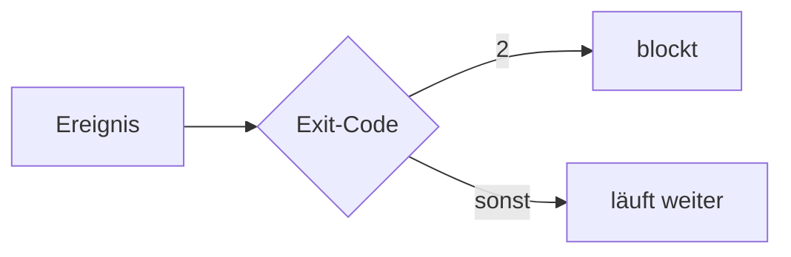

# S2.8 · Einen Hook konfigurieren

<!-- meta:start -->
> alter generierter Block
<!-- meta:end -->

## Schnellcheck

- Hast du schon einen Hook gebaut, der eine Aktion wirklich blockt?
- Weißt du ohne Nachschlagen, welcher Exit-Code blockt?

## Auf einen Blick

Ein Hook ist ein Skript, das Claude Code bei einem Ereignis aufruft. Nur `exit 2` blockt.

Zweiter Absatz, gehört nicht zum Kurztext.

## Bild im Kopf

Wie ein Türsensor, der die Tür nur bei einem bestimmten Signal verriegelt.



## Im Detail

Text mit einem [Link](s2-07-demo-events.md) und einem Codeblock:

```bash
## Das ist kein Abschnitt
echo "hallo"
```

## Selbst machen

<!-- cockpit:example -->
```json
{"hooks": {"PreToolUse": []}}
```

## Check

Du kannst einen Hook eintragen und seinen Exit-Code begründen.

1. Welcher Exit-Code blockt einen Aufruf?
2. Was passiert bei `exit 1`?

<details><summary>Auflösung</summary>

1. Von den Exit-Codes blockt nur `2`.
2. Der Aufruf läuft weiter, Claude Code meldet nur einen Hook-Fehler.

</details>

<details><summary>Quizfrage</summary>

**Frage:** Welcher Exit-Code blockt einen PreToolUse-Aufruf?

- **Richtig:** Exit-Code 2 blockt den Aufruf
- Falsch: Jeder Code ungleich null blockt
- Falsch: Exit-Code 1 blockt den Aufruf
- Falsch: Nur ein Timeout blockt den Aufruf

</details>

## Weiterlesen

- [Hooks-Referenz](https://code.claude.com/docs/en/hooks)
